# Design Tips

> [https://www.bilibili.com/video/BV1f4411377j](https://www.bilibili.com/video/BV1f4411377j)

> 4、7、9、29、30、

### 【封面】简单、干净、棱角分明

> 运用符合相同气质的图像和文字进行设计，可以完成富有同等美感的封面作品。

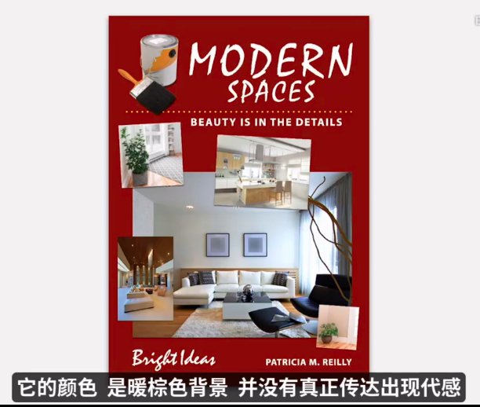

现代设计风格更加cool

让我们重新设计这个封面

注意到正中间的图是主要元素，所以我们将这个最大的图片放在正中间

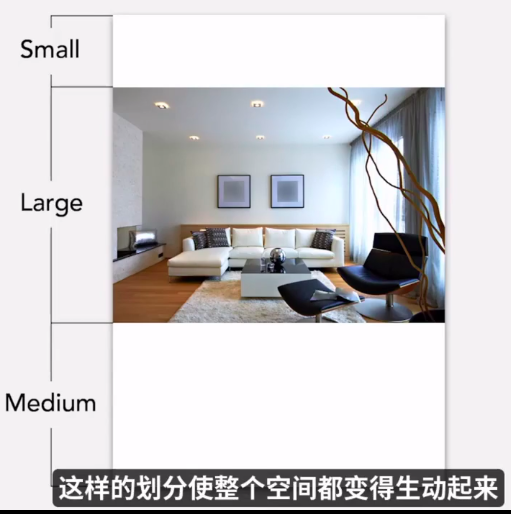

这样整个页面就被分成了三个大小的空间，小、中、大

**从图片上吸取颜色作为页面的背景色，天空、地板、面积大的地方就行**

这样就有了一个低对比度的画面

有了水平和垂直线，就有了一个基本的风格。

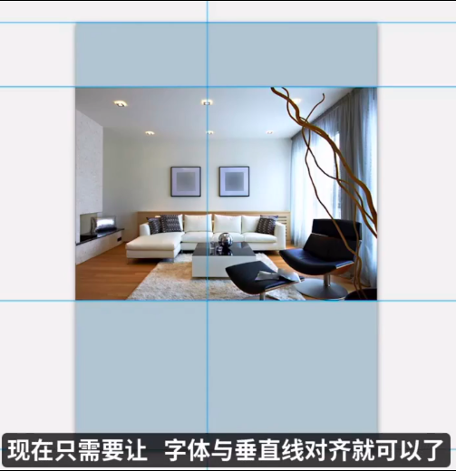

需要一个极细的字体，精致的字体

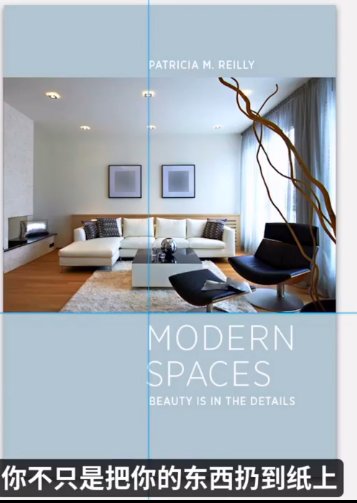

字体的名字叫做 `Gotham Narrow`

大标题设置为 `Gotham Narrow Light`

小标题设置为 `Gotham Narrow Medium` 为了和大标题产生相同的效果

### 【名片】如何让文字和图形进行完美融合

> 采用能够反应主题的字体
>
> 跟随图像的形态设计
>
> 按照阅读方式排列文字
>
> 不要在设计中留下无关元素

点评：

- 用文字填充的图片剩余的空间，并且文字是非常分散的，信息不集中。
- 字体选用了Times New Roman 较粗的衬线字体显得非常繁琐，我们需要采用轻快的字体。
- 将自己的名字设置为蓝色，但是照片背景的颜色饱和度太低，感觉像是仿造的。

第一步：

把信息要素集中起来，放在上方。因为图片的主题是飞机，我们不能干扰飞机的飞行路线。

最上方写姓名、电话、网址。左上角用大一点的字体写公司的名称，右下角小地方是飞机的型号，这样就把飞机飞行的空间让了出来。

飞机的飞行是带有曲线的特点的，我们把字体调成斜体，和曲线相融合

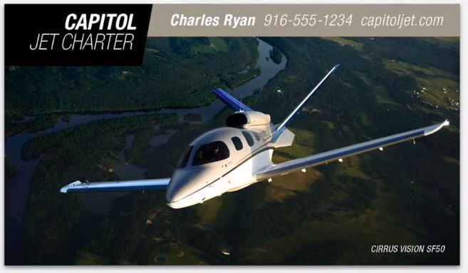

第二步：

上方信息栏的棱角和整体的飞机弧度相冲，所以我们可以改成曲线。

黑灰色背景和整体图片相冲**所以我们从飞机上吸取蓝色，作为信息栏的背景色，同时注意公司名字比个人信息颜色重**

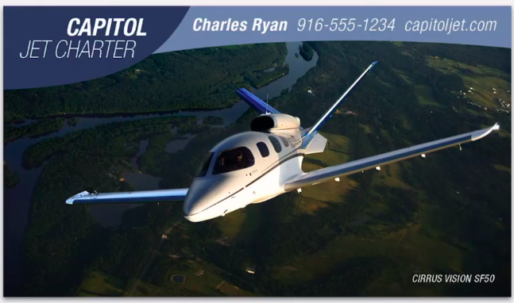

### 【海报】巧用素材

> 找准画面的焦点和重点
>
> 注意图像和页面的关系，垂直-垂直，按照纹理设计
>
> 保持元素的连续性和整体感

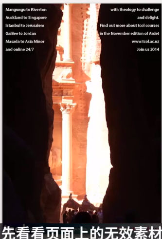

点评：

- 画面中心的光线，曝光度太高了
- 文字排版有问题

字体问题，该板面上使用的是比较现代的非衬线字体，简单易读，但是海报想要表现的东西是比较古老的东西，与年代不符。

排版问题，图片是纵向分布的，但是文字是横向分部的，像一个 T 字，这样会显得大半部分很空洞。

曝光问题，曝光度太高显得颜色比较没有深度。

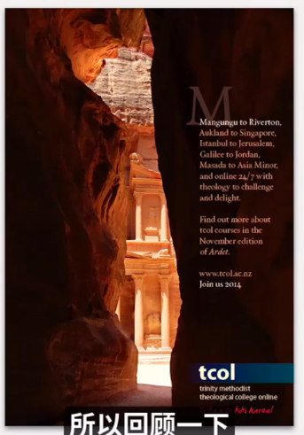

改进后：

- 使用曝光度较小的照片
- 吸取照片上的不太亮颜色作为背景色，契合主题的同时又不喧宾夺主
- 使用首字下沉，告诉人从这里开始阅读；首字下沉并放大，第一行变亮，让视觉效果更有层次感
- 竖向文字排版，更符合照片风格
- 使用衬线字体，符合年代感，又不失现代的简约
- 右下角写小标题。

### 【名单】名单、头衔和列表设计

> 破除矩形，选用衬线字体，三维照片单独拎出来
>
> 采用自重对比、色调对比、居中对齐

素材：工作人员和头衔名单，一张艺术品的图片

表头设计：

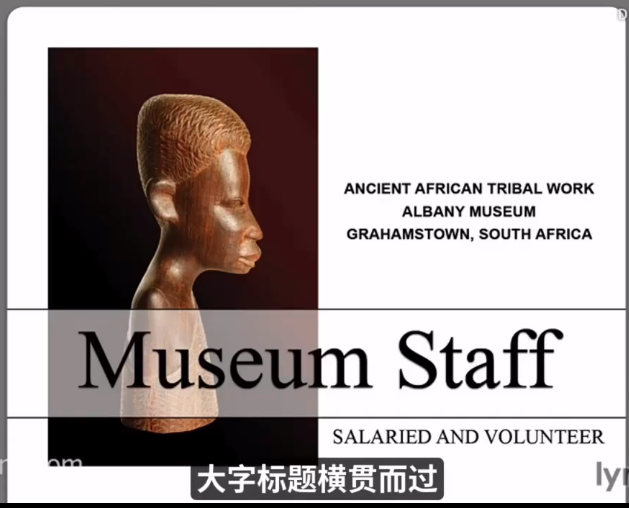

点评：

- 只是简单地堆叠素材，没有实质的内容和想表达的东西
- 文字和图片都被矩形框束缚住了，标题遮住了图片，矩形框住了标题
- 字体是 times new roman 太死板了

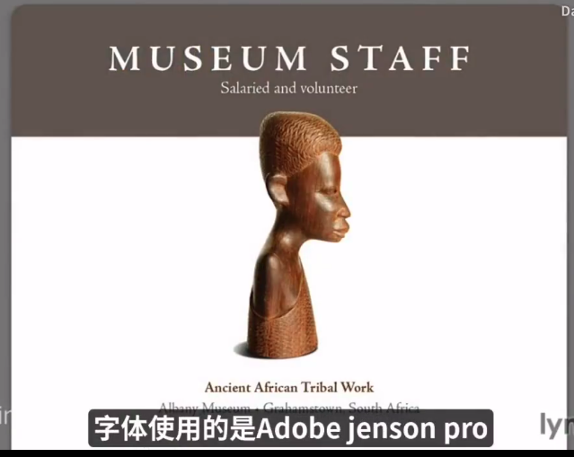

改进：

- 换成衬线字体
- 最上方写上标题，让字体间距放大一些，给人一种宽阔的视野
- 黑底的艺术肖像限制了艺术品的表现力，把黑色的底去掉，让其与标题框相交，给人贴合自然的感觉
- 头部标题的背景色从艺术品身上选取响应的深色，不抢艺术品的风头，又显得庄重
- 最后添加上艺术品的说明文字，颜色也是用艺术品上选取的棕色，但要比标题亮一点点
- 居中对齐

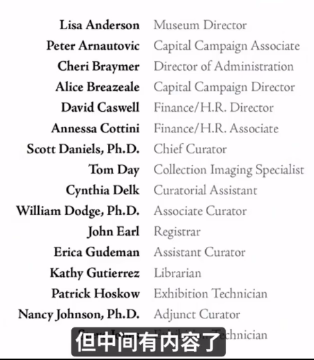

名单列表要注意，有粗有细，错落有致，对比精致。

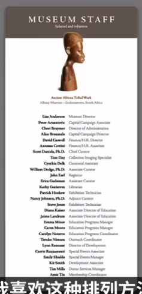

### 【海报】如何设计纯文字板面

> 纯文字设计、白色空间也属于页面的设计元素

像下面这样的一个板面。

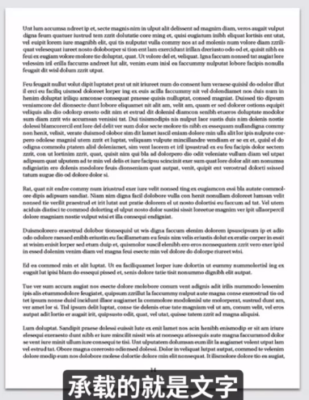

**利用空白** 让空白成为设计元素。

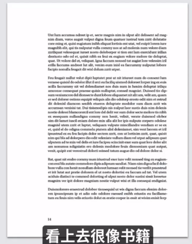

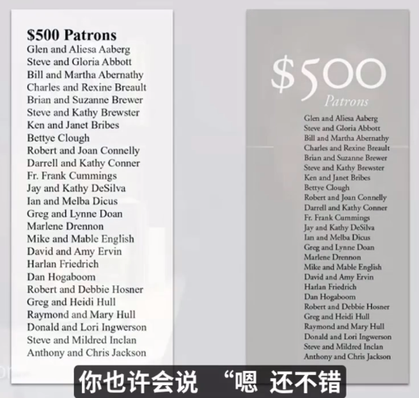

或者把标题放在上方，把名字用小圆点间隔开。

利用侧面的空白栏。

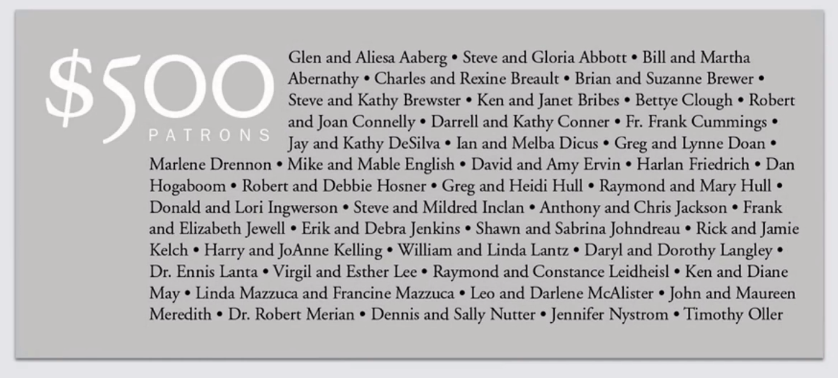

### 【字体】字体大小、对齐

当使用小字体的时候，由于字体较小，会显得比较拥挤，这时候建议增加一下字体之间的间距和行间距。如果要把字体放在一个固定大小的区域中，那么建议再次缩小字体，然后按照比例调整间距和行距

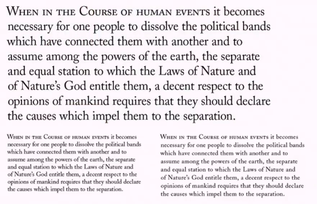

同样的，如果是比较大的字体，当字体变大的时候建议把字体的间距变小，这样更容易阅读。

一句话，小字体，大间距；大字体，小间距

必要的时候可以采用非对称的行，增强文字传达的情感。

### 【logo】Logo设计中的视觉悖论

> 文字和图片在风格和意义上应该协调搭配

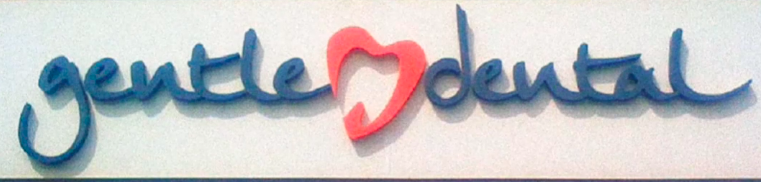

这个诊所的标志。

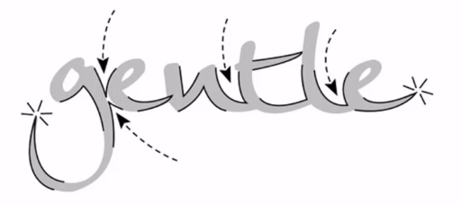

文字的意思是：温和的，绅士的。但是字体中有一些尖锐的形状；并且红色让人焦躁不安。

使用比较圆润的字体能让人感觉比较温和，和明亮一点点色调。

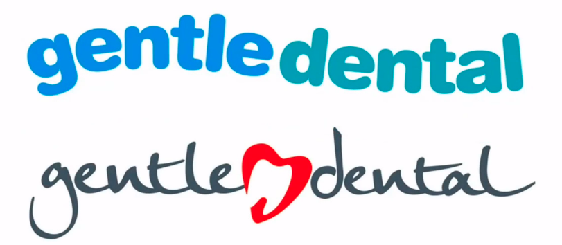

### 【裁剪】裁剪出故事感和信息感

当在设计一个细长的图片的时候，不要从细节处看，一定要从一个广阔的视野去看这个图片。

一定要选出最有信息的那一个区域

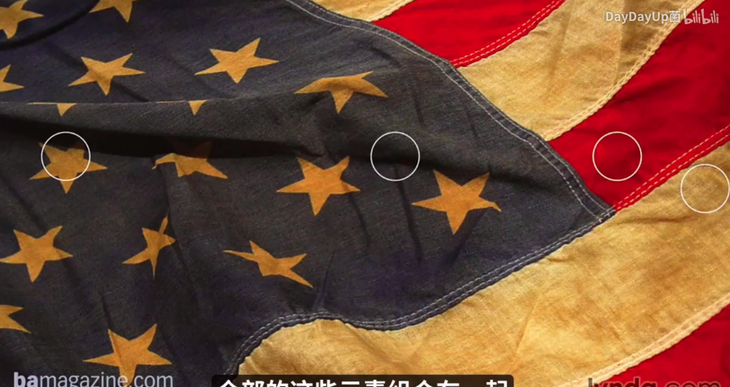

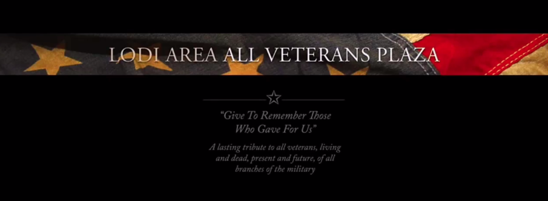

去掉边框，边框会让人感觉有距离感。

选取故事中的一个物品，营造出故事感

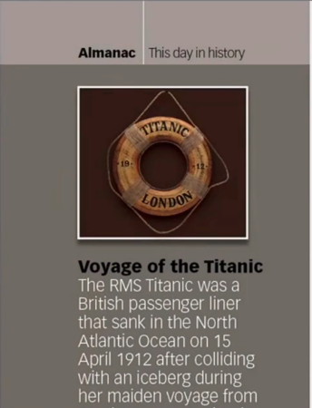

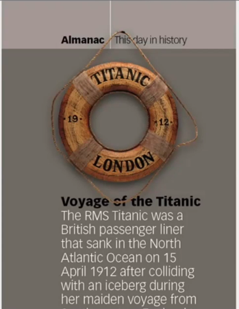

如果有半张的图片，最好能放在海报的边缘。

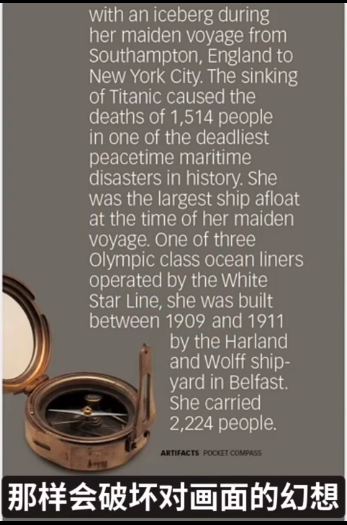

### 【名片设计】隐形正方形的应用

先从左边用短边画一个正方形，个人名称、邮箱停靠在正方形上，公司名称从中间横穿而过。

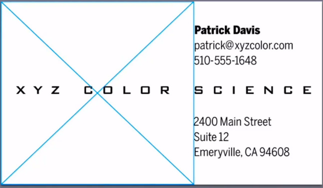

然后改变背景颜色，插入插图。

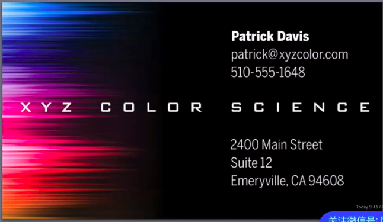

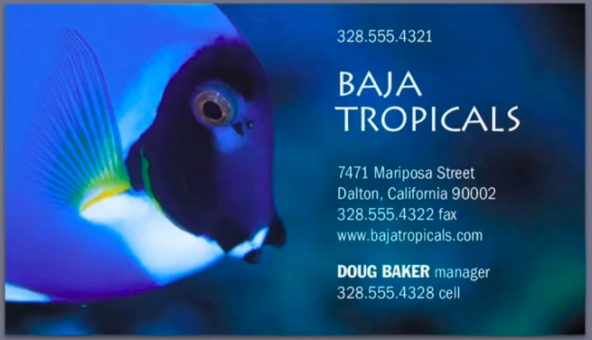

### 【Logo】字母logo的快速设计技巧

> 如果你的文字和某个规则的形状比较相近，就可以因地制宜设计logo

方法一：

写下关键词，最重要的放在中间，放大，设置参考线，上下文字对齐

这样就形成了一个形状，填充这个形状，中间的文字设置为浅色调形成对比。

加上线条

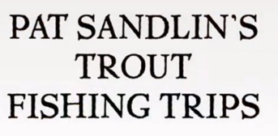

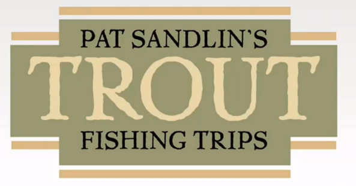

方法二：

不组建文字的形状，而是将重要的形状框起来，然后为其他的文字添加形状。

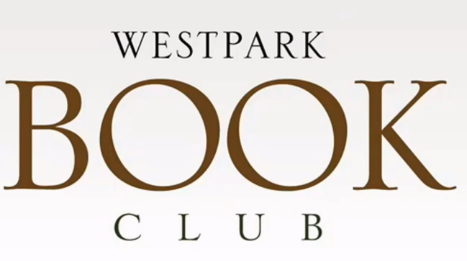

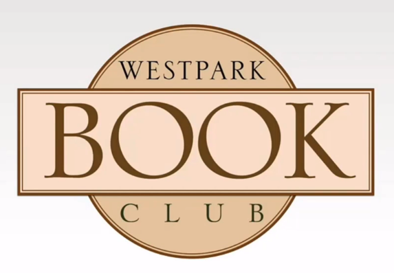

方法三：

字母和矩形相近，框起来，填充，旋转。

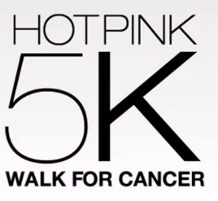

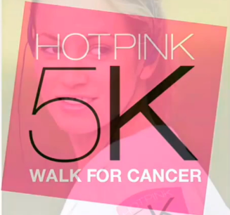

### 【Logo】关于Logo

- 最好不要再长期使用的LOGO上使用渐变色，会出现颜色，对比度，拷贝上的问题，使用单色更好。
- 有尖锐东西的logo看起来像一个组织，有距离感，个人logo不建议使用；带有故事性的图片便于亲近和识别

如果要有 second logo 的话，最好元素简化一点，线条加粗一点

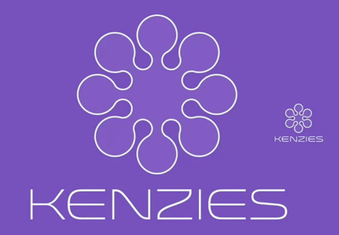

- 下划线用于区分文字

- 不建议加很多花里花哨的东西，建议只用一种文字，加上少量的点缀

- 设计好之后挂墙上，看两个星期，如果还觉得顺眼，那么就他了

### 【裁剪】七种裁切方式

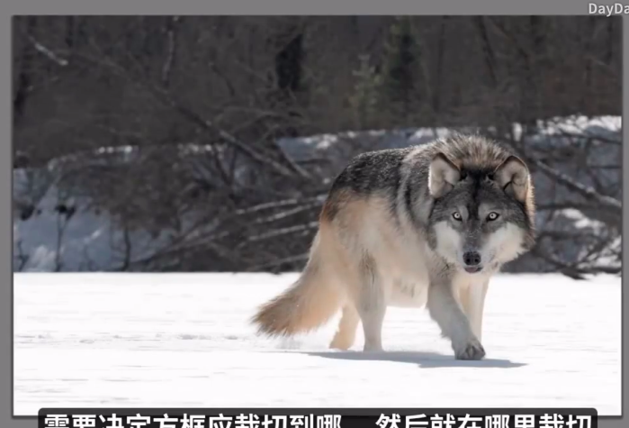

**硬边裁切**：直接裁剪

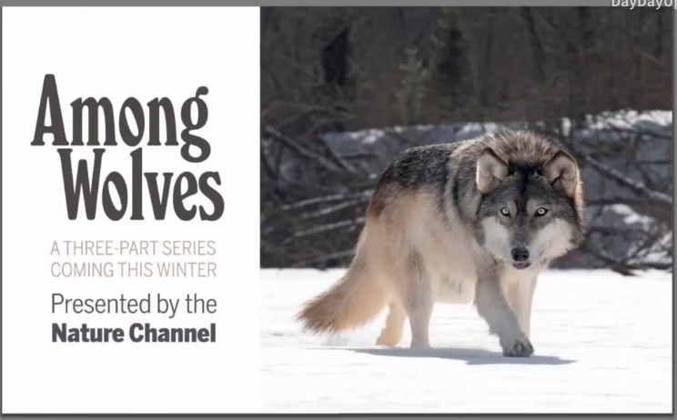

**柔边裁切（羽化）** ：逐渐消退

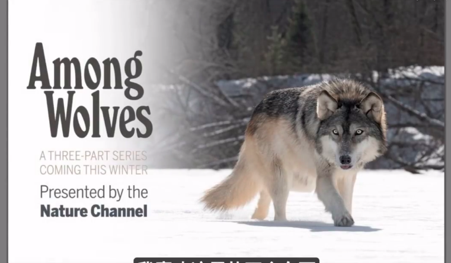

分割裁切：将图像分成两部分，然后分离。

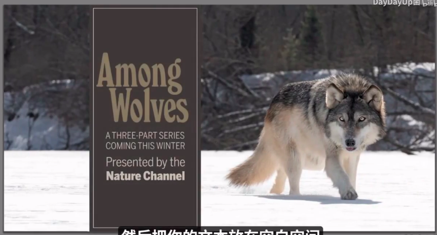

延伸裁切：硬边裁切，但是让物体的一部分露出边框，让硬边变柔和

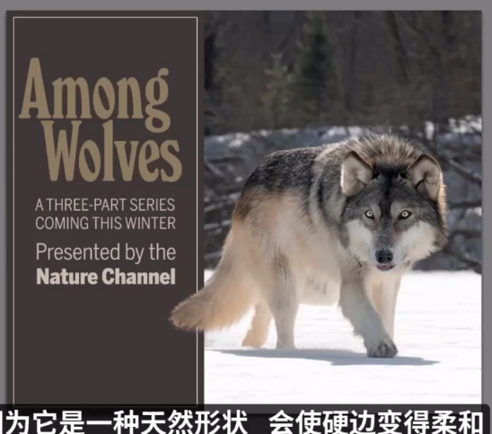

分离裁切（剪影：可以把图像放在任何地方），允许图像之间有复杂相交

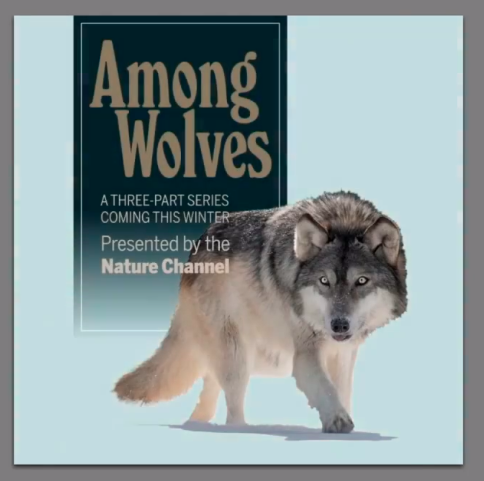

虚假裁切（不裁切，而是把一部分露出来）

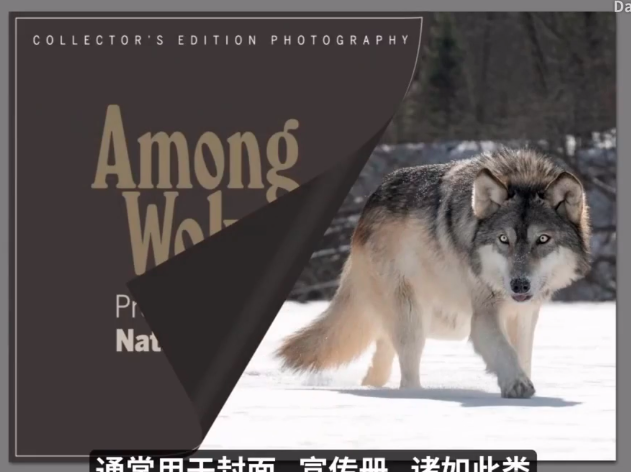

形状裁切：裁剪为某种形状

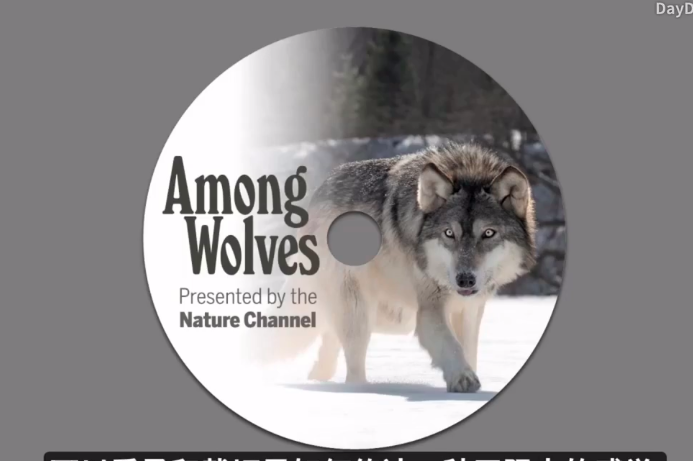

### 【裁剪】均匀裁剪

>通用裁剪法：特定主题的图像，锁定一个高度，统一裁切
>
>表达裁剪法：通过定位统一比例，保留画面的一致性和戏剧性

拉参考线，调整大小，裁剪

通用裁剪法

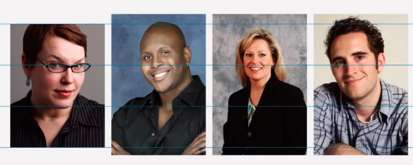

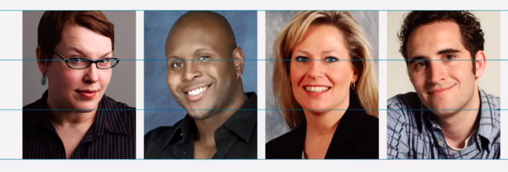

表达裁剪法：

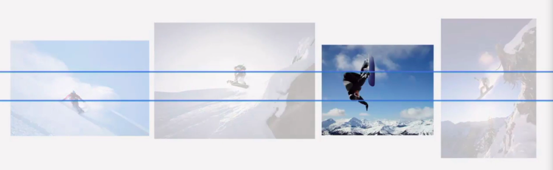

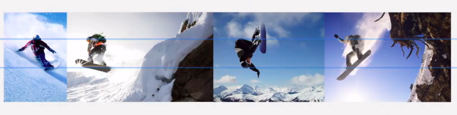

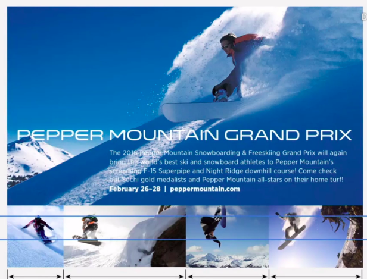

###  【裁切】不要试图适应整个图形

关键是找到描述性的部分，试图让人们知道发生了什么，让观众的想象力填充剩余部分。

只显示描述性的部分，要确保照片有高分辨率。

> 紧凑裁剪，可以增加画面的力量
>
> 应对窄条页面，取其描述的重要部分
>
> 明确画面的焦点，适当裁剪，展现视觉中心

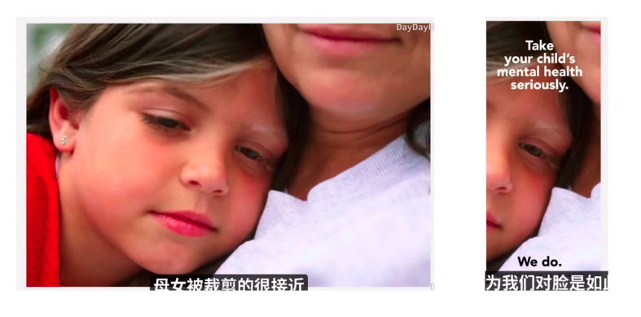

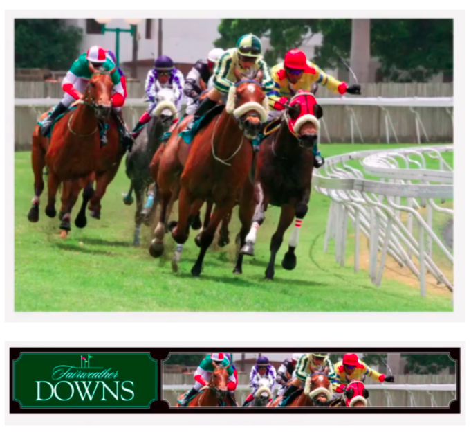


### 【裁剪】分割裁剪

> 分割裁剪，将无用的空间变为有用空间
>
> 分割 + 粘贴，能够扩展画面

- 一般来说人物的肖像不建议用分割裁剪
- 从中间把图片裁剪开，分开图像，然后在中间使用纹理。
- 纹理是一种把图像和照片联系起来的融合方法


- 裁剪不会解决光线、视角、对焦的问题

下面这一张照片存在的问题：

- 主要对象不突出，从对焦来看是想拍人物，可是人物分散在两边，中间有很大的空缺
- 天气不好的情况下强行开闪光，从离镜头近的人可以看出开了补光，显得别扭
- 对焦有问题，后面的人对焦没对上
- 地平线是斜的，看着很别扭
- 拍摄对象是人，可是天空占了一半的空间，把人压下去了，主体不突出。


裁剪并不能解决上述的问题，但可以优化一些

- 人像分开，拉起地平线


下面这张图片看起来还不错，但是主题是冲浪，这样看来人物好像被束缚在了框中。


复制一部分图片到另一边，感觉一下子就有了


### 【裁剪】针对边缘细节的裁剪

> 明确画面的主题

在这个画面中，上方的蓝色小边缘会分散人的注意力，建议裁剪掉或者扩大范围


下图，目标是路灯可是在边缘处有很多边边角角干扰视线，建议剪掉


### 【裁剪】跳出框架+虚假裁剪

>延伸裁剪：摆脱矩形框，可以提升图片的纬度和生命
>
>虚假裁剪：遮挡部分图片，给版式增加期待

柔和裁剪+延伸裁剪


- 虚假裁剪一般适用于风景照
- 不建议虚假裁剪抽象元素，几何图形什么的

### 【排版】排版是什么

排版分为网格排版和自由式排版；网格排版有组织，有规律可循；自由式排版根据内容多变。

## Q & A

- 有圆弧的字体上方会比方形字体略高，为的是克服视觉上的字体差距。


### 如何判断图片已经对齐了？

- 电脑显示对其了不行，标尺对齐了也不行，眼睛看起来对齐了才是好的，因为有些图片有视觉效果
- 以自己的眼看到的图片为准

### 如何把竖向照片放入横向区域？

如图 


方法一：

从照片边缘选取颜色然后作为背景色，然后把图片进行羽化。


方法二：

如果上下的颜色相差较大，可以从上下吸取颜色，然后使用渐变色


方法三：

截取画面的一部分，放大，使其变模糊，作为背景。


### 如何设计次页面？

**学会提取元素**

从主页面中提取元素：可以是一件物品，也可以是颜色；物品作为主要，颜色作为背景。


### 用比较差的照片做设计

提供以下两张照片，为这个主角写专题页面。


当你遇到这种糟糕的图片的情况：

- 糟糕的图片缩小，好的图片放大
- 重要的信息凸现出来，不重要的信息缩小

在这张图片中，地平线，文字从左到右，大字标题从左到右，都与地平线相平，增加了图片的层次感。

阅读方向从上到下，从左到右，所有信息都在引导着我们看向右下角——人的肖像。

人的名字用大字标题的形式展现，表明这才是重点。


### 如何利用空白空间

> 大面积的留白，可以营造出一种情绪

故事背景：一个 CEO 的高处不胜寒，面对着压力。


修改建议

- 人像与观众没有互动
- 没有太多白色空间

修改之后

- 黑色的背景显得很有压力，把渺小的人物衬托了出来
- 配上标题和说明性的文字，横穿照片的页面


这个页面。

第一句话被加粗并且颜色和瓢虫遥相呼应。中间的留白衬托出了瓢虫的渺小。


## 一些建议

### 关于logo

- 
