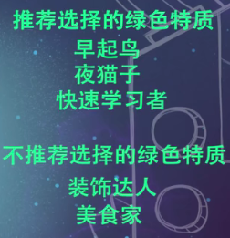
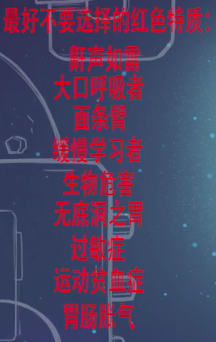
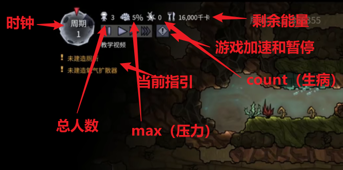
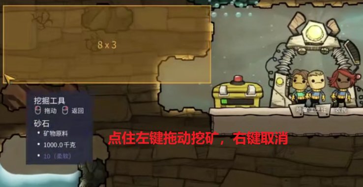
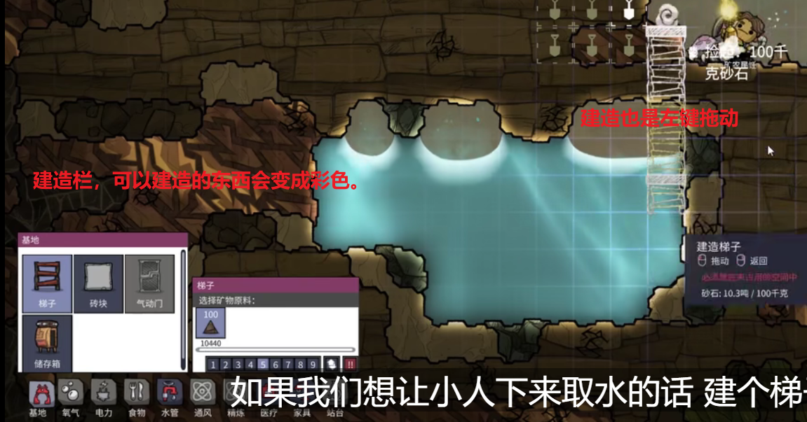
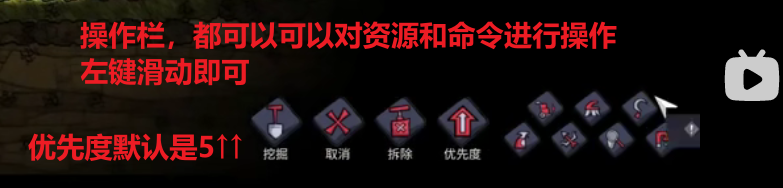
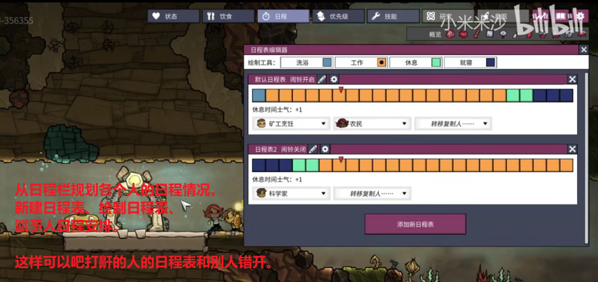
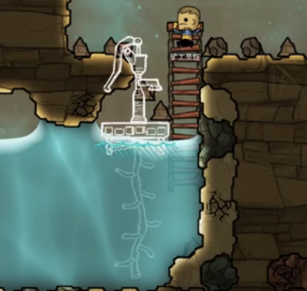

Oxygen Not Included
========================

## Start Up

**星球选择**

首选生存、第一个星球平稳度过200个周期再考虑其他星球。

**人物选择**

兴趣：

- 1个属性+7点，专精，前期比较强
- 属性越多，分摊越少
- 兴趣越广泛，在完成工作的时候所需的【士气】越少，后期比较强（容易控制）

特质：

- 绿色特质大多数都是好的

某一个时段内全属性+2

‘鼾声如雷’ 特质的小人 的 床 要和其他人隔离开，news不建议选

压力反应：

不建议选【狂吃】、建议【呕吐、大哭】等

*最好选择一个研究属性至少+3的（科学家）、一个挖掘属性至少+3的，最后一个可以选种地的或者研究的（+3）。两个兴趣就可以。*

## Layout

- 小人的高度是2格，因此至少需要2个的高度才能通过。
- 小人可以跳跃1格的高度，没有梯子也可以跳过去
- 小人的挖掘范围：以脚步为中心，向上3格和向下3格，共7格
- 房间系统要求面积是4的倍数

开局建议开启收获食物，先选中所有植物，便于收获。

开局第一周期内就得造厕所。

一周期是600秒，10分钟。

点击人物可以改名字，给人物起一个好记的名字。

日程表规划：

解决睡觉打鼾的人的问题：

开局应该做的事：

1. 找到水源，放下手压泵
   

2. 建造床，床不能放在打印门附近，因为会发光。
   在右上角状态栏概览可以看到发光的范围，点击“光照”

把床放在光照范围之外，一个人一张床。

