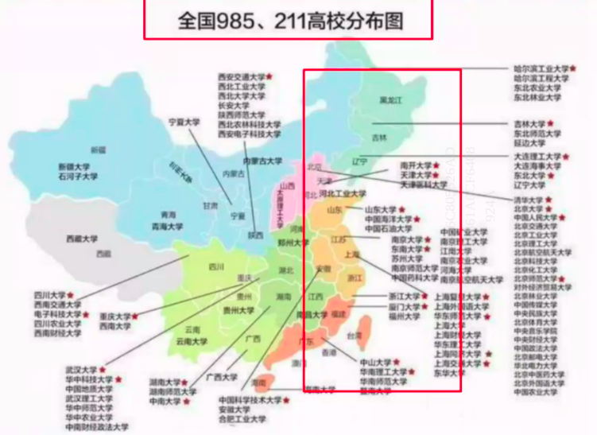
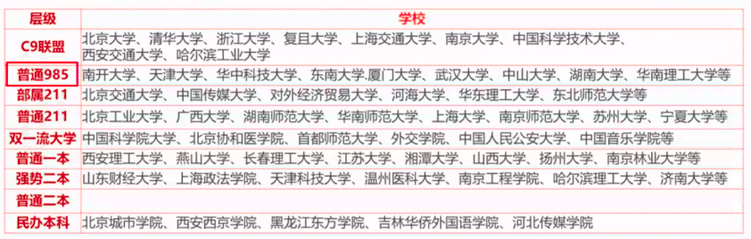

# 全国硕士研究生统一招生考试

## 前置知识

```
直博：硕博连读
学力：学习能力和知识水平
学历：正式学习经历
同能学力：学习经历虽然不同， 但是在知识水平和学习能力方面达到了同等水平。
教育部按照一区、二区制定并公布参加全国统考和联考考生进入复试的初试成绩基本要求。一区包括北京、天津、河北、山西、辽宁、吉林、黑龙江、上海、江苏、浙江、安徽、福建、江西、山东、河南、湖北、湖南、广东、重庆、四川、陕西等2省（市）；二区包括内蒙古、广西、海南、贵州、云南、西藏、甘肃、青海、宁夏、新疆等省（区）。
A类考生：报考地处一区招生单位的考生。
B类考生：报考地处二区招生单位的考生。
```

填志愿报名（9月预报名，10月正式报名）->考试（12月，国家统一）->出分->复试（学校自主3-4月）

只能填一个学校的一个专业

考试顺序：

| 时间                   | 科目   |
| ---------------------- | ------ |
| 8：30 ~ 11：30         | 政治   |
| 14：00 ~ 17：00        | 英语   |
| 第二天 8：30 ~ 11：30  | 数学   |
| 第二天 14：00 ~ 17：00 | 专业课 |





全日制专硕和学硕的区别

| 学硕                                 | 专硕                                                         |
| ------------------------------------ | ------------------------------------------------------------ |
| 应、历届高等教育毕业生或同等学力人员 | 应、往届高等教育毕亚生或同等学力人员（某些专业要求工作经验） |
| 理工科直博几率大                     | 直博机会少                                                   |
| 专业选择余地大                       | 固定专业                                                     |
| 一般3年制，少部分3年制               | 逐渐从2年制改为3年制                                         |
| 政治、英语一                         | 政治、英语一或二                                             |
| 学费多为8千                          | 1万2起步                                                     |
| 调剂，可调学硕or专硕                 | 几乎不能调剂到学硕                                           |
| 一定提供住宿                         | 部分开始不提供住宿                                           |
| 只有一个导师校内                     | 校内导师（学习）+校外导师（实践）                            |
| 论文数量质量要求高                   | 一般没有论文要求，偏向实践成果                               |
|                                      |                                                              |

哲学、理学没有专硕

专业代码第3位是 5、6 是专硕

考研形式：

1. 整体竞争力加大
2. 不同区域竞争力不同
3. 不同单位的竞争力不同
4. 不同专业不同

在哪报名？

- 研招网

什么是调剂？

复试没过，过了国家线但没有过学校线


重要时间节点：


除了 国防科大、中国海洋、华东师范、中央民族、西北农林科技，其他985都是自主划线。

本科专业和和 硕士专业的设置区别

- 基础专业（前两个数字）
- 特殊专业（带字母JLZ的）
- 研究方向
- 一级二级


## 院校信息

必须把这些文件下载下来仔细研究，阅读，标注：

- 研究生招生工作管理规定（中国研招网）
- 招生简章（学校研招办3月之后公布）
- 招生目录（学校研招办3月之后公布）

一定要即使看

分数线：【一科不过，满盘皆输】

- 34所自划线
- 国家线
  - 一区国家线，二区国家线
  - 单科分数线，总分分数线
  - A类考生，B类考生
- 学校线
- 学院线
- 专业线
- 方向线

有的是专业难，有的是竞争力大


## 择校准备

考名校必须了解的几个关键信息：

1. 专业复试线（进入复试的最低限）
2. 实际对外招生人数与实际录取标准（拟录取名单）
3. 专业课大纲与真题

人文社科类：地区 + 学校层级优先

技能技艺类：地区 + 专业排名优先

- 报录比存在不小的误差，可能存在大小年，不太可信，而且有些学校不给报录比

- 千万不要看1819年的数据

选学校的时候，招收5个人以下的不考虑

参考：

- 学位网的学科排名 http://www.cdgdc.edu.cn/
- 公众号 - 软科


## 复习参考资料

具体考什么要以学校**最新的**官方文件为准，如下

- 硕士研究生入学考试初试科目设置及试题选用一览表

- 研招网——硕士目录

- 招生单位每一年的招生目录

复习参考书：

- 书单：院校官网、研招网、经验贴、百度【官方渠道】
- 孔夫子二手书、图书馆、网购
- 【注意版本问题和出版社】
- 【只要不更新、旧的就能用】

如果没有指定参考书

- 以前的参考书单
- 真题
- 同层次学校同专业参考书
- 本科教材&拓展读物
- 学科内经典书目

真题怎么找？

- 官网、研招办(接电话的大概是个学生，如果是个学长学姐，加微信！沟通！利用！！！)、学长学姐、论坛
- 考研练习册、本科练习册

辨别资料贩子：找个小号，要别的学校的真题，如果有，那八成是个骗子。

知乎：篇幅比较少的，概率比较大；篇幅大的，可能是【写手】。


## 报考

**报学校的时候根据自己的水平往下压15分。**

**重点看拟录取的名单：看拟录取名单的学生的总成绩或者专业课成绩**

有的学校给分给的低，有的学校给的高，有的压分有的提分。

**选学校的时候要看学校的专业课真题！！！**

陆续往下筛！！！然后筛到2、3个之后拿出来学校的真题

看学校的真题！！看看做得顺不顺手！！

看学校的初试和复试的比例

复试千万不要提前准备！！只要初试能够，复试基本没问题

408的题都是一样的，自命题的不一样，所有资料先从官方找招生简章

衡量报考难度：

- 招生人数（招生目录、拟录取名单）
- 初试难度（国家线、录取线、真题、报录比）
- 复试筛选（复试占比、英语听口）


---

按照学科实力和考研难度，计算机的考研院校基本上可以分为以下5个梯队

> 第一梯队：热门地区+强势专业+强势985或学科实力强劲的211；

清华大学，北京大学、浙江大学，北航、北邮，上海交通大学，同济大学，南开大学、北京理工大学，电子科技大学、武汉大学等;


> 第二梯队：热门地区+优势专业+普通985或学科实力不错的211；

西安交通大学、西南交通大学、北京科技大学、四川大学、东南大学、西安电子科技大学、暨南大学、中国人民大学、上海大学、南京师范大学等；


> 第三梯队：普通地区+优势专业+学科实力强劲的双非或普通211；

中国石油大学，南京航空航天大学，深圳大学、杭州电子科技大学、西北工业大学、华北电力大学等；

