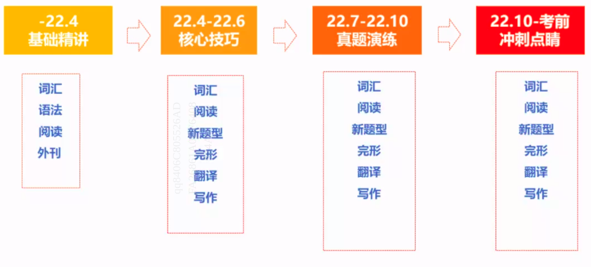
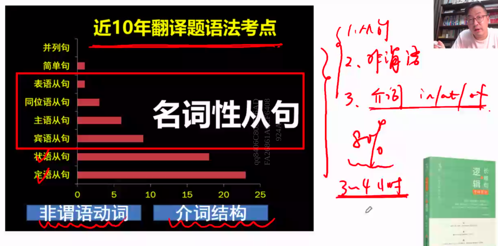
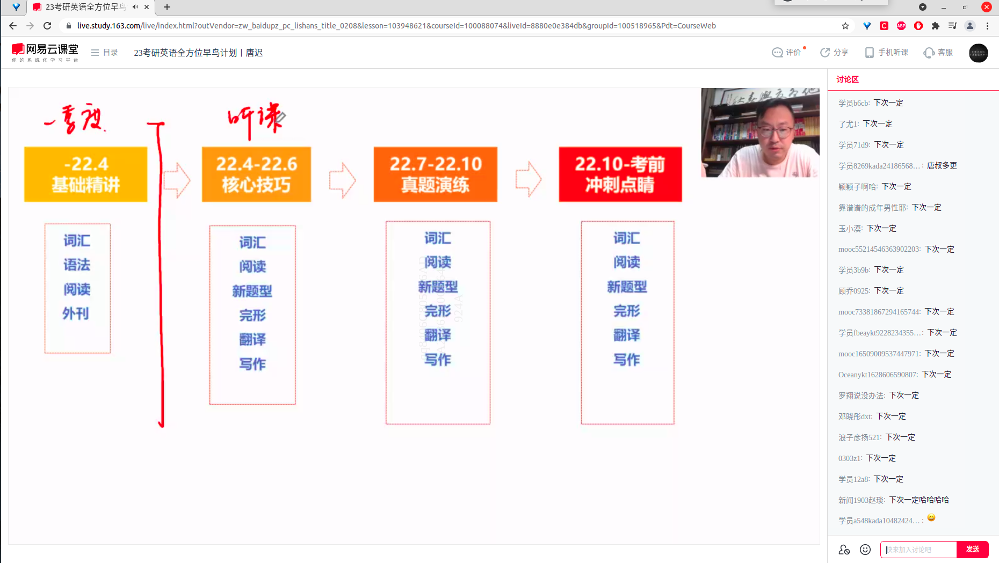

# 考研英语复习2.0版本

 阅读训练方法   
<ul style="list-style:number">
	<li>看题目串联文章大意</li>
	<li>题文同序做题，不会的跳过</li>
  <li>不会的单词一定要现场查！！！我们是在做阅读！不是单词默写！不会的单词直接查！</li>
	<li>想不起来的做题方法现场看！！现看！！！</li>
</ul>

 英语一轮精读方法   
<ul style="list-style:number">
	<li>逐字逐句逐段落一字不落翻译全文、题目、选项</li>
	<li>摘录不会的单词、词组，一旦发现立刻摘录，宁可错杀不能放过</li>
  <li>分析每一句话的作用，每一段的主旨，作者想通过这句话表达什么</li>
  <li>分析句子之间的关系和段落之间的关系，并依此推断出题目的类型</li>
	<li>结合文章分析所有选项，至少分析出题目类型，干扰项错误类型，每一个选项都不含糊</li>
	<li>针对题目类型迭代做题方法，这个方法包括但不限于以下几点
		<ul>
			<li> 例证题 整理表达作者情感的情态动词。 </li>
			<li> 态度题 整理表达作者态度的形容词副词。 </li>
		</ul>
  </li>
</ul>

## 第一阶段【阅读基础】（2022.4.1之前）【76天】

资料

- 《张剑英语二 10-21》、《词汇闪过 》

课程

- 唐迟基础阅读课——阅读方法论

### 阶段1（8天）

1. 学习唐迟阅读方法论、并记笔记
2. 《词汇闪过》每天一个list

### 阶段2（23天）

**英语二真题 17-21 三轮复习**

**第一轮 - 刷题（一天2个Text，大概 1H40m）**

- 做题、找出不会的单词、词组搭配等
- 在做计划的时候这一部分已经做完了，所以不算时间。

**第二轮 - 精读手译（一天1个Text，大概 2H，耗时20天）**

- 手译全文和题目选项
- 分析每一句的作用、意思、每一段的作用和全文主旨
- 对答案，整理

**第三轮 - 重做 （总共耗时3天）**

- 重做所有真题，这个时候应该是非常熟练且all combo的

### 阶段3（约45天）

10-16 共7年真题，每一套真题花费5-7天

**7轮循环**

**1. 刷题（一天4个Text，大概 2H）**

**2. 精读手译（一天1个Text，大概 2H，每年的耗时4-6天）**

然后重做所有题 （总共耗时3天）

## 第二阶段【阅读进阶】（2022.4-2022.7 110天）

真题

- 《张剑英语一10-21》《张剑英语01-10》、《词汇闪过》
- 暂时不考虑考研真相

课程

1. 刷题班【05-21 重解析】（视频每篇Text30min）

2. 阅读技巧课【有基础，记得结合笔记记笔记】

> 这个时候专业课和数学的压力应该是比较大的，因此采用弹性时间

**第一轮 - 做9年真题【02-10】精读看视频（）**

**第二轮 - 做8年真题【11-18】精读看视频（）**

**第三轮 - 做4年真题【19-22】精读看视频（）**

共计21年真题，88篇Text，每篇大概2.5H

如果时间宽裕，尽量在一天之内完成，最少两天一篇。

越早完成越好，因为还要准备小三科和作文。

## 第三阶段【小三科和作文】（2022.8.1开始）

到时候再说。

# 考研英语复习 1.0 版本【已作废】

## 最终规划

按照每天学习计划不同可分配给英语1~3小时复习时间

### 第一阶段【2021.9-2021.12】

一定要重视基础能力的培养 
以后的阅读题大招、做题技巧的有效性都是建立在 
单词、语法、长难句上

使用资料：

- 《恋恋有词》
- 《长难句解密》
- 《长难句的逻辑》
- 唐迟
  - 1.长难句【前期的后期看】
  - 2.美国文化【结合学姐笔记记笔记】
- 唐迟《语法课》
- 《张剑英语二真题 2010 - 2021》

【只看单词和阅读】【只看单词和阅读】【只看单词和阅读】

【探索学习方法】【探索学习方法】【探索学习方法】

时间分配：单词早上背，阅读晚上刷，从05年开始，一天刷两篇阅读，定时20分钟一篇，超时就立刻停下笔。

---

【先把大阅读题看完】【先把大阅读题看完】【先把大阅读题看完】【先把大阅读题看完】

订正：做题的时候答案写在草稿纸上，错掉的题目在试卷相应位置打个叉，不写正确答案，方便自己第二遍回过头来思考。订正错题的时间也在20分钟左右：明确错因。选项翻译。精确定位。

标记：（画圈或者划线）。在阅读过程中，你势必会遇到不懂的单词和搭配，会遇到让你卡壳的地方，不要犹豫，立刻做上标记，注意是立刻，你一定要让自己知道，这块内容你是真的不懂！

摘录。对折上图中的笔记本，把圈里或者线上的生词和搭配摘到笔记本的左边，参考黄皮书，把中文意思抄写到笔记本的右边，将整篇文章的疑点通通摘出。以学长的笔记为例，大概就是这样的效果。

复习：看时间。自学文章中的长难句或者全文

### 第二阶段【2022.1-2022.9】

- 《张剑英语一 1997 -- 2022》
- 唐迟
  - 《阅读和逻辑》
  - 3、基础阅读课【97-04 重技巧】
  - 4、刷题班【05-21 重解析】
  - 5、阅读技巧课【有基础，记得结合笔记记笔记】
  - 6、小三科的完形【只看完形】
- 新东方绿皮乱序

【只看单词和阅读】【只看单词和阅读】【只看单词和阅读】

【重点做阅读】【重点做阅读】【重点做阅读】【重点做阅读】

时间分配：单词早上背，阅读晚上刷，从05年开始，一天刷两篇阅读，定时20分钟一篇，超时就立刻停下笔。

订正：做题的时候答案写在草稿纸上，错掉的题目在试卷相应位置打个叉，不写正确答案，方便自己第二遍回过头来思考。订正错题的时间也在20分钟左右：明确错因。选项翻译。精确定位。

标记：（画圈或者划线）。在阅读过程中，你势必会遇到不懂的单词和搭配，会遇到让你卡壳的地方，不要犹豫，立刻做上标记，注意是立刻，你一定要让自己知道，这块内容你是真的不懂！

【看唐迟老师视频】【看唐迟老师视频】【看唐迟老师视频】

摘录。对折上图中的笔记本，把圈里或者线上的生词和搭配摘到笔记本的左边，参考黄皮书，把中文意思抄写到笔记本的右边，将整篇文章的疑点通通摘出。以学长的笔记为例，大概就是这样的效果。

复习：看时间。自学文章中的长难句或者全文

### 第三阶段【2022.9-2022.12】

【重点看作文和翻译】【重点看作文和翻译】【重点看作文和翻译】

重新做了一遍近15年真题阅读，第二遍刷起来很快。

重点反思错了两遍的题目。猜对的题目也不能放过，切忌不懂装懂。做第二遍的目的不是为了把题目做对，而是为了把题做懂做透，你要去想为什么老师这样出题，为什么这个选项是对的，为什么另几个选项是错的。

准备翻译和阅读。

## 整体阶段规划

**特别强调：在制定计划的时候把时间安排的宽松一点，不要高估自己的执行力，要给自己留有一定的时间缓冲**

第一阶段：1月之前：

| 时间分配  | 内容                     |
| --------- | ------------------------ |
| 1小时左右 | 单词、长难句、英语二阅读 |

第二阶段：1~8月

| 时间分配 | 内容 |
| -------- | ---- |
| 2-3小时 |  单词、英语一阅读  |

第三阶段：8~12月

| 时间分配 | 内容                   |
| -------- | ---------------------- |
| 1-3小时  | 单词、阅读、作文、翻译 |

## 具体时间规划和方法

### 单词-【每天背】

单词书 > 真题 > APP

不要拿出一块时间背单词

**第一阶段-每天一个list**

早上：拿张白纸遮住单词书中文意思，只看底部单词，开始“自测”，在不认识的单词附近打个勾。学完一个list，就立即把打过勾的单词再自考一遍，如果依旧不认识某个单词，则在它附近再打个勾，重复第三遍，以此类推。

晚上：睡前把打勾较多的单词重新自测一遍。此后，根据“艾宾浩森记忆曲线”规律，每隔1 2 4 7 15 天，重新自测一遍，同样，不认识的就打勾，反复记忆。

记忆窍门：只看单词回忆中文。遇到想不起来的单词就在旁边标注一下，下次复习的时候重点记忆这个单词。

注意点：考研单词是不需要你能够准确默写的，看到英文单词知道它典型的几个中文意思就足矣。

**第二阶段-每天一个list**

每天早上半个小时，早上一般半个小时可以背完一个list，可能会更快

**第三阶段-重点看常标记**

九月份之后一般吃完午饭顺手背几个list然后午睡，后期需要重点记忆的是你经常标记的单词

### 阅读-【订正标记摘录复习】

**【英语阅读只用做历年真题】【英语阅读只用做历年真题】【英语阅读只用做历年真题】【英语阅读只用做历年真题】**

#### 简介

两个时间点”2005年开始有新题型、2010开始分英语1和英语2

| 题型(-2005) | 英语                |
| ----------- | ------------------- |
| 完形        | 0.5 * 20 = 10       |
| 大阅读      | 4篇 2 * 20 = 40     |
| 翻译        | 篇内翻译 2 * 5 = 10 |
| 写作        | 图画 20 = 20        |
| 总分        | 100？               |

| 题型(2005-2010) | 英语                            |
| --------------- | ------------------------------- |
| 完形            | 0.5 * 20 = 10                   |
| 大阅读          | 2 * 20 = 40                     |
| 新题型          | 七选五、排序、小标题 2 * 5 = 10 |
| 翻译            | 2 * 5 = 10                      |
| 写作            | 小作文10 + 图画20 = 30          |
| 总分            | 100                             |

| 题型(2010-) | 英语1                           | 英语2                      |
| ----------- | ------------------------------- | -------------------------- |
| 完形        | 0.5 * 20 = 10                   | 0.5 * 20 = 10              |
| 大阅读      | 2 * 20 = 40                     | 2 * 20 = 40                |
| 新题型      | 七选五、排序、小标题 2 * 5 = 10 | 小标题、多项 2 * 5 = 10    |
| 翻译        | 2 * 5 = 10                      | 段落 15                    |
| 写作        | 小作文10 + 图画20 = 30          | 小作文10 + 图表作文15 = 25 |
| 总分        | 100                             | 100                        |

**统计：**

英语一：2001 - 2022 一共22套真题

全部题目数量统计

| 题型   | 数量        |
| ------ | ----------- |
| 完形   | 22 = 22 * 1 |
| 阅读   | 88 = 22 * 4 |
| 新题型 | 17 = 17 * 1 |
| 翻译   | 22          |

22+88+17 = 127 一天两篇大概65天的量

---

英语二：2010 - 2022 一共13套真题

| 题型   | 数量        |
| ------ | ----------- |
| 完形   | 13 = 13 * 1 |
| 阅读   | 52 = 13 * 4 |
| 新题型 | 13 = 13 * 1 |
| 翻译   | 13          |

13+52+13 = 78，一天两篇大概40天的量

#### 唐迟课程资料包介绍

1、长难句的逻辑【短小，但要求有基础】

- 他的这个长难句课程减去了很多语法术语的表述，主要是挑了长难句中最重要的知识点去讲解，也就是主讲主干、非主干和从句关系这三方面的知识；课时一共3.5小时左右。
- 使用方法：适合有一定语法基础的同学去看，比如本身对长难句的把握是非常到位的，那可以拿这门课来做个强化；

2、美国文化背景【提前看】

3、基础阅读课【97-04 重技巧】

- 这部分课是以97-04年的真题阅读为载体，通过专题讲解教你怎么上手阅读的，是一个讲方法论的技巧课，也相当于是阅读入门课。
- 使用方法：这个课的题虽然很老，但很适合在基础阶段学习阅读方法论的时候刷，因为用年份久远真题来学习方法论可以不浪费真题，建议在刷真题之前刷这个课，刷完这个课之后再刷真题就相当于是带着技巧方法去刷了，这样上手会快一些。

4、刷题班【05-21 重解析】

- 一篇文章对应一个视频，单独讲解。一共讲解了05-21年的全部真题，但课程是分三部分去更新的：
  - 逐篇精讲05-09年的真题，是放在逻汉班一里面讲的，所以这部分的刷题课也叫逻汉班一；
  - 逐篇精讲10-17年的真题；
  - 近3年的真题，因为强化阶段刷真题的时候，需要单独把近3年的真题空出来作为考前的模拟卷，所以这部分可以留着考前看。
- 使用方法：唐叔的刷题班我个人是非常推荐看，建议在强化阶段系统性刷真题的时候配合使用。也就是做完一篇真题，看对应的课程讲解，一套操作下来，能更了解和熟悉阅读真题的出题套路，比起自己看黄皮书的解析，效率会高不少。

5、阅读技巧课【要有基础，记得结合笔记记笔记】

- 这个技巧课一共包含了两部分，05-09以及10-20年真题阅读的技巧串讲。

- 使用方法：05-09和10-20年这两部分课，都是讲他那套做题方法和技巧的，来来回回都是那些东西，建议挑一个看就行。这部分的课程建议大家在已经刷一遍真题，或者已经刷了7、8套真题的基础之上再去听，相当于是在强化阶段做一次全面的技巧总结，基本上阅读的技巧你就掌握七七八八了，也不需要再去看后期那些乱七八糟的技巧课了，这部分课完全够用了。
- 另外：听技巧课的时候一定要记笔记（笔记做好以后务必经常拿出来回顾），保存学姐听这部分课的时候记的笔记，这样你就可以搭配我整理笔记去听，然后在听课的过程中直接在我做的笔记上补充一些你想补充的内容就行，这样应该能节省不少时间，听课的效率也会高很多。

6、小三科【只看唐叔的完形】

- 小三科是讲完型、翻译、新题型这三科的，唐叔负责讲新题型，宋逸轩老师讲完型和翻译。

- 这个课建议只听完型部分，因为新题型唐叔讲得很一般，建议跟别的老师。当然现在还早，不需要纠结小三科要怎么复习、看谁的课的问题，到后期我会专门出视频来讲小三科的复习方法和推荐老师。

## 参考资料

单词
- 红宝书
- 恋词【√ - 第一阶段】
- 绿皮乱序书【√ - 第二、三阶段】

真题
- 张剑黄皮书【√】

阅读
- 唐迟《阅读和逻辑》
- 《长难句解密》【√ - 第一阶段】

## 唐迟说

### 全年复习规划

英国《卫报》

**高效法则**

近三年真题【9-11月份】完全掌握

词以类记【经济、财经、社会、人文等】《词汇的逻辑》

单词语法齐头并进《长难句的逻辑》【b站上有唐叔讲语法的】

一定重视基础！！！

【单词+长难句】一定要重视！！！

> 有人为了让你听一席话，至少读了十年书。

---

> “一键三连是一个考研生最基本的素质—— 唐叔”
>
> “下次一定——弹幕”

