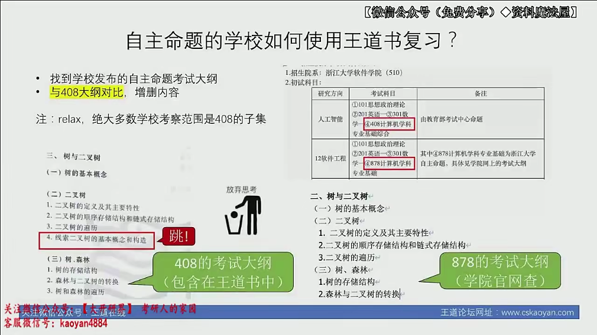
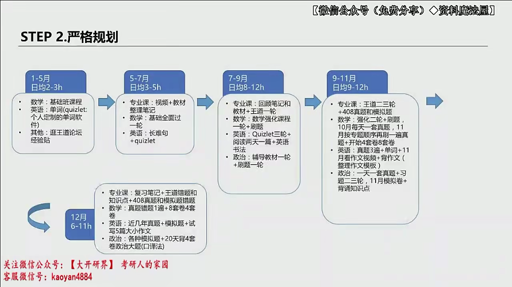
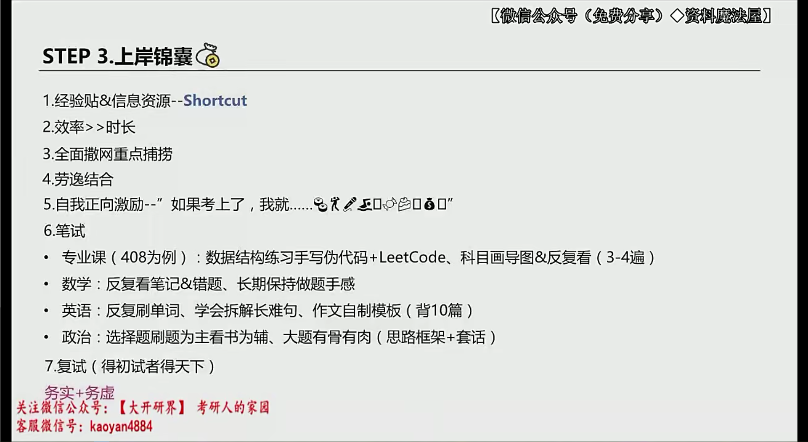
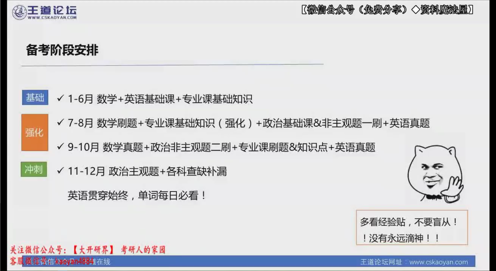
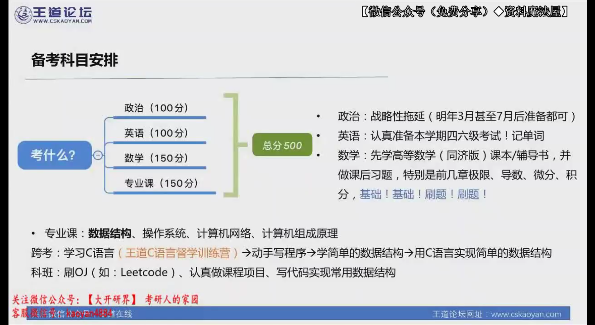

# 专业课复习计划V1.0

## 第一轮（2022.7月之前）

## 第二轮（2022.7-2022.8）

# 408

## 基础知识

分值

| 科目 | 占比 | 分值 |
| ---- | ---- | ---- |
| DS   | 30%  | 45   |
| 计组 | 30%  | 45   |
| CO   | 23%  | 35   |
| CN   | 17%  | 25   |

**选择题(1-40题)**

1-10题-数据结构(20分)

11-22题-计算机组成原理(24分)

23-32题-操作系统(20分)

33-40题计算机网络(16分)

Total: 80分 Percentage: 53.3%

**应用题(41-47题)**

41题-数据结构(10分)

42题-数据结构(15分)

43题-计算机组成原理(8分)

44题-计算机组成原理(13分)

45题-操作系统(7分)

46题-操作系统(8分)

47题-计算机网络(9分)

Total: 70分 Percentage: 46.6%

教材：

- 王道2023全套。

- 数据结构
  - 严《数据结构C语言版》黑色的 教材
- 计组
  - 唐朔飞 《计算机组成原理》 教材
- 系统
  - 汤晓丹 《计算机操作系统》教材
- 计网
  - 谢希仁 《计算机网络》 教材

## 北大软微神仙学姐

## 王道

