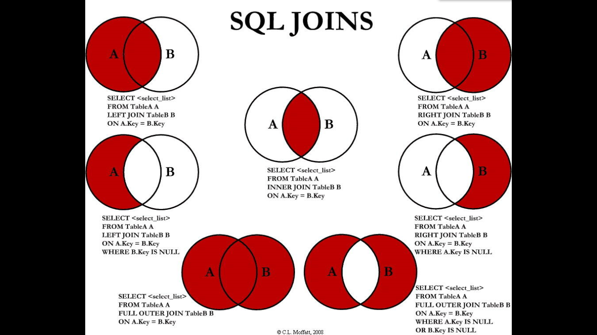

# MySQL高级

## MySQL架构介绍

MySQL是一个关系型数据库管理系统，由瑞典MySQL AB公司开发，目前属于Oracle公司。 

MySQL是一种关联数据库管理系统，将数据保存在不同的表中，而不是将所有数据放在一个大仓库内，这样就增加了速度并提高了灵活性。

MySQL是开源的，所以你不需要支付额外的费用。

MySQL是可以定制的，采用了GPL协议，你可以修改源码来开发自己的MySQL系统。 

MySQL支持大型的数据库。可以处理拥有上千万条记录的大型数据库。

MySQL使用标准的SQL数据语言形式。

MySQL可以允许于多个系统上，并且支持多种语言。这些编程语言包括C、C++、Python、Java、Perl、PHP、Eiffel、Ruby和Tcl等。

MySQL支持大型数据库，支持5000万条记录的数据仓库（分库），单表最大容量大约为500万条数据（分表），32位系统表文件最大可支持4GB，64位系统支持最大的表文件为8TB。

### MySQL用户与权限管理

#### 用户管理

- 创建用户 create user zhang3 identified by '123123';
	
	- 表示创建名称为zhang3的用户，密码设为123123；
- 修改当前用户的密码:

  -  set password =password('123456'); flush privileges; 
- 修改某个用户的密码: 
	- update mysql.user set password=password('123456') where user='li4'; flush privileges; 

-  修改用户名：
	- update mysql.user set user='li4' where user='wang5'; flush privileges;

- 删除用户：
	- drop user li4 ; （不要通过delete from  user u where user='li4' 进行删除，系统会有残留信息保留。 ）
- <span style = "color:red">flush privileges;   所有通过user表的修改，必须用该命令才能生效。</span>

**user表：**

查看用户
select host,user,authentication_string,select_priv,insert_priv,drop_priv from mysql.user;


 **host**    表示连接类型

% 表示所有远程通过 TCP方式的连接

IP 地址 如 (192.168.1.2,127.0.0.1) 通过制定ip地址进行的TCP方式的连接

机器名   通过制定i网络中的机器名进行的TCP方式的连接

::1   IPv6的本地ip地址  等同于IPv4的 127.0.0.1

localhost 本地方式通过命令行方式的连接 ，比如mysql -u xxx -p 123xxx 方式的连接。

**User**   表示用户名

同一用户通过不同方式链接的权限是不一样的。

**password**   密码

所有密码串通过 password(明文字符串) 生成的密文字符串。加密算法为MYSQLSHA1 ，不可逆 。

mysql 5.7 的密码保存到 authentication_string 字段中，不再使用password 字段。

**select_priv , insert_priv**  等为该用户所拥有的权限。

#### 权限管理

授予权限：

授权命令： grant 权限1,权限2,…权限n on 数据库名称.表名称 to 用户名@用户地址 identified by ‘连接口令’;
该权限如果发现没有该用户，则会直接新建一个用户。

grant select,insert,delete,drop on atguigudb.* to li4@localhost  ;
 #给li4用户用本地命令行方式下，授予atguigudb这个库下的所有表的插删改查的权限。

grant all privileges on *.* to joe@'%'  identified by '123'; 
#授予通过网络方式登录的的joe用户 ，对所有库所有表的全部权限，密码设为123.

收回权限：

查看当前用户权限 show grants;

收回权限命令： 
revoke  权限1,权限2,…权限n on 数据库名称.表名称  from  用户名@用户地址 ;

REVOKE ALL PRIVILEGES ON mysql.* FROM joe@localhost;
#收回全库全表的所有权限

REVOKE select,insert,update,delete ON mysql.* FROM joe@localhost;
#收回mysql库下的所有表的插删改查权限

<span style="color:red"> 必须用户重新登录后才能生效</span>

查看权限：

查看当前用户权限
show grants;

查看某用户的全局权限
select  * from user ;

查看某用户的某个表的权限
select * from tables_priv;

### sql_mode的配置

MySQL的sql_mode合理设置

sql_mode是个很容易被忽视的变量，默认值是空值，在这种设置下是可以允许一些非法操作的，比如允许一些非法数据的插入。在生产环境必须将这个值设置为严格模式，所以开发、测试环境的数据库也必须要设置，这样在开发测试阶段就可以发现问题。


show  variables like 'sql_mode';

在my.ini文件中，有个sql_mode属性

sql_mode常用值如下： 
set sql_mode='ONLY_FULL_GROUP_BY';

ONLY_FULL_GROUP_BY：
对于GROUP BY聚合操作，如果在SELECT中的列，没有在GROUP BY中出现，那么这个SQL是不合法的，因为列不在GROUP BY从句中

NO_AUTO_VALUE_ON_ZERO：
该值影响自增长列的插入。默认设置下，插入0或NULL代表生成下一个自增长值。如果用户 希望插入的值为0，而该列又是自增长的，那么这个选项就有用了。

STRICT_TRANS_TABLES：
在该模式下，如果一个值不能插入到一个事务表中，则中断当前的操作，对非事务表不做限制

NO_ZERO_IN_DATE：
在严格模式下，不允许日期和月份为零

NO_ZERO_DATE：
设置该值，mysql数据库不允许插入零日期，插入零日期会抛出错误而不是警告。

ERROR_FOR_DIVISION_BY_ZERO：
在INSERT或UPDATE过程中，如果数据被零除，则产生错误而非警告。如 果未给出该模式，那么数据被零除时MySQL返回NULL

NO_AUTO_CREATE_USER：
禁止GRANT创建密码为空的用户

NO_ENGINE_SUBSTITUTION：
如果需要的存储引擎被禁用或未编译，那么抛出错误。不设置此值时，用默认的存储引擎替代，并抛出一个异常

PIPES_AS_CONCAT：
将"||"视为字符串的连接操作符而非或运算符，这和Oracle数据库是一样的，也和字符串的拼接函数Concat相类似

ANSI_QUOTES：
启用ANSI_QUOTES后，不能用双引号来引用字符串，因为它被解释为识别符

 ORACLE：
  设置等同：PIPES_AS_CONCAT, ANSI_QUOTES, IGNORE_SPACE, NO_KEY_OPTIONS, NO_TABLE_OPTIONS, NO_FIELD_OPTIONS, NO_AUTO_CREATE_USER.

### MySQL逻辑架构

#### 总体概览


和其它数据库相比，MySQL有点与众不同，它的架构可以在多种不同场景中应用并发挥良好作用。主要体现在存储引擎的架构上，插件式的存储引擎架构将查询处理和其它的系统任务以及数据的存储提取相分离。这种架构可以根据业务的需求和实际需要选择合适的存储引擎。

1.连接层
 最上层是一些客户端和连接服务，包含本地sock通信和大多数基于客户端/服务端工具实现的类似于tcp/ip的通信。主要完成一些类似于连接处理、授权认证、及相关的安全方案。在该层上引入了线程池的概念，为通过认证安全接入的客户端提供线程。同样在该层上可以实现基于SSL的安全链接。服务器也会为安全接入的每个客户端验证它所具有的操作权限。

2.服务层

2.1  Management Serveices & Utilities： 系统管理和控制工具  
2.2  SQL Interface: SQL接口
	接受用户的SQL命令，并且返回用户需要查询的结果。比如select from就是调用SQL Interface
2.3 Parser: 解析器
	SQL命令传递到解析器的时候会被解析器验证和解析。 
2.4 Optimizer: 查询优化器。
	SQL语句在查询之前会使用查询优化器对查询进行优化。 
	用一个例子就可以理解： select uid,name from user where  gender= 1;
	优化器来决定先投影还是先过滤。

2.5 Cache和Buffer： 查询缓存。
	如果查询缓存有命中的查询结果，查询语句就可以直接去查询缓存中取数据。
	这个缓存机制是由一系列小缓存组成的。比如表缓存，记录缓存，key缓存，权限缓存等

3.引擎层
	存储引擎层，存储引擎真正的负责了MySQL中数据的存储和提取，服务器通过API与存储引擎进行通信。不同的存储引擎具有的功能不同，这样我们可以根据自己的实际需要进行选取。后面介绍MyISAM和InnoDB

4.存储层
	数据存储层，主要是将数据存储在运行于裸设备的文件系统之上，并完成与存储引擎的交互。

#### 查看sql的执行周期

 修改配置文件/etc/my.cnf
新增一行：query_cache_type=1
重启mysql 

先开启 show variables  like '%profiling%';
set profiling=1;

select * from xxx ;

show profiles;     #显示最近的几次查询


show profile cpu,block io for query 编号  #查看程序的执行步骤


#### SQL执行顺序

首先，mysql的查询流程大致是：

- mysql客户端通过协议与mysql服务器建连接，发送查询语句，先检查查询缓存，如果命中，直接返回结果，否则进行语句解析,也就是说，在解析查询之前，服务器会先访问查询缓存(query cache)——它存储SELECT语句以及相应的查询结果集。如果某个查询结果已经位于缓存中，服务器就不会再对查询进行解析、优化、以及执行。它仅仅将缓存中的结果返回给用户即可，这将大大提高系统的性能。

- 语法解析器和预处理：首先mysql通过关键字将SQL语句进行解析，并生成一颗对应的“解析树”。mysql解析器将使用mysql语法规则验证和解析查询；预处理器则根据一些mysql规则进一步检查解析数是否合法。

- 查询优化器当解析树被认为是合法的了，并且由优化器将其转化成执行计划。一条查询可以有很多种执行方式，最后都返回相同的结果。优化器的作用就是找到这其中最好的执行计划。。

- 然后，mysql默认使用的BTREE索引，并且一个大致方向是:无论怎么折腾sql，至少在目前来说，mysql最多只用到表中的一个索引。

手写SQL执行顺序：


机读SQL执行顺序

随着Mysql版本的更新换代，其优化器也在不断的升级，优化器会分析不同执行顺序产生的性能消耗不同而动态调整执行顺序。

下面是经常出现的查询顺序：


### MySQL存储引擎

#### 查看命令

如何用命令查看  #看你的mysql现在已提供什么存储引擎:
  mysql> show engines;


  #看你的mysql当前默认的存储引擎:
  mysql> show variables like '%storage_engine%';


#### 各种简介

1、InnoDB存储引擎
InnoDB是MySQL的默认事务型引擎，它被设计用来处理大量的短期(short-lived)事务。除非有非常特别的原因需要使用其他的存储引擎，否则应该优先考虑InnoDB引擎。

2、MyISAM存储引擎
MyISAM提供了大量的特性，包括全文索引、压缩、空间函数(GIS)等，但MyISAM不支持事务和行级锁，有一个毫无疑问的缺陷就是崩溃后无法安全恢复。

3、Archive引擎
Archive档案存储引擎**只支持INSERT和SELECT操作，不支持UPDATE和DELETE**在MySQL5.1之前不支持索引。
Archive表适合日志和数据采集类应用。
根据英文的测试结论来看，Archive表比MyISAM表要小大约75%，比支持事务处理的InnoDB表小大约83%。

4、Blackhole引擎
Blackhole引擎没有实现任何存储机制，它会丢弃所有插入的数据，不做任何保存。但服务器会记录Blackhole表的日志，所以可以用于复制数据到备库，或者简单地记录到日志。但这种应用方式会碰到很多问题，因此并不推荐。 

5、CSV引擎 
CSV引擎可以将普通的CSV文件作为MySQL的表来处理，但不支持索引。
CSV引擎可以作为一种数据交换的机制，非常有用。
CSV存储的数据直接可以在操作系统里，用文本编辑器，或者excel读取。

6、Memory引擎
如果需要快速地访问数据，并且这些数据不会被修改，重启以后丢失也没有关系，那么使用Memory表是非常有用。Memory表至少比MyISAM表要快一个数量级。

7、Federated引擎
Federated引擎是访问其他MySQL服务器的一个代理，尽管该引擎看起来提供了一种很好的跨服务器的灵活性，但也经常带来问题，因此默认是禁用的。

####  MyISAM/InnoDB

主要区别是前四点，重要！！！

| 对比项 | MyISAM | InnoDB |
| ------ | ------ | ------ |
| 外键   | 不支持 | 支持   |
| 事务   | 不支持 | 支持   |
| 行表锁   | 表锁，即使操作一条记录也会锁住整个表，不适合高并发的操作 | 行锁,操作时只锁某一行，不对其它行有影响，适合高并发的操作   |
| 缓存  | 只缓存索引，不缓存真实数据 |  不仅缓存索引还要缓存真实数据，对内存要求较高，而且内存大小对性能有决定性的影响  |
|关注点|节省资源、消耗少、简单业务|	并发写、事务、更大资源|
|默认安装	|Y	|Y|
|默认使用	|N 	|Y|
|自带系统表使用|	Y	|N|

系统自带的表用MyISAM，不用高并发，但是节省资源

#### 阿里用哪个


- Percona 为 MySQL 数据库服务器进行了改进，在功能和性能上较 MySQL 有着很显著的提升。该版本提升了在高负载情况下的 InnoDB 的性能、为 DBA 提供一些非常有用的性能诊断工具；另外有更多的参数和命令来控制服务器行为。

- 该公司新建了一款存储引擎叫xtradb完全可以替代innodb,并且在性能和并发上做得更好,

- 阿里巴巴大部分mysql数据库其实使用的percona的原型加以修改。
- AliSql+AliRedis

## 索引优化分析

### 性能下降分析

- 数据过多 -> 分库分表

- 关联了太多的表，太多的join -> SQL优化

- 没有充分利用到索引 -> 索引建立

- 服务器调优及各个参数设置 -> 调整my.cnf/my.ini

### 常见的join查询

“在我的日常工作中很少用到右外连接，一般都是用左外连接”

MySQL没有全连接（第三行第一个）



### 索引简介

#### 是什么

MySQL官方对索引的定义为：索引（Index）是帮助MySQL高效获取数据的数据结构。

索引的本质：数据结构。

索引的目的在于提高查询效率

简单理解为“排好序的快速查找数据结构”

举例：

在数据之外，数据库系统还维护着满足特定查找算法的数据结构，这些数据结构以某种方式引用（指向）数据，
这样就可以在这些数据结构上实现高级查找算法。这种数据结构，就是索引。下图就是一种**可能的**索引方式示例：


左边是数据表，一共有两列七条记录，最左边的是数据记录的物理地址，为了加快Col2的查找，可以维护一个右边所示的二叉查找树，每个节点分别包含索引键值和一个指向对应数据记录物理地址的指针，这样就可以运用二叉查找在一定的复杂度内获取到相应数据，从而快速的检索出符合条件的记录。
 
数据本身之外，数据库还维护着一个满足特定查找算法的数据结构，这些数据结构以某种方式指向数据，这样就可以在这些数据结构的基础上实现高级查找算法，这种数据结构就是索引。
 
一般来说索引本身也很大，不可能全部存储在内存中，因此索引往往以索引文件的形式存储的磁盘上

#### 优势/劣势

优势

- 类似大学图书馆建书目索引，提高数据检索的效率，降低数据库的IO成本

- 通过索引列对数据进行排序，降低数据排序的成本，降低了CPU的消耗

劣势

- 虽然索引大大提高了查询速度，同时却会降低更新表的速度，如对表进行INSERT、UPDATE和DELETE。 因为更新表时，MySQL不仅要保存数据，还要保存一下索引文件每次更新添加了索引列的字段， 都会调整因为更新所带来的键值变化后的索引信息

- 实际上索引也是一张表，该表保存了主键与索引字段，并指向实体表的记录，所以索引列也是要占用空间的

#### 索引结构

MySQL 用的**B+Tree**

BTree确实效率更高，但是每个节点都有一个指针，占用的内存大了。

**BTree**


【初始化介绍】

一颗b树，浅蓝色的块我们称之为一个磁盘块，可以看到每个磁盘块包含几个数据项（深蓝色所示）和指针（黄色所示），如磁盘块1包含数据项17和35，包含指针P1、P2、P3，P1表示小于17的磁盘块，P2表示在17和35之间的磁盘块，P3表示大于35的磁盘块。真实的数据存在于叶子节点即3、5、9、10、13、15、28、29、36、60、75、79、90、99。

非叶子节点只不存储真实的数据，只存储指引搜索方向的数据项，如17、35并不真实存在于数据表中。
 
【查找过程】

如果要查找数据项29，那么首先会把磁盘块1由磁盘加载到内存，此时发生一次IO，在内存中用二分查找确定29在17和35之间，锁定磁盘块1的P2指针，内存时间因为非常短（相比磁盘的IO）可以忽略不计，通过磁盘块1的P2指针的磁盘地址把磁盘块3由磁盘加载到内存，发生第二次IO，29在26和30之间，锁定磁盘块3的P2指针，通过指针加载磁盘块8到内存，发生第三次IO，同时内存中做二分查找找到29，结束查询，总计三次IO。
 
真实的情况是，3层的b+树可以表示上百万的数据，如果上百万的数据查找只需要三次IO，性能提高将是巨大的，如果没有索引，每个数据项都要发生一次IO，那么总共需要百万次的IO，显然成本非常非常高。

**B+Tree**


**B+Tree与B-Tree 的区别**

　1）B-树的关键字和记录是放在一起的，叶子节点可以看作外部节点，不包含任何信息；B+树的非叶子节点中只有关键字和指向下一个节点的索引，记录只放在叶子节点中。

　 2）在B-树中，越靠近根节点的记录查找时间越快，只要找到关键字即可确定记录的存在；而B+树中每个记录的查找时间基本是一样的，都需要从根节点走到叶子节点，而且在叶子节点中还要再比较关键字。从这个角度看B-树的性能好像要比B+树好，而在实际应用中却是B+树的性能要好些。因为B+树的非叶子节点不存放实际的数据，这样每个节点可容纳的元素个数比B-树多，树高比B-树小，这样带来的好处是减少磁盘访问次数。尽管B+树找到一个记录所需的比较次数要比B-树多，但是一次磁盘访问的时间相当于成百上千次内存比较的时间，因此实际中B+树的性能可能还会好些，而且B+树的叶子节点使用指针连接在一起，方便顺序遍历（例如查看一个目录下的所有文件，一个表中的所有记录等），这也是很多数据库和文件系统使用B+树的缘故。 

思考：为什么说B+树比B-树更适合实际应用中操作系统的文件索引和数据库索引？ 

1) B+树的磁盘读写代价更低 
　　B+树的内部结点并没有指向关键字具体信息的指针。因此其内部结点相对B 树更小。如果把所有同一内部结点的关键字存放在同一盘块中，那么盘块所能容纳的关键字数量也越多。一次性读入内存中的需要查找的关键字也就越多。相对来说IO读写次数也就降低了。 

2) B+树的查询效率更加稳定 
　　由于非终结点并不是最终指向文件内容的结点，而只是叶子结点中关键字的索引。所以任何关键字的查找必须走一条从根结点到叶子结点的路。所有关键字查询的路径长度相同，导致每一个数据的查询效率相当。

**时间复杂度**


**聚簇索引与非聚簇索引**

聚簇索引并不是一种单独的索引类型，而是一种数据存储方式。

术语‘聚簇’表示数据行和相邻的键值聚簇的存储在一起。

如下图，左侧的索引就是聚簇索引，因为数据行在磁盘的排列和索引排序保持一致。


聚簇索引的好处：

按照聚簇索引排列顺序，查询显示一定范围数据的时候，由于数据都是紧密相连，数据库不不用从多个数据块中提取数据，所以节省了大量的io操作。

聚簇索引的限制：

对于mysql数据库目前只有innodb数据引擎支持聚簇索引，而Myisam并不支持聚簇索引。

由于数据物理存储排序方式只能有一种，所以每个Mysql的表只能有一个聚簇索引。一般情况下就是该表的主键。

为了充分利用聚簇索引的聚簇的特性，所以innodb表的主键列尽量选用有序的顺序id，而不建议用无序的id，比如uuid这种。

#### 索引分类

**基本语法**

创建  CREATE INDEX [indexName] ON table_name(column))

删除  DROP INDEX [indexName] ON mytable; 

查看  SHOW INDEX FROM table_name;

使用ALTER命令

```sql
有四种方式来添加数据表的索引：

ALTER TABLE tbl_name ADD PRIMARY KEY (column_list): 
该语句添加一个主键，这意味着索引值必须是唯一的，且不能为NULL。
 
ALTER TABLE tbl_name ADD UNIQUE index_name (column_list):
这条语句创建索引的值必须是唯一的（除了NULL外，NULL可能会出现多次）。
 
ALTER TABLE tbl_name ADD INDEX index_name (column_list): 
添加普通索引，索引值可出现多次。
 
ALTER TABLE tbl_name ADD FULLTEXT index_name (column_list):
该语句指定了索引为 FULLTEXT ，用于全文索引。
```


**单值索引**

即一个索引只包含单个列，一个表可以有多个单列索引

CREATE INDEX [indexName] ON table_name(column))

```sql
随表一起建索引：

CREATE TABLE customer (id INT(10) UNSIGNED  AUTO_INCREMENT ,customer_no VARCHAR(200),customer_name VARCHAR(200),
  PRIMARY KEY(id),
  KEY (customer_name)
);
  
单独建单值索引：

CREATE  INDEX idx_customer_name ON customer(customer_name); 
 
删除索引：

DROP INDEX idx_customer_name  on customer;
```

**唯一索引**

索引列的值必须唯一，但允许有空值

CREATE  UNIQUE  INDEX [indexName] ON table_name(column))

```sql
随表一起建索引：

CREATE TABLE customer (id INT(10) UNSIGNED  AUTO_INCREMENT ,customer_no VARCHAR(200),customer_name VARCHAR(200),
  PRIMARY KEY(id),
  KEY (customer_name),
  UNIQUE (customer_no)
);
  
单独建唯一索引：

CREATE UNIQUE INDEX idx_customer_no ON customer(customer_no); 
 
删除索引：

DROP INDEX idx_customer_no on customer ;
```

**主键索引**

设定为主键后数据库会自动建立索引，innodb为聚簇索引

```sql
随表一起建索引：

CREATE TABLE customer (id INT(10) UNSIGNED  AUTO_INCREMENT ,customer_no VARCHAR(200),customer_name VARCHAR(200),
  PRIMARY KEY(id) 
);
   
CREATE TABLE customer2 (id INT(10) UNSIGNED   ,customer_no VARCHAR(200),customer_name VARCHAR(200),
  PRIMARY KEY(id) 
);
 
 单独建主键索引：

ALTER TABLE customer 
 add PRIMARY KEY customer(customer_no);  
 
删除建主键索引：

ALTER TABLE customer 
 drop PRIMARY KEY ;  
 
修改建主键索引：

必须先删除掉(drop)原索引，再新建(add)索引
```


**复合索引**

即一个索引包含多个列

```sql
 随表一起建索引：

CREATE TABLE customer (id INT(10) UNSIGNED  AUTO_INCREMENT ,customer_no VARCHAR(200),customer_name VARCHAR(200),
  PRIMARY KEY(id),
  KEY (customer_name),
  UNIQUE (customer_name),
  KEY (customer_no,customer_name)
);
 
单独建索引：

CREATE  INDEX idx_no_name ON customer(customer_no,customer_name); 
 
删除索引：

DROP INDEX idx_no_name  on customer ;
```

#### 创建索引的情况

哪些情况需要创建索引

- 主键自动建立唯一索引

- 频繁作为查询条件的字段应该创建索引

- 查询中与其它表关联的字段，外键关系建立索引

- 单键/组合索引的选择问题， 组合索引性价比更高

- 查询中排序的字段，排序字段若通过索引去访问将大大提高排序速度

- 查询中统计或者分组字段

哪些情况不要创建索引

- 表记录太少

- 经常增删改的表或者字段

	- Why:提高了查询速度，同时却会降低更新表的速度，如对表进行INSERT、UPDATE和DELETE。 因为更新表时，MySQL不仅要保存数据，还要保存一下索引文件
- Where条件里用不到的字段不创建索引

- 过滤性不好的不适合建索引

### Explain

#### 是什么

查看执行计划

使用EXPLAIN关键字可以模拟优化器执行SQL查询语句，从而知道MySQL是
如何处理你的SQL语句的。分析你的查询语句或是表结构的性能瓶颈

#### 能干啥

- 表的读取顺序

- 哪些索引可以使用

- 数据读取操作的操作类型

- <span style = "color:red">哪些索引被实际使用</span>

- 表之间的引用

- <span style = "color:red">每张表有多少行被物理查询</span>

#### 怎么玩

EXPLAIN 加上要查看的完整语句的执行计划

#### 字段的解释

##### id

select查询的序列号,包含一组数字，表示查询中执行select子句或操作表的顺序

三种情况

- id相同，执行顺序由上至下


- id不同，如果是子查询，id的序号会递增，id值越大优先级越高，越先被执行


- id相同不同，同时存在。id如果相同，可以认为是一组，从上往下顺序执行；在所有组中，id值越大，优先级越高，越先执行（衍生 = DERIVED）


**关注点**：

- id号每个号码，表示一趟独立的查询。一个 sql 的查询趟数越少越好。

##### select_type


查询的类型，主要是用于区别普通查询、联合查询、子查询等的复杂查询

SIMPLE

- 简单的 select 查询,查询中不包含子查询或者UNION


PRIMARY

- 查询中若包含任何复杂的子部分，最外层查询则被标记为Primary


DERIVED

- 在FROM列表中包含的子查询被标记为DERIVED(衍生) MySQL会递归执行这些子查询, 把结果放在临时表里。


SUBQUERY

- 在SELECT或WHERE列表中包含了子查询


DEPENDENT SUBQUERY

- 依赖子查询，在SELECT或WHERE列表中包含了子查询,子查询基于外层（in）


UNCACHEABLE SUBQUREY  

- 不可用缓存的子查询（SQL肯定不一样的）


SHOW VARIABLES LIKE '%lower_case_table_names%';

SELECT @@lower_case_table_names FROM DUAL;

出现@@，为MySQL的系统变量
出现@ 为

UNION

- 若第二个SELECT出现在UNION之后，则被标记为UNION； 若UNION包含在FROM子句的子查询中,外层SELECT将被标记为：DERIVED


UNION RESULT

- 从UNION表获取结果的SELECT


##### table

- 代表分区表中的命中情况，非分区表，该项为null

##### partitions

- 显示这一行的数据是关于哪张表的

##### type（重要）

避免出现全表扫描

类型：all, index, range, ref, eq_ref, const, system, null

type显示的是访问类型，是较为重要的一个指标，结果值从<span style="color:red">最好到最坏</span>依次是： 

system > const > eq_ref > ref > fulltext > ref_or_null > index_merge > unique_subquery > index_subquery > <span style="color:yellow">range</span> > <span style="color:orange">index</span> > <span style="color:red">ALL</span>

简而言之：system>const>eq_ref>ref>range>index>ALL

一般来说，得保证查询至少达到range级别，最好能达到ref。

system

- 表只有一行记录（等于系统表），这是const类型的特列，平时不会出现，这个也可以忽略不计

const

- 表示通过索引一次就找到了,const用于比较primary key或者unique索引。因为只匹配一行数据，所以很快 如将主键置于where列表中，MySQL就能将该查询转换为一个常量


eq_ref

- 唯一性索引扫描，对于每个索引键，表中只有一条记录与之匹配。常见于主键或唯一索引扫描

疑问：为啥t1是all的？


ref

- 非唯一性索引扫描，返回匹配某个单独值的所有行. 本质上也是一种索引访问，它返回所有匹配某个单独值的行，然而， 它可能会找到多个符合条件的行，所以他应该属于查找和扫描的混合体


<span style="color:yellow">range</span>

- 只检索给定范围的行,使用一个索引来选择行。key 列显示使用了哪个索引 一般就是在你的where语句中出现了between、<、>、in等的查询 这种范围扫描索引扫描比全表扫描要好，因为它只需要开始于索引的某一点，而结束语另一点，不用扫描全部索引。


<span style="color:orange">index</span>

- 出现index是sql使用了索引但是没用通过索引进行过滤，一般是使用了覆盖索引或者是利用索引进行了排序分组


<span style="color:red">all</span>

- Full Table Scan，将遍历全表以找到匹配的行


index_merge

- 在查询过程中需要多个索引组合使用，通常出现在有 or 的关键字的sql中


ref_or_null

- 对于某个字段既需要关联条件，也需要null值得情况下。查询优化器会选择用ref_or_null连接查询。


index_subquery

- 利用索引来关联子查询，不再全表扫描。


unique_subquery 

- 该联接类型类似于index_subquery。 子查询中的唯一索引


<span style="color:red">备注：一般来说，得保证查询至少达到range级别，最好能达到ref。</span>

##### possible_keys

显示可能应用在这张表中的索引，一个或多个。

查询涉及到的字段上若存在索引，则该索引将被列出，<span style="color:red">但不一定被查询实际使用</span>

##### key

实际使用的索引。如果为NULL，则没有使用索引

查询中若使用了覆盖索引，则该索引和查询的select字段重叠


##### key_len

理解：where 后面的筛选条件命中索引的长度，越大越好

key_len字段能够帮你检查是否充分的利用上了索引

表示索引中使用的字节数，可通过该列计算查询中使用的索引的长度。 

例如：

EXPLAIN SELECT SQL_NO_CACHE * FROM emp WHERE emp.age=30 AND emp.name LIKE 'ab%';

67的（上面的）比较好


如何计算
1、先看索引上字段的类型+长度比如 int=4 ;  varchar(20) =20 ; char(20) =20  
2、如果是varchar或者char这种字符串字段，视字符集要乘不同的值，比如utf-8  要乘 3,GBK要乘2，
3、varchar这种动态字符串要加2个字节
4、 允许为空的字段要加1个字节  


第一组

key_len=age的字节长度+name的字节长度=4+1  + ( 20*3+2)=5+62=67

int本身长度为4（字节），如果可以为null，则+1 ， 所以是5

varchar的长度就是位数20，再看字符集，如果是gbk就 * 2，utf8就 * 3，如果长度可变，就再加 2 

所以是20*3+ 2

第二组

key_len=age的字节长度=4+1=5


##### ref

显示索引的哪一列被使用了，如果可能的话，是一个常数。哪些列或常量被用于查找索引列上的值


##### rows


##### filtered


##### Extra


### 查询优化


#### 批量数据脚本


#### 单表索引及索引失效


#### 关联查询优化


#### 子查询优化


#### 排序分组优化


#### 覆盖索引


## 查询截取分析


### 慢查询日志


### SHOW PROCESSLIST


## 视图


### 是什么


### 作用


### 场景


### 语法


### 注意

## 主从复制


### 基本原理


### 最大问题


### 一主一从常见配置