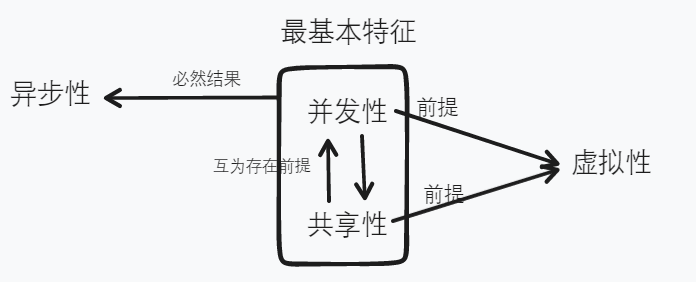
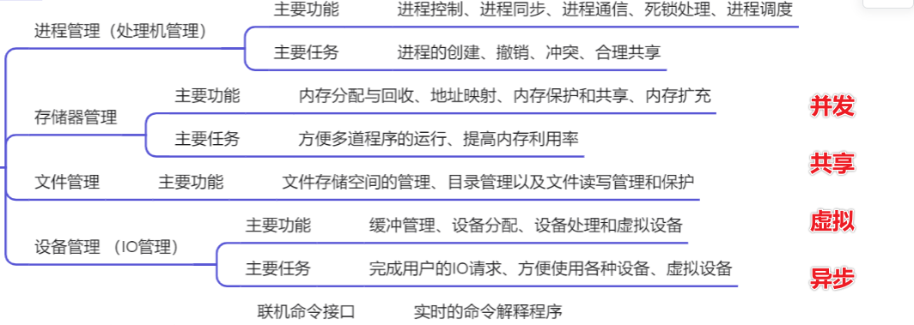

[toc]

##  问题总览

### 第一章 操作系统引论

1. OS的引入和发展

随着计算机技术和应用需求的不断发展，OS由简单变为复杂，由低级变为高级，故在学习“OS的引入和发展”时，应对下述几个问题有较清晰的认识。

(1).早期无OS的计算机系统中，存在着所谓的“人机矛盾”和“CPU一I/O设备速度不匹配的矛盾”，它们对计算机资源的利用率有何严重的影响？

(2).单道批处理系统中引入了哪些技术？它们是如何解决上述两对矛盾的？

(3).单道批处理系统还存在哪些不足之处？而多道批处理系统又是通过哪些技术措施来解决这些不足的？

(4).多道批处理系统还有哪些地方不能满足用户的需求？或者说，是在什么样的需求推动力的作用下，由批处理系统发展为分时系统的？实现分时系统的关键技术是什么？

(5).上述几种系统还有哪些地方不能满足用户的需求，或者说，是在什么样的需求推动力的作用下，由分时系统又发展为实时系统的？在学习时，还应注意分析和比较分时系统与实时系统的特征。

2. OS的基本特征和功能

在多道程序的环境下，OS具有四大特征和五大功能。在学习该问题时，应对下述四个方面的内容有较深入的理解。

(1).OS的特征。OS具有并发性、资源共享性、虚拟性和异步性四大特征，在学习时应对每种特征的具体含义和形成原因有较清晰的认识。

(2).OS四大特征之间的关系。这四大特征之中，最重要的是并发性特征，其他三个特征都是以并发性为前提的。在学习时，必须清楚并发性和资源共享性之间的关系，并理解它们是如何导致虚拟性和异步性特征的产生的。

(3).OS的功能。传统的OS具有处理机管理、存储器管理、设备管理、文件管理和提供友好的用户接口这五大功能，现代OS中还增加了面向安全、面向网络和面向多媒体等功能。在学习时应了解各个功能的主要任务，并深入了解处理机管理功能与OS的并发性和共享性特征之间的关系。

(4).OS五大功能的必要性。为了保证多道程序能有条不紊地、高效地运行，并能方便用户对计算机系统的使用，OS必须具备上述五大功能。在学习时，请思考：如果缺少了其中的某个(些)功能(如处理机管理或内存管理功能)，将会对系统的运行产生什么样的影响。

3. 分层式结构和微内核结构在OS结构中，分层式结构是最为成熟的一种OS结构，被广泛应用了二十多年。而20世纪90年代兴起的微内核结构是最具有发展前途的OS结构。在学习过程中，应对下述内容有较深刻的了解。

(1).什么是分层式结构。该结构是指将OS按某些原则分为若干个层次，并规定了层次间的单向调用关系。在学习时应对分层结构是为了解决什么样的问题，它又是如何解决这些问题的，有较深入的了解。

(2).分层的原则。在学习时应知道为一个 OS 应设置哪些层次以及设置这些层次的主要依据，并清楚通常应把哪些功能放在最低层，哪些功能放在最高层。

(3).什么是客户／服务器技术。该技术是把OS分为两个部分，一部分是用于提供各种服务的服务器，另一部分是用于实现 OS 最基本功能(含通信功能)的内核。学习时必须清楚，为什么要将OS一分为二，由此会带来什么好处。

(4).什么是面向对象技术。该技术是基于“抽象”和“隐蔽”原则来控制OS的复杂度。它利用封装的数据结构和一组对它进行操作的过程来表示系统中的某个对象，以达到隐蔽系统内部数据结构和操作的实现细节的目的。在学习时应了解什么是对象、面向对象技术会给OS带来什么好处。

(5).什么是微内核结构。微内核结构是指将客户／服务器技术、面向对象技术用于基于微内核技术的OS中所形成的OS结构。学习时应对该结构用于解决什么样的问题、又是如何解决这些问题的，以及该结构有何优点有较深刻的了解。

### 第二章 进程的描述和控制

1. 进程的基本概念

进程既是OS中的一个重要概念，又是系统进行资源分配和独立运行的基本单位。学习OS,首先必须理解和掌握好进程的概念，为此，读者应认真学习和掌握下述几个方面的内容。

(1).为什么要引入进程。引入进程是为了使内存中的多道程序能够正确地并发执行，在学习时应清楚地理解为什么程序(在未为之建立进程之前)不能与其他程序并发执行，而由PCB、程序段和数据段三部分组成的进程实体却能与其他进程一起并发执行。

(2).进程与程序的联系与区别。进程是运行中的程序，它与程序是两个既有联系，又有本质区别的概念，在学习时不仅应从结构上，而且还应该从动态性、并发性、独立性和异步性上比较进程和程序这两个概念的异同。

(3).进程有哪些基本状态。进程具有就绪、执行和阻塞三种基本状态，在学习时必须了解在一个进程的生命期中，它是如何随着自身的执行和外界条件的变化不断地在各种状态之间进行转换的。

(4).进程控制块。为了描述和控制进程， OS必须为每个进程建立一个进程控制块PCB。在学习时请思考如果没有PCB， 那进程是否还能并发执行， 从而进一步去了解PCB应具有哪些作用， 为此， 在PCB中必须设置哪些内容。

2. 进程同步的基本概念

进程同步既是OS中的一个重要概念，又是保证系统中诸进程间能协调运行的关键，故应对它有较深入的理解，并能较熟练地运用。为此，应对下述与进程同步有关的几个基本概念有较好的理解和掌握。

(1)临界资源。临界资源是指一段时间内仅允许一个进程访问的资源。在学习时，应通过典型的实例来了解哪些资源属于临界资源，为什么要对它们采用互斥共享的方式。

(2)临界区。进程中访问临界资源的那段代码称为临界区。显然，为了实现进程互斥地访问临界资源，诸进程不能同时进入自己的临界区。在学习时，应了解用什么样的机制(称同步机制)可以实现进程互斥地进入自己的临界区。

(3)同步机制应遵循的准则。用于实现进程同步的机制有多种，但它们都应遵循“空闲让进”、“忙则等待”、“有限等待”和“让权等待”四个准则。读者必须清楚，为什么要同时满足这四条准则，如违背了这些基本准则，其后果是什么。

3. 信号量机制及其应用

信号量机制是一种卓有成效的进程同步机制,它已被广泛地应用于各种类型的OS中。因此,在学习时,必须对下述几个与信号量有关的内容有较深刻的理解和掌握

(1)信号量的含义。信号量是一个用来实现同步的整型或记录型变量,除了初始化外,对它只能执行wait和signal这两种原子操作。在学习时,应了解对信号量的wait和signal 操作分别是如何实现的,整型信号量存在着什么不足之处,记录型信号量是如何解决整型信号量的不足的。

(2)信号量的物理意义。一个信号量S通常对应于一类临界资源,在学习时,读者必须理解S.value的值在物理上(即从资源的角度来考虑)有什么特殊的含义,而每次wait操作和signal操作又分别意味着什么,故必须分别对S.value进行什么操作。

(3)用信号量实现互斥。为实现进程对临界资源的互斥访问,需为每类临界资源设置个初值为1的互斥信号量mutex。在学习时,应清楚在进入临界区前或退出临界区后应对mutex分别执行什么操作,为什么对mutex的wait和signal操作必须成对出现,如少了其中的wait操作或signal操作,会对互斥算法产生什么样的影响。

(4)用信号量实现前趋关系。为实现前驱关系Pi→Pj,可为它们设置一个初值为0的信号量S。在学习时,应清楚对S的wait操作和signal操作应分别安排在什么位置,同时注意wait(S)操作和signal(S)操作也必须成对出现。

(5)用信号量实现同步。两个相互合作的进程A和B,A在某一点需要等待B为它完成某个动作D,然后才能继续执行。在学习时,请考虑上述同步关系中,可否将进程对应的程序分成若干段,并用前趋关系来描述它们;是否可设想A与B之间争用一块令牌,从而将上述同步关系转换成临界资源的互斥访问;再思考为了实现上述同步关系,应设置初值为多少的信号量S,并在什么位置插入对S的wait操作和signal操作.

4. 经典进程的同步问题

我们以生产者一消费者为例,来说明学习此重点问题时应了解和掌握些什么。

(1)问题的含义。在学习时首先应了解,该问题中有哪些进程,通常,进程是动作的主体,生产者一消费者问题中,每个生产者和每个消费者都是动作的主体,所以他们都是个独立的进程。然后考虑每个进程应该完成哪些动作,比如,生产者的动作就是不停地“生产下一个产品,把产品放到空闲缓冲区中”。最后,根据进程所做的动作为每个进程写出不考虑同步的算法,由于所有的生产者进程完成的动作是类似的,因此它们可共享同个程序,即它们的算法是一样的。

(2)互斥和同步关系。接着来考虑问题中哪些资源属于临界资源,需要互斥;哪些地方有一个进程要等另一进程完成某个动作,需要同步。如生产者一消费者问题中的空闲缓冲区、满缓冲区(或缓冲区中的产品)以及in、out变量(in、out变量被当做一个组合,看成个资源)均是临界资源,对它们的访问都需要互斥。

(3)如何实现进程互斥和同步。为实现对上述临界资源的互斥访问,应为每类临界资源设置一个信号量,初值为临界资源的初始个数,并在算法中访问资源以前的位置插入信号量的wait操作,完成临界资源访问的位置插入信号量的signal操作。另外,要为每一类同步关系设置一个初值为0的信号量,在算法中等动作的位置插入信号量的wait操作,在被等待的动作完成的位置插入信号量的signal操作。如生产者一消费者问题的空闲缓冲区,需为它设置一个初值为n的信号量empty;生产者放产品时要使用它,所以,在放产品之前加wait(empty);产品从缓冲中取走后,该缓冲就不再被使用,它被消费者释放,归还给系统,所以取走产品之后要加signal(empty)。通常资源使用后会被释放,所以,读者应在相互合作的进程中找到成对的wait(empty)和signal(empty)操作,成对的wait(full)和signal(full)操作,成对的wait(mutex)和 signal(mutex)操作。

(4)对程序的阅读方式。由于生产者一消费者问题属于并发执行程序,因此在阅读时应采取交替阅读的方式。例如,我们可以先从任一程序开始(如生产者),在遇见wait操作失败时,程序不能继续往下运行,便应去阅读消费者程序。如又发现wait失败受阻时,又应返回到生产者程序。如此不断的交替阅读

5. 消息传递通信机制

无论是在单机系统、多机系统还是计算机网络中，消息传递机制都是一种使用十分广泛的进程通信机制，在学习中，读者必须了解以下几个问题。

(1)什么是消息传递通信机制。消息传递通信机制是指以格式化的消息为进程间数据交换单位的进程通信方式，在学习时应了解通常在一个消息中应包含哪几方面的内容，定长格式的消息和变长格式的消息分别具有什么优缺点。

(2)消息传递通信机制有哪几种实现方式。消息传递通信机制有直接通信和间接通信两种实现方式，在学习时应注意比较它们在原语的提供、通信链路的建立、通信的实时性等方面的异同。

(3)如何协调发送进程和接收进程。为了使诸进程间能协调地进行通信，必须对进程通信的收、发双方进行进程同步，在学习时应了解常用的同步方式有哪些，它们分别适用于何种场合。

(4)消息缓冲队列通信机制。消息队列通信机制是一种常用的直接通信方式，在学习时应较好地理解它是如何在诸进程间实现互斥和同步的，其发送和接收过程又是如何完成的。

6. 线程的基本概念

线程是20世纪80年代中期在操作系统领域出现的一个非常重要的概念，它能有效地提高系统的性能。目前，不仅在操作系统中，而且在数据库管理系统和其他应用软件中，都普遍引入了线程的概念。故在学习时，应对下述几个问题有较好的理解。

(1)为什么要引入线程。在学习时，读者必须清晰地认识到，为什么进程的并发执行需要付出较大的时空开销，这对系统的并发程度又将产生什么样的影响；而线程机制是如何解决上述问题的，它带来了哪些好处。

(2)线程具有哪些特征。线程实体具有轻型、可独立运行、可共享其所隶属的进程所拥有的资源等特征。在学习时，应了解线程自己为什么还必须拥有少量的私有资源，并注意在并发性、调度性、拥有资源和系统开销等方面对线程和传统进程进行比较。

(3)如何创建和终止线程。在学习时应了解应用程序是如何创建线程和终止线程的，还应注意比较线程的创建和终止与传统的进程的创建和终止有什么异同之处。

7. 内核支持线程和用户级线程

线程的实现方式有内核支持线程和用户级线程两类，在学习时，应了解以下两个方面的内容。

(1)什么是内核支持线程。内核支持线程的TCB被保存在核心空间中，它的运行需获得内核的支持。在学习时，必须了解内核支持线程的创建、撤消和切换等功能是如何实现的，内核支持线程有哪些优点，又有哪些缺点。

(2)什么是用户级线程。用户级线程是在用户空间实现的。在学习时，必须了解用户级线程有哪些优点，通过用户空间的线程库(即运行时系统)来实现用户级线程有哪些不足之处，而将用户级线程和核心支持线程结合起来(即内核控制的用户线程)又能带来什么样的好处。

### 第三章 处理机调度和死锁

1. 进程调度算法

优先级调度算法、基于时间片的轮转调度算法、多级队列和多级反馈队列调度算法都是目前被广泛使用的进程调度算法,读者应对它们有较深入的理解和掌握。

(1)什么是优先级调度算法。这是指将处理机分配给就绪队列中优先权最高的进程的调度算法。在学习时应了解,系统是根据哪些因素来确定一个进程的优先权的,在采用动态优先权的系统中,又将根据哪些因素来调整运行进程的优先权。

(2)什么是高响应比优先调度算法。这是指以响应比作为进程的优先权的进程调度算法。在学习时应了解高响应比优先调度算法是为了解决什么问题而引入的,它有何优缺点。

(3)什么是时间片轮转算法。这是指让就绪进程以FCFS的方式按时间片轮流使用CPU的调度方式。在学习时应了解时间片的概念是为了解决什么问题而引入的,它是如何解决上述问题的。

(4)多级队列和多级反馈队列调度算法。这两种算法都设置了多个就绪队列,在学习时应了解它们分别是按什么规则将进程插入不同的就绪队列的?各个就绪队列中的进程又是按什么方法进行调度的?为什么多级反馈队列调度算法能较好地满足各种类型用户的需要

2. 常用的几种实时调度算法根据确定实时任务优先权方法的不同，可形成以下两种常用的实时调度算法。

(1)最早截止时间优先(EDF)算法。在学习时，应了解EDF算法是根据什么来确定任务的优先权的，或者说它是如何保证满足各任务对截止时间的要求的。

(2)最低松弛度优先LLF)算法。在学习时，应了解LLF算法又是根据什么来确定任务的优先级的，在什么情况下，一个进程应抢占被另一进程占用的CPU。

3. 死锁的基本概念

处于死锁状态的一组进程，其中每个进程都在等待只能由该集合中的其他进程才能引发的事件。可见，死锁状态不同于一般的阻塞状态。在学习时，读者应对下述两个问题有较深刻的理解和掌握。

(1)产生死锁的原因是什么。产生死锁的根本原因是竞争资源和进程推进顺序非法，在学习时应了解这两个根本原因与OS的两个基本特征并发和共享之间存在着什么样的联系。

(2)产生死锁的必要条件有哪些。产生死锁的必要条件有互斥条件、请求与保持条件、不剥夺条件和环路等待条件，在学习时请思考如果其中的一个条件不满足，为什么不会产生死锁。

4. 预防死锁的方法

预防死锁是通过摒弃死锁产生的必要条件来达到防止死锁产生的目的。在学习时应了解下述几个方面的内容：

(1)摒弃“互斥”条件。应了解“互斥”条件为什么不应被摒弃，对某些(极少数的)互斥共享的设备(如打印机)又可通过什么技术来摒弃互斥条件。

(2)摒弃“请求和保持”条件。应了解可通过哪些方法来摒弃“请求和保持”条件，它们对进程的运行和系统资源的利用率造成了什么样的影响。

(3)摒弃“不剥夺”条件。应了解可通过哪些方法来摒弃“不剥夺”条件，这些方法有什么缺点。

(4)摒弃“环路等待”条件。应了解可通过哪些方法来摒弃“环路等待”条件，它对系统和用户带来了哪些不便，对资源的利用率又有什么影响。

(5)各种方法的比较。从实现的简单性和资源的利用率等方面比较上述几种预防死锁的方法，以了解哪种方法实现最简便，哪种方法可使资源利用率受损最少。

5. 利用银行家算法避免死锁

银行家算法是一种最有代表性的避免死锁的算法，在学习时应对下述几个方面的内容有较好的理解。

(1)避免死锁的实质在于如何防止系统进入不安全状态。在学习时，首先必须理解不安全状态不等于死锁状态，也不是必定会导致死锁；然后进一步理解，为什么处于不安全状态极有可能导致死锁状态的产生？如何保证系统不进入不安全状态？

(2)在银行家算法中用到了可利用资源向量Available、最大需求矩阵Max、分配矩阵Allocation、需求矩阵Need等数据结构，而在安全性检查算法中则还要用到工作向量Work 和完成向量Finish等数据结构，应对它们的物理意义和相互关系有较好的理解。

(3)安全性检查算法的目的是寻找一个安全序列。在学习时应了解，满足什么条件的进程P,其对资源的最大需求可以得到满足，故可顺利完成；当P:完成后，应如何修改工作向量Work和完成向量Finish。

(4)在利用银行家算法避免死锁时应了解，什么时候系统可以为提出资源请求的进程试行分配资源；什么时候才可以正式将资源分配给进程。

### 第四章 存储器管理

1. 重定位的基本概念

重定位的实质是地址变换，它将作业地址空间中的逻辑地址转换为主存空间中的物理地址，从而保证作业能够正常执行。在学习时，应对下述两个方面的内容有较好的理解。

(1)读者应了解为什么要引入重定位，由重定位装入程序在装入作业时一次性完成的静态重定位适用于何种场合，它有何优缺点。

(2)应进一步了解动态重定位是为了解决什么问题而引入的，在连续分配方式、分页系统和分段系统中，分别是如何实现动态重定位的。

2. 动态分区

分配方式动态分区分配方式曾经是一种广为流行的内存分配方式，至今仍在内存分配中占有一席之地。在学习时，读者应了解下述几个问题。

(1)如何提高内存利用率。动态分区分配方式是根据进程的实际需要，动态地为进程分配内存，读者应了解造成动态分区分配方式内存空间浪费的主要原因是什么，它可以通过什么办法加以解决。

(2)分配算法。动态分区分配方式可采用空闲分区表或空闲分区链来描述分区的情况，并可采用首次适应、最佳适应等算法来进行内存的分配和回收。读者应了解在采用不同的分配算法时，系统是如何组织空闲分区表或空闲分区链的，它们又是如何进行分区的分配和回收的。

(3)如何进行分区的保护。该方式可利用界限寄存器或保护键来进行分区的保护，读者应了解它们分别是如何进行越界检查的；在检查到越界情况时，将由谁负责进行具体的处理。

3. 分页和分段存储管理方式

分页和分段存储管理方式不仅能有效地提高内存空间的使用效率，而且还是实现虚拟存储器的基础。在学习时，应对下面几个方面的内容有较深刻的理解和掌握。

(1)分页存储管理方式。在学习时应了解是在什么推动力的作用下，内存管理由动态分区分配方式发展为分页存储管理方式；分页系统是如何将地址空间中的作业划分为若干个页的，为什么页的大小必须为2的幂；分页系统是如何进行内存分配的。

(2)分页系统的地址转换。读者应掌握分页系统逻辑地址的结构；为了进行逻辑地址到物理地址的转换，分页系统必须为每个作业配置什么样的数据结构并提供哪些硬件支持；为什么引入快表可加快分页系统存取指令和数据的速度。

(3)分段存储管理方式。读者应了解由分页发展为分段，并进一步发展为段页式存储管理方式的主要推动力是什么，分段和段页式系统是如何管理作业的地址空间和内存空间的，它们的地址变换是如何完成的，并应注意对分段系统和分页系统加以比较。

(4)信息的共享。分页系统和分段系统都可以实现信息的共享，在学习时应了解为什么分段系统比分页系统更容易实现信息的共享和保护。

### 第五章 虚拟存储器

1. 虚拟存储器的基本概念

虚拟存储管理技术已被广泛地应用于现代操作系统中，它的主要功能是从逻辑上扩充内存的容量。由于它是存储器管理中的重点部分，故在学习时，应对下述几个问题有较清楚和深入的理解。

(1)为什么要引入虚拟存储器。引入虚拟存储器主要是为了解决内存空间不足的问题，在学习时应了解虚拟存储器是如何扩充内存容量的，为什么一次性和驻留性并非是程序运行所必需的条件，或者说，为什么只需将部分程序和数据装入内存，便能完成整个程序的运行。

(2)虚拟存储器具有哪些特征。虚拟存储器具有多次性、对换性和虚拟性的特征，读者必须了解每种特征的具体含义，以及它们相互之间存在着什么样的关系，它们与离散分配之间又存在着什么样的关系。

(3)实现虚拟存储器的关键技术是什么。实现虚拟存储器的关键是请求调页(段)技术和页(段)置换技术,在学习时应清楚的了解,这些技术的实现需要得到哪些硬件支持和软件支持。

2. 请求分页系统的基本原理

请求分页系统是目前最常用的一种实现虚拟存储器的方式,它只需将作业当前要用到的部分页面装入内存,便可启动作业的运行。在学习时应对下述内容有较深刻的理解和掌握:

(1)页表机制。为实现虚拟存储器,必须扩充页表项的内容,读者应了解除了内存块号和存取权限字段以外,页表中还必须增加哪些字段,为什么要增加这些字段。

(2)地址变换过程。请求分页系统的地址变换也必须通过地址变换机构进行,读者应了解请求分页系统的地址变换机构,是在基本分页系统的地址变换机构的基础上增加了哪些功能而形成的。

3. 页面置换算法

页面置换算法直接影响到虚拟存储器的性能,从而影响到整个计算机的性能,故在学习时应该深入理解。

(1) LRU 算法。LRU 算法选择最近一段时间内最久没有使用的页面予以淘汰,在学习时首先应了解什么原因使LRU算法具有比较好的性能,但又是什么原因导致实际中一般只使用LRU近似算法。

(2)页面缓冲池算法PBA。PBA在系统中保留了一个空闲页面缓冲池,在学习时应清楚地了解分配给换入页的物理块与存放换出页的物理块是否必须为同一个块,为什么PBA 能有效地减少页面换入、换出的频率

### 第六章 IO

1. I/O控制方式

I/O控制方式随着计算机技术的发展而不断地由低效的方式演变为高效的方式,故在学习时,应了解I/O控制方式的演变过程、每种I/O控制方式是如何进行控制的、又是如何提高CPU的利用率的。

(1)程序I/O方式。因为当时尚未出现中断机构,在进行I/O时,CPU不得不花费大量的时间去测试I/O设备的工作状态,此时CPU完全陷入I/O工作中。

(2)中断驱动I/O控制方式。在系统中引入中断机构后,CPU就不必再不断测试。在学习时,应清楚的了解和掌握在中断机构的支持下,其I/0控制是如何实现的,CPU的利用率提高了多少。

(3) DMA I/O控制方式。在系统中配置了DMA控制器后,其传输数据的基本单位是数据块,读者应很好的了解此时I/O控制是如何实现的,CPU的效率又提高了多少。

(4) I/O 通道控制方式。在系统中配置了通道控制器后,在通道程序的控制下,其传输的基本单位由一个数据块增为一组数据块,读者应了解什么是通道程序,它是如何实现I/O 控制的。

2. 设备独立性

在现代OS中都毫无例外地实现了设备独立性,在学习时,读者应较深刻的理解下述几个问题:

(1)什么是设备独立性。设备独立性也称设备无关性,它是指用户程序独立于具体使用的物理设备。在学习时,读者应了解为什么设备独立性能提高设备分配的灵活性,并使I/O重定向的实现变得更为容易。

(2)如何实现设备独立性。为实现设备独立性,系统必须在设备驱动程序之上设置层设备独立性软件,读者应了解该层软件有哪些功能,它是如何实现逻辑设备名到实际使用的物理设备名之间的转换的。

3. 虚拟设备和SPOOLing技术

虚拟性是OS的四大特征之一,而实现虚拟设备最常用的技术便是SPOOLing技术,因此,读者必须对下列问题有较清晰的认识和掌握

(1)什么是虚拟设备技术。虚拟设备技术是指把每次仅允许一个进程使用的物理设备,改造为能同时供多个进程共享的虚拟设备的技术,或者说将一个物理设备变为多个对应的逻辑设备。在学习时必须了解,实现虚拟设备技术的关键是什么。

(2)什么是SPOOLing技术。SPOOLing也称做假脱机操作,是指在多道程序的环境下,利用多道程序中的一道或两道程序来模拟外围控制机,从而在联机的条件下实现脱机I/O的功能。在学习时应了解SPOOLing系统由哪几部分组成,并注意对假脱机和脱机两种I/O技术加以比较。

(3)如何共享打印机。读者应了解在SPOOLing系统中,当用户申请打印机时,系统将如何为之服务,并可以通过这个例子来说明为什么SPOOLing技术可加快I/O的速度,为什么它可以把一台独占的设备变换成可供多个进程共享的虚拟设备

4. 设备处理

I/O操作最终都必须通过设备处理来实现。在学习时，读者必须清楚的了解下述内容：

(1)设备驱动程序。设备驱动程序是I/O进程与设备控制器之间的通信程序，它的主要任务是按用户的要求去启动I/O设备完成相应的I/O操作。读者应了解为了完成上述任务，设备驱动程序应具备哪些功能。

(2)I/O中断处理程序。I/O中断处理程序的主要任务是对引起本次中断的I/O操作进行结束处理，读者应了解这些结束处理通常应包含哪些工作。

(3) 设备处理的过程。读者应了解CPU是如何响应I/O中断的， 以及一次完整的I/O 操作是如何在设备驱动程序和I/O中断的配合下完成的。

5. 磁盘调度

当有多个进程要求访问磁盘时，系统根据某种算法决定先为哪个请求服务的过程称为磁盘调度，它的目标是使各进程对磁盘的平均访问时间最小。在学习时，读者应对下述问题有较好的理解：

(1)首先，读者应了解对移动头磁盘，磁盘访问时间应由哪几部分组成，分别是如何进行计算的，它可使我们自然地理解到，为什么磁盘调度的主要目标是优化平均寻道时间。

(2) 其次， 读者应了解FCFS、SST F、SCAN、CS CAN、N-Step-SCAN以及FS CAN等算法分别是如何进行磁盘调度的，以及在这些调度算法的演变过程中，分别解决了哪些问题。

### 第七章 文件管理

1. 目录管理

文件系统中储存着大量的文件，它们必须通过文件目录加以妥善的组织和管理。在学习时，必须对下述与目录管理有关的内容有较清晰的认识：

(1)文件控制块(FCB)。FCB是用来描述和控制文件的数据结构，而FCB的有序集合被称为文件目录，即一个FCB就是一个文件目录项。在学习时应了解FCB通常应包含哪些内容，它与文件之间存在着什么样的关系。

(2)索引结点。读者应理解磁盘索引结点是为了解决什么问题而引入的，它与FCB、目录项之间存在着什么样的关系。另外还应了解为什么要引入内存索引结点，以及在内存索引结点中还应增加哪些数据项，以及为什么要增加这些数据项。

(3)单级目录和两级目录结构。在学习时应清楚地了解在单级目录结构中应如何创建或删除文件，它在哪些地方无法满足对目录管理的要求，而两级文件目录是如何解决这些问题的。

(4)多级目录结构。在学习时应很好地理解和掌握目录结构由单级发展为两级、并进一步发展为多级带来了哪些好处，应如何根据绝对路径名或相对路径名在多级目录结构中线性地检索一个文件或子目录，要创建或删除一个文件或子目录时，应如何进行处理。

2. 文件共享方式文件

共享的主要目的，一是提高文件存储空间的利用率，二是方便用户对文件的使用。目前常用的文件共享方式有基于索引结点的共享方式和利用符号链实现文件共享两种。

(1)基于索引结点的共享方式。这是指将多个目录项指向同一个磁盘索引结点的共享方式。在学习时应了解如果不引入索引结点，而直接通过FCB来共享文件会产生什么问题，这种共享方式应如何进行文件的删除操作，它有何优缺点。

(2)利用符号链实现文件共享。这是指通过建立一个类型为LINK、内容为被共享文件路径名的新文件来实现共享的方式。在学习时应了解当用户访问LINK类型的文件时，系统应如何进行处理，通过这种方式共享文件又有何优缺点。

### 第八章 磁盘管理

1. 连续分配、链接分配和索引分配在为文件分配存储空间时，通常可采用连续分配、链接分配和索引分配三种方式。

(1)连续分配。这是指为每个文件分配一组相邻接的盘块的方式。学习时应了解如何对连续分配的文件进行顺序访问或随机访问，这种分配方式有何优缺点。

(2)链接分配。这是指为每个文件分配多个离散的盘块，并通过链接指针将它们链成一个链表的分配方式。在学习时应较好地理解隐式链接分配方式是为了解决什么问题而引入的，它有何不足之处，而显式链接结构是如何解决上述不足的，它较适合用于哪种场合。

(3)索引分配。索引分配将分配给文件的所有盘块号都记录在文件的索引块中，在学习时首先应清楚为什么要引入单级索引和多级索引方式，为什么要将多种索引方式混合在一起引入混合索引方式：其次，还必须清楚，索引方式下应如何将文件的逻辑地址转换成物理地址，从而实现对文件的访问。

2. 位示图法和成组链接法

位示图法和成组链接法是两种最常用的文件存储空间管理方式。

(1)位示图。位示图利用二进制的一个位来表示磁盘中一个盘块的使用情况。在学习时应了解使用位示图应如何来进行磁盘块的分配或回收，这种管理方式有何优点。

(2)成组链接法。这种方式使用在UNX中，在学习时应掌握它是如何将盘块进行分组并将这些盘块组形成成组链的，还应清楚它是如何进行盘块的分配和回收的。

3. 改善磁盘系统性能的主要技术

(1)提高磁盘I/O速度的方法。提高磁盘I/O速度的最主要方法是磁盘高速缓冲)在学习时应清楚磁盘高速缓冲是在内存中开辟的空间，并了解当磁盘高速装满数据时应如何处理，为什么要将磁盘高速缓存中的数据周期性地写回磁盘。

(2)磁盘容错技术。磁盘容错技术是利用硬件的冗余来提高磁盘系统可靠性的一种技术，在学习时应了解，SFTI,SFTⅡ，SFTⅢ分别是用来防止什么原因所引起的数据错误或丢失的，具体有哪些实现方法。

## 第一章 控制系统引论

### OS的引入和发展

> (1).<u>早期无OS的计算机系统</u>中，存在着所谓的“人机矛盾”和“CPU一I/O设备速度不匹配的矛盾”，它们对计算机资源的利用率有何严重的影响？

矛盾1-人机矛盾: 是指早起的操作系统采用人工方式操作, 用户独占全机资源, CPU等待人工操作. 人工操作比较低速而CPU计算速度较快, 造成了**计算机利用率的降低**

矛盾2-CPU和IO之间的矛盾: 高速的CPU和低速的IO设备之间速度不匹配的矛盾.

> (2).单道批处理系统中引入了哪些技术？它们是如何解决上述两对矛盾的？

引入了<u>脱机输入输出方式</u>和<u>批处理技术</u>

**脱机输入输出方式**: 人--(外围机)---> 磁带/磁盘 -->CPU-->磁带/磁盘--(外围机)--->人 

- 等待人工操作的是外围机而不是CPU, 从而有效了减少了主机CPU的空闲时间, 缓解了人机矛盾

**批处理技术**: 一批作业-->磁带/磁盘---(监督程序调度作业进入内存, 控制权交给作业)---> 作业使用CPU ---(使用完CPU之后将控制权交给监督程序)-->监督程序再次调入作业

- 脱机输入和作业的自动调度, 提高了机器的资源利用率, 增加了系统的吞吐量.

> (3).单道批处理系统还存在哪些不足之处？而多道批处理系统又是通过哪些技术措施来解决这些不足的？

不足之处

1. 内存中仅有一道程序, 造成了**内存浪费**
2. 内存中的程序发出IO请求之后, CPU只能等待IO结束后才能运行(CPU和IO都不能**有效利用**)

多道批处理系统如何解决?

- 在内存中存放多个作业, 并配置了**一组软件**(操作系统)来解决多道程序对系统资源的共享和征用问题.

> (4).多道批处理系统还有哪些地方不能满足用户的需求？或者说，是在什么样的需求推动力的作用下，由批处理系统发展为分时系统的？实现分时系统的关键技术是什么？

不足: 人机交互问题. 多个用户不能同时使用计算机的资源(满足用户需要).

关键技术: <u>时间片轮转运行的分时技术</u>

> (5).上述几种系统还有哪些地方不能满足用户的需求，或者说，是在什么样的需求推动力的作用下，由分时系统又发展为实时系统的？在学习时，还应注意分析和比较分时系统与实时系统的特征。

不足: 及时性, 在规定时间内完成对作业的处理.

对比分时系统和实时系统

| 特征   | 分时操作系统                 | 实时系统                     |
| ------ | ---------------------------- | ---------------------------- |
| 多路性 | 多用户共享一台主机           | 周期性对多路现场进行采集     |
| 独立性 | 各用户在自己的视角里是独占的 | 信息采集和对对象的控制       |
| 及时性 | 等待时间可接受(1-3s)         | 由控制对象要求的截止时间所定 |
| 交互性 | 可以进行交互                 | 仅限于特定的服务             |
| 可靠性 | 要求较低                     | 要求非常高                   |

### OS的基本特征和功能

> (1).OS的特征。OS具有并发性、资源共享性、虚拟性和异步性四大特征，在学习时应对每种特征的具体含义和形成原因有较清晰的认识。

并发: 多个事件同一时间间隔内发生

共享: 系统中的资源可供内存中多个并发执行的进程同时使用

虚拟: 通过某种技术将一个物理上的实体对应为多个逻辑上的等价物

异步: 每个程序的执行和暂停都是未知的, 但是结果都是可再现的

> (2).OS四大特征之间的关系。这四大特征之中，最重要的是并发性特征，其他三个特征都是以并发性为前提的。在学习时，必须清楚并发性和资源共享性之间的关系，并理解它们是如何导致虚拟性和异步性特征的产生的。

> (3).OS的功能。传统的OS具有处理机管理、存储器管理、设备管理、文件管理和提供友好的用户接口这五大功能，现代OS中还增加了面向安全、面向网络和面向多媒体等功能。在学习时应了解各个功能的主要任务，并深入了解处理机管理功能与OS的并发性和共享性特征之间的关系。

> (4).OS五大功能的必要性。为了保证多道程序能有条不紊地、高效地运行，并能方便用户对计算机系统的使用，OS必须具备上述五大功能。在学习时，请思考：如果缺少了其中的某个(些)功能(如处理机管理或内存管理功能)，将会对系统的运行产生什么样的影响。

失去并发性: 程序只能单道运行,无法有效利用计算机资源

失去共享性: 影响到程序的并发执行

失去异步性: 只要有并发共享, 就必然有异步性

失去虚拟性: 虚拟性解决了多个进程对系统资源的征用问题, 失去了虚拟性会导致系统的并发量和吞吐量减少.

### 分层式结构和微内核结构

> (1).什么是分层式结构。该结构是指将OS按某些原则分为若干个层次，并规定了层次间的单向调用关系。在学习时应对分层结构是为了解决什么样的问题，它又是如何解决这些问题的，有较深入的了解。

解决什么问题

- 模块化结构的相互依赖关系复杂, 模块的划分和接口的规定较为困难.

如何解决这些问题的

- 将操作系统按照功能调用次序和其他原则划分为多个层次, 上层调用底层的功能和服务.

> (2).分层的原则。在学习时应知道为一个 OS 应设置哪些层次以及设置这些层次的主要依据，并清楚通常应把哪些功能放在最低层，哪些功能放在最高层。

原则: 每一步的设计都建立在可靠的基础上, 每一层只能调用其底层提供的功能和服务.

> (3).什么是客户／服务器技术。该技术是把OS分为两个部分，一部分是用于提供各种服务的服务器，另一部分是用于实现 OS 最基本功能(含通信功能)的内核。学习时必须清楚，为什么要将OS一分为二，由此会带来什么好处。

> (4).什么是面向对象技术。该技术是基于“抽象”和“隐蔽”原则来控制OS的复杂度。它利用封装的数据结构和一组对它进行操作的过程来表示系统中的某个对象，以达到隐蔽系统内部数据结构和操作的实现细节的目的。在学习时应了解什么是对象、面向对象技术会给OS带来什么好处。

> (5).什么是微内核结构。微内核结构是指将客户／服务器技术、面向对象技术用于基于微内核技术的OS中所形成的OS结构。学习时应对该结构用于解决什么样的问题、又是如何解决这些问题的，以及该结构有何优点有较深刻的了解。

## 第二章 进程的描述和控制

### 进程的基本概念

进程既是OS中的一个重要概念，又是系统进行资源分配和独立运行的基本单位。学习OS,首先必须理解和掌握好进程的概念，为此，读者应认真学习和掌握下述几个方面的内容。

> (1).为什么要引入进程。引入进程是为了使内存中的多道程序能够正确地并发执行，在学习时应清楚地理解为什么程序(在未为之建立进程之前)不能与其他程序并发执行，而由PCB、程序段和数据段三部分组成的进程实体却能与其他进程一起并发执行。

> (2).进程与程序的联系与区别。进程是运行中的程序，它与程序是两个既有联系，又有本质区别的概念，在学习时不仅应从结构上，而且还应该从动态性、并发性、独立性和异步性上比较进程和程序这两个概念的异同。

> (3).进程有哪些基本状态。进程具有就绪、执行和阻塞三种基本状态，在学习时必须了解在一个进程的生命期中，它是如何随着自身的执行和外界条件的变化不断地在各种状态之间进行转换的。

> (4).进程控制块。为了描述和控制进程， OS必须为每个进程建立一个进程控制块PCB。在学习时请思考如果没有PCB， 那进程是否还能并发执行， 从而进一步去了解PCB应具有哪些作用， 为此， 在PCB中必须设置哪些内容。

### 进程同步的基本概念

进程同步既是OS中的一个重要概念，又是保证系统中诸进程间能协调运行的关键，故应对它有较深入的理解，并能较熟练地运用。为此，应对下述与进程同步有关的几个基本概念有较好的理解和掌握。

> (1)临界资源。临界资源是指一段时间内仅允许一个进程访问的资源。在学习时，应通过典型的实例来了解哪些资源属于临界资源，为什么要对它们采用互斥共享的方式。

> (2)临界区。进程中访问临界资源的那段代码称为临界区。显然，为了实现进程互斥地访问临界资源，诸进程不能同时进入自己的临界区。在学习时，应了解用什么样的机制(称同步机制)可以实现进程互斥地进入自己的临界区。

> (3)同步机制应遵循的准则。用于实现进程同步的机制有多种，但它们都应遵循“空闲让进”、“忙则等待”、“有限等待”和“让权等待”四个准则。读者必须清楚，为什么要同时满足这四条准则，如违背了这些基本准则，其后果是什么。

### 信号量机制及其应用

信号量机制是一种卓有成效的进程同步机制,它已被广泛地应用于各种类型的OS中。因此,在学习时,必须对下述几个与信号量有关的内容有较深刻的理解和掌握

> (1)信号量的含义。信号量是一个用来实现同步的整型或记录型变量,除了初始化外,对它只能执行wait和signal这两种原子操作。在学习时,应了解对信号量的wait和signal 操作分别是如何实现的,整型信号量存在着什么不足之处,记录型信号量是如何解决整型信号量的不足的。

> (2)信号量的物理意义。一个信号量S通常对应于一类临界资源,在学习时,读者必须理解S.value的值在物理上(即从资源的角度来考虑)有什么特殊的含义,而每次wait操作和signal操作又分别意味着什么,故必须分别对S.value进行什么操作。

> (3)用信号量实现互斥。为实现进程对临界资源的互斥访问,需为每类临界资源设置个初值为1的互斥信号量mutex。在学习时,应清楚在进入临界区前或退出临界区后应对mutex分别执行什么操作,为什么对mutex的wait和signal操作必须成对出现,如少了其中的wait操作或signal操作,会对互斥算法产生什么样的影响。

> (4)用信号量实现前趋关系。为实现前驱关系Pi→Pj,可为它们设置一个初值为0的信号量S。在学习时,应清楚对S的wait操作和signal操作应分别安排在什么位置,同时注意wait(S)操作和signal(S)操作也必须成对出现。

> (5)用信号量实现同步。两个相互合作的进程A和B,A在某一点需要等待B为它完成某个动作D,然后才能继续执行。在学习时,请考虑上述同步关系中,可否将进程对应的程序分成若干段,并用前趋关系来描述它们;是否可设想A与B之间争用一块令牌,从而将上述同步关系转换成临界资源的互斥访问;再思考为了实现上述同步关系,应设置初值为多少的信号量S,并在什么位置插入对S的wait操作和signal操作.

### 经典进程的同步问题

我们以生产者一消费者为例,来说明学习此重点问题时应了解和掌握些什么。

> (1)问题的含义。在学习时首先应了解,该问题中有哪些进程,通常,进程是动作的主体,生产者一消费者问题中,每个生产者和每个消费者都是动作的主体,所以他们都是个独立的进程。然后考虑每个进程应该完成哪些动作,比如,生产者的动作就是不停地“生产下一个产品,把产品放到空闲缓冲区中”。最后,根据进程所做的动作为每个进程写出不考虑同步的算法,由于所有的生产者进程完成的动作是类似的,因此它们可共享同个程序,即它们的算法是一样的。

> (2)互斥和同步关系。接着来考虑问题中哪些资源属于临界资源,需要互斥;哪些地方有一个进程要等另一进程完成某个动作,需要同步。如生产者一消费者问题中的空闲缓冲区、满缓冲区(或缓冲区中的产品)以及in、out变量(in、out变量被当做一个组合,看成个资源)均是临界资源,对它们的访问都需要互斥。

> (3)如何实现进程互斥和同步。为实现对上述临界资源的互斥访问,应为每类临界资源设置一个信号量,初值为临界资源的初始个数,并在算法中访问资源以前的位置插入信号量的wait操作,完成临界资源访问的位置插入信号量的signal操作。另外,要为每一类同步关系设置一个初值为0的信号量,在算法中等动作的位置插入信号量的wait操作,在被等待的动作完成的位置插入信号量的signal操作。如生产者一消费者问题的空闲缓冲区,需为它设置一个初值为n的信号量empty;生产者放产品时要使用它,所以,在放产品之前加wait(empty);产品从缓冲中取走后,该缓冲就不再被使用,它被消费者释放,归还给系统,所以取走产品之后要加signal(empty)。通常资源使用后会被释放,所以,读者应在相互合作的进程中找到成对的wait(empty)和signal(empty)操作,成对的wait(full)和signal(full)操作,成对的wait(mutex)和 signal(mutex)操作。

> (4)对程序的阅读方式。由于生产者一消费者问题属于并发执行程序,因此在阅读时应采取交替阅读的方式。例如,我们可以先从任一程序开始(如生产者),在遇见wait操作失败时,程序不能继续往下运行,便应去阅读消费者程序。如又发现wait失败受阻时,又应返回到生产者程序。如此不断的交替阅读

### 消息传递通信机制

无论是在单机系统、多机系统还是计算机网络中，消息传递机制都是一种使用十分广泛的进程通信机制，在学习中，读者必须了解以下几个问题。

> (1)什么是消息传递通信机制。消息传递通信机制是指以格式化的消息为进程间数据交换单位的进程通信方式，在学习时应了解通常在一个消息中应包含哪几方面的内容，定长格式的消息和变长格式的消息分别具有什么优缺点。

> (2)消息传递通信机制有哪几种实现方式。消息传递通信机制有直接通信和间接通信两种实现方式，在学习时应注意比较它们在原语的提供、通信链路的建立、通信的实时性等方面的异同。

> (3)如何协调发送进程和接收进程。为了使诸进程间能协调地进行通信，必须对进程通信的收、发双方进行进程同步，在学习时应了解常用的同步方式有哪些，它们分别适用于何种场合。

> (4)消息缓冲队列通信机制。消息队列通信机制是一种常用的直接通信方式，在学习时应较好地理解它是如何在诸进程间实现互斥和同步的，其发送和接收过程又是如何完成的。

### 线程的基本概念

线程是20世纪80年代中期在操作系统领域出现的一个非常重要的概念，它能有效地提高系统的性能。目前，不仅在操作系统中，而且在数据库管理系统和其他应用软件中，都普遍引入了线程的概念。故在学习时，应对下述几个问题有较好的理解。

> (1)为什么要引入线程。在学习时，读者必须清晰地认识到，为什么进程的并发执行需要付出较大的时空开销，这对系统的并发程度又将产生什么样的影响；而线程机制是如何解决上述问题的，它带来了哪些好处。

> (2)线程具有哪些特征。线程实体具有轻型、可独立运行、可共享其所隶属的进程所拥有的资源等特征。在学习时，应了解线程自己为什么还必须拥有少量的私有资源，并注意在并发性、调度性、拥有资源和系统开销等方面对线程和传统进程进行比较。

> (3)如何创建和终止线程。在学习时应了解应用程序是如何创建线程和终止线程的，还应注意比较线程的创建和终止与传统的进程的创建和终止有什么异同之处。

### 内核支持线程和用户级线程

线程的实现方式有内核支持线程和用户级线程两类，在学习时，应了解以下两个方面的内容。

> (1)什么是内核支持线程。内核支持线程的TCB被保存在核心空间中，它的运行需获得内核的支持。在学习时，必须了解内核支持线程的创建、撤消和切换等功能是如何实现的，内核支持线程有哪些优点，又有哪些缺点。

> (2)什么是用户级线程。用户级线程是在用户空间实现的。在学习时，必须了解用户级线程有哪些优点，通过用户空间的线程库(即运行时系统)来实现用户级线程有哪些不足之处，而将用户级线程和核心支持线程结合起来(即内核控制的用户线程)又能带来什么样的好处。

## 第三章 处理机调度和死锁

### 进程调度算法

优先级调度算法、基于时间片的轮转调度算法、多级队列和多级反馈队列调度算法都是目前被广泛使用的进程调度算法,读者应对它们有较深入的理解和掌握。

> (1)什么是优先级调度算法。这是指将处理机分配给就绪队列中优先权最高的进程的调度算法。在学习时应了解,系统是根据哪些因素来确定一个进程的优先权的,在采用动态优先权的系统中,又将根据哪些因素来调整运行进程的优先权。

> (2)什么是高响应比优先调度算法。这是指以响应比作为进程的优先权的进程调度算法。在学习时应了解高响应比优先调度算法是为了解决什么问题而引入的,它有何优缺点。

> (3)什么是时间片轮转算法。这是指让就绪进程以FCFS的方式按时间片轮流使用CPU的调度方式。在学习时应了解时间片的概念是为了解决什么问题而引入的,它是如何解决上述问题的。

> (4)多级队列和多级反馈队列调度算法。这两种算法都设置了多个就绪队列,在学习时应了解它们分别是按什么规则将进程插入不同的就绪队列的?各个就绪队列中的进程又是按什么方法进行调度的?为什么多级反馈队列调度算法能较好地满足各种类型用户的需要

### 常用的几种实时调度算法

根据确定实时任务优先权方法的不同，可形成以下两种常用的实时调度算法。

> (1)最早截止时间优先(EDF)算法。在学习时，应了解EDF算法是根据什么来确定任务的优先权的，或者说它是如何保证满足各任务对截止时间的要求的。

> (2)最低松弛度优先LLF)算法。在学习时，应了解LLF算法又是根据什么来确定任务的优先级的，在什么情况下，一个进程应抢占被另一进程占用的CPU。

### 死锁的基本概念

处于死锁状态的一组进程，其中每个进程都在等待只能由该集合中的其他进程才能引发的事件。可见，死锁状态不同于一般的阻塞状态。在学习时，读者应对下述两个问题有较深刻的理解和掌握。

> (1)产生死锁的原因是什么。产生死锁的根本原因是竞争资源和进程推进顺序非法，在学习时应了解这两个根本原因与OS的两个基本特征并发和共享之间存在着什么样的联系。

> (2)产生死锁的必要条件有哪些。产生死锁的必要条件有互斥条件、请求与保持条件、不剥夺条件和环路等待条件，在学习时请思考如果其中的一个条件不满足，为什么不会产生死锁。

### 预防死锁的方法

预防死锁是通过摒弃死锁产生的必要条件来达到防止死锁产生的目的。在学习时应了解下述几个方面的内容：

> (1)摒弃“互斥”条件。应了解“互斥”条件为什么不应被摒弃，对某些(极少数的)互斥共享的设备(如打印机)又可通过什么技术来摒弃互斥条件。

> (2)摒弃“请求和保持”条件。应了解可通过哪些方法来摒弃“请求和保持”条件，它们对进程的运行和系统资源的利用率造成了什么样的影响。

> (3)摒弃“不剥夺”条件。应了解可通过哪些方法来摒弃“不剥夺”条件，这些方法有什么缺点。

> (4)摒弃“环路等待”条件。应了解可通过哪些方法来摒弃“环路等待”条件，它对系统和用户带来了哪些不便，对资源的利用率又有什么影响。

> (5)各种方法的比较。从实现的简单性和资源的利用率等方面比较上述几种预防死锁的方法，以了解哪种方法实现最简便，哪种方法可使资源利用率受损最少。

### 利用银行家算法避免死锁

银行家算法是一种最有代表性的避免死锁的算法，在学习时应对下述几个方面的内容有较好的理解。

> (1)避免死锁的实质在于如何防止系统进入不安全状态。在学习时，首先必须理解不安全状态不等于死锁状态，也不是必定会导致死锁；然后进一步理解，为什么处于不安全状态极有可能导致死锁状态的产生？如何保证系统不进入不安全状态？

> (2)在银行家算法中用到了可利用资源向量Available、最大需求矩阵Max、分配矩阵Allocation、需求矩阵Need等数据结构，而在安全性检查算法中则还要用到工作向量Work 和完成向量Finish等数据结构，应对它们的物理意义和相互关系有较好的理解。

> (3)安全性检查算法的目的是寻找一个安全序列。在学习时应了解，满足什么条件的进程P,其对资源的最大需求可以得到满足，故可顺利完成；当P:完成后，应如何修改工作向量Work和完成向量Finish。

> (4)在利用银行家算法避免死锁时应了解，什么时候系统可以为提出资源请求的进程试行分配资源；什么时候才可以正式将资源分配给进程。

## 第四章 存储器管理

### 重定位的基本概念

重定位的实质是地址变换，它将作业地址空间中的逻辑地址转换为主存空间中的物理地址，从而保证作业能够正常执行。在学习时，应对下述两个方面的内容有较好的理解。

> (1)读者应了解为什么要引入重定位，由重定位装入程序在装入作业时一次性完成的静态重定位适用于何种场合，它有何优缺点。

> (2)应进一步了解动态重定位是为了解决什么问题而引入的，在连续分配方式、分页系统和分段系统中，分别是如何实现动态重定位的。

### 动态分区

分配方式动态分区分配方式曾经是一种广为流行的内存分配方式，至今仍在内存分配中占有一席之地。在学习时，读者应了解下述几个问题。

> (1)如何提高内存利用率。动态分区分配方式是根据进程的实际需要，动态地为进程分配内存，读者应了解造成动态分区分配方式内存空间浪费的主要原因是什么，它可以通过什么办法加以解决。

> (2)分配算法。动态分区分配方式可采用空闲分区表或空闲分区链来描述分区的情况，并可采用首次适应、最佳适应等算法来进行内存的分配和回收。读者应了解在采用不同的分配算法时，系统是如何组织空闲分区表或空闲分区链的，它们又是如何进行分区的分配和回收的。

> (3)如何进行分区的保护。该方式可利用界限寄存器或保护键来进行分区的保护，读者应了解它们分别是如何进行越界检查的；在检查到越界情况时，将由谁负责进行具体的处理。

### 分页和分段存储管理方式

分页和分段存储管理方式不仅能有效地提高内存空间的使用效率，而且还是实现虚拟存储器的基础。在学习时，应对下面几个方面的内容有较深刻的理解和掌握。

> (1)分页存储管理方式。在学习时应了解是在什么推动力的作用下，内存管理由动态分区分配方式发展为分页存储管理方式；分页系统是如何将地址空间中的作业划分为若干个页的，为什么页的大小必须为2的幂；分页系统是如何进行内存分配的。

> (2)分页系统的地址转换。读者应掌握分页系统逻辑地址的结构；为了进行逻辑地址到物理地址的转换，分页系统必须为每个作业配置什么样的数据结构并提供哪些硬件支持；为什么引入快表可加快分页系统存取指令和数据的速度。

> (3)分段存储管理方式。读者应了解由分页发展为分段，并进一步发展为段页式存储管理方式的主要推动力是什么，分段和段页式系统是如何管理作业的地址空间和内存空间的，它们的地址变换是如何完成的，并应注意对分段系统和分页系统加以比较。

> (4)信息的共享。分页系统和分段系统都可以实现信息的共享，在学习时应了解为什么分段系统比分页系统更容易实现信息的共享和保护。

## 第五章 虚拟存储器

### 虚拟存储器的基本概念

虚拟存储管理技术已被广泛地应用于现代操作系统中，它的主要功能是从逻辑上扩充内存的容量。由于它是存储器管理中的重点部分，故在学习时，应对下述几个问题有较清楚和深入的理解。

> (1)为什么要引入虚拟存储器。引入虚拟存储器主要是为了解决内存空间不足的问题，在学习时应了解虚拟存储器是如何扩充内存容量的，为什么一次性和驻留性并非是程序运行所必需的条件，或者说，为什么只需将部分程序和数据装入内存，便能完成整个程序的运行。

> (2)虚拟存储器具有哪些特征。虚拟存储器具有多次性、对换性和虚拟性的特征，读者必须了解每种特征的具体含义，以及它们相互之间存在着什么样的关系，它们与离散分配之间又存在着什么样的关系。

> (3)实现虚拟存储器的关键技术是什么。实现虚拟存储器的关键是请求调页(段)技术和页(段)置换技术,在学习时应清楚的了解,这些技术的实现需要得到哪些硬件支持和软件支持。

### 请求分页系统的基本原理

请求分页系统是目前最常用的一种实现虚拟存储器的方式,它只需将作业当前要用到的部分页面装入内存,便可启动作业的运行。在学习时应对下述内容有较深刻的理解和掌握:

> (1)页表机制。为实现虚拟存储器,必须扩充页表项的内容,读者应了解除了内存块号和存取权限字段以外,页表中还必须增加哪些字段,为什么要增加这些字段。

> (2)地址变换过程。请求分页系统的地址变换也必须通过地址变换机构进行,读者应了解请求分页系统的地址变换机构,是在基本分页系统的地址变换机构的基础上增加了哪些功能而形成的。

### 页面置换算法

页面置换算法直接影响到虚拟存储器的性能,从而影响到整个计算机的性能,故在学习时应该深入理解。

> (1) LRU 算法。LRU 算法选择最近一段时间内最久没有使用的页面予以淘汰,在学习时首先应了解什么原因使LRU算法具有比较好的性能,但又是什么原因导致实际中一般只使用LRU近似算法。

> (2)页面缓冲池算法PBA。PBA在系统中保留了一个空闲页面缓冲池,在学习时应清楚地了解分配给换入页的物理块与存放换出页的物理块是否必须为同一个块,为什么PBA 能有效地减少页面换入、换出的频率

## 第六章 IO

### I/O控制方式

I/O控制方式随着计算机技术的发展而不断地由低效的方式演变为高效的方式,故在学习时,应了解I/O控制方式的演变过程、每种I/O控制方式是如何进行控制的、又是如何提高CPU的利用率的。

> (1)程序I/O方式。因为当时尚未出现中断机构,在进行I/O时,CPU不得不花费大量的时间去测试I/O设备的工作状态,此时CPU完全陷入I/O工作中。

> (2)中断驱动I/O控制方式。在系统中引入中断机构后,CPU就不必再不断测试。在学习时,应清楚的了解和掌握在中断机构的支持下,其I/0控制是如何实现的,CPU的利用率提高了多少。

> (3) DMA I/O控制方式。在系统中配置了DMA控制器后,其传输数据的基本单位是数据块,读者应很好的了解此时I/O控制是如何实现的,CPU的效率又提高了多少。

> (4) I/O 通道控制方式。在系统中配置了通道控制器后,在通道程序的控制下,其传输的基本单位由一个数据块增为一组数据块,读者应了解什么是通道程序,它是如何实现I/O 控制的。

### 设备独立性

在现代OS中都毫无例外地实现了设备独立性,在学习时,读者应较深刻的理解下述几个问题:

> (1)什么是设备独立性。设备独立性也称设备无关性,它是指用户程序独立于具体使用的物理设备。在学习时,读者应了解为什么设备独立性能提高设备分配的灵活性,并使I/O重定向的实现变得更为容易。

> (2)如何实现设备独立性。为实现设备独立性,系统必须在设备驱动程序之上设置层设备独立性软件,读者应了解该层软件有哪些功能,它是如何实现逻辑设备名到实际使用的物理设备名之间的转换的。

### 虚拟设备和SPOOLing技术

虚拟性是OS的四大特征之一,而实现虚拟设备最常用的技术便是SPOOLing技术,因此,读者必须对下列问题有较清晰的认识和掌握

> (1)什么是虚拟设备技术。虚拟设备技术是指把每次仅允许一个进程使用的物理设备,改造为能同时供多个进程共享的虚拟设备的技术,或者说将一个物理设备变为多个对应的逻辑设备。在学习时必须了解,实现虚拟设备技术的关键是什么。

> (2)什么是SPOOLing技术。SPOOLing也称做假脱机操作,是指在多道程序的环境下,利用多道程序中的一道或两道程序来模拟外围控制机,从而在联机的条件下实现脱机I/O的功能。在学习时应了解SPOOLing系统由哪几部分组成,并注意对假脱机和脱机两种I/O技术加以比较。

> (3)如何共享打印机。读者应了解在SPOOLing系统中,当用户申请打印机时,系统将如何为之服务,并可以通过这个例子来说明为什么SPOOLing技术可加快I/O的速度,为什么它可以把一台独占的设备变换成可供多个进程共享的虚拟设备

### 设备处理

I/O操作最终都必须通过设备处理来实现。在学习时，读者必须清楚的了解下述内容：

> (1)设备驱动程序。设备驱动程序是I/O进程与设备控制器之间的通信程序，它的主要任务是按用户的要求去启动I/O设备完成相应的I/O操作。读者应了解为了完成上述任务，设备驱动程序应具备哪些功能。

> (2)I/O中断处理程序。I/O中断处理程序的主要任务是对引起本次中断的I/O操作进行结束处理，读者应了解这些结束处理通常应包含哪些工作。

> (3) 设备处理的过程。读者应了解CPU是如何响应I/O中断的， 以及一次完整的I/O 操作是如何在设备驱动程序和I/O中断的配合下完成的。

### 磁盘调度

当有多个进程要求访问磁盘时，系统根据某种算法决定先为哪个请求服务的过程称为磁盘调度，它的目标是使各进程对磁盘的平均访问时间最小。在学习时，读者应对下述问题有较好的理解：

> (1)首先，读者应了解对移动头磁盘，磁盘访问时间应由哪几部分组成，分别是如何进行计算的，它可使我们自然地理解到，为什么磁盘调度的主要目标是优化平均寻道时间。

> (2) 其次， 读者应了解FCFS、SST F、SCAN、CS CAN、N-Step-SCAN以及FS CAN等算法分别是如何进行磁盘调度的，以及在这些调度算法的演变过程中，分别解决了哪些问题。

## 第七章 文件管理

### 目录管理

文件系统中储存着大量的文件，它们必须通过文件目录加以妥善的组织和管理。在学习时，必须对下述与目录管理有关的内容有较清晰的认识：

> (1)文件控制块(FCB)。FCB是用来描述和控制文件的数据结构，而FCB的有序集合被称为文件目录，即一个FCB就是一个文件目录项。在学习时应了解FCB通常应包含哪些内容，它与文件之间存在着什么样的关系。

> (2)索引结点。读者应理解磁盘索引结点是为了解决什么问题而引入的，它与FCB、目录项之间存在着什么样的关系。另外还应了解为什么要引入内存索引结点，以及在内存索引结点中还应增加哪些数据项，以及为什么要增加这些数据项。

> (3)单级目录和两级目录结构。在学习时应清楚地了解在单级目录结构中应如何创建或删除文件，它在哪些地方无法满足对目录管理的要求，而两级文件目录是如何解决这些问题的。

> (4)多级目录结构。在学习时应很好地理解和掌握目录结构由单级发展为两级、并进一步发展为多级带来了哪些好处，应如何根据绝对路径名或相对路径名在多级目录结构中线性地检索一个文件或子目录，要创建或删除一个文件或子目录时，应如何进行处理。

### 文件共享方式文件

共享的主要目的，一是提高文件存储空间的利用率，二是方便用户对文件的使用。目前常用的文件共享方式有基于索引结点的共享方式和利用符号链实现文件共享两种。

> (1)基于索引结点的共享方式。这是指将多个目录项指向同一个磁盘索引结点的共享方式。在学习时应了解如果不引入索引结点，而直接通过FCB来共享文件会产生什么问题，这种共享方式应如何进行文件的删除操作，它有何优缺点。

> (2)利用符号链实现文件共享。这是指通过建立一个类型为LINK、内容为被共享文件路径名的新文件来实现共享的方式。在学习时应了解当用户访问LINK类型的文件时，系统应如何进行处理，通过这种方式共享文件又有何优缺点。

## 第八章 磁盘管理

### 连续分配、链接分配和索引分配

在为文件分配存储空间时，通常可采用连续分配、链接分配和索引分配三种方式。

> (1)连续分配。这是指为每个文件分配一组相邻接的盘块的方式。学习时应了解如何对连续分配的文件进行顺序访问或随机访问，这种分配方式有何优缺点。

> (2)链接分配。这是指为每个文件分配多个离散的盘块，并通过链接指针将它们链成一个链表的分配方式。在学习时应较好地理解隐式链接分配方式是为了解决什么问题而引入的，它有何不足之处，而显式链接结构是如何解决上述不足的，它较适合用于哪种场合。

> (3)索引分配。索引分配将分配给文件的所有盘块号都记录在文件的索引块中，在学习时首先应清楚为什么要引入单级索引和多级索引方式，为什么要将多种索引方式混合在一起引入混合索引方式：其次，还必须清楚，索引方式下应如何将文件的逻辑地址转换成物理地址，从而实现对文件的访问。

### 位示图法和成组链接法

位示图法和成组链接法是两种最常用的文件存储空间管理方式。

> (1)位示图。位示图利用二进制的一个位来表示磁盘中一个盘块的使用情况。在学习时应了解使用位示图应如何来进行磁盘块的分配或回收，这种管理方式有何优点。

> (2)成组链接法。这种方式使用在UNX中，在学习时应掌握它是如何将盘块进行分组并将这些盘块组形成成组链的，还应清楚它是如何进行盘块的分配和回收的。

### 改善磁盘系统性能的主要技术

> (1)提高磁盘I/O速度的方法。提高磁盘I/O速度的最主要方法是磁盘高速缓冲)在学习时应清楚磁盘高速缓冲是在内存中开辟的空间，并了解当磁盘高速装满数据时应如何处理，为什么要将磁盘高速缓存中的数据周期性地写回磁盘。

> (2)磁盘容错技术。磁盘容错技术是利用硬件的冗余来提高磁盘系统可靠性的一种技术，在学习时应了解，SFTI,SFTⅡ，SFTⅢ分别是用来防止什么原因所引起的数据错误或丢失的，具体有哪些实现方法。

