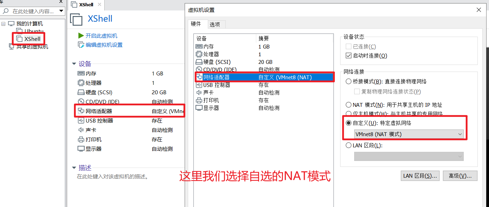
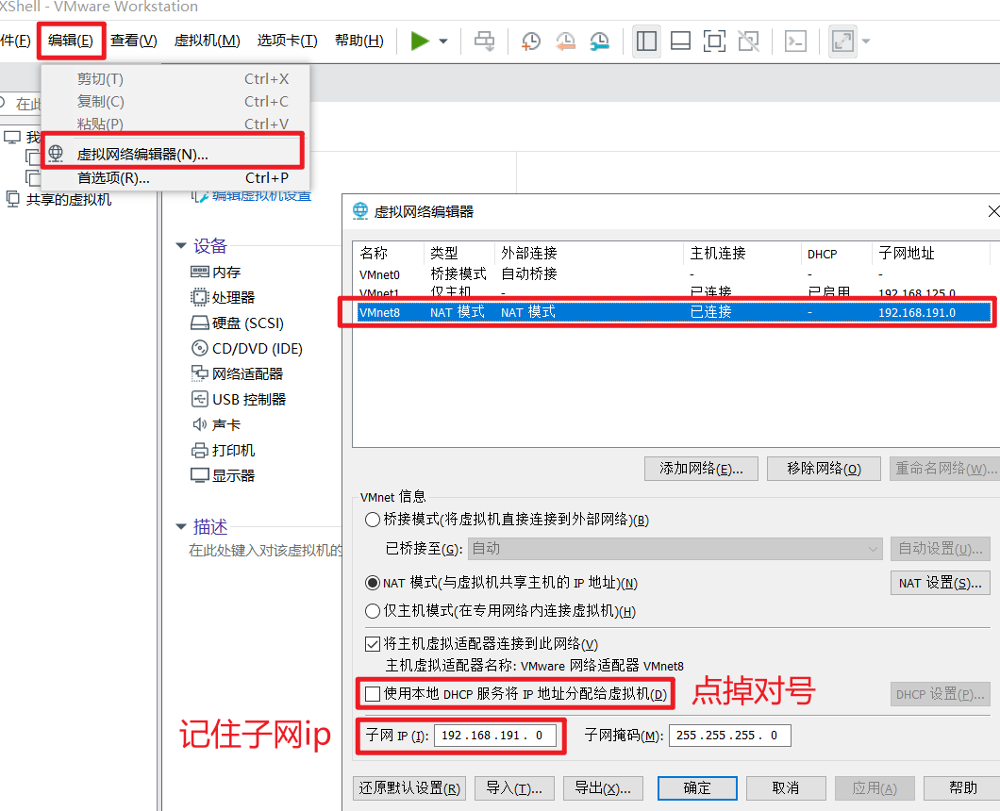

# XShell连接虚拟机

本次我采用静态方式连接虚拟机。

**首先明确一点：XShell在连接的时候，虚拟机是不能关闭的，但是可以选择在后台运行。**

连接方式有静态和动态两种，这里我们使用静态链接（不用每次连接都看一下ip地址，而是可以直接连接）

## 静态链接方式

1. 首先设置网络连接类型

2. 按照如下配置配置VM网络，我们要根据子网ip来配置虚拟机的IP地址

3. 配置Linux的静态ip

查看我们的网络名称，用来配置文件

因此我们修改 `vi /etc/sysconfig/network-scripts/ifcfg-ens33

打开文件之后修改BOOTPROTO为static，添加IPADDR（自己设置的ip地址，这个地址应该属于我们刚刚查到的子网ip下，不要用0、2、255）、NETMASK（子网掩码）和GATEWAY（网关）

这个IPADDR，我们要用XShell来连接他

重启网络服务`service network restart`

4. 配置虚拟机VMnet8 的网络属性，这个ip地址要和刚刚我们配置的虚拟机地址不一样，防止冲突

5. 测试连接情况，主机写我们刚刚配置的虚拟机ip

输入用户名和密码，连接成功。

也可以用不同的用户登录。

