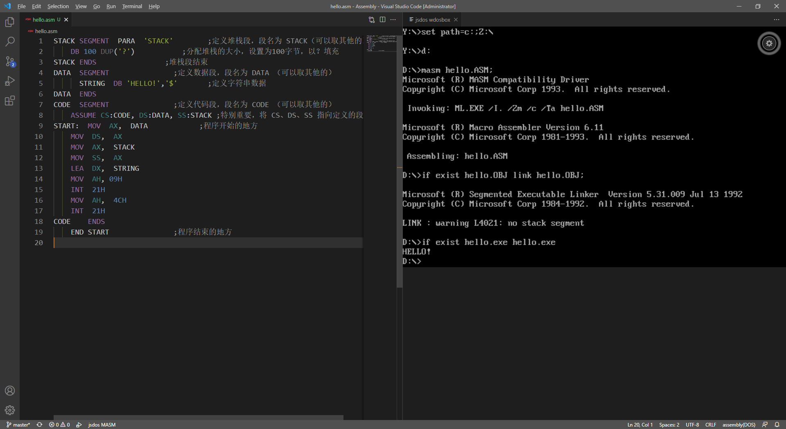
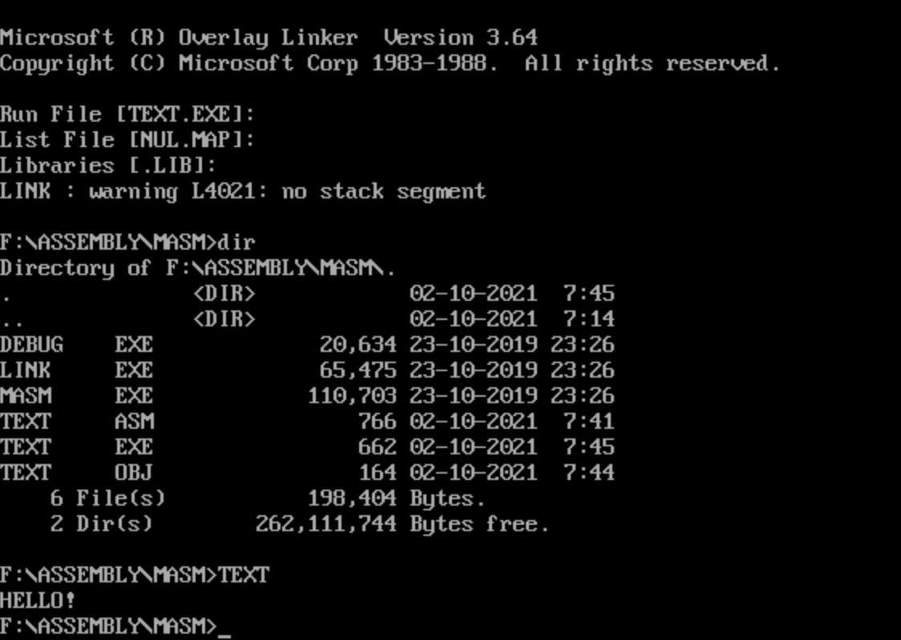

# Windows 10 搭建汇编环境

---

> 信1901-4 闫竞存 20194127

## VsCode安装

1. 下载 MASM/TASM 插件

搭建完毕。

写汇编代码，测试运行：



成功。

## 原始方法安装

下载DosBox

下载MASM/ASM编译软件

配置DosBox初始命令

```bash
# 挂载驱动器（将放汇编程序、编译工具文件夹挂载到一个虚拟盘）
mount F: V:\Environment\Assembler
# 添加系统临时变量（此时的 F: 代表的是E:\Assembly）
set PATH=%PATH%;F:\MASM;
# 转到 F: 
F: 
# 进入ASM文件夹
cd F:\ASM
```

完成。

进行测试：

```bash
masm hello.asm
link hello.obj
debug hello.exe
```



成功