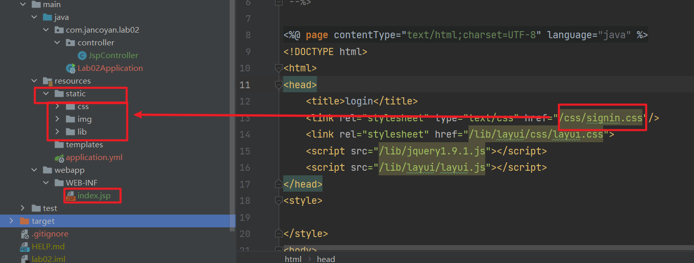

### SpringBoot整合jsp的时候访问不到静态资源

springboot 默认的静态资源的值有四个：

- *classpath:/META-INF/resources/*
- *classpath:/resources/*
- *classpath:/static/*
- *classpath:/public/*

如果你没有特别配置静态资源的位置，那么默认的静态资源的位置就是resource 下面的static文件夹，毕竟不用自己新建文件夹

那么你的页面引入的静态文件可以这么写：

`  `

这样就需要在static下面创建js文件夹，将jqeruy.js放在这个js文件夹下面

