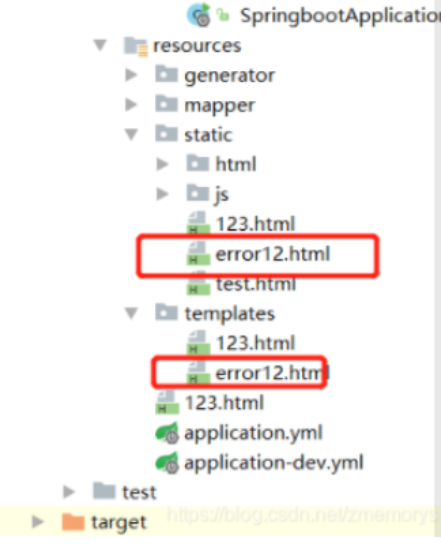
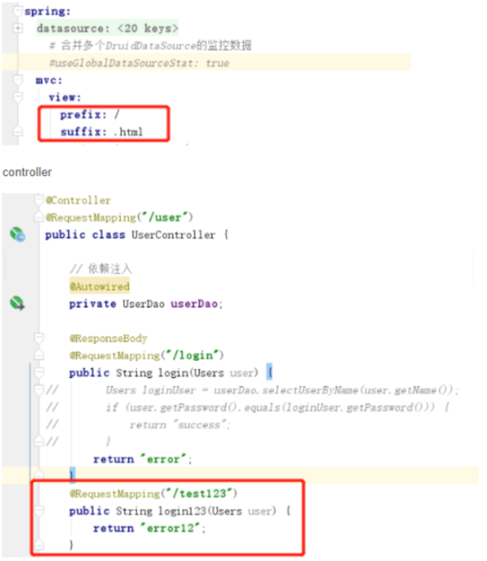
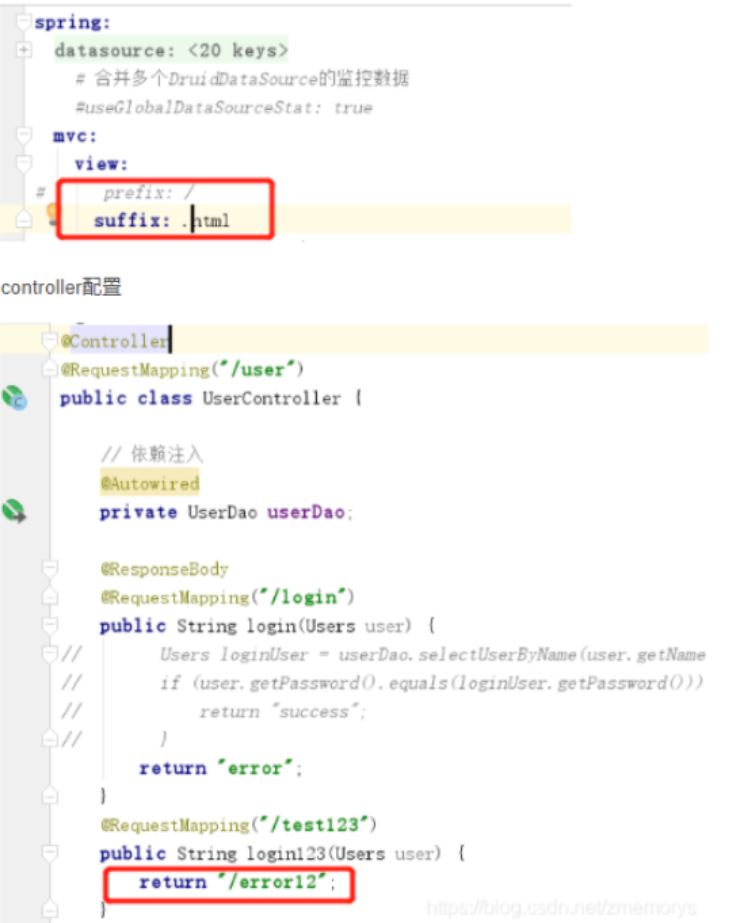
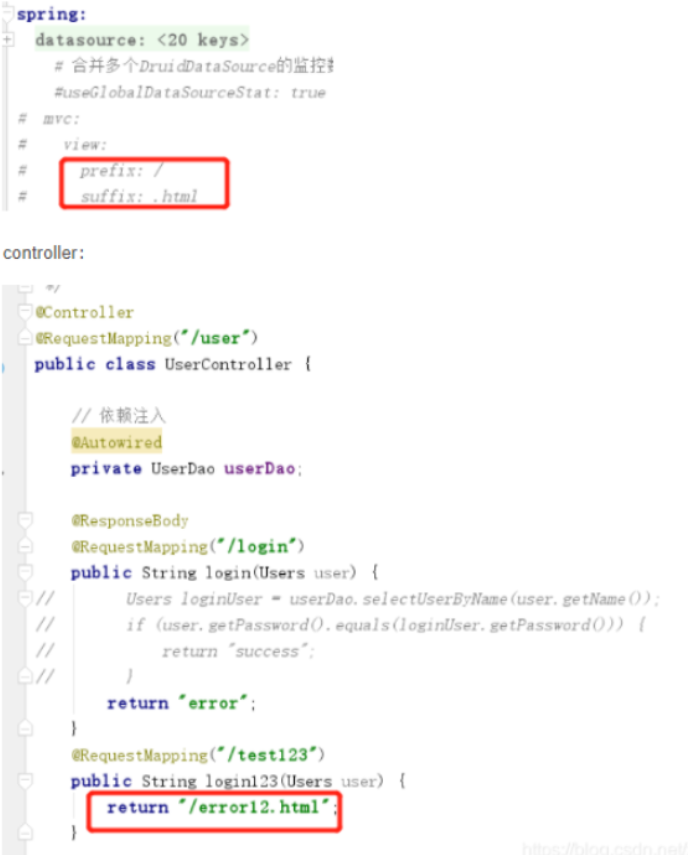
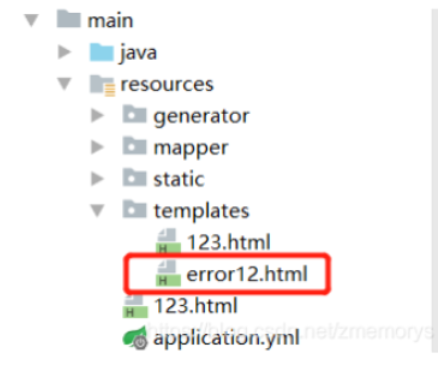
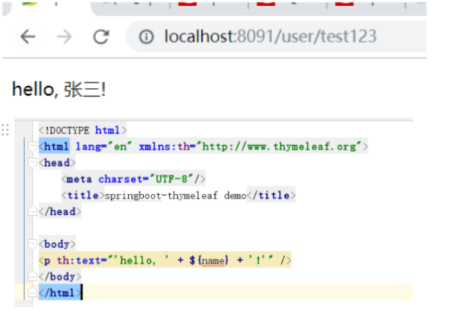

#后端/JavaWeb #后端/SpringBoot #后端/Spring

# 路径访问

## **不使用模板引擎的时候：**

```yaml
# 配置文件
spring:
devtools:
restart:
enabled: true
additional-paths: src/main/java
web:
resources:
static-locations: classpath:/static,classpath:/public,classpath:/resources,classpath:/META-INF/resources
mvc:
view:
prefix: /
```

```java
/**
* @Author: Yan Jingcun
* @Date: 2021/6/29
* @Description:
* @Version: 1.0
*/

package com.jancoyan.commentset.controller;

import org.springframework.stereotype.Controller;
import org.springframework.web.bind.annotation.GetMapping;
import org.springframework.web.bind.annotation.PathVariable;

@Controller
public class MvcController {

@GetMapping("/workbench/{file}")
public String workbenchResource(@PathVariable(value = "file") String file) {
return "workbench/" + file;
}

@GetMapping("/workbench/{file1}/{file2}")
public String workbenchResource(
@PathVariable(value = "file1") String file1,
@PathVariable(value = "file2") String file2) {
return "workbench/" + file1 + "/" + file2;
}
}
```

## **使用模板引擎**

```java
# 配置文件
spring:
thymeleaf:
cache: false
devtools:
restart:
enabled: true
additional-paths: src/main/java
web:
resources:
static-locations: classpath:/static,classpath:/public,classpath:/resources,classpath:/META-INF/resources
mvc:
view:
prefix: classpath:/templates/
```

```java
/**
* @Author: Yan Jingcun
* @Date: 2021/6/29
* @Description:
* @Version: 1.0
*/

package com.jancoyan.commentset.controller;

import org.springframework.stereotype.Controller;
import org.springframework.web.bind.annotation.GetMapping;
import org.springframework.web.bind.annotation.PathVariable;

@Controller
public class MvcController {

@GetMapping("/workbench/{file}")
public String workbenchResource(@PathVariable(value = "file") String file) {
return "workbench/" + file;
}

@GetMapping("/workbench/{file1}/{file2}")
public String workbenchResource(
@PathVariable(value = "file1") String file1,
@PathVariable(value = "file2") String file2) {
return "workbench/" + file1 + "/" + file2;
}
}
```

# 详解-不使用模板引擎的时候



## case 1



## case 2



## case 3



1.  “spring.mvc.static-path-pattern”

spring.mvc.static-path-pattern代表的含义是我们应该以什么样的路径来访问静态资源，换句话说，只有静态资源满足什么样的匹配条件，[[Spring Boot]]才会处理静态资源请求，以官方配置为例：这表示只有静态资源的访问路径为/resources/**时，才会处理请求

`spring.mvc.static-path-pattern=/resources/**`

假定采用默认的配置端口，那么只有请求地址类似于“[http://localhost:8080/resources/jquery.js](http://localhost:8080/resources/jquery.js)”时，Spring Boot才会处理此请求，处理方式是将根据模式匹配后的文件名查找本地文件，那么应该在什么地方查找本地文件呢？这就是“spring.resources.static-locations”的作用了。

1.  “spring.resources.static-locations”

“spring.resources.static-locations”用于告诉Spring Boot应该在何处查找静态资源文件，这是一个列表性的配置，查找文件时会依赖于配置的先后顺序依次进行，默认的官方配置如下：

`spring.resources.static-locations=classpath:/static,classpath:/public,classpath:/resources,classpath:/META-INF/resources`

继续以上面的请求地址为例，“[http://localhost:8080/resources/jquery.js](http://localhost:8080/resources/jquery.js)”就会在上述的四个路径中依次查找是否存在“jquery.js”文件，如果找到了，则返回此文件， 否则返回404错误。

# 详解 - 使用模板引擎的时候

1.  引入jar包(当引入这个jar包的时候 默认的静态根目录变成了templates)

```xml
<dependency>
<groupId>org.springframework.boot</groupId>
<artifactId>spring-boot-starter-thymeleaf</artifactId>
</dependency>
```

1.  application.yml只需要加(开发时禁用缓存)

```yaml
spring:
thymeleaf:
cache: false
```

1.  写Controller

```java
@RequestMapping("/test123")
public String login(User user, HttpServletRequest request){
request.setAttribbute("name", "张三");
return "/error12.html"
}
```

1.  目录结构



结论：


