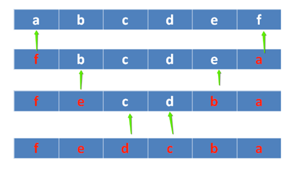

## C语言-指针

### 概述

#### 内存

内存含义：

- 存储器：计算机的组成中，用来存储程序和数据，辅助CPU进行运算处理的重要部分。

- 内存：内部存贮器，暂存程序/数据——掉电丢失 SRAM、DRAM、DDR、DDR2、DDR3。

- 外存：外部存储器，长时间保存程序/数据—掉电不丢ROM、ERRROM、FLASH（NAND、NOR）、硬盘、光盘

内存是沟通CPU与硬盘的桥梁：

- 暂存放CPU中的运算数据

- 暂存与硬盘等外部存储器交换的数据

#### 物理存储器和存储地址空间

> 有关内存的两个概念：物理存储器和存储地址空间

物理存储器：实际存在的具体存储器芯片。

- 主板上装插的内存条

- 显示卡上的显示RAM芯片

- 各种适配卡上的RAM芯片和ROM芯片

存储地址空间：对存储器编码的范围。我们在软件上常说的内存是指这一层含义

- 编码：对每个物理存储单元（一个字节）分配一个号码
- 寻址：可以根据分配的号码找到相应的存储单元，完成数据的读写

#### 内存地址

- 将内存抽象成一个很大的一维字符数组

- 编码就是对内存的每一个字节分配一个32位或64位的编号（与32位或者64位处理器相关）

- 这个内存编号我们称之为内存地址。

  内存中的每一个数据都会分配相应的地址：

  - `char`:占一个字节分配一个地址
  - `int`: 占四个字节分配四个地址
  - `float`、`struct`、函数、数组等

![[img/clip_image002-1600782355725.png]]

#### 指针和指针变量

- <font color="red">内存区的每一个字节都有一个编号，这就是“地址”</font>
- 如果在程序中定义了一个变量，在对程序进行编译或运行时，系统就会给这个变量分配内存单元，并确定它的内存地址(编号)
- 指针的实质就是内存“地址”。指针就是地址，地址就是指针
- <font color="red">指针是内存单元的编号，指针变量是存放地址的变量</font>
- 通常我们叙述时会把指针变量简称为指针，实际他们含义并不一样

![[img/clip_image002-1600782473718.png]]

### 指针基础知识

#### 指针变量的定义和使用

- 指针也是一种数据类型，指针变量也是一种变量

- 指针变量指向谁，就把谁的地址赋值给指针变量
- “*”操作符操作的是指针变量指向的内存空间

```c
#include <stdio.h>

int main()
{
	int a = 0;
	char b = 100;
	printf("%p, %p\n", &a, &b); //打印a, b的地址

	//int *代表是一种数据类型，int*指针类型，p才是变量名
	//定义了一个指针类型的变量，可以指向一个int类型变量的地址
	int *p;
	p = &a;//将a的地址赋值给变量p，p也是一个变量，值是一个内存地址编号
	printf("%d\n", *p);//p指向了a的地址，*p就是a的值

	char *p1 = &b;
	printf("%c\n", *p1);//*p1指向了b的地址，*p1就是b的值

	return 0;
}
```

> 注意：`&`可以取得一个变量在内存中的地址。但是，<font color="red">不能取寄存器变量</font>，因为寄存器变量不在内存里，而在CPU里面，所以是没有地址的

```bash
tao@Taoc:~/Desktop/C/7$ ./7.2.1 
0x7ffda2091cf4, 0x7ffda2091cf3
0
100
```

#### 通过指针间接修改变量的值

```c
	int a = 0;
	int b = 11;
	int *p = &a;
	
	*p = 100;
	printf("a=%d, *p=%d\n", a, *p);
	
	p = &b
	*p = 22;
	printf("b = %d, *p = %d\n", b, *p);
```

#### 指针大小

- <font color="red">使用sizeof()测量指针的大小，得到的总是：4或8</font>
- `sizeof()`测的是指针变量指向存储地址的大小
- 在32位平台，所有的指针（地址）都是32位(4字节)
- 在64位平台，所有的指针（地址）都是64位(8字节)

```c
#include <stdio.h>
int main()
{
    int *p1;
    int **p2;
    char *p3;
    char **p4;

    printf("sizeof(p1) = %d\n", sizeof(p1));
    printf("sizeof(p2) = %d\n", sizeof(p2));
    printf("sizeof(p3) = %d\n", sizeof(p3));
    printf("sizeof(p4) = %d\n", sizeof(p4));
    printf("sizeof(double *) = %d\n", sizeof(double *));
    
    return 0;
}
```

输出结果：

```c
sizeof(p1) = 8
sizeof(p2) = 8
sizeof(p3) = 8
sizeof(p4) = 8
sizeof(double *) = 8
```

#### 野指针和空指针

指针变量也是变量，是变量就可以任意赋值，不要越界即可（32位为4字节，64位为8字节），但是，<font color="red">任意数值赋值给指针变量没有意义，因为这样的指针就成了野指针</font>，此指针指向的区域是未知(操作系统不允许操作此指针指向的内存区域)。所以，<font color="red">野指针不会直接引发错误，操作野指针指向的内存区域才会出问题</font>。

```c
	int a = 100;
	int *p;
	p = a; //把a的值赋值给指针变量p，p为野指针， ok，不会有问题，但没有意义

	p = 0x12345678; //给指针变量p赋值，p为野指针， ok，不会有问题，但没有意义

	*p = 1000;  //操作野指针指向未知区域，内存出问题，err
```

但是，野指针和有效指针变量保存的都是数值，为了标志此指针变量没有指向任何变量(空闲可用)，C语言中，可以把NULL赋值给此指针，这样就标志此指针为空指针，没有任何指针

```c
int *p = NULL;
```

NULL是一个值为0的宏常量：

```c
#define NULL    ((void *)0)
```

#### 万能指针void *

> `void *`指针可以指向任意变量的内存空间

```c
	void *p = NULL;

	int a = 10;
	p = (void *)&a; //指向变量时，最好转换为void *

	//使用指针变量指向的内存时，转换为int *
	*( (int *)p ) = 11;
	printf("a = %d\n", a);
```

#### const修饰的指针变量

```c
int a = 100;
int b = 200;
//指向常量的指针
//修饰*，指针指向内存区域不能修改，指针指向可以变
const int * p1 = &a;
// *p1 = 111 // err
p1 = &b; // ok
//指针常量
//修饰p1，指针指向不能变，指针指向的内存可以修改

int * const p2 = &a;
// p2 = &b; //err
*p2 = 333; //ok
```

<font color="red">在编辑程序时，指针作为函数参数，如果不想修改指针对应内存空间的值，需要使用const修饰指针数据类型</font>

### 指针和数组

#### 数组名

数组名字是数组的首元素地址，但它是一个地址常量：

```c
int a[] = { 1, 2, 3, 4, 5, 6, 7, 8, 9 }; 
	printf("a = %p\n", a);
	printf("&a[0] = %p\n", &a[0]);

	//a = 10; //err, 数组名只是常量，不能修改
```

#### 指针操作数组元素

```c
#include <stdio.h>

int main()
{
    int a[] = { 1, 2, 3, 4, 5, 6, 7, 8, 9 };
    int i = 0;
    int n = sizeof(a)/sizeof(a[0]);
    
    for(i = 0; i < n; i++)
    {
    	// printf("%d, " a[i]);
        printf("%d,", *(a+i));
    }
    printf("\n");
    
    int *p = a;
    for(i = 0; i < n; i++)
    {
    	p[i] = 2 * i;
    }
    
    for(i = 0; i < n; i++)
    {
        printf("%d", *(p+i));
    }
    printf("\n");
    
    return 0;
    
}
```

```c
tao@Taoc:~/Desktop/C/7$ ./7.3.2 
1,2,3,4,5,6,7,8,9,
0246810121416
```

#### 指针加减运算

**1. 加法运算**

- <font color="red">指针计算不是简单的整数相加</font>
- 如果是一个`int *`，+1的结果是增加一个int的大小
- 如果是一个`char *`，+1的结果是增加一个char大小

```c
#include <stdio.h>

int main()
{
    int a;
    int *p = &a;
    printf("%d\n", p);
    p += 2; //移动了2个int
    printf("%d\n", p);
    
    char b = 0;
    char *p1 = &b;
   	printf("%d\n", p1);
    p1 += 2;	// 移动了2个char
    printf("%d\n",p1);
    
    return 0;
}
```

> 通过改变指针指向操作数组元素：

```c
#include <stdio.h>

int main()
{
	int a[] = { 1, 2, 3, 4, 5, 6, 7, 8, 9 };
	int i = 0;
	int n = sizeof(a) / sizeof(a[0]);

	int *p = a;
	for (i = 0; i < n; i++)
	{
		printf("%d, ", *p);
		p++;
	}
	printf("\n");
	
	return 0;
}
```

**2. 减法运算**

```c
#include <stdio.h>

int main()
{
	int a[] = { 1, 2, 3, 4, 5, 6, 7, 8, 9 };
	int i = 0;
	int n = sizeof(a) / sizeof(a[0]);

	int *p = a+n-1;
	for (i = 0; i < n; i++)
	{
		printf("%d, ", *p);
		p--;
	}
	printf("\n");

	return 0;
}
```

输出结果：

```bash
tao@Taoc:~/Desktop/C/7$ ./7.3.3-2 
9, 8, 7, 6, 5, 4, 3, 2, 1, 
```

```c
#include <stdio.h>

int main()
{
	int a[] = { 1, 2, 3, 4, 5, 6, 7, 8, 9 };
	int *p2 = &a[2]; //第2个元素地址
	int *p1 = &a[1]; //第1个元素地址
	printf("p1 = %p, p2 = %p\n", p1, p2);

	int n1 = p2 - p1; //n1 = 1
	int n2 = (int)p2 - (int)p1; //n2 = 4
	printf("n1 = %d, n2 = %d\n", n1, n2);
	
	return 0;
}
```

#### 指针数组

指针数组，它是数组，数组的每个元素都是指针类型

```c
#include <stdio.h>

int main()
{
	// 指针数组
	int *p[3];
	int a = 1;
	int b = 2;
	int c = 3;
	int i = 0;
	
	p[0] = &b;
	p[1] = &b;
	p[2] = &c;
	
	for(i = 0; i < sizeof(p)/sizeof(p[0]);i++)
	{
		printf("%d, ", *(p[i]));
	}
	printf("\n");


	return 0;
}
```

### 多级指针 

- C语言允许有多级指针存在，在实际的程序中一级指针最常用，其次是二级指针
- 二级指针就是指向一个一级指针变量地址的指针
- 三级指针基本用不着，但考试会考

```c
	int a = 10;
	int *p = &a; //一级指针
	*p = 100; //*p就是a

	int **q = &p;
	//*q就是p
	//**q就是a

	int ***t = &q;
	//*t就是q
	//**t就是p
	//***t就是a
```

### 指针和函数

#### 函数形参改变实参的值

```c
#include <stdio.h>

void swap1(int x, int y)
{
	int tmp;
	tmp = x;
	x = y;
	y = tmp;
	printf("x=%d, y=%d\n", x, y);
}
void swap2(int *x, int *y)
{
	int tmp;
	tmp = *x;
	*x = *y;
	*y = tmp;
}
int main()
{
	int a = 3;
	int b = 5;
	swap1(a, b); // 值传递
	printf("a = %d, b = %d\n", a, b);

	a = 3;
	b = 5;
	swap2(&a, &b);	// 地址传递
	printf("a2 = %d, b2=%d\n", a, b);

	return 0;
}

```

输出结果：

```bash
tao@Taoc:~/Desktop/C/7$ ./7.5.1 
x=5, y=3
a = 3, b = 5
a2 = 5, b2=3
```

#### 数组名做函数参数

> 数组名做函数参数，函数的形参会退化为指针：

```c
#include <stdio.h>

void printArrary(int *a, int n)	
{
	int i = 0;
	for (i = 0; i < n; i++)
	{
		printf("%d, ", a[i]);
	}
	printf("\n");
}

int main()
{
	int a[] = { 1, 2, 3, 4, 5, 6, 7, 8, 9 };
	int n = sizeof(a) / sizeof(a[0]);

	//数组名做函数参数
	printArrary(a, n); 
	return 0;
}
```

输出结果:

```c
1, 2, 3, 4, 5, 6, 7, 8, 9, 
```

#### 指针做为函数的返回值

```c
#include <stdio.h>

int a = 10;

int *getA()
{
	return &a;
}

int main()
{	
	*(getA()) = 111;
	printf("a = %d\n", a);
	// 输出： a = 111;
	return 0;
}
```

### 指针和字符串

#### 字符指针

```c
#include <stdio.h>

int main()
{
	char str[] = "hello world";
	char *p = str;
	*p = 'm';
	p++;
	*p='i';
	printf("%s\n", str);
	
	p = "mike Tao";
	printf("%s\n", p);
	
	char *q = "test";
	printf("%s\n", q);
	
	return 0;
}
```

输出结果：

```c
tao@Taoc:~/Desktop/C/7$ ./7.6.1 
millo world
mike Tao
test
```

#### 字符指针做函数参数

```c
#include <stdio.h>

void mystract(char *dest, const char *src)
{
    int len1 = 0;
    int len2 = 0;
    while(dest[len1])
    {
        len1++;
    }
    while(src[len2])
    {
        len2++;
    }
    int i;
    for(i = 0; i < len2; i++)
    {
        dest[len1 + i] = src[i];
    }
}

int main()
{
    char dst[100] = "hello mike";
    char src[] = "123456";
    
    mystract(dst,src);
    printf("dst = %s\n", dst);
    
    return 0;
}
```

输出结果；

```c
tao@Taoc:~/Desktop/C/7$ ./7.7.3 
dst = hello mike123456
```

#### const 修饰的指针变量

```c
#include <stdio.h>
#include <stdlib.h>
#include <string.h>

int main(void)
{
    // const 修饰一个变量为只读
    const int a = 10;
    // a = 100; 	//error
    
    /指针变量， 指针指向的内存， 2个不同概念
	char buf[] = "aklgjdlsgjlkds";

    //从左往右看，跳过类型，看修饰哪个字符
	//如果是*， 说明指针指向的内存不能改变
	//如果是指针变量，说明指针的指向不能改变，指针的值不能修改
	const char *p = buf;
    // 等价于上同  char const *p1 = buf;
    //p[1] = '2'; //err
    
    p = "agdlsjaglkdsajgl"; //ok
	char * const p2 = buf;
    p2[1] = '3';
	//p2 = "salkjgldsjaglk"; //err
	
    //p3为只读，指向不能变，指向的内存也不能变
	const char * const p3 = buf;

    return 0;
}
```

#### 指针数组做为main函数的形参

```c
int main(int argc, char *argv[]);
```

- `main`函数是操作系统调用的，第一个参数标明`argc`数组的成员数量，`argv`数组的每个成员都是`char *`类型
- `argv`是命令行参数的字符串数组
- `argc`代表命令行参数的数量，程序名字本身算一个参数

```c
#include <stdio.h>

//argc: 传参数的个数（包含可执行程序）
//argv：指针数组，指向输入的参数
int main(int argc, char *argv[])
{

	//指针数组，它是数组，每个元素都是指针
	char *a[] = { "aaaaaaa", "bbbbbbbbbb", "ccccccc" };
	int i = 0;

	printf("argc = %d\n", argc);
	for (i = 0; i < argc; i++)
	{
		printf("%s\n", argv[i]);
	}
	return 0;
}
```

#### 项目开发常用字符串应用模型

**1. strstr中的while和do-while模型**

> 利用strstr标准库函数找出一个字符串中substr出现的个数

a. while模型

```c
#include <stdio.h>
#include <stdlib.h>
#include <string.h>

int main(void)
{
	char *p = "11abcd111122abcd333abcd3322abcd3333322qqq";
	int n = 0;
	
	while((p = strstr(p, "abcd")) != NULL)
    {
        //能进来，肯定有匹配的子串
		//重新设置起点位置
        p = p + strlen("abcd");
        n++;
        
        if(*p == 0) // 结束符
        {
            break;
        }
    }
    printf("n = %d\n", n);
    
    return 0;
}

// 输出 n = 4
```

b. do-while

```c
#include <stdio.h>
#include <stdlib.h>
#include <string.h>

int main(void)
{
	char *p = "11abcd111122abcd333abcd3322abcd3333322qqq";
	int n = 0;
	
	do
	{
		p = strstr(p, "abcd");
		if(p != NULL)
		{
			n++;
			// 重新设置查找的起点
			p = p + strlen("abcd");
		}
		else
		{
			break;
		}
	}while(*p != 0);
	
	printf("n=%d\n", n);
	
	return 0;
}
```

**2. 两头堵模型**

```c
#include <stdio.h>
#include <stdlib.h>
#include <string.h>
#include <stype.h>

int fun(char *p, int *n)
{
    if(p = NULL || n = NULL)
    {
        return -1;
    }
    int begin = 0;
    int end = strlen(p) - 1;
    
   	//从左边开始
	//如果当前字符为空，而且没有结束
    while(p[begin] = '' && p[begin] != 0)
    {
        begin++;
    }
    
    //从右往左移动
	while (p[end] == ' ' && end > 0)
	{
		end--; //往左移动
	}

    
	if (end == 0)
	{
		return -2;
	}

	//非空元素个数
	*n = end - begin + 1;

	return 0;
}


int main(void)
{
    char *p = "      abcddsgadsgefg      ";
    int ret = 0;
    int n = 0;
    
    ret = fun(p, &n);
    if(ret != 0)
    {
        return ret;
    }
    printf("非空字符串元素个数：%d\n", n);
    
    return 0;
}
```

输出结果：

```c
tao@Taoc:~/Desktop/C/7$ ./7.6.5-2 
非空字符串元素个数：14
```

**3. 字符串反转模型(逆置)**



```c
#include <stdio.h>
#include <stdlib.h>
#include <string.h>

int inverse(char *p)
{
    if(p == NULL)
    {
        return -1;
    }
    char *str = p;
    int begin = 0;
    int end = strlen(str) - 1;
    char tmp;
    
    while(begin < end)
    {
        // 交换元素
        tmp = str[begin];
        str[begin] = str[end];
        str[end] = tmp;
        
        begin++;  //往右移动位置
        end--;	// 往左移动位置
    }
       
    return 0;
}
int main(void)
{
        //char *str = "abcdefg"; //文件常量区，内容不允许修改
        char str[] = "abcdef";
        
        int ret = inverse(str);
       
        if(ret != 0)
        {
            return ret;
        }
    
    printf("str = %s\n", str);
    
    return 0;
}
```

输出结果：

```c
tao@Taoc:~/Desktop/C/7$ ./7.6.5-3 
str = fedcba
```

#### 字符串处理函数

**1. strcpy()**

```c
#include <string.h>
char *strcpy(char *dest, const char *src);
```

> 功能：把src所指向的字符串复制到dest所指向的空间中，<font color="red">'\0'也会拷贝过去</font>
>
> 参数：
>
> ​    dest：目的字符串首地址
>
> ​    src：源字符首地址
>
> 返回值：
>
> ​    成功：返回dest字符串的首地址
>
> ​    失败：NULL

<font color="red">注意：如果参数dest所指的内存空间不够大，可能会造成缓冲溢出的错误情况</font>

```c
char dest[20] = "123456789";
char src[] = "hello world";
strcpy(dest, src);
printf("%s\n", dest);
```

**2. strncpy()**

```c
#include <string.h>
char *strncpy(char *dest, const char *src, size_t n);
```

> 功能：把src指向字符串的前n个字符复制到dest所指向的空间中，<font color="red">是否拷贝结束符看指定的长度是否包含'\0'。</font>>
>
> 参数：
>
> ​    dest：目的字符串首地址
>
> ​    src：源字符首地址
>
> ​    n：指定需要拷贝字符串个数
>
> 返回值：
>
> ​    成功：返回dest字符串的首地址
>
> ​    失败：NULL

```c
	char dest[20] ;
	char src[] = "hello world";

	strncpy(dest, src, 5);
	printf("%s\n", dest);

	dest[5] = '\0';
	printf("%s\n", dest);

```

**3. strcat()**

```c
#include <string.h>
char *strcat(char *dest, const char *src);
```

> 功能：将src字符串连接到dest的尾部，‘\0’也会追加过去
>
> 参数：
>
> ​    dest：目的字符串首地址
>
> ​    src：源字符首地址
>
> 返回值：
>
> ​    成功：返回dest字符串的首地址
>
> ​    失败：NULL

```c
    char str[20] = "123";
	char *src = "hello world";
	printf("%s\n", strcat(str, src));
```

**4. strncat**

```c
#include <string.h>
char *strncat(char *dest, const char *src, size_t n);
```

> 功能：将src字符串前n个字符连接到dest的尾部，‘\0’也会追加过去
>
> 参数：
>
> ​    dest：目的字符串首地址
>
> ​    src：源字符首地址
>
> ​    n：指定需要追加字符串个数
>
> 返回值：
>
> ​    成功：返回dest字符串的首地址
>
> ​    失败：NULL

```c
	char str[20] = "123";
	char *src = "hello world";
	printf("%s\n", strncat(str, src, 5));
```

**5. strcmp**

```c
#include <string.h>
int strcmp(const char *s1, const char *s2);
```

> 功能：比较 s1 和 s2 的大小，<font color="red">比较的是字符ASCII码大小。</font>
>
> 参数：
>
> ​    s1：字符串1首地址
>
> ​    s2：字符串2首地址
>
> 返回值：
>
> ​    相等：0
>
> ​    大于：>0 在不同操作系统strcmp结果会不同  返回ASCII差值
>
> ​    小于：<0

```c
	char *str1 = "hello world";
	char *str2 = "hello mike";

	if (strcmp(str1, str2) == 0)
	{
		printf("str1==str2\n");
	}
	else if (strcmp(str1, str2) > 0)
	{
		printf("str1>str2\n");
	}	
	else
	{
		printf("str1<str2\n");
	}

```

**6. strncmp()**

```c
#include <string.h>
int strncmp(const char *s1, const char *s2, size_t n);
```

> 功能：比较 s1 和 s2 前n个字符的大小，<font color="red">比较的是字符ASCII码大小。</font>
>
> 参数：
>
> ​    s1：字符串1首地址
>
> ​    s2：字符串2首地址
>
> ​    n：指定比较字符串的数量
>
> 返回值：
>
> ​    相等：0
>
> ​    大于： > 0
>
> ​    小于： < 0

```c
	char *str1 = "hello world";
	char *str2 = "hello mike";

	if (strncmp(str1, str2, 5) == 0)
	{
		printf("str1==str2\n");
	}
	else if (strcmp(str1, "hello world") > 0)
	{
		printf("str1>str2\n");
	}
	else
	{
		printf("str1<str2\n");
	}
```

**7. sprintf()**

```c
#include <stdio.h>
int sprintf(char *str, const char *format, ...);
```

> 功能：根据参数format字符串来转换并格式化数据，然后将结果输出到str指定的空间中，直到出现字符串结束符 '`\0`' 为止。
>
> 参数：
>
> ​    str：字符串首地址
>
> ​    format：字符串格式，用法和printf()一样
>
> 返回值：
>
> ​    成功：实际格式化的字符个数
>
> ​    失败： - 1

```c
	char dst[100] = { 0 };
	int a = 10;
	char src[] = "hello world";
	printf("a = %d, src = %s", a, src);
	printf("\n");

	int len=sprintf(dst, "a = %d, src = %s", a, src);
	printf("dst = \" %s\"\n", dst);
	printf("len = %d\n", len);
```

**8. sscanf()**

```c
#include <stdio.h>
int sscanf(const char *str, const char *format, ...);
```

> 功能：从str指定的字符串读取数据，并根据参数format字符串来转换并格式化数据。
>
> 参数：
>
> ​    str：指定的字符串首地址
>
> ​    format：字符串格式，用法和scanf()一样
>
> 返回值：
>
> ​    成功：参数数目，成功转换的值的个数
>
> ​    失败： - 1

```c
	char src[] = "a=10, b=20";
	int a;
	int b;
	sscanf(src, "a=%d,  b=%d", &a, &b);
	printf("a:%d, b:%d\n", a, b);
```

**9.strchr()**

```c
#include <string.h>
char *strchr(const char *s, int c);
```

> **功能**：在字符串s中查找字母c出现的位置
>
> **参数**：
>
> ​    s：字符串首地址
>
> ​    c：匹配字母(字符)
>
> **返回值**：
>
> ​    成功：返回第一次出现的c地址
>
> ​    失败：NULL

```c
	char src[] = "ddda123abcd";
	char *p = strchr(src, 'a');
	printf("p = %s\n", p);
```

**10. strstr()**

```c
#include <string.h>
char *strstr(const char *haystack, const char *needle);
```

> 功能：在字符串haystack中查找字符串needle出现的位置
>
> 参数：
>
> ​    haystack：源字符串首地址
>
> ​    needle：匹配字符串首地址
>
> 返回值：
>
> ​    成功：返回第一次出现的needle地址
>
> ​    失败：NULL

```c
	char src[] = "ddddabcd123abcd333abcd";
	char *p = strstr(src, "abcd");
	printf("p = %s\n", p);
```

**11. strtok()**

```c
#include <string.h>
char *strtok(char *str, const char *delim);
```

> 功能：来将字符串分割成一个个片段。当`strtok()`在参数s的字符串中发现参数delim中包含的分割字符时, 则会将该字符改为\0 字符，当连续出现多个时只替换第一个为\0。
>
> 参数：
>
> ​    str：指向欲分割的字符串
>
> ​    delim：为分割字符串中包含的所有字符
>
> 返回值：
>
> ​    成功：分割后字符串首地址
>
> ​    失败：NULL

- 在第一次调用时：`strtok()`必需给予参数s字符串
- 往后的调用则将参数s设置成NULL，每次调用成功则返回指向被分割出片段的指针

```c
	char a[100] = "adc*fvcv.ebcy*hghbdfg$casdert";
	char *s = strtok(a, ".*$");//将"*"分割的子串取出
	while (s != NULL)
	{
		printf("%s\n", s);
		s = strtok(NULL, "*");
	}
```

**12. atoi()**

```c
#include <stdlib.h>
int atoi(const char *nptr);
```

> 功能：`atoi()`会扫描nptr字符串，跳过前面的空格字符，直到遇到数字或正负号才开始做转换，而遇到非数字或字符串结束符('\0')才结束转换，并将结果返回返回值。
>
> 参数：
>
> ​    nptr：待转换的字符串
>
> 返回值：成功转换后整数

类似的函数有：

- `atof()`：把一个小数形式的字符串转化为一个浮点数
- `atol()`：将一个字符串转化为long类型

```d
	char str1[] = "          -10";
	int num1 = atoi(str1);
	printf("num1 = %d\n", num1);

	char str2[] = "0.123";
	double num2 = atof(str2);
	printf("num2 = %lf\n", num2);

	char str3[] = "123L";
	long num3 = atol(str3);
	printf("num3 = %ld\n", num3);
```

### 指针小结

| **定义**      | **说明**                                     |
| ------------- | -------------------------------------------- |
| `int i`       | 定义整形变量                                 |
| `int *p`      | 定义一个指向int的指针变量                    |
| `int a[10]`   | 定义一个有10个元素的数组，每个元素类型为int  |
| `int *p[10]`  | 定义一个有10个元素的数组，每个元素类型为int* |
| `int func()`  | 定义一个函数，返回值为int型                  |
| `int *func()` | 定义一个函数，返回值为int *型                |
| `int **p `    | 定义一个指向int的指针的指针，二级指针        |

