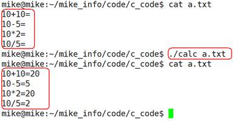
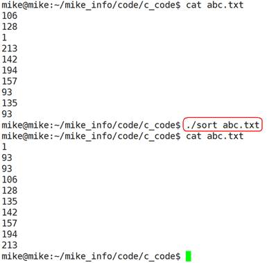

## C语言-文件操作

### 概述

#### 磁盘文件和设备文件

- 磁盘文件

  - 指一组相关数据的有序集合,通常存储在外部介质(如磁盘)上，使用时才调入内存
- 设备文件
  - 在操作系统中把每一个与主机相连的输入、输出设备看作是一个文件，把它们的输入、输出等同于对磁盘文件的读和写

#### 磁盘文件的分类

计算机的存储在物理上是二进制的，所以物理上所有的磁盘文件本质上都是一样的：以字节为单位进行顺序存储

![[img/clip_image002-1601113908804.jpg]]

从用户或者操作系统使用的角度（逻辑上）把文件分为：

- 文本文件：基于字符编码的文件 

- 二进制文件：基于值编码的文件

#### 文本文件和二进制文件

**1. 文本文件**

- 基于字符编码，常见编码有ASCII、UNICODE等

- 一般可以使用文本编辑器直接打开

- 数5678的以ASCII存储形式(ASCII码)为：

  00110101 00110110 00110111 00111000

**2. 二进制文件**

- 基于值编码,自己根据具体应用,指定某个值是什么意思
- 把内存中的数据按其在内存中的存储形式原样输出到磁盘上
- 数5678的存储形式(二进制码)为：
- 00010110 00101110

### 文件的打开和关闭

#### 文件指针

在C语言中用一个指针变量指向一个文件，这个指针称为文件指针

```c
typedef struct
{
	short           level;	//缓冲区"满"或者"空"的程度 
	unsigned        flags;	//文件状态标志 
	char            fd;		//文件描述符
	unsigned char   hold;	//如无缓冲区不读取字符
	short           bsize;	//缓冲区的大小
	unsigned char   *buffer;//数据缓冲区的位置 
	unsigned        ar;	 //指针，当前的指向 
	unsigned        istemp;	//临时文件，指示器
	short           token;	//用于有效性的检查 
}FILE;
```

FILE是系统使用typedef定义出来的有关文件信息的一种结构体类型，<font color="red">结构中含有文件名、文件状态和文件当前位置等信息</font>

声明FILE结构体类型的信息包含在头文件“stdio.h”中，一般设置一个指向FILE类型变量的指针变量，然后通过它来引用这些FILE类型变量。通过文件指针就可对它所指的文件进行各种操作

![[img/clip_image002-1601123785585.png]]

C语言中有三个特殊的文件指针由系统默认打开，<font color="red">用户无需定义即可直接使用:</font>

- `stdin`：标准输入，默认为当前终端（键盘），我们使用的scanf、getchar函数默认从此终端获得数据
- `stdout`: 标准输出，默认为当前终端（屏幕），我们使用的printf、puts函数默认输出信息到此终端
- `stderr`: 标准出错，默认为当前终端（屏幕），我们使用的perror函数默认输出信息到此终端

#### 文件的打开

任何文件使用之前必须打开：

```c
#include <stdio.h>
FILE * fopen(const char * filename, const char * mode);
```

> 功能：打开文件
>
> 参数：
>
> ​    filename：需要打开的文件名，根据需要加上路径
>
> ​    mode：打开文件的模式设置
>
> 返回值：
>
> ​    成功：文件指针
>
> ​    失败：NULL

第一个参数的几种形式:

```c
FILE *fp_passwd = NULL;

//相对路径：
//打开当前目录passdw文件：源文件(源程序)所在目录
FILE *fp_passwd = fopen("passwd.txt", "r");

//打开当前目录(test)下passwd.txt文件
fp_passwd = fopen(". / test / passwd.txt", "r");

//打开当前目录上一级目录（相对当前目录）passwd.txt文件
fp_passwd = fopen(".. / passwd.txt", "r");

//绝对路径：
//打开C盘test目录下一个叫passwd.txt文件
fp_passwd = fopen("c:/test/passwd.txt","r");
```

第二个参数的几种形式(打开文件的方式)：

| **打开模式** | **含义**                                                     |
| ------------ | ------------------------------------------------------------ |
| r或rb        | 以只读方式打开一个文本文件（不创建文件，若文件不存在则报错） |
| w或wb        | 以写方式打开文件(如果文件存在则清空文件，文件不存在则创建一个文件) |
| a或ab        | 以追加方式打开文件，在末尾添加内容，若文件不存在则创建文件   |
| r+或rb+      | 以可读、可写的方式打开文件(不创建新文件)                     |
| w+或wb+      | 以可读、可写的方式打开文件(如果文件存在则清空文件，文件不存在则创建一个文件) |
| a+或ab+      | 以添加方式打开可读、可写的文件。若文件不存在则创建文件；如果文件存在，则写入的数据会被加到文件尾后，即文件原先的内容会被保留。 |

注意：

- b是二进制模式的意思，b只是在Windows有效，在Linux用r和rb的结果是一样的
- Unix和Linux下所有的文本文件行都是\n结尾，而Windows所有的文本文件行都是\r\n结尾
- 在Windows平台下，以“文本”方式打开文件，不加b：
  - n 当读取文件的时候，系统会将所有的 "\r\n" 转换成 "\n"
  - 当写入文件的时候，系统会将 "\n" 转换成 "\r\n" 写入
  - <font color="red">n 以"二进制"方式打开文件，则读写都不会进行这样的转换</font>
- 在Unix/Linux平台下，“文本”与“二进制”模式没有区别，"\r\n" 作为两个字符原样输入输出

```c
int main()
{
	FILE *fp = NULL;
	// "\\"这样的路径形式，只能在windows使用
	// "/"这样的路径形式，windows和linux平台下都可用，建议使用这种
	// 路径可以是相对路径，也可是绝对路径
	fp = fopen("../test", "w");
	// fp = fopen("..\\test", "w");
	if(fp == NULL)
	{
		//perror()是标准出错打印函数，能打印调用库函数出错原因
		perror("open");
		return -1;
	}
	
	return 0;
}
```

#### 文件的关闭

任何文件在使用后应该关闭：

- 打开的文件会占用内存资源，如果总是打开不关闭，会消耗很多内存
- 一个进程同时打开的文件数是有限制的，超过最大同时打开文件数，再次调用`fopen`打开文件会失败
- 如果没有明确的调用`fclose`关闭打开的文件，那么程序在退出的时候，操作系统会统一关闭

```c
#include <stdio.h>
int fclose(FILE * stream);
```

> 功能：关闭先前fopen()打开的文件。此动作让缓冲区的数据写入文件中，并释放系统所提供的文件资源。
>
> 参数：
>
> ​    stream：文件指针
>
> 返回值：
>
> ​    成功：0
>
> ​    失败：-1

```c
	FILE * fp = NULL;
	fp = fopen("abc.txt", "r");
	fclose(fp);
```

### 文件的顺序读写

#### 按照字符读写文件fgetc、fputc

**1. 写文件**

```c
#include <stdio.h>
int fputc(int ch, FILE * stream);
```

> 功能：将ch转换为unsigned char后写入stream指定的文件中
>
> 参数：
>
> ​    ch：需要写入文件的字符
>
> ​    stream：文件指针
>
> 返回值：
>
> ​    成功：成功写入文件的字符
>
> ​    失败：返回-1

```c
char buf[] = "My name is Tao.";
int i = 0;
int n = strlen(buf);
for(i = 0; i < n; i++)
{
	// 往文件fp写入符buf[i]
	int ch = fputc(buf[i], fp);
	printf("ch = %c\n", ch);
}
```

**2. 文件结尾**

在C语言中，EOF表示文件结束符(end of file)。在while循环中以EOF作为文件结束标志，<font color="red">这种以EOF作为文件结束标志的文件，必须是文本文件。</font>在文本文件中，数据都是以字符的ASCII代码值的形式存放。我们知道，ASCII代码值的范围是0~127，不可能出现-1，因此可以用EOF作为文件结束标志

```c
#define EOF    (-1)
```

当把数据以二进制形式存放到文件中时，就会有-1值的出现，因此不能采用EOF作为二进制文件的结束标志。为解决这一个问题，ANSI C提供一个feof函数，用来判断文件是否结束。<font color="red">feof函数既可用以判断二进制文件又可用以判断文本文件</font>

```c
#include <stdio.h>
int feof(FILE * stream);
```

> 功能：检测是否读取到了文件结尾。<font color="red">判断的是最后一次“读操作的内容”，不是当前位置内容(上一个内容)。</font>
>
> 参数：
>
> ​    stream：文件指针
>
> 返回值：
>
> ​    非0值：已经到文件结尾
>
> ​    0：没有到文件结尾

**3. 读文件**

```c
#include <stdio.h>
int fgetc(FILE * stream);
```

> 功能：从stream指定的文件中读取一个字符
>
> 参数：
>
> ​    stream：文件指针
>
> 返回值：
>
> ​    成功：返回读取到的字符
>
> ​    失败：-1

```c
char ch;
#if 0
while((ch = fgetc(fp)) != EOF)
{
	printf("%c", ch);
}
printf("\n");
#endif

while(!feop(fp)) //文件没有结束，则执行循环
{
	ch = fgetc(fp);
	printf("%c", ch);
};
printf("\n");
```

#### 按照行读写文件fgets、fputs

**1. 写文件**

```c
#include <stdio.h>
int fputs(const char * str, FILE * stream);
```

> 功能：将str所指定的字符串写入到stream指定的文件中，字符串结束符 '`\0`'  不写入文件。 
>
> 参数：
>
> ​    str：字符串
>
> ​    stream：文件指针
>
> 返回值：
>
> ​    成功：0
>
> ​    失败：-1

```c
char *buf[] = { "123456\n", "bbbbbbbbbb\n", "ccccccccccc\n" };
int i = 0;
int n = 3;
for (i = 0; i < n; i++)
{
	int len = fputs(buf[i], fp);
	printf("len = %d\n", len);
}
```

**2. 读文件**

```c
#include <stdio.h>
char * fgets(char * str, int size, FILE * stream);
```

> 功能：从stream指定的文件内读入字符，保存到str所指定的内存空间，直到出现换行字符、读到文件结尾或是已读了size - 1个字符为止，最后会自动加上字符 '\0' 作为字符串结束。
>
> 参数：
>
> ​    str：字符串
>
> ​    size：指定最大读取字符串的长度（size - 1）
>
> ​    stream：文件指针
>
> 返回值：
>
> ​    成功：成功读取的字符串
>
> ​    读到文件尾或出错： NULL

```c
char buf[100] = {0};
while(!feof(fp))
{
	memset(buf, 0, sizeof(buf));
	char *p = gets(buf, sizeof(buf), fp);
	if(p != NULL)
	{
		printf("buf = %s", buf);
	}
}
```

#### 强化训练：文件版四则运算

有个文件大小不确定，每行内容都是一个四则运算表达式，还没有算出结果，写一个程序，自动算出其结果后修改文件



#### 按照格式化文件fprintf、fscanf

1. **写文件**

```c
#include <stdio.h>
int fprintf(FILE * stream, const char * format, ...);
```

> 功能：根据参数format字符串来转换并格式化数据，然后将结果输出到stream指定的文件中，指定出现字符串结束符 '\0' 为止。
>
> 参数：
>
> ​    stream：已经打开的文件
>
> ​    format：字符串格式，用法和printf()一样
>
> 返回值：
>
> ​    成功：实际写入文件的字符个数
>
> ​    失败：-1

```c
fprintf(fp, "%d %d %d\n", 1, 2, 3);
```

2. **读文件**

```c
#include <stdio.h>
int fscanf(FILE * stream, const char * format, ...);
```

> 功能：从stream指定的文件读取字符串，并根据参数format字符串来转换并格式化数据。
>
> 参数：
>
> ​    stream：已经打开的文件
>
> ​    format：字符串格式，用法和scanf()一样
>
> 返回值：
>
> ​    成功：参数数目，成功转换的值的个数
>
> ​    失败： - 1

```c
int a = 0;
int b = 0;
int c = 0;
fscanf(fp, "%d %d %d\n", &a, &b, &c);
printf("a = %d, b = %d, c = %d\n", a, b, c);
```



#### 按照块读写文件fread、fwrite

1. **写文件**

```c
#include <stdio.h>
size_t fwrite(const void *ptr, size_t size, size_t nmemb, FILE *stream);
```

> 功能：以数据块的方式给文件写入内容
>
> 参数：
>
> ​    ptr：准备写入文件数据的地址
>
> ​    size： size_t 为 unsigned int类型，此参数指定写入文件内容的块数据大小
>
> ​    nmemb：写入文件的块数，写入文件数据总大小为：size * nmemb
>
> ​    stream：已经打开的文件指针
>
> 返回值：
>
> ​    成功：实际成功写入文件数据的块数目，此值和 nmemb 相等
>
> ​    失败：0

```c
typedef struct Stu
{
	char name[50];
	int id; 
}Stu;

Stu s[3];
int i = 0;
for(i = 0; i < 3; i++)
{
    sprintf(s[i].name, "stu%d%d%d", i, i, i);
    s[i].id = i + 1;
}

int ret = fwrite(s, sizeof(Stu), 3, fp);
printf("ret = %d\n", ret);
```

**2. 读文件**

```c
#include <stdio.h>
size_t fread(void *ptr, size_t size, size_t nmemb, FILE *stream);
```

> 功能：以数据块的方式从文件中读取内容
>
> 参数：
>
> ​    ptr：存放读取出来数据的内存空间
>
> ​    size： size_t 为 unsigned int类型，此参数指定读取文件内容的块数据大小
>
> ​    nmemb：读取文件的块数，读取文件数据总大小为：size * nmemb
>
> ​    stream：已经打开的文件指针
>
> 返回值：
>
> ​    成功：实际成功读取到内容的块数，如果此值比nmemb小，但大于0，说明读到文件的结尾。
>
> ​    失败：0
>
> ​    0: 表示读到文件结尾。(feof())

```c
typedef struct Stu
{
	char name[50];
    int id;
}Stu;

Stu s[3];
int ret = fread(s, sizeof(Stu), 3, fp);
printf("ret = %d\n", ret);

int i = 0;
for(i = 0; i < 3; i++)
{
    printf("s = %s, %d\n", s[i].name, s[i].id);
}
```

### 文件的随机读写

```c
#include <stdio.h>
int fseek(FILE *stream, long offset, int whence);
```

> 功能：移动文件流（文件光标）的读写位置。
>
> 参数：
>
> ​    stream：已经打开的文件指针
>
>  offset：根据whence来移动的位移数（偏移量），可以是正数，也可以负数，如果正数，则相对于whence往右移动，如果是负数，则相对于whence往左移动。如果向前移动的字节数超过了文件开头则出错返回，如果向后移动的字节数超过了文件末尾，再次写入时将增大文件尺寸。
>
> ​    whence：其取值如下：
>
> ​       SEEK_SET：从文件开头移动offset个字节
>
> ​       SEEK_CUR：从当前位置移动offset个字节
>
> ​       SEEK_END：从文件末尾移动offset个字节
>
> 返回值：
>
> ​    成功：0
>
> ​    失败：-1

```c
#include <stdio.h>
long ftell(FILE *stream);
```

> 功能：获取文件流（文件光标）的读写位置。
>
> 参数：
>
> ​    stream：已经打开的文件指针
>
> 返回值：
>
> ​    成功：当前文件流（文件光标）的读写位置
>
> ​    失败：-1

```c
#include <stdio.h>
void rewind(FILE *stream);
```

> 功能：把文件流（文件光标）的读写位置移动到文件开头。
>
> 参数：
>
> ​    stream：已经打开的文件指针
>
> 返回值：
>
> ​    无返回值

```c
typedef struct Stu
{
	char name[50];
	int id;
}Stu;

//假如已经往文件写入3个结构体
//fwrite(s, sizeof(Stu), 3, fp);
Stu s[3];
Stu tmp; 
int ret = 0;

//文件光标读写位置从开头往右移动2个结构体的位置
fseek(fp, 2 * sizeof(Stu), SEEK_SET);

//读第3个结构体
ret = fread(&tmp, sizeof(Stu), 1, fp);
if (ret == 1)
{
	printf("[tmp]%s, %d\n", tmp.name, tmp.id);
}

//把文件光标移动到文件开头
//fseek(fp, 0, SEEK_SET);
rewind(fp);

ret = fread(s, sizeof(Stu), 3, fp);
printf("ret = %d\n", ret);

int i = 0;
for (i = 0; i < 3; i++)
{
	printf("s === %s, %d\n", s[i].name, s[i].id);
}
```

### Windows和Linux文本文件区别

- b是二进制模式的意思，b只是在Windows有效，在Linux用r和rb的结果是一样的
- Unix和Linux下所有的文本文件行都是\n结尾，而Windows所有的文本文件行都是\r\n结尾
- 在Windows平台下，以“文本”方式打开文件，不加b：
  - n 当读取文件的时候，系统会将所有的 "\r\n" 转换成 "\n"
  - n 当写入文件的时候，系统会将 "\n" 转换成 "\r\n" 写入 
  - <font color="red">n 以"二进制"方式打开文件，则读\写都不会进行这样的转换</font>
- 在Unix/Linux平台下，“文本”与“二进制”模式没有区别，"\r\n" 作为两个字符原样输入输出

判断文本文件是Linux格式还是Windows格式:

```c
#include <stdio.h>

int main(int argc, char **args)
{
    if(argc < 2)
        return 0;
    FILE *p = fopen(args[1], "rb");
    if(!p)
        return 0;
    char a[1024] = {0};
    fgets(a, sizeof(a),p);
    
    int len = 0;
    while(a[len])
    {
       	if(a[len] == '\n')
        {
            if(a[len - 1] == '\r')
            {
                printf("windows file\n");
            }else
            {
                printf("linux file\n");
            }
        }
    }
    
    fclose(p);
    
    return 0;
}
```

### 获取文件状态

```c
xxxxxxxxxx #include <sys/types.h>#include <sys/stat.h>int stat(const char *path, struct stat *buf);
```

> 功能：获取文件状态信息
>
> 参数：
>
> ​	path：文件名
>
> ​	buf：保存文件信息的结构体
>
> 返回值：
>
> ​	成功：0
>
> ​	失败-1

```c
struct stat {
	dev_t         st_dev;         //文件的设备编号
	ino_t         st_ino;          //节点
	mode_t        st_mode;   //文件的类型和存取的权限
	nlink_t       st_nlink;     //连到该文件的硬连接数目，刚建立的文件值为1
	uid_t         st_uid;         //用户ID
	gid_t         st_gid;         //组ID
	dev_t         st_rdev;      //(设备类型)若此文件为设备文件，则为其设备编号
	off_t         st_size;        //文件字节数(文件大小)
	unsigned long st_blksize;   //块大小(文件系统的I/O 缓冲区大小)
	unsigned long st_blocks;    //块数
	time_t        st_atime;     //最后一次访问时间
	time_t        st_mtime;    //最后一次修改时间
	time_t        st_ctime;     //最后一次改变时间(指属性)
};
```

```c
#include <sys/types.h>
#include <sys/stat.h>
#include <stdio.h>

int main(int argc, char **args)
{
	if(argc < 2)
        return 0;
    struct stat at = { 0 };
    stat(args[1], &st);
    int size = st.st_size;
    printf("%d\n", size);
    
    return 0;
}
```

### 删除文件、重命名文件名

```c
#include <stdio.h>
int remove(const char *pathname);
```

> 功能：删除文件
>
> 参数：
>
> ​    pathname：文件名
>
> 返回值：
>
> ​    成功：0
>
> ​    失败：-1

```c
#include <stdio.h>
int rename(const char *oldpath, const char *newpath);
```

> 功能：把oldpath的文件名改为newpath
>
> 参数：
>
> oldpath：旧文件名
>
> newpath：新文件名
>
> 返回值：
>
> 成功：0
>
> 失败： - 1

### 文件缓冲区

#### 文件缓冲区

ANSI C标准采用“缓冲文件系统”处理数据文件。

所谓缓冲文件系统是指系统自动地在内存区为程序中每一个正在使用的文件开辟一个文件缓冲区从内存向磁盘输出数据必须先送到内存中的缓冲区，装满缓冲区后才一起送到磁盘去。

如果从磁盘向计算机读入数据，则一次从磁盘文件将一批数据输入到内存缓冲区(充满缓冲区)，然后再从缓冲区逐个地将数据送到程序数据区(给程序变量) 。

#### 磁盘文件的存取

![[img/clip_image002-1601186383431.jpg]]

- 磁盘文件，一般保存在硬盘、U盘等掉电不丢失的磁盘设备中，在需要时调入内存
- 在内存中对文件进行编辑处理后，保存到磁盘中
- 程序与磁盘之间交互，不是立即完成，系统或程序可根据需要设置缓冲区，以提高存取效率

#### 更新缓冲区

```c
#include <stdio.h>
int fflush(FILE *stream);
```

> 功能：更新缓冲区，让缓冲区的数据立马写到文件中。
>
> 参数：
>
> ​	stream：文件指针
>
> 返回值：
>
> ​	成功：0
>
> ​	失败：-1

