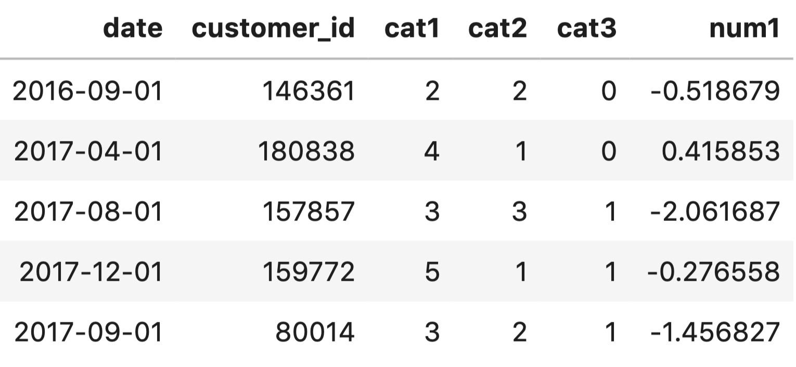
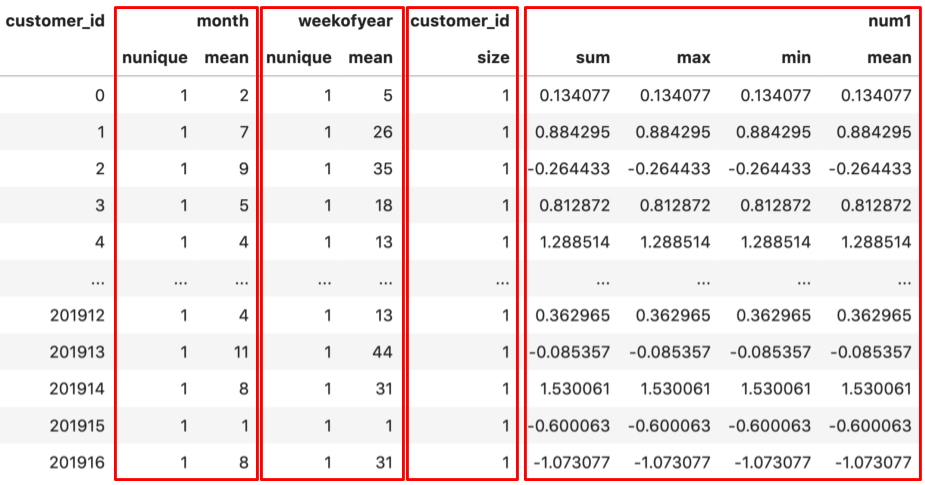
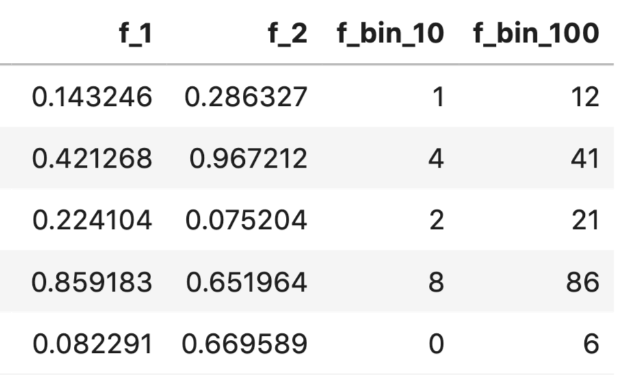
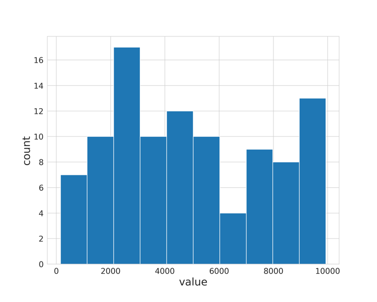
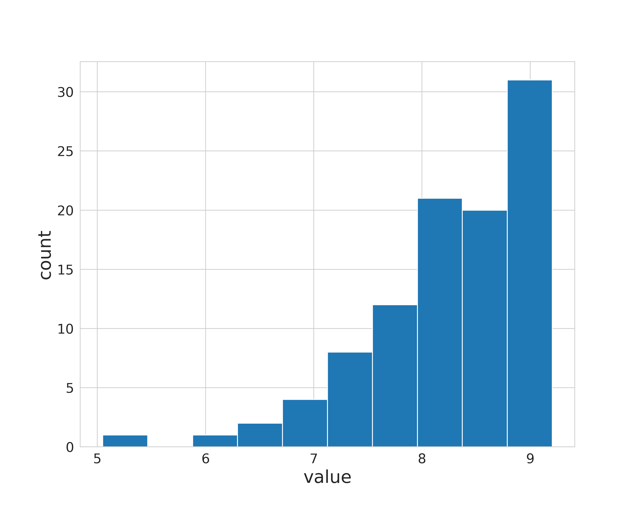
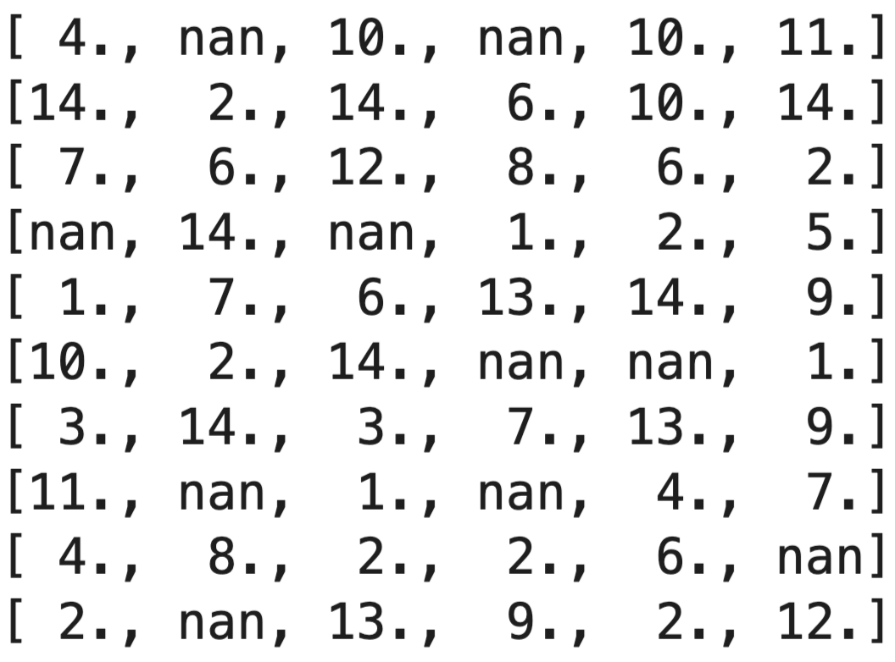
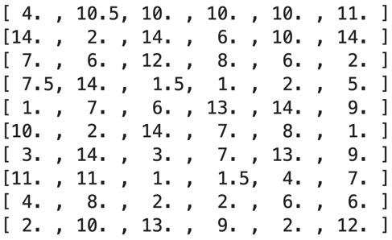

# 特征工程

特征工程是构建良好机器学习模型的最关键部分之一。如果我们拥有有用的特征，模型就会表现得更好。在许多情况下，您可以避免使用大型复杂模型，而使用具有关键工程特征的简单模型。我们必须牢记，只有当你对问题的领域有一定的了解，并且在很大程度上取决于相关数据时，才能以最佳方式完成特征工程。不过，您可以尝试使用一些通用技术，从几乎所有类型的数值变量和分类变量中创建特征。特征工程不仅仅是从数据中创建新特征，还包括不同类型的归一化和转换。

在有关分类特征的章节中，我们已经了解了结合不同分类变量的方法、如何将分类变量转换为计数、标签编码和使用嵌入。这些几乎都是利用分类变量设计特征的方法。因此，在本章中，我们的重点将仅限于数值变量以及数值变量和分类变量的组合。

让我们从最简单但应用最广泛的特征工程技术开始。假设你正在处理日期和时间数据。因此，我们有一个带有日期类型列的 pandas 数据帧。利用这一列，我们可以创建以下特征：

- 年
- 年中的周 
- 月
- 星期 
- 周末 
- 小时
- 还有更多

而使用pandas就可以非常容易地做到这一点。

```python
# 添加'year'列，将 'datetime_column' 中的年份提取出来
df.loc[:, 'year'] = df['datetime_column'].dt.year
# 添加'weekofyear'列，将 'datetime_column' 中的周数提取出来
df.loc[:, 'weekofyear'] = df['datetime_column'].dt.weekofyear 
# 添加'month'列，将 'datetime_column' 中的月份提取出来
df.loc[:, 'month'] = df['datetime_column'].dt.month
# 添加'dayofweek'列，将 'datetime_column' 中的星期几提取出来
df.loc[:, 'dayofweek'] = df['datetime_column'].dt.dayofweek
# 添加'weekend'列，判断当天是否为周末
df.loc[:, 'weekend'] = (df.datetime_column.dt.weekday >=5).astype(int) 
# 添加 'hour' 列，将 'datetime_column' 中的小时提取出来
df.loc[:, 'hour'] = df['datetime_column'].dt.hour
```

因此，我们将使用日期时间列创建一系列新列。让我们来看看可以创建的一些示例功能。

```python
import pandas as pd
# 创建日期时间序列，包含了从 '2020-01-06' 到 '2020-01-10' 的日期时间点，时间间隔为10小时
s = pd.date_range('2020-01-06', '2020-01-10', freq='10H').to_series() 
# 提取对应时间特征
features = {
    "dayofweek": s.dt.dayofweek.values, 
    "dayofyear": s.dt.dayofyear.values, 
    "hour": s.dt.hour.values,
    "is_leap_year": s.dt.is_leap_year.values, 
    "quarter": s.dt.quarter.values,
    "weekofyear": s.dt.weekofyear.values
}
```

这将从给定系列中生成一个特征字典。您可以将此应用于 pandas 数据中的任何日期时间列。这些是 pandas 提供的众多日期时间特征中的一部分。在处理时间序列数据时，日期时间特征非常重要，例如，在预测一家商店的销售额时，如果想在聚合特征上使用 xgboost 等模型，日期时间特征就非常重要。

假设我们有一个如下所示的数据：



<p align="center"><b>图 1：包含分类和日期特征的样本数据</b> </p>

在图 1 中，我们可以看到有一个日期列，从中可以轻松提取年、月、季度等特征。然后，我们有一个 customer_id 列，该列有多个条目，因此一个客户会被看到很多次（截图中看不到）。每个日期和客户 ID 都有三个分类特征和一个数字特征。我们可以从中创建大量特征：
- 客户最活跃的月份是几月 
- 某个客户的 cat1、cat2、cat3 的计数是多少
- 某年某月某周某客户的 cat1、cat2、cat3 数量是多少？
- 某个客户的 num1 平均值是多少？
- 等等。

使用 pandas 中的聚合，可以很容易地创建类似的功能。让我们来看看如何实现。

```python
def generate_features(df):
    df.loc[:, 'year'] = df['date'].dt.year
    df.loc[:, 'weekofyear'] = df['date'].dt.weekofyear 
    df.loc[:, 'month'] = df['date'].dt.month
    df.loc[:, 'dayofweek'] = df['date'].dt.dayofweek
    df.loc[:, 'weekend'] = (df['date'].dt.weekday >=5).astype(int) 
    aggs = {}
    # 对 'month' 列进行 nunique 和 mean 聚合
    aggs['month'] = ['nunique', 'mean']
    # 对 'weekofyear' 列进行 nunique 和 mean 聚合
    aggs['weekofyear'] = ['nunique', 'mean']
    # 对 'num1' 列进行 sum、max、min、mean 聚合
    aggs['num1'] = ['sum','max','min','mean']
    # 对 'customer_id' 列进行 size 聚合
    aggs['customer_id'] = ['size']
    # 对 'customer_id' 列进行 nunique 聚合
    aggs['customer_id'] = ['nunique']
    # 对数据应用不同的聚合函数
    agg_df = df.groupby('customer_id').agg(aggs)
    # 重置索引
    agg_df = agg_df.reset_index() 
	return agg_df
```

请注意，在上述函数中，我们跳过了分类变量，但您可以像使用其他聚合变量一样使用它们。



<p align="center"><b>图 2：总体特征和其他特征</b> </p>

现在，我们可以将图 2 中的数据与带有 customer_id 列的原始数据帧连接起来，开始训练模型。在这里，我们并不是要预测什么；我们只是在创建通用特征。不过，如果我们试图在这里预测什么，创建特征会更容易。

例如，有时在处理时间序列问题时，您可能需要的特征不是单个值，而是一系列值。 例如，客户在特定时间段内的交易。在这种情况下，我们会创建不同类型的特征，例如：使用数值特征时，在对分类列进行分组时，会得到类似于时间分布值列表的特征。在这种情况下，您可以创建一系列统计特征，例如

- 平均值
- 最大值
- 最小值
- 独特性
- 偏斜
- 峰度
- Kstat
- 百分位数
- 定量
- 峰值到峰值 
- 以及更多

这些可以使用简单的 numpy 函数创建，如下面的 python 代码段所示。

```python
import numpy as np
# 创建字典，用于存储不同的统计特征
feature_dict = {}
# 计算 x 中元素的平均值，并将结果存储在 feature_dict 中的 'mean' 键下
feature_dict['mean'] = np.mean(x) 
# 计算 x 中元素的最大值，并将结果存储在 feature_dict 中的 'max' 键下
feature_dict['max'] = np.max(x) 
# 计算 x 中元素的最小值，并将结果存储在 feature_dict 中的 'min' 键下
feature_dict['min'] = np.min(x) 
# 计算 x 中元素的标准差，并将结果存储在 feature_dict 中的 'std' 键下
feature_dict['std'] = np.std(x)
# 计算 x 中元素的方差，并将结果存储在 feature_dict 中的 'var' 键下
feature_dict['var'] = np.var(x) 
# 计算 x 中元素的差值，并将结果存储在 feature_dict 中的 'ptp' 键下
feature_dict['ptp'] = np.ptp(x) 
# 计算 x 中元素的第10百分位数（即百分之10分位数），并将结果存储在 feature_dict 中的 'percentile_10' 键下
feature_dict['percentile_10'] = np.percentile(x, 10)
# 计算 x 中元素的第60百分位数，将结果存储在 feature_dict 中的 'percentile_60' 键下
feature_dict['percentile_60'] = np.percentile(x, 60)
# 计算 x 中元素的第90百分位数，将结果存储在 feature_dict 中的 'percentile_90' 键下
feature_dict['percentile_90'] = np.percentile(x, 90)
# 计算 x 中元素的5%分位数（即0.05分位数），将结果存储在 feature_dict 中的 'quantile_5' 键下
feature_dict['quantile_5'] = np.quantile(x, 0.05)
# 计算 x 中元素的95%分位数（即0.95分位数），将结果存储在 feature_dict 中的 'quantile_95' 键下
feature_dict['quantile_95'] = np.quantile(x, 0.95)
# 计算 x 中元素的99%分位数（即0.99分位数），将结果存储在 feature_dict 中的 'quantile_99' 键下
feature_dict['quantile_99'] = np.quantile(x, 0.99)
```

时间序列数据（数值列表）可以转换成许多特征。在这种情况下，一个名为 tsfresh 的 python 库非常有用。

```python
from tsfresh.feature_extraction import feature_calculators as fc
# 计算 x 数列的绝对能量（abs_energy），并将结果存储在 feature_dict 字典中的 'abs_energy' 键下
feature_dict['abs_energy'] = fc.abs_energy(x)
# 计算 x 数列中高于均值的数据点数量，将结果存储在 feature_dict 字典中的 'count_above_mean' 键下
feature_dict['count_above_mean'] = fc.count_above_mean(x)
# 计算 x 数列中低于均值的数据点数量，将结果存储在 feature_dict 字典中的 'count_below_mean' 键下
feature_dict['count_below_mean'] = fc.count_below_mean(x)
# 计算 x 数列的均值绝对变化（mean_abs_change），并将结果存储在 feature_dict 字典中的 'mean_abs_change' 键下
feature_dict['mean_abs_change'] = fc.mean_abs_change(x)
# 计算 x 数列的均值变化率（mean_change），并将结果存储在 feature_dict 字典中的 'mean_change' 键下
feature_dict['mean_change'] = fc.mean_change(x)

```

这还不是全部；tsfresh 提供了数百种特征和数十种不同特征的变体，你可以将它们用于基于时间序列（值列表）的特征。在上面的例子中，x 是一个值列表。但这还不是全部。您还可以为包含或不包含分类数据的数值数据创建许多其他特征。生成许多特征的一个简单方法就是创建一堆多项式特征。例如，从两个特征 "a "和 "b "生成的二级多项式特征包括 "a"、"b"、"ab"、"a^2 "和 "b^2"。

```python
import numpy as np
df = pd.DataFrame(
np.random.rand(100, 2),
columns=[f"f_{i}" for i in range(1, 3)])
```

如图 3 所示，它给出了一个数据表。


<p align="center"><b>图 3：包含两个数字特征的随机数据表</b> </p>

我们可以使用 scikit-learn 的 PolynomialFeatures 创建两次多项式特征。

```python
from sklearn import preprocessing
# 指定多项式的次数为 2，不仅考虑交互项，不包括偏差（include_bias=False）
pf = preprocessing.PolynomialFeatures(degree=2,
                                      interaction_only=False, 
                                      include_bias=False
                                     )
# 拟合，创建多项式特征
pf.fit(df)
# 转换数据
poly_feats = pf.transform(df)
# 获取生成的多项式特征的数量
num_feats = poly_feats.shape[1]
# 为新生成的特征命名
df_transformed = pd.DataFrame(poly_feats,columns=[f"f_{i}" for i in range(1, num_feats + 1)] )
```

这样就得到了一个数据表，如图 4 所示。


<p align="center"><b>图 4：带有多项式特征的样本数据表</b> </p>

现在，我们创建了一些多项式特征。如果创建的是三次多项式特征，最终总共会有九个特征。特征的数量越多，多项式特征的数量也就越多，而且你还必须记住，如果数据集中有很多样本，那么创建这类特征就需要花费一些时间。


<p align="center"><b>图 5：数字特征列的直方图</b> </p>

另一个有趣的功能是将数字转换为类别。这就是所谓的**分箱**。让我们看一下图 5，它显示了一个随机数字特征的样本直方图。我们在该图中使用了10个分箱，可以看到我们可以将数据分为10个部分。这可以使用 pandas 的cat函数来实现。

```python
# 创建10个分箱
df["f_bin_10"] = pd.cut(df["f_1"], bins=10, labels=False) 
# 创建100个分箱
df["f_bin_100"] = pd.cut(df["f_1"], bins=100, labels=False)
```

如图 6 所示，这将在数据帧中生成两个新特征。



<p align="center"><b>图 6：数值特征分箱</b> </p>

当你进行分类时，可以同时使用分箱和原始特征。我们将在本章后半部分学习更多关于选择特征的知识。分箱还可以将数字特征视为分类特征。

另一种可以从数值特征中创建的有趣特征类型是对数变换。请看图 7 中的特征 f_3。

与其他方差较小的特征相比（假设如此），f_3 是一种方差非常大的特殊特征。因此，我们希望降低这一列的方差，这可以通过对数变换来实现。

f_3 列的值范围为 0 到 10000，直方图如图 8 所示。



<p align="center"><b>图 8：特征 f_3 的直方图</b> </p>

我们可以对这一列应用 log(1 + x) 来减少其方差。图 9 显示了应用对数变换后直方图的变化。



<p align="center"><b>图 9：应用对数变换后的 f_3 直方图</b> </p>

让我们来看看不使用对数变换和使用对数变换的方差。

```python
In [X]: df.f_3.var()
Out[X]: 8077265.875858586
In [X]: df.f_3.apply(lambda x: np.log(1 + x)).var() 
Out[X]: 0.6058771732119975
```

有时，也可以用指数来代替对数。一种非常有趣的情况是，您使用基于对数的评估指标，例如 RMSLE。在这种情况下，您可以在对数变换的目标上进行训练，然后在预测时使用指数值转换回原始值。这将有助于针对指标优化模型。

大多数情况下，这类数字特征都是基于直觉创建的。没有公式可循。如果您从事的是某一行业，您将创建特定行业的特征。

在处理分类变量和数值变量时，可能会遇到缺失值。在上一章中，我们介绍了一些处理分类特征中缺失值的方法，但还有更多方法可以处理缺失值/NaN 值。这也被视为特征工程。

如果在分类特征中遇到缺失值，就将其视为一个新的类别！这样做虽然简单，但（几乎）总是有效的！

在数值数据中填补缺失值的一种方法是选择一个在特定特征中没有出现的值，然后用它来填补。例如，假设特征中没有 0。这是其中一种方法，但可能不是最有效的。对于数值数据来说，比填充 0 更有效的方法之一是使用平均值进行填充。您也可以尝试使用该特征所有值的中位数来填充，或者使用最常见的值来填充缺失值。这样做的方法有很多。

填补缺失值的一种高级方法是使用 **K 近邻法**。 您可以选择一个有缺失值的样本，然后利用某种距离度量（例如欧氏距离）找到最近的邻居。然后取所有近邻的平均值来填补缺失值。您可以使用 KNN 来填补这样的缺失值。



<p align="center"><b>图 10：有缺失值的二维数组</b> </p>

让我们看看 KNN 是如何处理图 10 所示的缺失值矩阵的。

```python
import numpy as np
from sklearn import impute
# 生成维度为 (10, 6) 的随机整数矩阵 X，数值范围在 1 到 14 之间
X = np.random.randint(1, 15, (10, 6))
# 数据类型转换为 float
X = X.astype(float)
# 在矩阵 X 中随机选择 10 个位置，将这些位置的元素设置为 NaN（缺失值）
X.ravel()[np.random.choice(X.size, 10, replace=False)] = np.nan 
# 创建一个 KNNImputer 对象 knn_imputer，指定邻居数量为 2
knn_imputer = impute.KNNImputer(n_neighbors=2) 
# # 使用 knn_imputer 对矩阵 X 进行拟合和转换，用 K-最近邻方法填补缺失值
knn_imputer.fit_transform(X)
```

如图 11 所示，它填充了上述矩阵。



<p align="center"><b>图 11：KNN估算的数值</b> </p>

另一种弥补列缺失值的方法是训练回归模型，试图根据其他列预测某列的缺失值。因此，您可以从有缺失值的一列开始，将这一列作为无缺失值回归模型的目标列。现在，您可以使用所有其他列，对相关列中没有缺失值的样本进行模型训练，然后尝试预测之前删除的样本的目标列（同一列）。这样，基于模型的估算就会更加稳健。

请务必记住，对于基于树的模型，没有必要进行数值归一化，因为它们可以自行处理。

到目前为止，我所展示的只是创建一般特征的一些方法。现在，假设您正在处理一个预测不同商品（每周或每月）商店销售额的问题。您有商品，也有商店 ID。因此，您可以创建每个商店的商品等特征。现在，这是上文没有讨论的特征之一。这类特征不能一概而论，完全来自于领域、数据和业务知识。查看数据，找出适合的特征，然后创建相应的特征。如果您使用的是逻辑回归等线性模型或 SVM 等模型，请务必记住对特征进行缩放或归一化处理。基于树的模型无需对特征进行任何归一化处理即可正常工作。