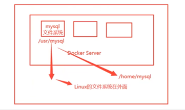

#后端/docker

## 容器数据卷

### 是什么

docker的理念回顾

将应用和环境打包成一个镜像！

数据？如果数据都在容器中，那么我们容器删除，数据就会丢失！需求：数据可以持久化

MySQL，容器删除了，删库跑路！需求：MySQL数据可以存储在本地！

容器之间可以有一个数据共享的技术！Docker容器中产生的数据，同步到本地！

这就是卷技术！目录的挂载，将我们容器内的目录，挂载到Linux上面！

**总结一句话：容器的持久化和同步操作！容器间也是可以数据共享的！**

### 使用数据卷

## DockerFile

## DockerNet

## SpringBoot + Docker
