#Software/git

# Git

## Git安装

下载在官方网站Git [https://git-scm.com/downloads](https://git-scm.com/downloads)

打开安装程序

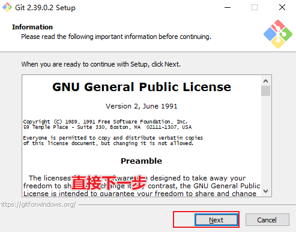

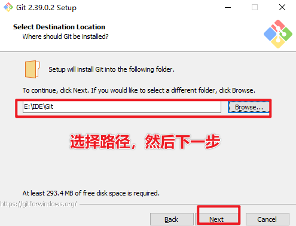

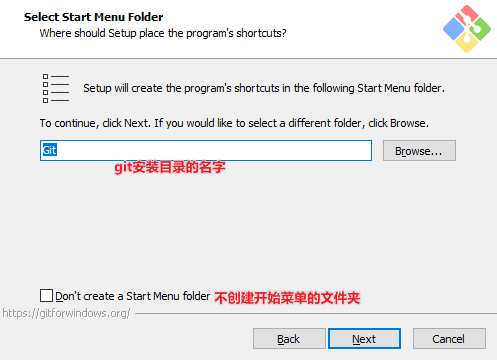

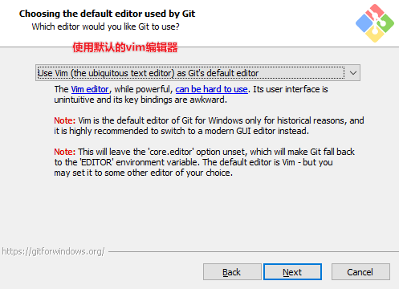

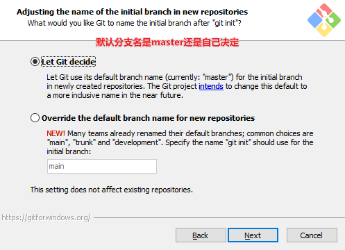

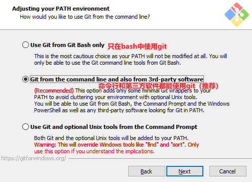

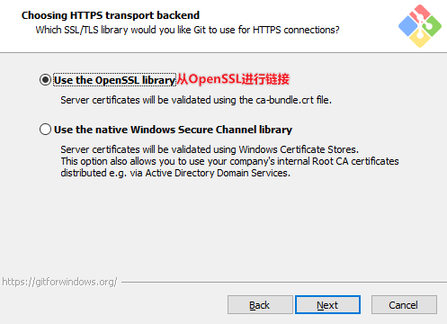

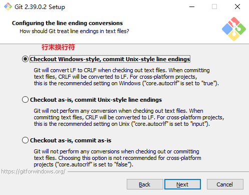

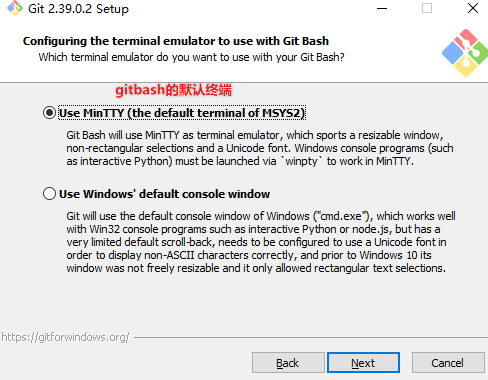

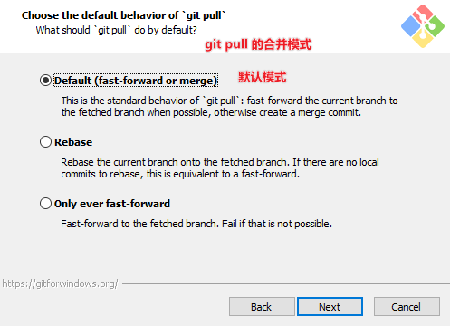

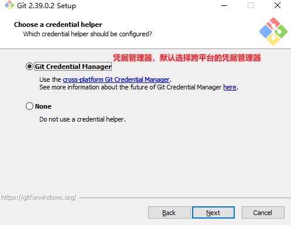

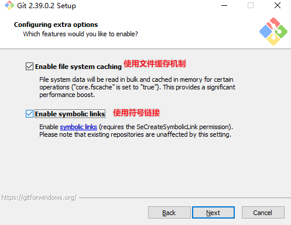

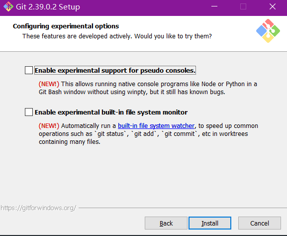

然后点击安装即可。

系统右键打开 git bash here

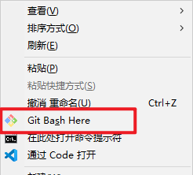

输入 `git --version`

输出版本号就是安装成功

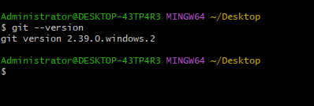

## Git常用命令

## Git分支操作

## Git团队协作

