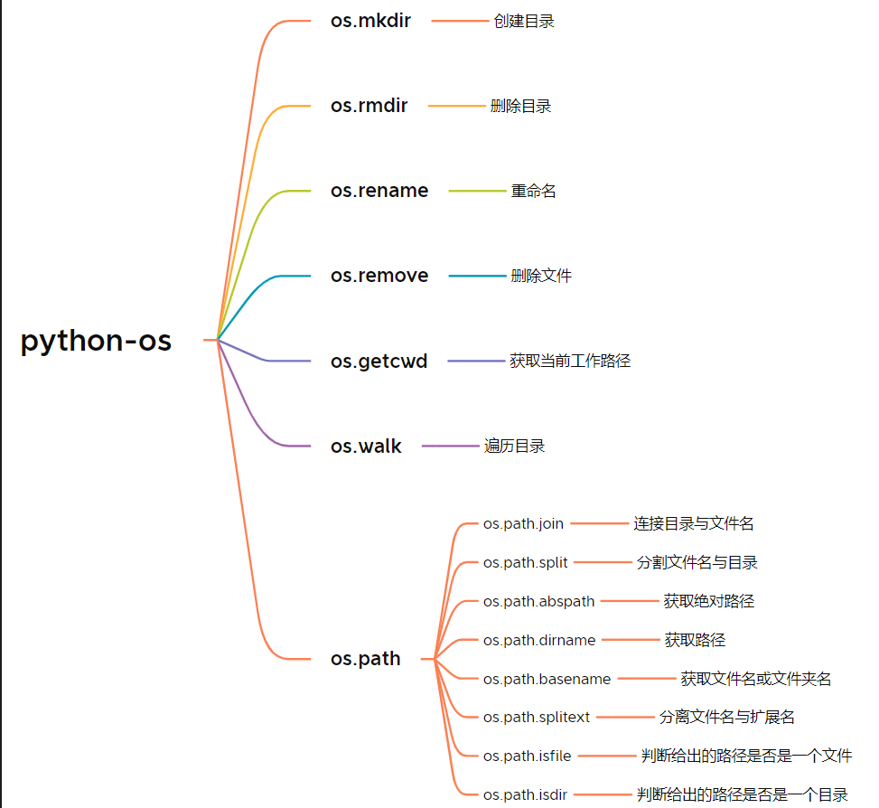

> 学习Github开源书籍 [Python-Explore](https://funhacks.gitbooks.io/explore-python/content/) 的学习笔记
> 2020.02.26

#Python  #Python/IO




| 模式 | 介绍 |
|---|---|
| 'r' | 读模式 |
|‘w'|写模式|
|‘a'|追加模式|
|‘b'|二进制模式（可添加到其他模式中使用）|
|‘+'|读/写模式（可添加到其他模式中使用）|

## 文本文件

使用open函数直接打开一般需要 打开\ 读取\ 关闭文件三个步骤

但是我们可以使用 with 

```python
with open('/path/to/file', 'r') as f:
    data = f.read()
```

读取方式
- 一次性读取所有内容， `read()` 或 `readlines()`
- 按字节读取， `read(size)`
- 按行读取， `readline()`

文件可以作为迭代器使用:

```python
with open('data.txt', 'r') as f:
    for line in f:
        print line,
```

写文件使用 `write` 方法：

```python
with open('data2.txt', 'w') as f:
    f.write('one\n')
    f.write('two')
```

-   如果上述文件已存在，则会清空原内容并覆盖掉；
-   如果上述路径是正确的但是文件不存在（data2.txt 不存在），则会新建一个文件，并写入上述内容；
-   如果上述路径是不正确, 会抛出 IOError；

## 二进制文件

-   读取二进制文件使用 'rb' 
-   写入二进制文件使用 'wb' 

