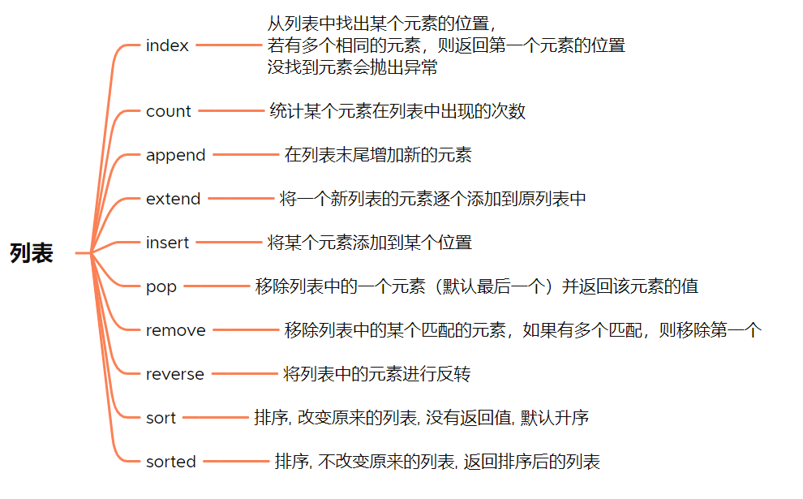
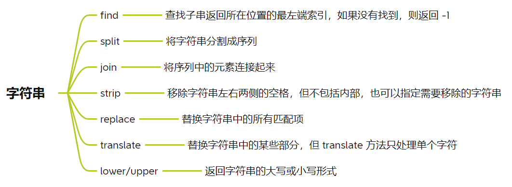
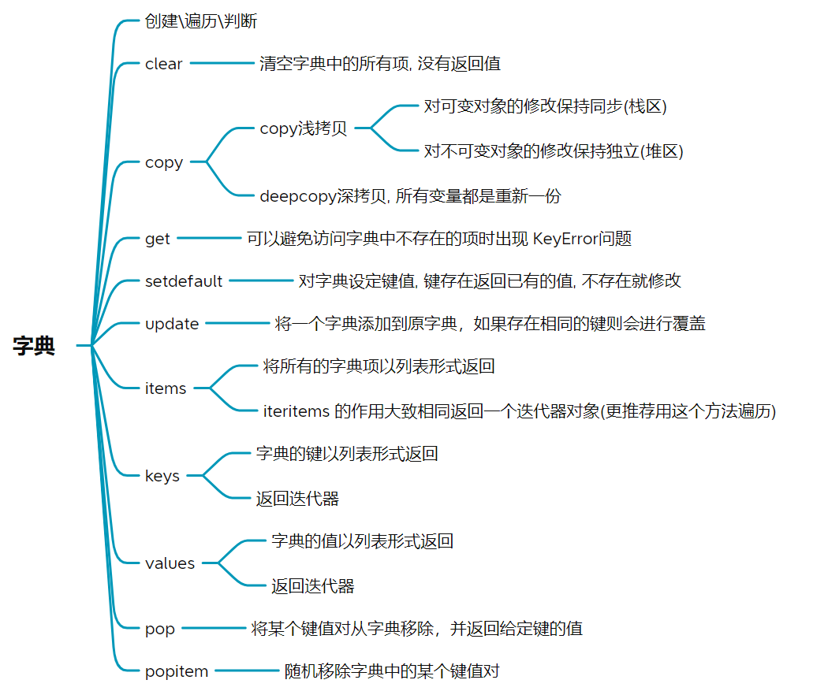
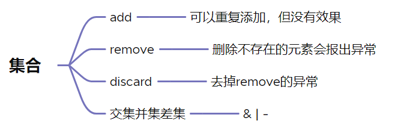

> 学习Github开源书籍 [Python-Explore](https://funhacks.gitbooks.io/explore-python/content/) 的学习笔记
> 2020.02.22

#Python #Python/数据类型

## 序列

根据索引获取元素, 有一些通用的操作

序列
- 列表 list
- 元组 tuple
- 字符串 string

映射
- 字典 dict

集合
- 集合 set


### 索引

获取序列中单个元素

```python
>>> nums = [1, 2, 3, 4, 5, 6, 7, 8, 9]
>>> 
>>> # 第0个元素
>>> nums[0]
1
>>> # 最后一个元素
>>> nums[-1]
9
>>> s = 'abcdefghijklmn'
>>> 
>>> # 第0个元素
>>> s[0]
'a'
>>> # 最后一个元素
>>> s[-1]
'n'
```

### 分片

获取序列中的一个区间的元素

`左闭右开`的区间

```python
>>> nums = [1, 2, 3, 4, 5, 6, 7]

>>> # 访问前面的元素和后面的元素
>>> nums[0:4]
[1, 2, 3, 4]
>>> nums[3:4]
[4]

# 访问前面和后面的元素
>>> nums[:3]
[1, 2, 3]
>>> nums[-3:]
[5, 6, 7]

>>> # 整个序列
>>> nums[:]
[1, 2, 3, 4, 5, 6, 7]
>>>

>>> # 使用步长, 默认为1
>>> nums[1:5]
[2, 3, 4, 5]
>>> nums[1:5:1]
[2, 3, 4, 5]
>>>

>>> # 对正数步长，从左向右取元素；对负数步长，从右向左取元素
>>> nums[1:5:-1]
[]
>>> nums[5:1:-1]
[6, 5, 4, 3]
>>>

>>> # 前两个元素置空
>>> nums[::-2]
[7, 5, 3, 1]
>>> nums[::2]
[1, 3, 5, 7]

>>> nums = [1, 2, 3, 4, 5, 6, 7, 8, 9, 10, 11, 12, 13, 14, 15]
>>> nums[:6]
[1, 2, 3, 4, 5, 6]
>>> nums[:6:-2]
[15, 13, 11, 9]
>>> nums[:6:2]
[1, 3, 5]
```

### +

加法就是 `拼接`

```python
>>> [1, 2, 3] + [4, 5, 6, 7, 8, 9, 10]
[1, 2, 3, 4, 5, 6, 7, 8, 9, 10]

>>> (1, 2, 3) + (4, 5, 6)
(1, 2, 3, 4, 5, 6)

>>> 'hello' + 'world'
'helloworld'
```

### x

加法就是 `多次拼接`

```python
>>> [1, 1, 2] * 3
[1, 1, 2, 1, 1, 2, 1, 1, 2]

>>> '123' * 3
'123123123'
```

### in

就是`在不在序列中`

```python
>>> 1 in [1, 2, 3, 4, 5]
True

>>> 8 in [1, 2, 3, 4, 5]
False

>>> 'el' in 'hello'
True
```

## 列表



```python

# -----index-----

>>> strs = ['hello', 'hi', 'nice']
>>> strs.index('hi')
1
>>> nums = [1, 2, 3, 4, 5]
>>> nums.index(5)
4

# -----count-----

>>> nums = [1, 1, 2, 1, 2, 4, 5]
>>> nums.count(1)
3
>>> nums.count(3)
0

# -----append-----

>>> nums = [1, 2]
>>> nums
[1, 2]
>>> nums.append(3)
>>> nums
[1, 2, 3]
>>> nums.append([4, 5])
>>> nums
[1, 2, 3, [4, 5]]

# -----extend-----

>>> a = [1, 1, 1]
>>> b = [2, 2, 2]
>>> a
[1, 1, 1]
>>> b
[2, 2, 2]
>>> a.extend(b)
>>> a
[1, 1, 1, 2, 2, 2]
>>> b.extend(a)
>>> b
[2, 2, 2, 1, 1, 1, 2, 2, 2]

# -----insert-----

>>> nums
[1, 3]
>>> nums.insert(1, 0)
>>> nums
[1, 0, 3]

# -----pop----

>>> nums
[1, 2, 3, [4, 5]]
>>> nums.pop()
[4, 5]
>>> nums
[1, 2, 3]
>>> nums.pop(1)
2
>>> nums
[1, 3]

# -----remove-----

>>> nums
[3, 0, 1, 3]
>>> nums.remove(3)
>>> nums
[0, 1, 3]

# -----reverse-----

>>> nums
[1, 0, 3]
>>> nums.reverse()
>>> nums
[3, 0, 1]

# -----sort-----

>>> nums.sort()
>>> nums
[0, 0, 1, 1, 3, 3, 5, 6, 23, 33]

>>> nums
[0, 1, 3, 3, 5, 6, 23, 33, 1, 0]
>>> sorted(nums)
[0, 0, 1, 1, 3, 3, 5, 6, 23, 33]
>>> sorted(nums, reverse=True)
[33, 23, 6, 5, 3, 3, 1, 1, 0, 0]
>>>

>>> students
[('aaa', 12, 15, 12), ('qww', 45, 12, 55), ('erw', 12, 10, 23), ('asdd', 1, 20, 123), ('qqq', 32, 20, 55), ('bbb', 43, 16, 30)]

# 对第 3 列排序 (从小到大)
>>> sorted(students, key=lambda student: student[2])
[('erw', 12, 10, 23), ('qww', 45, 12, 55), ('aaa', 12, 15, 12), ('bbb', 43, 16, 30), ('asdd', 1, 20, 123), ('qqq', 32, 20, 55)]

# 对第 2 列排序（从小到大），再对第 3 列从大到小排序
>>> sorted(students, key=lambda student: (student[1], -student[2]))
[('asdd', 1, 20, 123), ('aaa', 12, 15, 12), ('erw', 12, 10, 23), ('qqq', 32, 20, 55), ('bbb', 43, 16, 30), ('qww', 45, 12, 55)]
```

排序  https://wiki.python.org/moin/HowTo/Sorting


## 元组

因为是不可变的序列, 也就没有排序什么的操作了

创建

```python
>>> t = ()
>>> t
()
>>> t = (1,)
>>> t
(1,)
```

## 字符串



不可变, 不能对他进行赋值等操作

```python

# ----find----

>>> s
"when i was young i'd listen to the radio"

>>> s.find('i')
5
# 指定起始位置
>>> s.find('i', 5)
5

>>> s.find('i', 6)
17
# 指定起始位置和结束位置
>>> s.find('i', 6, 15)
-1

# ----split----

>>> '/root/OS-lab/lab01'.split('/')
['', 'root', 'OS-lab', 'lab01']

# 默认以 所有 空格（空格、制表符、换行等）作为分隔符
>>> ' when i was    young i d listen'.split()
['when', 'i', 'was', 'young', 'i', 'd', 'listen']

# 以 空格 作为分隔符
>>> ' when i was    young i d listen'.split(' ')
['', 'when', 'i', 'was', '', '', '', 'young', 'i', 'd', 'listen']

# ----join----

>>> ' '.join(['', 'root', 'OS-lab', 'lab01'])
' root OS-lab lab01'

>>> '/'.join(['', 'root', 'OS-lab', 'lab01'])
'/root/OS-lab/lab01'

# ----strip----

>>> '     strip string    '.strip()
'strip string'
>>> '     strip string    '.rstrip()
'     strip string'
>>> '     strip string    '.lstrip()
'strip string    '
# 移除所有的字符1和2
>>> '123     strip string1212'.strip('12')
'3     strip string'
>>>

# ----replace----

>>> '     strip string    '.replace('s', 'S')
'     Strip String    '

# ----lower/upper----

>>> 'Python'.upper()
'PYTHON'
>>> 'Python'.lower()
'python'
>>>
```

## 字典




创建. 遍历, 判断
```python

# ----创建----

# 空
>>> dic = {}
>>> dic
{}
# 字典
>>> dic = {'name': 'yan jingcun', 'age': 22}
>>> dic
{'name': 'yan jingcun', 'age': 22}
# dict函数
>>> dic = dict(name='yjc', age=20)
>>> dic
{'name': 'yjc', 'age': 20}
>>> item = [('name', 'yjc'), ('age', 23)]
>>> dic = dict(item)
>>> dic
{'name': 'yjc', 'age': 23}

# -----遍历

>>> dic = {'name':'yjc', 'age':12}
ey in dic:
    >>> for key in dic:
...         print('%s:%s' %(key, dic[key]))
...
name:yjc
age:12
>>> dic['name']
'yjc'

>>> for key in dic.keys():
...     if key == 'name':
...             del dic[key]
>>> dic
{'age': 12}

# ----判断是否在字典里面

>>> 'name' in dic
True
>>> 'ad' in dic
False
>>>

```


```python

# ----clear----

# 直接赋值不能清除dic2的值
>>> dic1 = {'name':'yjc', 'age':12, 'school':'stdu'}
>>> dic2 = dic1
>>> dic2
{'name': 'yjc', 'age': 12, 'school': 'stdu'}
>>> dic1 = {}
>>> dic2
{'name': 'yjc', 'age': 12, 'school': 'stdu'}
# clear可以
>>> dic1
{'name': 'yjc', 'age': 12, 'school': 'stdu'}
>>> dic2
{'name': 'yjc', 'age': 12, 'school': 'stdu'}
>>> dic1.clear()
>>> dic2
{}
>>>

# ----copy----

# 浅拷贝
>>> dic
{'name': 'yjc', 'age': 12, 'school': 'stdu', 'scores': [33, 55, 66]}
>>> dic1 = dic.copy()
>>> dic1
{'name': 'yjc', 'age': 12, 'school': 'stdu', 'scores': [33, 55, 66]}
>>> dic1['name'] = '123'
>>> dic1['scores'][0] = 60
>>> dic
{'name': 'yjc', 'age': 12, 'school': 'stdu', 'scores': [60, 55, 66]}
>>>

# 深拷贝
# 对任何对象的操作都不会影响到彼此
>>> from copy import deepcopy
>>> dic1 = deepcopy(dic)
>>> dic1
{'name': 'yjc', 'age': 12, 'school': 'stdu', 'scores': [60, 55, 66]}
>>> dic['name'] = '123'
>>> dic1
{'name': 'yjc', 'age': 12, 'school': 'stdu', 'scores': [60, 55, 66]}
>>> dic
{'name': '123', 'age': 12, 'school': 'stdu', 'scores': [60, 55, 66]}
>>> dic['name'] = '321'
>>> dic1
{'name': 'yjc', 'age': 12, 'school': 'stdu', 'scores': [60, 55, 66]}

# ----get----
>>> dic
{'name': '321', 'age': 12, 'school': 'stdu', 'scores': [60, 55, 66]}
>>> dic.get('name')
'321'
>>> dic.get('nam0')
>>>

# ----setdefault----
# 当键不存在的时候，setdefault 返回设定的默认值并且更新字典。
# 当键存在的时候，会返回已有的值，但不会更新字典。

>>> d
{'name': '123'}
>>> d = {}
>>> d.setdefault('name', '111')
'111'
>>> d
{'name': '111'}
>>> d.setdefault('name', '1112')
'111'
>>> d
{'name': '111'}

# ----update----

# 创建
>>> dic
{'name': '321', 'age': 12, 'school': 'stdu'}
>>> dic1 = {'score':[1, 2, 3]}
>>> dic.update(dic1)
>>> dic
{'name': '321', 'age': 12, 'school': 'stdu', 'score': [1, 2, 3]}
>>>

#更新
>>> dic
{'name': '321', 'age': 12, 'school': 'stdu', 'score': [1, 2, 3]}
>>> dic1
{'name': '123'}
>>> dic.update(dic1)
>>> dic
{'name': '123', 'age': 12, 'school': 'stdu', 'score': [1, 2, 3]}
>>>

# ----pop----

>>> dic
{'name': '123', 'age': 12, 'school': 'stdu', 'score': [1, 2, 3]}
>>> dic.pop('score')
[1, 2, 3]
>>> dic
{'name': '123', 'age': 12, 'school': 'stdu'}
>>>

# ----popitem----

>>> dic.popitem()
('school', 'stdu')
>>> dic
{'name': '123', 'age': 12}
>>>

# ----keys----

>>> dic
{'name': '123', 'age': 12}
>>> dic.keys()
dict_keys(['name', 'age'])

# ----values----
>>> dic
{'name': '123', 'age': 12}
>>> dic.values()
dict_values(['123', 12])
>>>


# ----items----
>>> dic
{'name': '123', 'age': 12}
>>> dic.items()
dict_items([('name', '123'), ('age', 12)])
>>> for k,v in dic.items():
...     print('%s:%s'%(k,v))
...
name:123
age:12

```

## 集合



```python


# ----创建-----
>>> s = {'a', 'f', 'd', 's', 'q'}
>>> s
{'s', 'd', 'f', 'a', 'q'}
>>> type(s)
<class 'set'>
>>> set('aaaaaaa')
{'a'}
>>>

# ----遍历----

>>> s
{'s', 'd', 'f', 'a', 'q'}
>>> for e in s:
...     print(e, end='')
...
sdfaq

# 增删

>>> s = {'a'}
>>> s
{'a'}
>>> s.add('b')
>>> s
{'a', 'b'}
>>> s.remove('a')
>>> s
{'b'}
>>>

#----交集, 并集, 差集----

>>> s1 = {1, 2, 3}
>>> s2 = {3, 4, 5}
>>> s1 & s2
{3}
>>> s1 | s2
{1, 2, 3, 4, 5}
>>> s1 - s2
{1, 2}
>>>

```