## 索引优化分析

### 性能下降分析

- 数据过多 -> 分库分表

- 关联了太多的表，太多的join -> SQL优化

- 没有充分利用到索引 -> 索引建立

- 服务器调优及各个参数设置 -> 调整my.cnf/my.ini

### 常见的join查询

“在我的日常工作中很少用到右外连接，一般都是用左外连接”

MySQL没有全连接（第三行第一个）

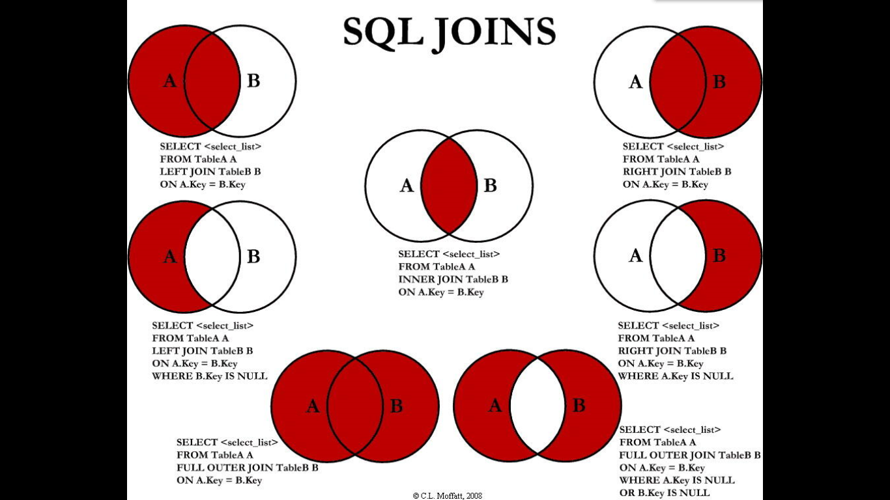

### 索引简介

#### 是什么

MySQL官方对索引的定义为：索引（Index）是帮助MySQL高效获取数据的数据结构。

索引的本质：数据结构。

索引的目的在于提高查询效率

举例：

在数据之外，数据库系统还维护着满足特定查找算法的数据结构，这些数据结构以某种方式引用（指向）数据，
这样就可以在这些数据结构上实现高级查找算法。这种数据结构，就是索引。下图就是一种**可能的**索引方式示例：

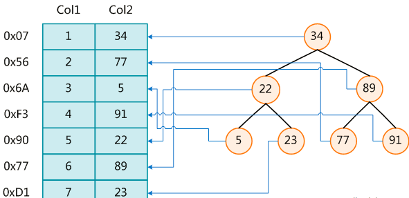

左边是数据表，一共有两列七条记录，最左边的是数据记录的物理地址，为了加快Col2的查找，可以维护一个右边所示的二叉查找树，每个节点分别包含索引键值和一个指向对应数据记录物理地址的指针，这样就可以运用二叉查找在一定的复杂度内获取到相应数据，从而快速的检索出符合条件的记录。

数据本身之外，数据库还维护着一个满足特定查找算法的数据结构，这些数据结构以某种方式指向数据，这样就可以在这些数据结构的基础上实现高级查找算法，这种数据结构就是索引。

一般来说索引本身也很大，不可能全部存储在内存中，因此索引往往以索引文件的形式存储的磁盘上

#### 优势/劣势

优势

- 类似大学图书馆建书目索引，提高数据检索的效率，降低数据库的IO成本

- 通过索引列对数据进行排序，降低数据排序的成本，降低了CPU的消耗

劣势

- 虽然索引大大提高了查询速度，同时却会降低更新表的速度，如对表进行INSERT、UPDATE和DELETE。 因为更新表时，MySQL不仅要保存数据，还要保存一下索引文件每次更新添加了索引列的字段， 都会调整因为更新所带来的键值变化后的索引信息

- 实际上索引也是一张表，该表保存了主键与索引字段，并指向实体表的记录，所以索引列也是要占用空间的

#### 索引结构

MySQL 用的**B+Tree**

BTree确实效率更高，但是每个节点都有一个指针，占用的内存大了。

**BTree**

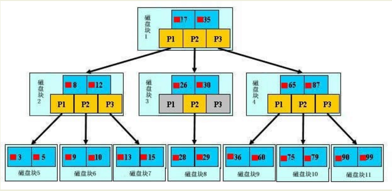

【初始化介绍】

一颗b树，浅蓝色的块我们称之为一个磁盘块，可以看到每个磁盘块包含几个数据项（深蓝色所示）和指针（黄色所示），如磁盘块1包含数据项17和35，包含指针P1、P2、P3，P1表示小于17的磁盘块，P2表示在17和35之间的磁盘块，P3表示大于35的磁盘块。真实的数据存在于叶子节点即3、5、9、10、13、15、28、29、36、60、75、79、90、99。

非叶子节点不存储真实的数据，只存储**指引搜索方向**的数据项，如17、35并不真实存在于数据表中。

【查找过程】

如果要查找数据项29，那么首先会把磁盘块1由磁盘加载到内存，此时发生一次IO，在内存中用二分查找确定29在17和35之间，锁定磁盘块1的P2指针，内存时间因为非常短（相比磁盘的IO）可以忽略不计，通过磁盘块1的P2指针的磁盘地址把磁盘块3由磁盘加载到内存，发生第二次IO，29在26和30之间，锁定磁盘块3的P2指针，通过指针加载磁盘块8到内存，发生第三次IO，同时内存中做二分查找找到29，结束查询，总计三次IO。

真实的情况是，3层的b+树可以表示上百万的数据，如果上百万的数据查找只需要三次IO，性能提高将是巨大的，如果没有索引，每个数据项都要发生一次IO，那么总共需要百万次的IO，显然成本非常非常高。

**B+Tree**

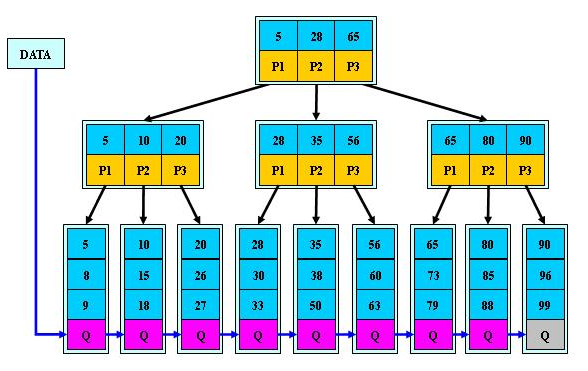


**B+Tree与B-Tree 的区别**

　1）B-树的关键字和记录是放在一起的，叶子节点可以看作外部节点，不包含任何信息；B+树的非叶子节点中只有关键字和指向下一个节点的索引，记录只放在叶子节点中。

　 2）在B-树中，越靠近根节点的记录查找时间越快，只要找到关键字即可确定记录的存在；而B+树中每个记录的查找时间基本是一样的，都需要从根节点走到叶子节点，而且在叶子节点中还要再比较关键字。从这个角度看B-树的性能好像要比B+树好，而在实际应用中却是B+树的性能要好些。因为B+树的非叶子节点不存放实际的数据，这样每个节点可容纳的元素个数比B-树多，树高比B-树小，这样带来的好处是减少磁盘访问次数。尽管B+树找到一个记录所需的比较次数要比B-树多，但是一次磁盘访问的时间相当于成百上千次内存比较的时间，因此实际中B+树的性能可能还会好些，而且B+树的叶子节点使用指针连接在一起，方便顺序遍历（例如查看一个目录下的所有文件，一个表中的所有记录等），这也是很多数据库和文件系统使用B+树的缘故。 

思考：为什么说B+树比B-树更适合实际应用中操作系统的文件索引和数据库索引？ 

1) B+树的磁盘读写代价更低 
　　B+树的内部结点并没有指向关键字具体信息的指针。因此其内部结点相对B 树更小。如果把所有同一内部结点的关键字存放在同一盘块中，那么盘块所能容纳的关键字数量也越多。一次性读入内存中的需要查找的关键字也就越多。相对来说IO读写次数也就降低了。 

2) B+树的查询效率更加稳定 
　　由于非终结点并不是最终指向文件内容的结点，而只是叶子结点中关键字的索引。所以任何关键字的查找必须走一条从根结点到叶子结点的路。所有关键字查询的路径长度相同，导致每一个数据的查询效率相当。

**时间复杂度**

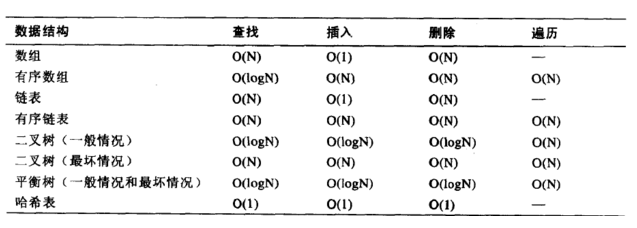

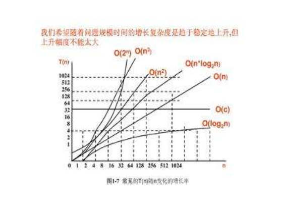


**聚簇索引与非聚簇索引**

聚簇索引并不是一种单独的索引类型，而是一种数据存储方式。

术语‘聚簇’表示数据行和相邻的键值聚簇的存储在一起。

如下图，左侧的索引就是聚簇索引，因为数据行在磁盘的排列和索引排序保持一致。

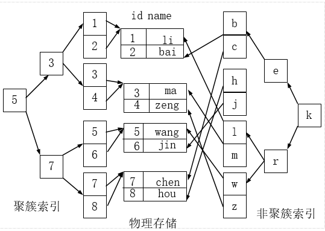

聚簇索引的好处：

按照聚簇索引排列顺序，查询显示一定范围数据的时候，由于数据都是紧密相连，数据库不不用从多个数据块中提取数据，所以节省了大量的io操作。

聚簇索引的限制：

对于mysql数据库目前只有innodb数据引擎支持聚簇索引，而Myisam并不支持聚簇索引。

由于数据物理存储排序方式只能有一种，所以每个Mysql的表只能有一个聚簇索引。一般情况下就是该表的主键。

为了充分利用聚簇索引的聚簇的特性，所以innodb表的主键列尽量选用有序的顺序id，而不建议用无序的id，比如uuid这种。

#### 索引分类

**基本语法**

创建  CREATE INDEX [indexName] ON table_name(column))

删除  DROP INDEX [indexName] ON mytable; 

查看  SHOW INDEX FROM table_name;

使用ALTER命令

```sql
有四种方式来添加数据表的索引：

ALTER TABLE tbl_name ADD PRIMARY KEY (column_list): 
该语句添加一个主键，这意味着索引值必须是唯一的，且不能为NULL。
 
ALTER TABLE tbl_name ADD UNIQUE index_name (column_list):
这条语句创建索引的值必须是唯一的（除了NULL外，NULL可能会出现多次）。
 
ALTER TABLE tbl_name ADD INDEX index_name (column_list): 
添加普通索引，索引值可出现多次。
 
ALTER TABLE tbl_name ADD FULLTEXT index_name (column_list):
该语句指定了索引为 FULLTEXT ，用于全文索引。
```

**单值索引**

即一个索引只包含单个列，一个表可以有多个单列索引

CREATE INDEX [indexName] ON table_name(column))

```sql
随表一起建索引：

CREATE TABLE customer (id INT(10) UNSIGNED  AUTO_INCREMENT ,customer_no VARCHAR(200),customer_name VARCHAR(200),
  PRIMARY KEY(id),
  KEY (customer_name)
);
  
单独建单值索引：

CREATE  INDEX idx_customer_name ON customer(customer_name); 
 
删除索引：

DROP INDEX idx_customer_name  on customer;
```

**唯一索引**

索引列的值必须唯一，但允许有空值

CREATE  UNIQUE  INDEX [indexName] ON table_name(column))

```sql
随表一起建索引：

CREATE TABLE customer (id INT(10) UNSIGNED  AUTO_INCREMENT ,customer_no VARCHAR(200),customer_name VARCHAR(200),
  PRIMARY KEY(id),
  KEY (customer_name),
  UNIQUE (customer_no)
);

单独建唯一索引：

CREATE UNIQUE INDEX idx_customer_no ON customer(customer_no); 
 
删除索引：

DROP INDEX idx_customer_no on customer ;
```

**主键索引**

设定为主键后数据库会自动建立索引，innodb为聚簇索引

```sql
随表一起建索引：

CREATE TABLE customer (id INT(10) UNSIGNED  AUTO_INCREMENT ,customer_no VARCHAR(200),customer_name VARCHAR(200),
  PRIMARY KEY(id) 
);
   
CREATE TABLE customer2 (id INT(10) UNSIGNED   ,customer_no VARCHAR(200),customer_name VARCHAR(200),
  PRIMARY KEY(id) 
);
 
 单独建主键索引：

ALTER TABLE customer 
 add PRIMARY KEY customer(customer_no);  
 
删除建主键索引：

ALTER TABLE customer 
 drop PRIMARY KEY ;  
 
修改建主键索引：

必须先删除掉(drop)原索引，再新建(add)索引
```


**复合索引**

即一个索引包含多个列

```sql
 随表一起建索引：

CREATE TABLE customer (id INT(10) UNSIGNED  AUTO_INCREMENT ,customer_no VARCHAR(200),customer_name VARCHAR(200),
  PRIMARY KEY(id),
  KEY (customer_name),
  UNIQUE (customer_name),
  KEY (customer_no,customer_name)
);
 
单独建索引：

CREATE  INDEX idx_no_name ON customer(customer_no,customer_name); 
 
删除索引：

DROP INDEX idx_no_name  on customer ;
```

#### 创建索引的情况

哪些情况需要创建索引

- 主键自动建立唯一索引

- 频繁作为查询条件的字段应该创建索引

- 查询中与其它表关联的字段，外键关系建立索引

- 单键/组合索引的选择问题， 组合索引性价比更高

- 查询中排序的字段，排序字段若通过索引去访问将大大提高排序速度

- 查询中统计或者分组字段

哪些情况不要创建索引

- 表记录太少

- 经常增删改的表或者字段

	- Why：提高了查询速度，同时却会降低更新表的速度，如对表进行INSERT、UPDATE和DELETE。 因为更新表时，MySQL不仅要保存数据，还要保存一下索引文件
- Where条件里用不到的字段不创建索引

- 过滤性不好的不适合建索引

### Explain

#### 是什么

查看执行计划

使用EXPLAIN关键字可以模拟优化器执行SQL查询语句，从而知道MySQL是
如何处理你的SQL语句的。分析你的查询语句或是表结构的性能瓶颈

#### 能干啥

- 表的读取顺序

- 哪些索引可以使用

- 数据读取操作的操作类型

- <span style = "color:red">哪些索引被实际使用</span>

- 表之间的引用

- <span style = "color:red">每张表有多少行被物理查询</span>

#### 怎么玩

EXPLAIN 加上要查看的完整语句的执行计划

#### 字段的解释

##### id

select查询的序列号,包含一组数字，表示查询中执行select子句或操作表的顺序

三种情况

- id相同，执行顺序由上至下

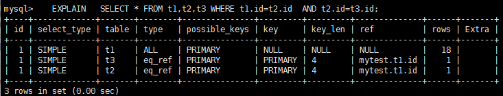

- id不同，如果是子查询，id的序号会递增，id值越大优先级越高，越先被执行

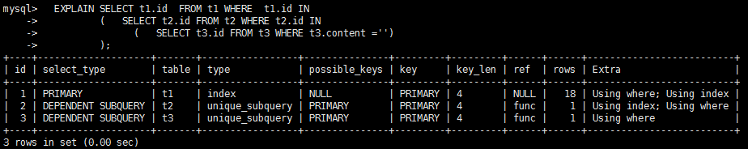

- id相同不同，同时存在。id如果相同，可以认为是一组，从上往下顺序执行；在所有组中，id值越大，优先级越高，越先执行（衍生 = DERIVED）

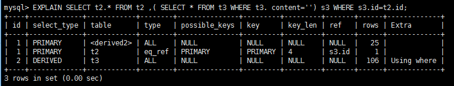

**关注点**：

- id号每个号码，表示一趟独立的查询。一个 sql 的查询趟数越少越好。

##### select_type

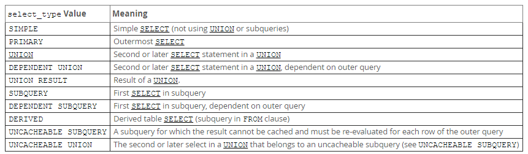

查询的类型，主要是用于区别普通查询、联合查询、子查询等的复杂查询

SIMPLE

- 简单的 select 查询,查询中不包含子查询或者UNION

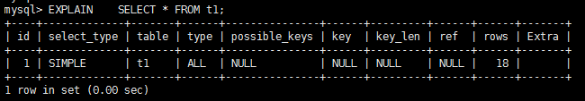

PRIMARY

- 查询中若包含任何复杂的子部分，最外层查询则被标记为Primary


DERIVED

- 在FROM列表中包含的子查询被标记为DERIVED(衍生) MySQL会递归执行这些子查询, 把结果放在临时表里。

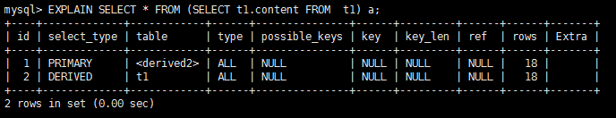

SUBQUERY

- 在SELECT或WHERE列表中包含了子查询

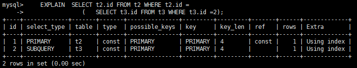

DEPENDENT SUBQUERY

- 依赖子查询，在SELECT或WHERE列表中包含了子查询,子查询基于外层（in）

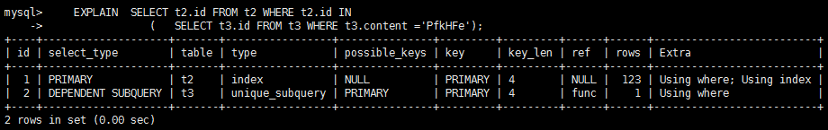

UNCACHEABLE SUBQUREY  

- 不可用缓存的子查询（SQL肯定不一样的）


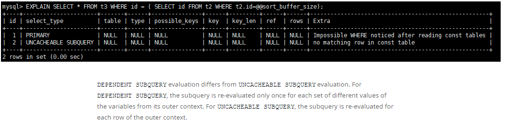

SHOW VARIABLES LIKE '%lower_case_table_names%';

SELECT @@lower_case_table_names FROM DUAL;

出现@@，为MySQL的系统变量
出现@ 为

UNION

- 若第二个SELECT出现在UNION之后，则被标记为UNION； 若UNION包含在FROM子句的子查询中,外层SELECT将被标记为：DERIVED

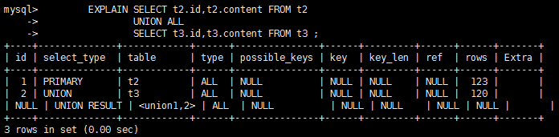

UNION RESULT

- 从UNION表获取结果的SELECT


##### table

- 代表分区表中的命中情况，非分区表，该项为null

##### partitions

- 显示这一行的数据是关于哪张表的

##### type（重要）

避免出现全表扫描

类型：all, index, range, ref, eq_ref, const, system, null

type显示的是访问类型，是较为重要的一个指标，结果值从<span style="color:red">最好到最坏</span>依次是： 

system > const > eq_ref > ref > fulltext > ref_or_null > index_merge > unique_subquery > index_subquery > <span style="color:yellow">range</span> > <span style="color:orange">index</span> > <span style="color:red">ALL</span>

简而言之：system>const>eq_ref>ref>range>index>ALL

一般来说，得保证查询至少达到range级别，最好能达到ref。

system

- 表只有一行记录（等于系统表），这是const类型的特列，平时不会出现，这个也可以忽略不计

const

- 表示通过索引一次就找到了,const用于比较primary key或者unique索引。因为只匹配一行数据，所以很快 如将主键置于where列表中，MySQL就能将该查询转换为一个常量

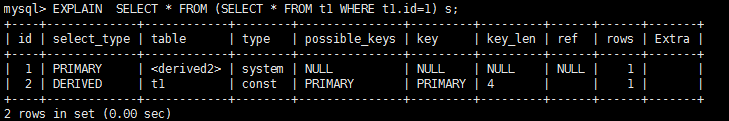

eq_ref

- 唯一性索引扫描，对于每个索引键，表中只有一条记录与之匹配。常见于主键或唯一索引扫描

疑问：为啥t1是all的？

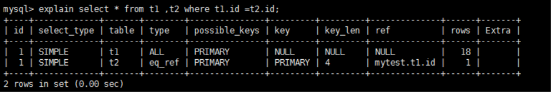

ref

- 非唯一性索引扫描，返回匹配某个单独值的所有行. 本质上也是一种索引访问，它返回所有匹配某个单独值的行，然而， 它可能会找到多个符合条件的行，所以他应该属于查找和扫描的混合体


<span style="color:yellow">range</span>

- 只检索给定范围的行,使用一个索引来选择行。key 列显示使用了哪个索引 一般就是在你的where语句中出现了between、<、>、in等的查询 这种范围扫描索引扫描比全表扫描要好，因为它只需要开始于索引的某一点，而结束语另一点，不用扫描全部索引。

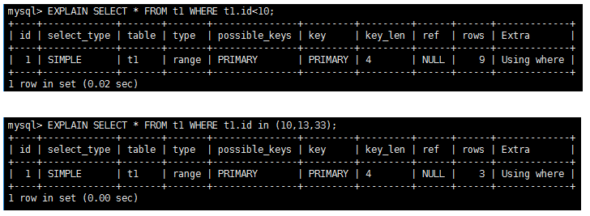

<span style="color:orange">index</span>

- 出现index是sql使用了索引但是没用通过索引进行过滤，一般是使用了覆盖索引或者是利用索引进行了排序分组

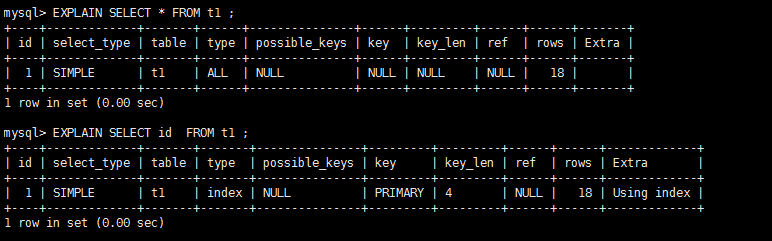

<span style="color:red">all</span>

- Full Table Scan，将遍历全表以找到匹配的行

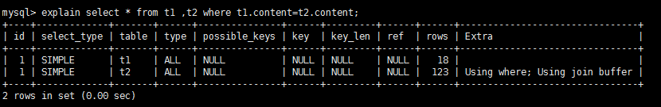

index_merge

- 在查询过程中需要多个索引组合使用，通常出现在有 or 的关键字的sql中

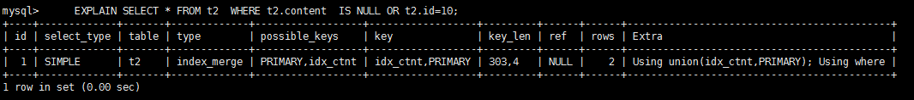

ref_or_null

- 对于某个字段既需要关联条件，也需要null值得情况下。查询优化器会选择用ref_or_null连接查询。

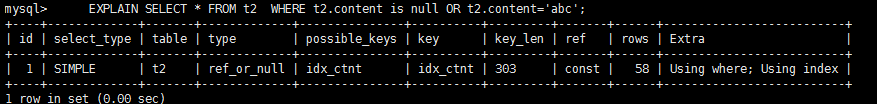

index_subquery

- 利用索引来关联子查询，不再全表扫描。

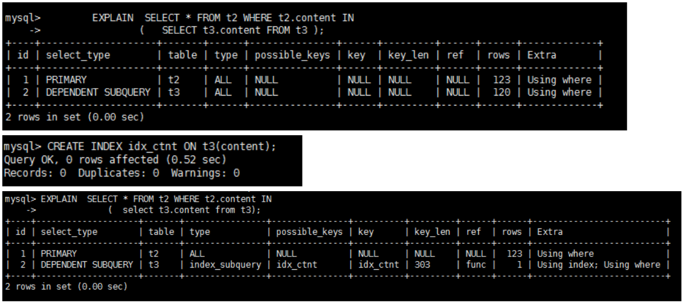

unique_subquery 

- 该联接类型类似于index_subquery。 子查询中的唯一索引

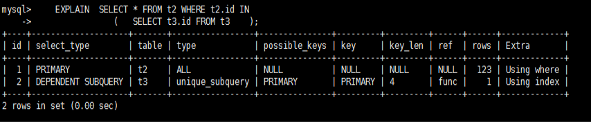

<span style="color:red">备注：一般来说，得保证查询至少达到range级别，最好能达到ref。</span>

##### possible_keys

显示可能应用在这张表中的索引，一个或多个。

查询涉及到的字段上若存在索引，则该索引将被列出，<span style="color:red">但不一定被查询实际使用</span>

##### key

实际使用的索引。如果为NULL，则没有使用索引

查询中若使用了覆盖索引，则该索引和查询的select字段重叠


##### key_len

理解：where 后面的筛选条件命中索引的长度，越大越好

key_len字段能够帮你检查是否充分的利用上了索引

表示索引中使用的字节数，可通过该列计算查询中使用的索引的长度。 

例如：

EXPLAIN SELECT SQL_NO_CACHE * FROM emp WHERE emp.age=30 AND emp.name LIKE 'ab%';

67的（上面的）比较好


如何计算
1、先看索引上字段的类型+长度比如 int=4 ;  varchar(20) =20 ; char(20) =20  
2、如果是varchar或者char这种字符串字段，视字符集要乘不同的值，比如utf-8  要乘 3,GBK要乘2，
3、varchar这种动态字符串要加2个字节
4、 允许为空的字段要加1个字节  

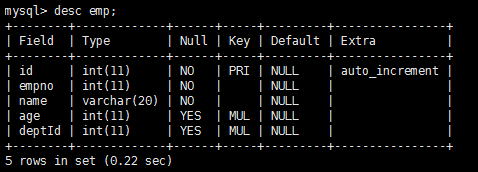

第一组

key_len=age的字节长度+name的字节长度=4+1  + ( 20*3+2)=5+62=67

int本身长度为4（字节），如果可以为null，则+1 ， 所以是5

varchar的长度就是位数20，再看字符集，如果是gbk就 * 2，utf8就 * 3，如果长度可变，就再加 2 

所以是20*3+ 2

第二组

key_len=age的字节长度=4+1=5

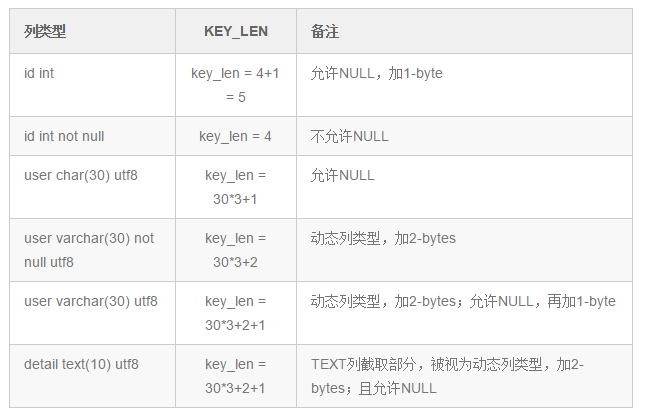

##### ref

显示索引的哪一列被使用了，如果可能的话，是一个常数。哪些列或常量被用于查找索引列上的值

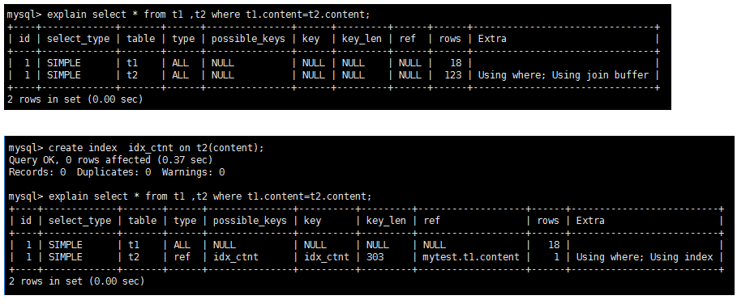

##### rows

rows列显示MySQL认为它执行查询时必须检查的行数。（整个SQL物理扫描的行数，**越少越好**）

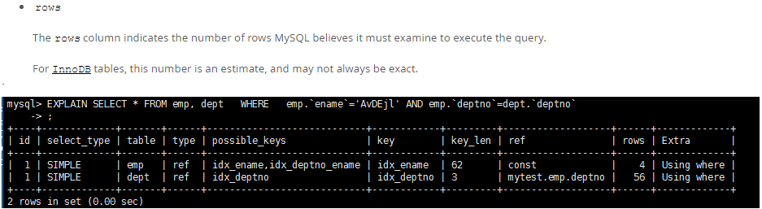

##### filtered

这个字段表示存储引擎返回的数据在server层过滤后，剩下多少满足查询的记录数量的比例，注意是百分比，不是具体记录数

##### Extra

包含不适合在其他列中显示但十分重要的额外信息

<span style="color:red">**Using filesort**（要你命三千！)</span>

说明mysql会对数据使用一个外部的索引排序，而不是按照表内的索引顺序进行读取。 MySQL中无法利用索引完成的排序操作称为“文件排序”，说明order by 没有用上索引

出现了filesort的情况：

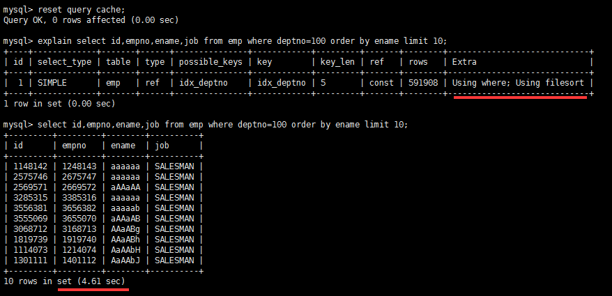

优化后的情况

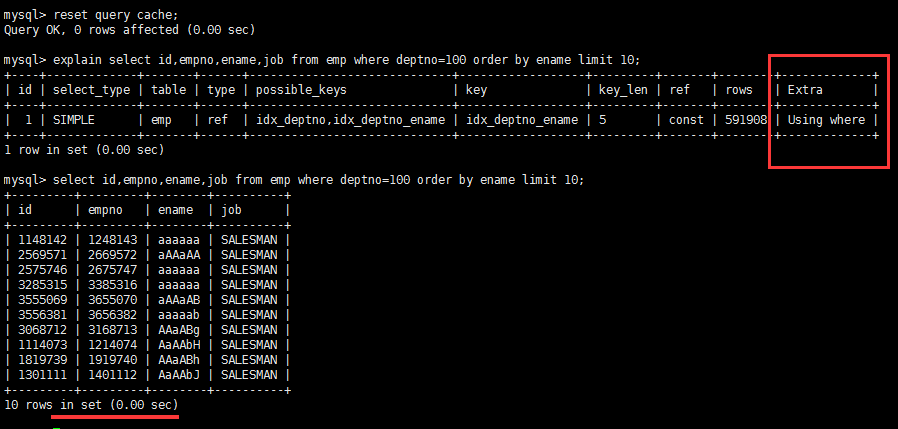

- 查询中排序的字段，排序字段若通过索引去访问将大大提高排序速度

<span style="color:red">**Using temporary（要你命三万！！！！）**</span>

使了用临时表保存中间结果,MySQL在对查询结果排序时使用临时表。（group by没有用上索引）常见于排序 order by 和分组查询 group by。（group by包含一个order by）

优化前存在 using  temporary 和 using  filesort

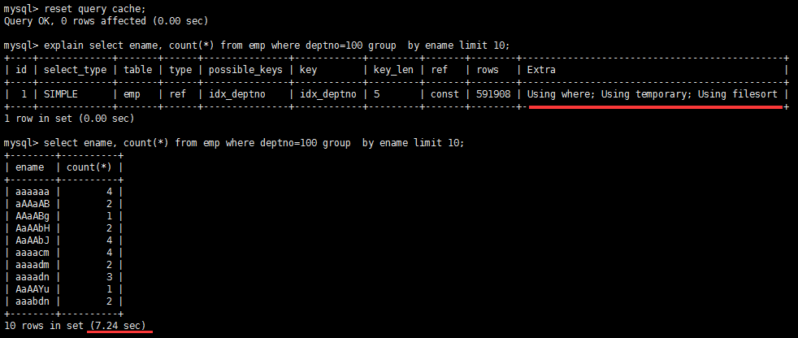

优化前存在的 using  temporary 和 using  filesort 不在，性能发生明显变化：

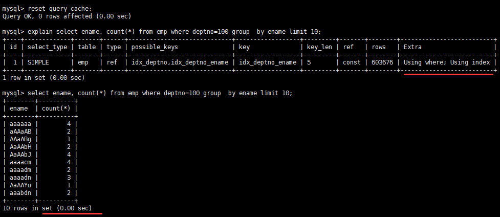

**USING index**

表示相应的select操作中使用了覆盖索引(Covering Index)，避免访问了表的数据行，效率不错！ 如果同时出现using where，表明索引被用来执行索引键值的查找; 如果没有同时出现using where，表明索引只是用来读取数据而非利用索引执行查找。
利用索引进行了排序或分组

**Using where**

表明使用了where过滤

<span style="color:red">**using join buffer**</span>

使用了连接缓存

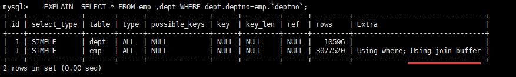

**impossible where**

where子句的值总是false，不能用来获取任何元组，说明SQL写错了。

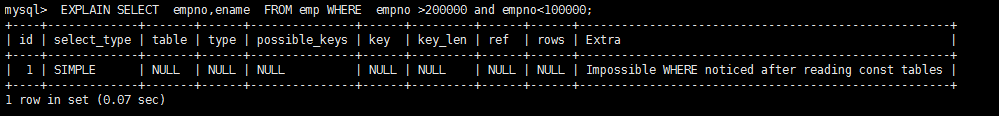

**select tables optimized away**

在没有GROUPBY子句的情况下，基于索引优化MIN/MAX操作或者 对于MyISAM存储引擎优化COUNT(*)操作，不必等到执行阶段再进行计算， 查询执行计划生成的阶段即完成优化。

### 查询优化

#### 批量数据脚本

**【思考题】怎样往一张表中插入数据更快？**

- 一个语句中插入多行数据

- 插入之前，删除除了主键索引之外的所有索引

- 关闭自动提交，使用事务机制

MySQL默认不能自己编写函数，show variables like 'log_bin_trust_function_creators';
执行结果为 0，说明不允许

这时候我们要自己打开，set global log_bin_trust_function_creators=1;

这样设置过后，如果MySQL重启参数就会消失，一劳永逸的方法：

windows下my.ini[mysqld]加上log_bin_trust_function_creators=1 

linux下    /etc/my.cnf下my.cnf[mysqld]加上log_bin_trust_function_creators=1

直接修改配置文件


<span style="color:red"> **所有的有关于sql编程的相关知识都不用看，那是运维人员的事情，和我们无关。在面试的时候可以这样说“运维人员写的时候我看过一些，但是不太了解”** </span>

**建表**

```sql
 CREATE TABLE `dept` (
 `id` INT(11) NOT NULL AUTO_INCREMENT,
 `deptName` VARCHAR(30) DEFAULT NULL,
 `address` VARCHAR(40) DEFAULT NULL,
 ceo INT NULL ,
 PRIMARY KEY (`id`)
) ENGINE=INNODB AUTO_INCREMENT=1 DEFAULT CHARSET=utf8;
 
 
CREATE TABLE `emp` (
 `id` INT(11) NOT NULL AUTO_INCREMENT,
 `empno` INT NOT NULL ,
 `name` VARCHAR(20) DEFAULT NULL,
 `age` INT(3) DEFAULT NULL,
 `deptId` INT(11) DEFAULT NULL,
 PRIMARY KEY (`id`)
) ENGINE=INNODB AUTO_INCREMENT=1 DEFAULT CHARSET=utf8;
```


```sql

#创建名字的函数

DELIMITER $$ #指定函数结束符为 $$，表示输入$$的时候函数结束
CREATE FUNCTION rand_string(n INT) RETURNS VARCHAR(255) #函数名，参数，返回值
BEGIN    #函数开始
DECLARE chars_str VARCHAR(100) DEFAULT 'abcdefghijklmnopqrstuvwxyzABCDEFJHIJKLMNOPQRSTUVWXYZ'; 
#声明一个变量，默认为引号中的字符
 DECLARE return_str VARCHAR(255) DEFAULT '';
#声明要返回的字符串
 DECLARE i INT DEFAULT 0;
 WHILE i < n DO  #开始循环，n是传入的参数，表示字符串的长度
 SET return_str =CONCAT(return_str,SUBSTRING(chars_str,FLOOR(1+RAND()*52),1));  
 SET i = i + 1;
 END WHILE;
 RETURN return_str; #返回名字
END $$ #函数结束
 
#假如要删除
#drop function rand_string;

#------------------------------------

#用于随机产生多少到多少的编号的函数

DELIMITER $$
CREATE FUNCTION  rand_num (from_num INT ,to_num INT) RETURNS INT(11)
BEGIN   
 DECLARE i INT DEFAULT 0;  
 SET i = FLOOR(from_num +RAND()*(to_num -from_num+1));
 #初始值到结束值之间随机生成一个数字
RETURN i;  
 END$$ 
 
#假如要删除
#drop function rand_num;

#------------------------------------

#向emp表中插入数据
DELIMITER $$
CREATE PROCEDURE  insert_emp(START INT ,  max_num INT)
BEGIN  
DECLARE i INT DEFAULT 0;   
SET autocommit = 0;    #把autocommit设置成0  
REPEAT  
SET i = i + 1;  
INSERT INTO emp (empno, NAME ,age ,deptid ) VALUES ((START+i) ,rand_string(6)   , rand_num(30,50),rand_num(1,10000));  
UNTIL i = max_num  
END REPEAT;  
COMMIT;  
END$$ 
 
#删除
# DELIMITER ;
# drop PROCEDURE insert_emp;

#------------------------------------

#执行存储过程，往dept表添加随机数据
DELIMITER $$
CREATE PROCEDURE `insert_dept`(  max_num INT )
BEGIN  
DECLARE i INT DEFAULT 0;   
 SET autocommit = 0;    
 REPEAT  
 SET i = i + 1;  
 INSERT INTO dept ( deptname,address,ceo ) VALUES (rand_string(8),rand_string(10),rand_num(1,500000));  
 UNTIL i = max_num  
 END REPEAT;  
 COMMIT;  
 END$$
 
#删除
# DELIMITER ;
# drop PROCEDURE insert_dept;

 #执行存储过程，往dept表添加1万条数据（3.5秒左右）
DELIMITER ;
CALL insert_dept(10000); 

#执行存储过程，往emp表添加50万条数据（89秒左右）
DELIMITER ;
CALL insert_emp(100000,500000); 

#------------------------------------

#批量删除表上的所有索引

DELIMITER $$
CREATE  PROCEDURE `proc_drop_index`(dbname VARCHAR(200),tablename VARCHAR(200))
BEGIN
       DECLARE done INT DEFAULT 0;
       DECLARE ct INT DEFAULT 0;
       DECLARE _index VARCHAR(200) DEFAULT '';
       DECLARE _cur CURSOR FOR  SELECT   index_name   FROM information_schema.STATISTICS   WHERE table_schema=dbname AND table_name=tablename AND seq_in_index=1 AND    index_name <>'PRIMARY'  ;
       DECLARE  CONTINUE HANDLER FOR NOT FOUND set done=2 ;      
        OPEN _cur;
        FETCH   _cur INTO _index;
        WHILE  _index<>'' DO 
               SET @str = CONCAT("drop index ",_index," on ",tablename ); 
               PREPARE sql_str FROM @str ;
               EXECUTE  sql_str;
               DEALLOCATE PREPARE sql_str;
               SET _index=''; 
               FETCH   _cur INTO _index; 
        END WHILE;
   CLOSE _cur;
   END$$
	 
	 CALL proc_drop_index("dbname","tablename");
```

**如何删除索引**

CREATE X

DROP INDEX idx_xxx ON emp

1 查出该表有哪些索引，索引名-->集合

SHOW INDEX FROM t_emp
元数据：meta DATA  描述数据的数据

SELECT index_name  FROM information_schema.STATISTICS WHERE table_name='t_emp' AND table_schema='mydb'
 AND index_name <>'PRIMARY' AND seq_in_index = 1

2 如何循环集合
 CURSOR 游标
 FETCH xxx INTO xxx

3 如何让mysql执行一个字符串
PREPARE 预编译 XXX

EXECUTE

CALL proc_drop_index ('mydb','t_emp');

#### 单表索引及索引失效

在产品经理提出了一个几乎不可能实现的需求的时候，我们能做的是尽量把选择权交到产品经理手中。比如：

“在我们的项目中添加一个功能：能够显示或者查询不等于某个值的数据条目。”

“这个功能是可以实现的，但是在实现之后，在查询的时候会变慢，慢很多，这个是系统特性的问题，您说我们是做还是不做呢？”

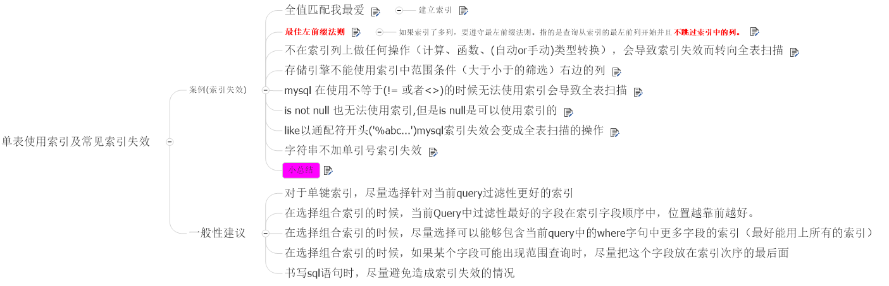

**单表索引的查询原理**

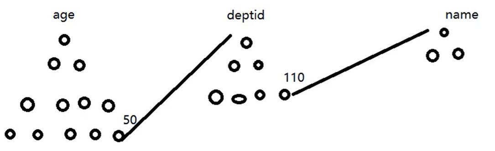

**索引失效的案例**

**全值匹配我最爱--建立索引**

 系统中经常出现的sql语句如下： 
```sql 
EXPLAIN SELECT SQL_NO_CACHE * FROM emp WHERE emp.age=30;

EXPLAIN SELECT SQL_NO_CACHE * FROM emp WHERE emp.age=30 and deptid=4;

EXPLAIN SELECT SQL_NO_CACHE * FROM emp WHERE emp.age=30 and deptid=4 AND emp.name = 'abcd';
```
索引应该如何建立 ？

`CREATE INDEX idx_age_deptid_name ON emp(age,deptid,NAME)`

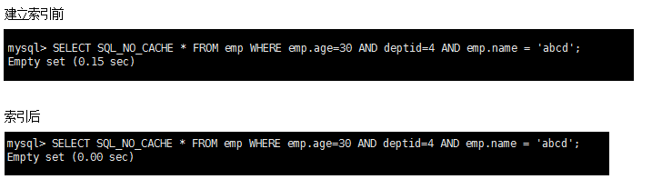

**最佳左前缀法则**
如果索引了多列，要遵守最左前缀法则。指的是查询从索引的最左前列开始并且不跳过索引中的列。

如果系统经常出现的sql如下：

`EXPLAIN SELECT SQL_NO_CACHE * FROM emp WHERE emp.age=30   AND emp.name = 'abcd'`

或者

`EXPLAIN SELECT SQL_NO_CACHE * FROM emp WHERE emp.deptid=1   AND emp.name = 'abcd'`

那原来的idx_age_deptid_name 还能否正常使用？

建立索引：
`EXPLAIN SELECT SQL_NO_CACHE * FROM emp WHERE emp.age=30   AND emp.name = 'abcd'`

情况1：

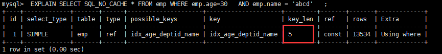

虽然可以正常使用，但是只有部分被使用到了。

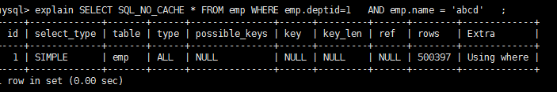

完全没有使用上索引。

结论：过滤条件要使用索引必须按照索引建立时的顺序，依次满足，一旦跳过某个字段，索引后面的字段都无法被使用。


**不在索引列上做任何操作（计算、函数、(自动or手动)类型转换），会导致索引失效而转向全表扫描**

在有索引的情况下这两条sql哪种写法更好

`EXPLAIN  SELECT SQL_NO_CACHE * FROM emp WHERE   emp.name  LIKE 'abc%' `

`EXPLAIN   SELECT SQL_NO_CACHE * FROM emp WHERE   LEFT(emp.name,3)  = 'abc'`

情况1：

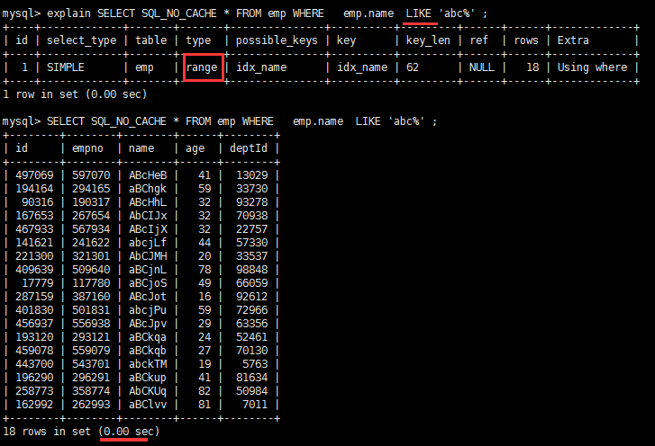

情况2：

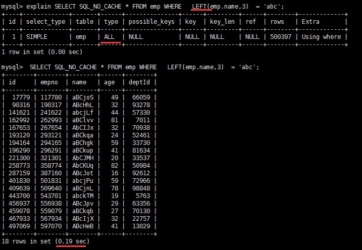

显然第一种更好

**存储引擎不能使用索引中范围条件（大于小于的筛选）右边的列**

如果系统经常出现的sql如下：

`EXPLAIN SELECT  SQL_NO_CACHE * FROM emp WHERE emp.age=30 AND emp.deptId>20 AND emp.name = 'abc' ;`


那么索引 idx_age_deptid_name这个索引还能正常使用么？

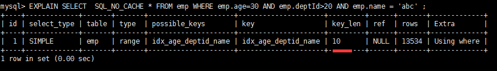

如果这种sql 出现较多
应该建立： 

`create index idx_age_name_deptid on emp(age,name,deptid)`

效果

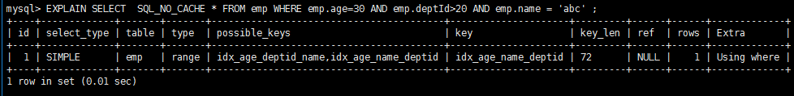

**mysql 在使用不等于(!= 或者<>)的时候无法使用索引会导致全表扫描**

`CREATE INDEX idx_name ON emp(NAME)`

`EXPLAIN SELECT SQL_NO_CACHE * FROM emp WHERE   emp.name <>  'abc' `

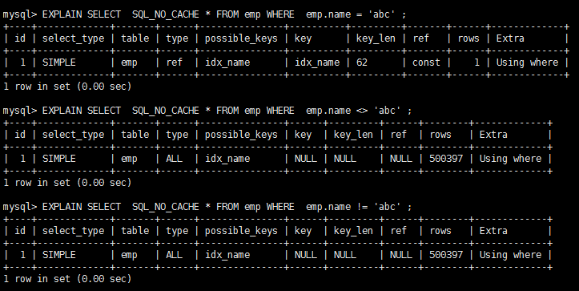

**is not null 也无法使用索引,但是is null是可以使用索引的**

`UPDATE emp SET age =NULL WHERE id=123456;`

下列哪个sql语句可以用到索引

`EXPLAIN SELECT * FROM emp WHERE age IS NULL`

`EXPLAIN SELECT * FROM emp WHERE age IS NOT NULL`

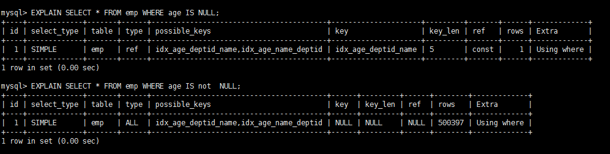

**like以通配符开头('%abc...')mysql索引失效会变成全表扫描的操作**

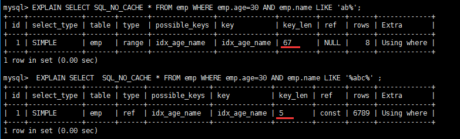

**字符串不加单引号索引失效**

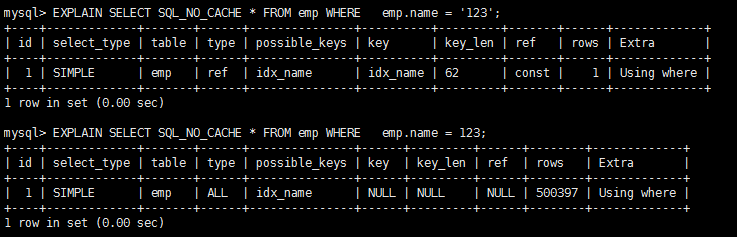

小总结

假设`index(a,b,c)`

|where语句|索引是否被使用|
|---------|----------|
|where a = 3|	Y,使用到a|
|where a = 3 and b = 5|	Y,使用到a，b|
|where a = 3 and b = 5 and c = 4|	Y,使用到a,b,c|
|where b = 3 或者 where b = 3 and c = 4  或者 where c = 4	|N|
|where a = 3 and c = 5	|使用到a， 但是c不可以，b中间断了|
|where a = 3 and b > 4 and c = 5	|使用到a和b， c不能用在范围之后，b断了|
|where a is null and b is not null  |	  is null 支持索引 但是is not null 不支持,所以 a 可以使用索引,但是  b不可以使用|
|where a <> 3   |	 不能使用索引|
|where   abs(a) =3	|不能使用 索引|
|where a = 3 and b like 'kk%' and c = 4	|Y,使用到a,b,c|
|where a = 3 and b like '%kk' and c = 4|	Y,只用到a|
|where a = 3 and b like '%kk%' and c = 4|	Y,只用到a|
|where a = 3 and b like 'k%kk%' and c = 4	|Y,使用到a,b,c（首字母都能用上）|


**一般性建议**

- 对于单键索引，尽量选择针对当前query过滤性更好的索引

- 在选择组合索引的时候，当前Query中过滤性最好的字段在索引字段顺序中，位置越靠前越好。

- 在选择组合索引的时候，尽量选择可以能够包含当前query中的where字句中更多字段的索引（最好能用上所有的索引）

- 在选择组合索引的时候，如果某个字段可能出现范围查询时，尽量把这个字段放在索引次序的最后面

- 书写sql语句时，尽量避免造成索引失效的情况

#### 关联/子查询查询优化


**关联查询优化**

建表语句

```sql
 
CREATE TABLE IF NOT EXISTS `class` (
`id` INT(10) UNSIGNED NOT NULL AUTO_INCREMENT,
`card` INT(10) UNSIGNED NOT NULL,
PRIMARY KEY (`id`)
);
CREATE TABLE IF NOT EXISTS `book` (
`bookid` INT(10) UNSIGNED NOT NULL AUTO_INCREMENT,
`card` INT(10) UNSIGNED NOT NULL,
PRIMARY KEY (`bookid`)
);

INSERT INTO class(card) VALUES(FLOOR(1 + (RAND() * 20))); #20个这句话
INSERT INTO book(card) VALUES(FLOOR(1 + (RAND() * 20)));  #20个这句话
```

**案例**

```sql
# 下面开始explain分析
EXPLAIN SELECT * FROM class LEFT JOIN book ON class.card = book.card;
#结论：type 有All
 
# 添加索引优化
ALTER TABLE `book` ADD INDEX Y ( `card`);
 
#换成inner join
 
delete from class where id<5;
 
# 第2次explain
EXPLAIN SELECT * FROM class LEFT JOIN book ON class.card = book.card;
#可以看到第二行的 type 变为了 ref,rows 也变成了优化比较明显。
#这是由左连接特性决定的。LEFT JOIN 条件用于确定如何从右表搜索行,左边一定都有,
#所以右边是我们的关键点,一定需要建立索引。
 
# 删除旧索引 + 新建 + 第3次explain
DROP INDEX Y ON book;
ALTER TABLE class ADD INDEX X (card);
EXPLAIN SELECT * FROM class LEFT JOIN book ON class.card = book.card;
```

建议

1、保证被驱动表的join字段已经被索引。

2、left join 时，选择小表作为驱动表，大表作为被驱动表。

3、inner join 时，mysql会自己帮你把小结果集的表选为驱动表。

4、子查询尽量不要放在被驱动表，有可能使用不到索引。

5、能够直接多表关联的尽量直接关联，不用子查询。

**子查询优化**

尽量不要使用 not in  或者 not exists

取所有不为掌门人的员工，按年龄分组 ，每个年龄段多少人

` SELECT SQL_NO_CACHE age,count(*)  FROM emp a WHERE  id  NOT  IN(SELECT ceo FROM dept b2 WHERE ceo IS NOT NULL) group by age  having count(*)<10000`

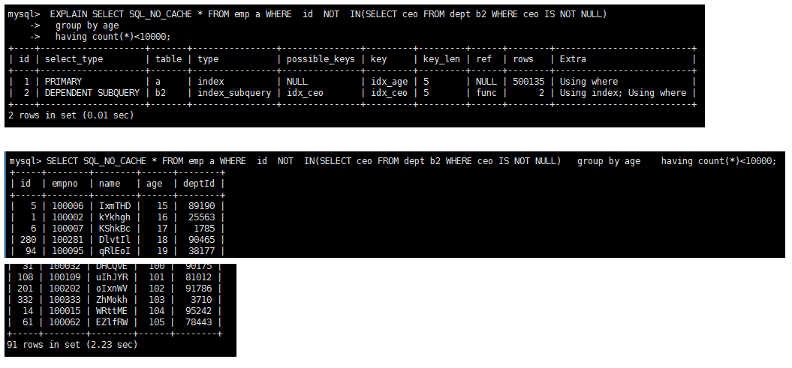


用left outer join  on  xxx is null 替代

`  EXPLAIN SELECT SQL_NO_CACHE age,count(*) FROM  emp a LEFT OUTER JOIN dept b ON a.id =b.ceo  WHERE    b.ceo IS   NULL  group by age   having count(*)<10000`

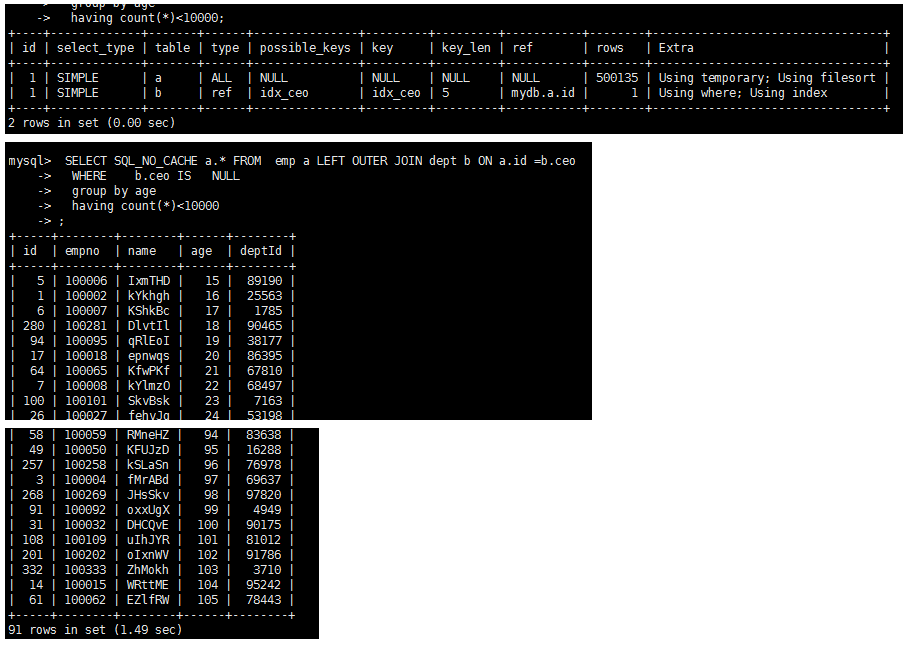

inner join ， MySQL自己选择驱动表和被驱动表，优先将有索引的设置为被驱动表（比较好）

