> 来源：[bilibili-狂神说java - Docker最新超详细版教程通俗易懂](https://www.bilibili.com/video/BV1og4y1q7M4)

#后端/docker 

## 概述

**Docker为什么出现？**


Docker的思想来自于集装箱；

JRE – 多个应用（端口冲突）-- 原来都是交叉的！

隔离 ： Docker核心思想，打包装箱，每个箱子是互相隔离的。

Docker通过隔离机制，可以将服务器利用到极致！

**Docker的历史**

Docker 是 PaaS 提供商 dotCloud 开源的一个基于 LXC 的高级容器引擎，源代码托管在 Github 上, 基于go语言并遵从Apache2.0协议开源。

**Docker能做什么？**

> 之前的虚拟机技术

[[虚拟机]]技术的缺点：

1. 资源占用十分多
2. 冗余步骤多

> 容器化技术

[[容器化]]技术不是模拟一个完整的操作系统


比较Docker和虚拟机技术的不同：

- 传统虚拟机，虚拟出一套硬件，运行一个完整的操作系统，然后在这个系统上安装和运行软件

- Docker容器内的应用直接运行在宿主机的内核，容器没有自己的内核，也没有虚拟我们的硬件，所以就轻便了

- 每个容器间是相互隔离，每个容器都有一个属于自己的文件系统，互不影响

> [[DevOps]]（开发即运维）

**应用更快速的交付和部署**

传统：一堆帮助文档，安装程序

Docker : 打包镜像发布测试，一键运行

**更快捷的升级和扩容**

使用了Docker之后，我们部署应用就和搭积木一样！

项目打包为一个镜像

**更简单的系统运维**

在容器化之后，我们的开发，测试环境都是高度一致的

**更高效的计算资源利用**

Docker是内核级别的虚拟化，可以在一个物理机上运行很多的容器实例，服务器的性能可以被压榨到极致。

## Docker安装

### Docker基本组成

**镜像（image）**

docker镜像就好比是一个模板，可以通过这个模板来创建容器服务。

tomcat镜像 ==> run ==> tomcat容器（提供服务）

通过这个镜像可以创建多个容器（最终运行或者项目运行都是在容器中的）。

**容器（container）**

Docker利用容器技术，独立运行一个或者一组应用，是通过镜像来创建的。

有启动，停止，删除等Linux基本指令！

目前就可以把这个容器理解为一个简易的Linux系统

**仓库（repository）**

仓库就是存放镜像的地方，分为私有仓库和公有仓库；

Docker Hub（默认是国外的）

阿里云都有容器服务器（配置镜像加速！）


### 安装

查看服务器环境，系统环境是 3.10 以上的。

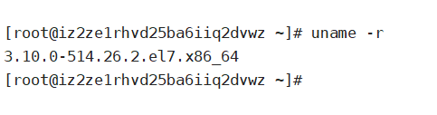

查看系统信息

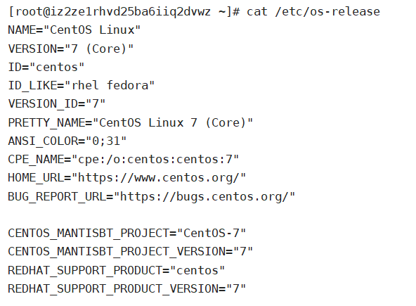

**开始安装**

#后端/docker/环境配置

帮助文档：https://docs.docker.com/engine/install/centos/

1. 卸载旧版本

   ```bash
   yum remove docker \
                     docker-client \
                     docker-client-latest \
                     docker-common \
                     docker-latest \
                     docker-latest-logrotate \
                     docker-logrotate \
                     docker-engine
   ```

2. 安装相关的安装包

   ```bash
   yum install -y yum-utils
   ```

3. 设置镜像仓库, 最好用阿里云的

   ```bash
   yum-config-manager --add-repo http://mirrors.aliyun.com/docker-ce/linux/centos/docker-ce.repo
   ```

4. 更新yum的索引

   ```bash
   yum makecache faster
   ```

5. 安装最新版的docker引擎

   ```bash
   yum install docker-ce docker-ce-cli containerd.io
   ```

6. 启动docker

   ```bash
   systemctl start docker
   ```

7. 查看版本信息

   ```bash
   docker version
   ```

   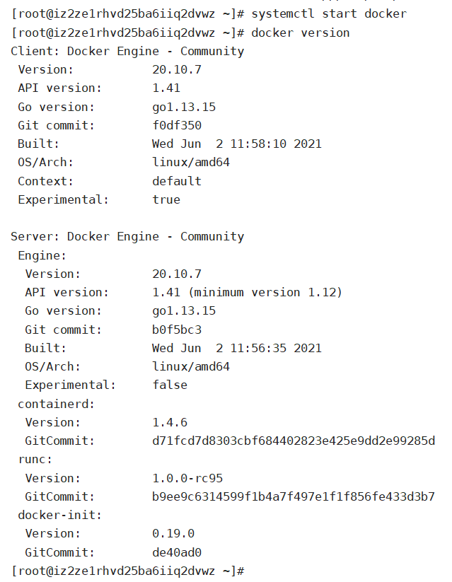


   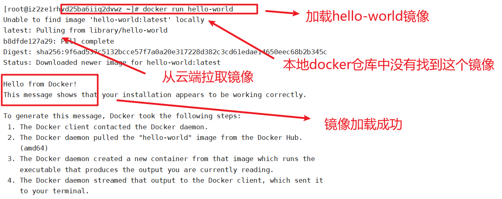

9. 查看本地镜像 `docker images` 我们最终的服务都要打包成镜像运行

   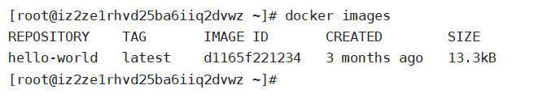


了解 ： 卸载docker

```bash
# 1、依赖卸载
yum remove docker-ce docker-ce-cli containerd.io

# 2、删除资源
rm -rf /var/lib/docker

# /var/lib/docker docker的默认工作路径
```

### 阿里云镜像加速服务

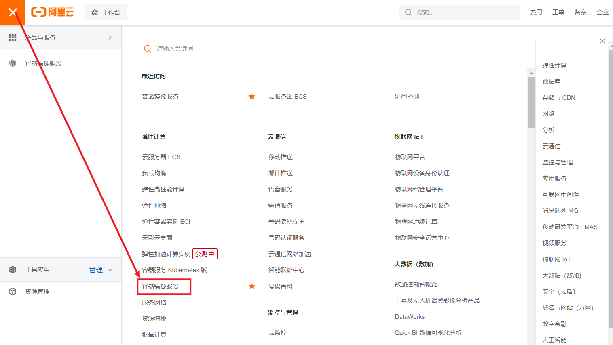

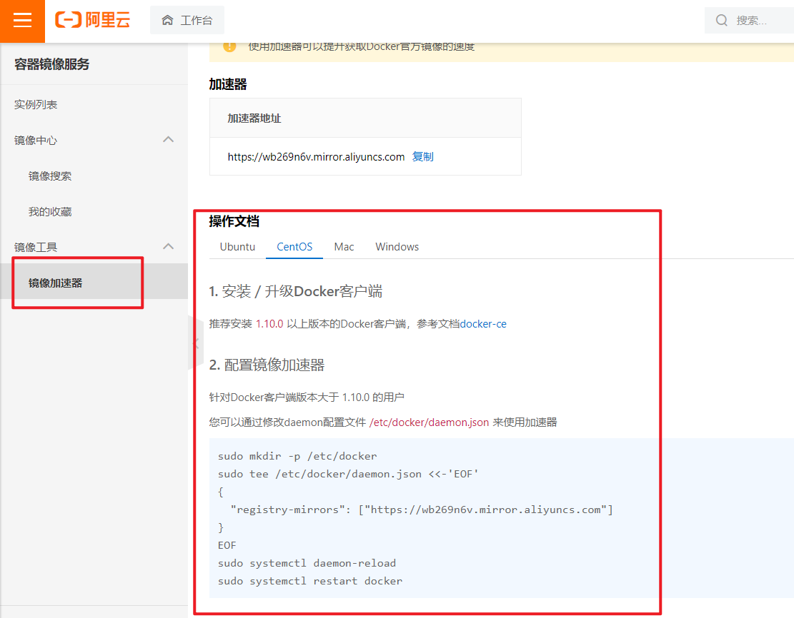

### 回顾HelloWorld流程

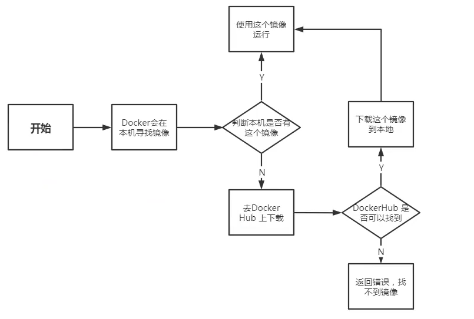


### Portainer

密码 ：`12345678`


### 底层原理

**Docker是怎么工作的？**

Docker是一个Client-Server结构的系统，Docker的守护进程运行在主机上，通过Socket从客户端访问！

DockerServer接收到Docker-Client的指令，就会执行这个命令！

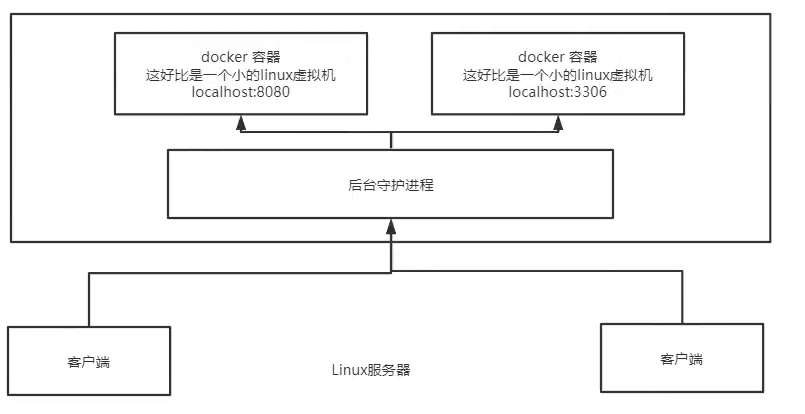

**Docker为什么比VM快？**

1. Docker有着比虚拟机更少的抽象层
2. Docker利用的是宿主机的内核，VM需要的是Guest OS

所以说，新建一个容器的时候，docker不需要像虚拟机一样重新加载一个操作系统内核，避免引导。虚拟机是加载Guset OS , 分钟级别的，而docker是利用宿主机的操作系统，省略了这个复杂的过程，秒级。


## Docker常用命令

### 帮助命令

```bash
docker version      # 显示docker的版本信息
docker info         # 显示docker的系统信息，包括镜像和容器的数量
docker 命令 --help   # 帮助命令
```

帮助文档的地址：https://docs.docker.com/reference/

### 镜像命令

> docker images 查看所有本地主机上的镜像

```bash
docker images

REPOSITORY    TAG       IMAGE ID       CREATED        SIZE
hello-world   latest    d1165f221234   3 months ago   13.3kB


# 解释
REPOSITORY  镜像的仓库源
TAG         镜像的标签
IMAGE ID    镜像的id
CREATED     镜像的创建时间

# 可选项
	-a, --all      # 列出所有的镜像
	-q, --quiet    # 只显示镜像的id
```

> docker serch 在dockhub中搜索镜像

```bash
[root@iz2ze1rhvd25ba6iiq2dvwz ~]# docker search mysql
NAME                              DESCRIPTION                                     STARS     OFFICIAL   AUTOMATED
mysql                             MySQL is a widely used, open-source relation…   11038     [OK]       

# 可选项
--filter , -f		Filter output based on conditions provided

docker search mysql -f=stars=5000
```

> docker pull 下载镜像

```bash
# 下载镜像 docker pull 镜像名[:tag]
[root@AlibabaECS ~]# docker pull mysql
Using default tag: latest # 如果不写tag,默认就是latest
latest: Pulling from library/mysql 
bf5952930446: Pull complete # 分层下载，docker image的核心 联合文件系统
8254623a9871: Pull complete 
938e3e06dac4: Pull complete 
ea28ebf28884: Pull complete 
f3cef38785c2: Pull complete 
894f9792565a: Pull complete 
1d8a57523420: Pull complete 
6c676912929f: Pull complete 
ff39fdb566b4: Pull complete 
fff872988aba: Pull complete 
4d34e365ae68: Pull complete 
7886ee20621e: Pull complete 
Digest: sha256:c358e72e100ab493a0304bda35e6f239db2ec8c9bb836d8a427ac34307d074ed # 签名
Status: Downloaded newer image for mysql:latest
docker.io/library/mysql:latest # 真实地址

# 两条命令等价
docker pull mysql
docker.io/library/mysql:latest

# 指定版本下载
docker pull mysql:5.7

[root@AlibabaECS ~]# docker pull mysql:5.7
5.7: Pulling from library/mysql
bf5952930446: Already exists  # 前面的很多文件已经存在了，就不用重新下载了
8254623a9871: Already exists  # 这是Docker中非常重要的一个特性 —— 分层文件系统
938e3e06dac4: Already exists 
ea28ebf28884: Already exists 
f3cef38785c2: Already exists 
894f9792565a: Already exists 
1d8a57523420: Already exists 
5f09bf1d31c1: Pull complete 
1b6ff254abe7: Pull complete 
74310a0bf42d: Pull complete 
d398726627fd: Pull complete 
Digest: sha256:da58f943b94721d46e87d5de208dc07302a8b13e638cd1d24285d222376d6d84
Status: Downloaded newer image for mysql:5.7
docker.io/library/mysql:5.7
```

> docker rmi 删除镜像

```bash
docker rmi -f 镜像id                # 删除指定的镜像
docker rmi -f  镜像id 镜像id 镜像id  # 删除多个镜像
docker rmi -f $(docker images -aq) # 删除全部镜像
```

### 容器命令

```bash
docker run  镜像id #新建容器并启动
docker ps   #列出所有运行的容器 docker container list
docker rm   容器id #删除指定容器
docker start 容器id #启动容器
docker restart容器id #重启容器
docker stop  容器id #停止当前正在运行的容器
docker kill  容器id #强制停止当前容器
```

下载一个centOS镜像来测试学习

```bash
docker pull centos
```

> 新建容器并启动

 ```bash
docker run [可选参数] image

# 参数说明
--name = "Name"    容器名字  tomcat01，tomcat02,用来区分容器
-d                 后台方式运行
-it                使用交互方式运行，进入容器查看区分
-p                 指定容器的端口 -p 8080：8080
    -p ip:主机端口：容器端口
    -p 主机端口：容器端口(常用)
    -p 容器端口
    容器端口
-P                 随机指定端口
 ```

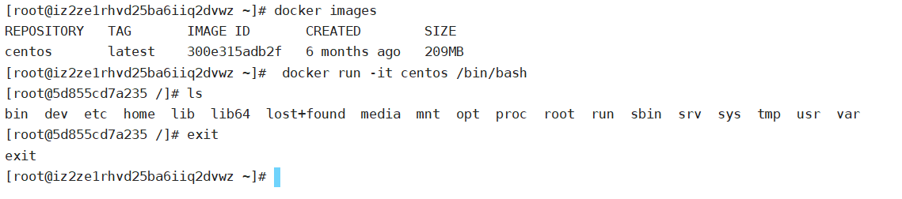

镜像里面的命令有很多都是不完善的

**列出所有的运行中的容器**

```bash
# docker ps 命令
			 # 列出当前正在运行的容器
	-a   # 列出当前正在运行的容器+带出历史运行过的容器
  -n=? # 显示最近创建的容器
  -q   # 只显示容器的编号


# 列出所有运行过和运行中的容器
docker ps -a

```

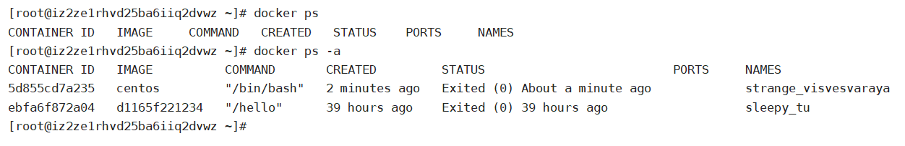

> 退出容器

```bash
exit            # 直接容器停止并退出
Ctrl + P + Q    # 容器不停止退出
```

![[Docker.imgs/image-20210627102445188.png]]
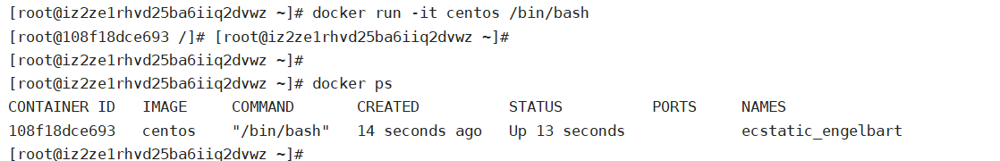

> 删除容器

```bash
docker rm 容器id                  # 删除指定容器，不能删除正在运行的容器，如果要强制删除 rm -f
docker rm -f $(docker ps -aq)    # 删除所有的容器
docker ps -aq|xargs docker rm    # 删除所有的容器
```

> 启动和停止容器

```bash
docker start 容器id        # 启动容器
docker restart 容器id      # 重启容器
docker stop 容器id         # 停止当前正在运行的容器
docker kill 容器id         # 强制停止当前容器
```

### 常用其他命令

> 后台启动容器

```bash
# 命令 docker run -d 镜像名
docker run -d centos
```

问题docker ps, 发现 centos 停止了

常见的坑, **docker容器使用后台运行，就必须要有一个前台进程，docker发现没有应用，就会自动停止**

nginx,容器启动后，发现自己没有提供服务，就会立刻停止，就是没有程序了

> 查看日志命令

```bash
docker logs -f -t --tail 容器id，没有日志

# 自己编写一段shell脚本
docker run -d centos /bin/sh -c "while true;do echo kuangshen;sleep 1;done"

# 显示日志
-tf                # 显示日志
--tail number      # 要显示的日志条数

docker logs -ft --tail f1178d5b0bd8
```

如果当前没有运行日志，则在执行了命令之后会出现如下情况：

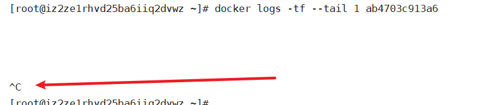

查找不到日志，那我们手动编写shell脚本在容器中运行，生成日志

```bash
docker run -d centos /bin/sh -c "while true;do echo helloworld; sleep 1;done"
```

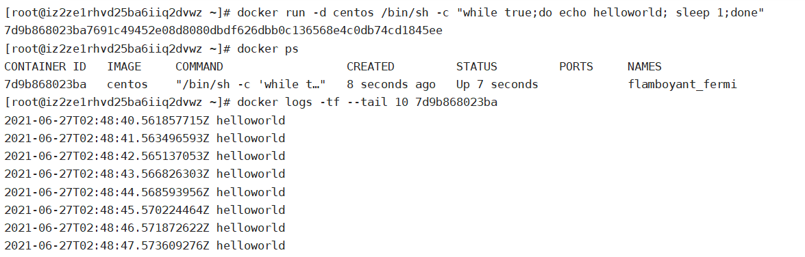

如上图所示，正在执行并生成日志

> 查看容器中的进程信息

```bash
# 命令 docker top 容器id

[root@AlibabaECS /]# docker top f1178d5b0bd8
UID                 PID                 PPID                C                   STIME               TTY                 TIME                CMD
root                21626               21609               0                   while true;do echo kuangshen;sleep 1;done
root                27492               21626               0                   13:15               ?                   00:00:00            
```

> 查看镜像元数据

```bash]
docker inspect 容器id
```

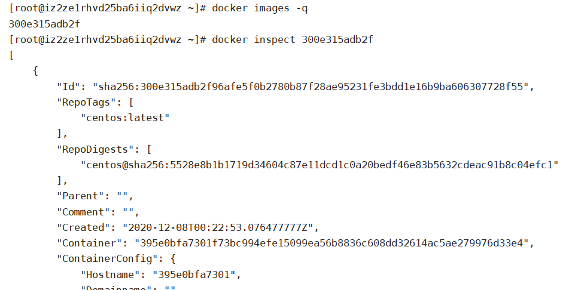

> 进入当前**正在运行**的容器
>
> 再次注意：**docker容器使用后台运行，就必须要有一个前台进程，docker发现没有应用，就会自动停止**, 容器启动后，发现自己没有提供服务，就会立刻停止，就是没有程序了

```bash
# 方式一
docker exec -it  容器id /bin/bash
# 方式二
docker attach 容器id
```

两种方式的区别：

- exec是新开一个终端进去

- attach是直接进去正在运行的终端

> 从容器内拷贝到主机上

```bash
# 命令
docker cp [r] 容器id :容器内路径 目的地主机路径
# 参数r : 递归拷贝
# 测试
docker cp a485a9d900b4:/home/test.java /home
```

### 总结和作业

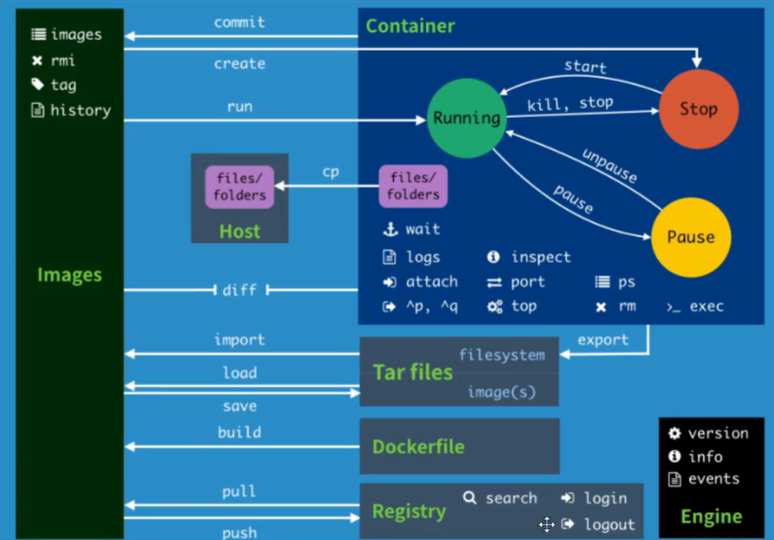

端口暴露：

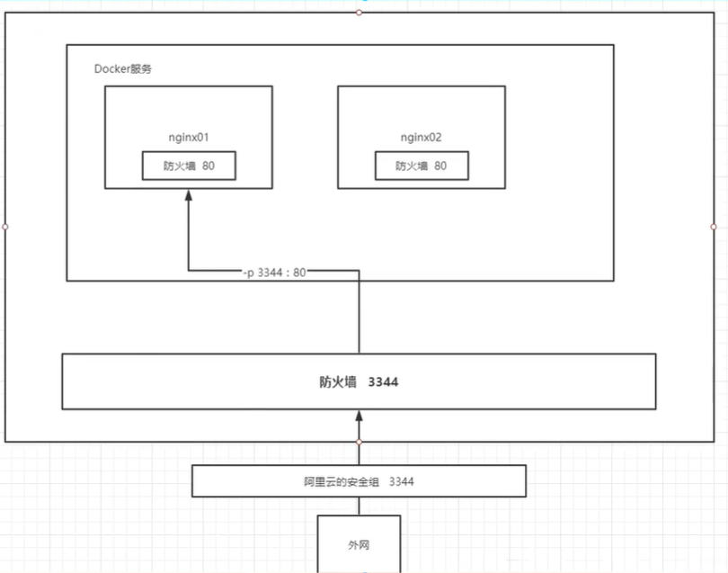

从外网访问docker服务需要从外到里经过： 阿里云的安全组、Linux服务器防火墙、Docker服务器防火墙

我们把docker服务的端口打开、Linux服务器的防火墙打开、阿里云的安全组也打开

建立端口 - docker服务之间的映射

就可以从外部网络直接访问docker服务了

**作业：在docker中部署tomcat**

下载镜像

```bash
docker pull tomcat :9.0
```

启动

```bash
docker run -d -p 3389:8080 --name tomcat01 tomcat:9.0
```

- -d 后台启动
- -p 端口暴露，把tomcat的8080端口映射到主机的3389端口
- --name 别名为 tomcat01
- 使用镜像 tomcat:9.0 , 不加9.0默认使用最新的

启动之后是找不到网页的，说明已经部署完成了，但是无法访问,我们进入容器看一下:

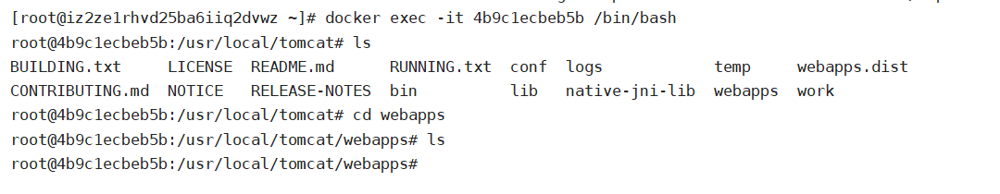

发现webapps里面是空的,并且不支持部分linux命令

原因: 阿里云的镜像是默认最小的,所有的不必要的文件都去掉了

所有webapps里面的文件都在webapp.dist中,我们可以复制过去或者剪切过去

等一段时间,再次访问.

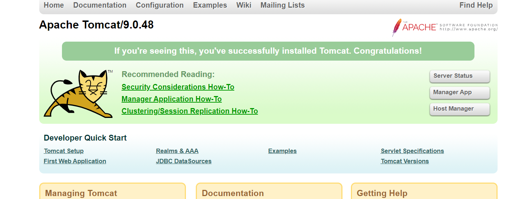

成功.

`docker stats `查看cpu的状态

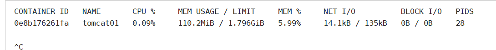

## Docker 镜像讲解

### UnionFS（联合文件系统）

- 联合文件系统（[[UnionFS]]）是一种分层、轻量级并且高性能的文件系统，它支持对文件系统的修改作为一次提交来一层层的叠加，同时可以将不同目录挂载到同一个虚拟文件系统下。联合文件系统是 Docker 镜像的基础。镜像可以通过分层来进行继承，基于基础镜像（没有父镜像），可以制作各种具体的应用镜像。
- 特性：一次同时加载多个文件系统，但从外面看起来只能看到一个文件系统。联合加载会把各层文件系统叠加起来，这样最终的文件系统会包含所有底层的文件和目录。

### 镜像加载原理

Docker的镜像实际由一层一层的文件系统组成：

- bootfs（boot file system）主要包含bootloader和kernel。bootloader主要是引导加载kernel，完成后整个内核就都在内存中了。此时内存的使用权已由bootfs转交给内核，系统卸载bootfs。可以被不同的Linux发行版公用。

- rootfs（root file system），包含典型Linux系统中的/dev，/proc，/bin，/etc等标准目录和文件。rootfs就是各种不同操作系统发行版（Ubuntu，Centos等）。因为底层直接用Host的kernel，rootfs只包含最基本的命令，工具和程序就可以了。

- 分层理解

所有的Docker镜像都起始于一个基础镜像层，当进行修改或增加新的内容时，就会在当前镜像层之上，创建新的容器层。
容器在启动时会在镜像最外层上建立一层可读写的容器层（R/W），而镜像层是只读的（R/O）。

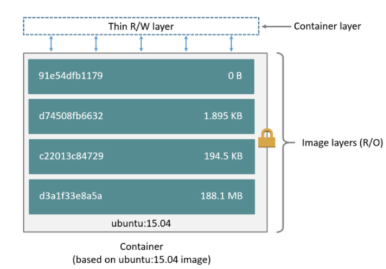


所有的 Docker镜像都起始于一个基础镜像层，当进行修改或者增加加新的内容时，就会在当前镜像层之上，创建新的镜像层。

举一个简单的例子，假如基于 Ubuntu Linux16.04创建一个新的镜像，这就是新镜像的第一层；如果在该镜像中添加 Python包，就会在基础镜像层之上创建第二个镜像层；如果继续添加一个安全补丁，就会创健第三个镜像层该像当前已经包含3个镜像层，如下图所示（这只是一个用于演示的很简单的例子）。

在添加额外的镜像层的同时，镜像始终保持是当前所有镜像的组合，理解这一点非常重要。下图中举了一个简单的例子，每个镜像层包含3个文件，而镜像包含了来自两个镜像层的6个文件。

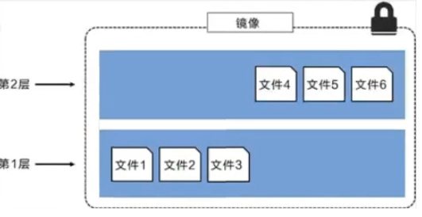

上图中的镜像层跟之前图中的略有区別，主要目的是便于展示文件

下图中展示了一个稍微复杂的三层镜像，在外部看来整个镜像只有6个文件，这是因为最上层中的文件7是文件5的一个更新版

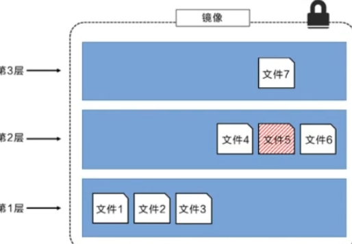

这种情況下，上层镜像层中的文件覆盖了底层镜像层中的文件。这样就使得文件的更新版本作为一个新镜像层添加到镜像当中

Docker通过存储引擎（新版本采用快照机制）的方式来实现镜像层堆栈，并保证多镜像层对外展示为统一的文件系统

Linux上可用的存储引撃有AUFS、 Overlay2、 Device Mapper、Btrfs以及ZFS。顾名思义，每种存储引擎都基于 Linux中对应的
件系统或者块设备技术，井且每种存储引擎都有其独有的性能特点。

Docker在 Windows上仅支持 windowsfilter 一种存储引擎，该引擎基于NTFS文件系统之上实现了分层和CoW [1]。

下图展示了与系统显示相同的三层镜像。所有镜像层堆并合井，对外提供统一的视图

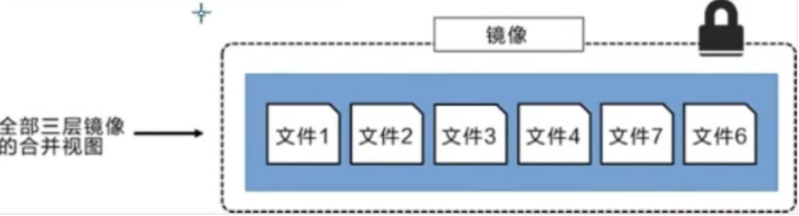


### 提交镜像

步骤：

> 1. 启动一个默认的tomcat
> 2. 发现这个默认的tomcat是没有webapps应用， 镜像的原因，官方镜像默认webapps下面是没有内容的
> 3. 我自己拷贝进去了基本的文件
> 4. 将我们操作过的容器通过commit提价为一个镜镜像！我们以后就使用我们自己制作的镜像了


`docker commit -m="描述信息" -a="作者" 容器id 目标镜像名:[tag]  *# 编辑容器后提交容器成为一个新镜像*`


```bash
docker commit 提交容器成为一个新的版本
 
# 命令和git 原理类似
docker commit -m="提交的描述信息" -a="作者" 容器id 目标镜像名：[TAG]
 
docker commit -a="xiaofan" -m="add webapps app" d798a5946c1f tomcat007:1.0
```
