# 平面设计理论基础

> 学习笔记 for https://www.bilibili.com/video/BV1it411E79X

## 平面构成——点线面

### 点

点的形态——点不只是一个圆圆的小点，而是在视觉上看起来相对比较小的、分散的物体（大概）

比如：

- （体积小的、分散的）芝麻、沙粒、
- （远距离的、大空间对比下的）星星、孤灯、远帆
- （处于交叉位置的）线的交点、面的交点
- （符号）逗号、引号、音符

点是相对的，没有固定的形状。

>  小练习：举出20种生活中常见的点
>
> 1. 电脑屏幕上鼠标的指针
> 2. 老师在黑板上写字时的粉笔
> 3. 墙上的划痕
> 4. 夜月
> 5. 白日
> 6. 空中掉落的水珠
> 7. 吃饭时桌子上散落的米粒
> 8. 停电时的烛火
> 9. 火柴的火焰
> 10. 高处看行人
> 11. 射出去的箭
> 12. 书架上的绿植
> 13. 路灯的灯
> 14. 雪地行人
> 15. 撒出去的盐、糖粒
> 16. 柳絮因风起
> 17. 落红
> 18. 独花
> 19. 稻间种田人
> 20. 麦地收割机

**点的形态的分类**

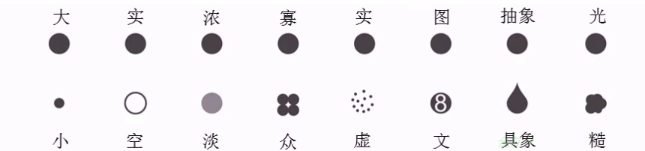

**点的视觉“重量”**

1. 画面正中间，强调的作用、显得稳定

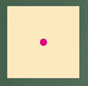

2. 中间向下，稳定、**静止**
   1. 一般的海报，会把主办方的联系方式放这个位置
   2. 很重要但又不是设计中要表现的的主题

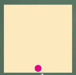

3. 中间的上方，提示、加强
   1. 标题

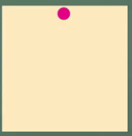

4. 左上角，逃离感
   1. 装饰性元素
   2. 自我扩充的感觉
   3. 初学者慎用

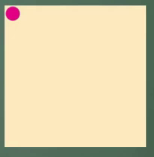

5. 正右，下落感
   1. 特别简单的元素不适合放在这里

6. 右下，封闭，保守，自闭
   1. 重要元素不要在这里！

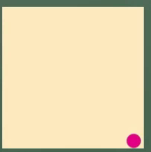

7. 中心和角落，中间吸引注意，角落容易忽视

8. 视线会在点之间跳跃

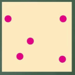

可能会形成视觉单元，左边视重更大。

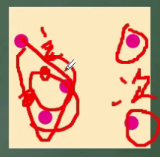

 

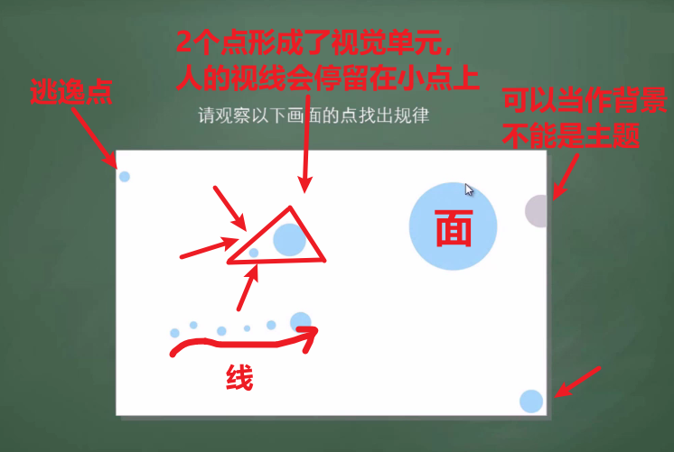

###  线

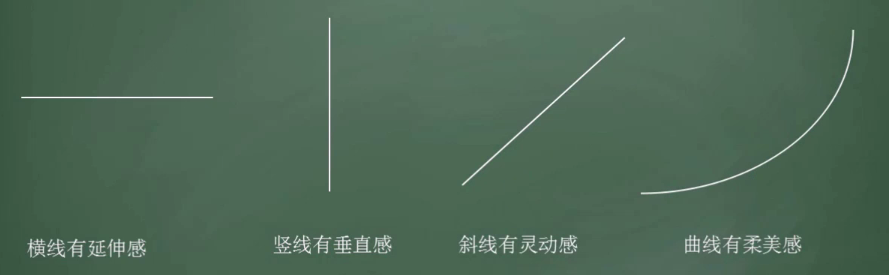

- 同样长度的两根线，竖线比横线看起来长。

- 阵列排布的线形成面的感觉

- 编织的线也会形成面的感觉

  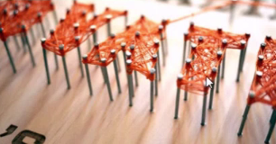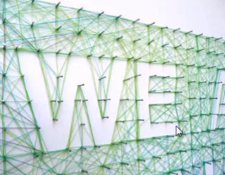

- 文字排布成线

> 作业：用手机拍至少20张“线”的照片

### 面

如何构成面：封闭、扩大、聚集、编织

面的性格：

- 正方形：正值、充实
- 横向长方形：平静、稳定
- 竖向长方形：伟大、庄重
- 原型：饱满、张力、生命力
- 向上三角形：稳定
- 向下三角形：不稳定
- 多边形：紧张（放射）、不调和

面的关系：

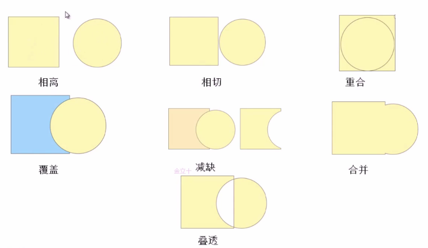

正负形：

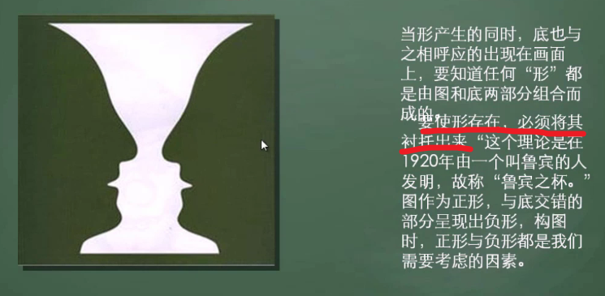

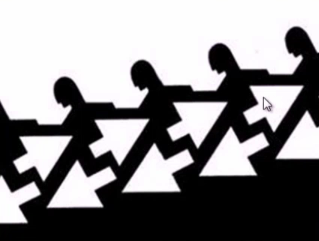

> 作业：设计一个正负形的logo，可以参考apple
>
> 作业：点线面的综合表现（黑白）

### 点的应用

**点-聚集-组成面**

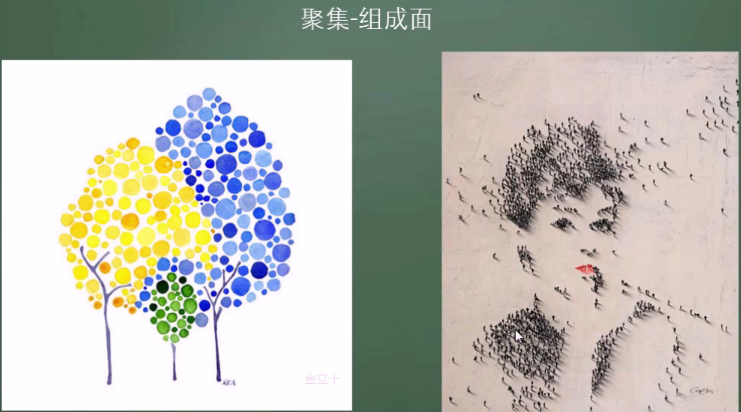

**点-成为画面的中心点**

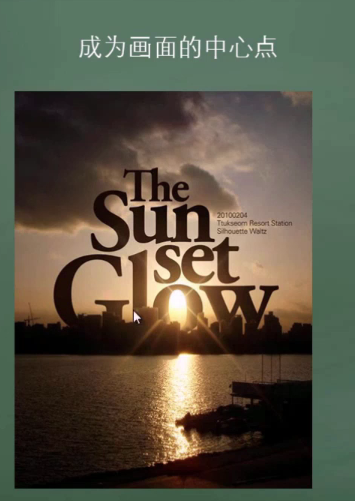

**点-均匀分布形成肌理**

点的排布形成了背景。

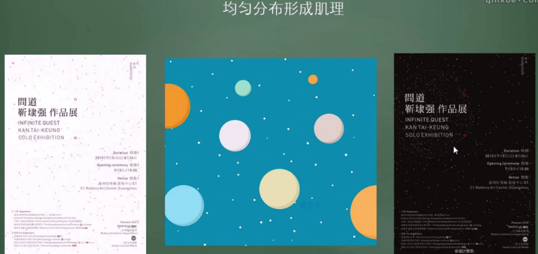

**点-成为画面中的动感的元素**

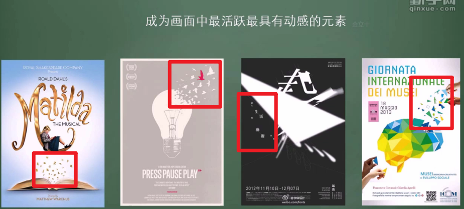

**渲染气氛提升画面感**

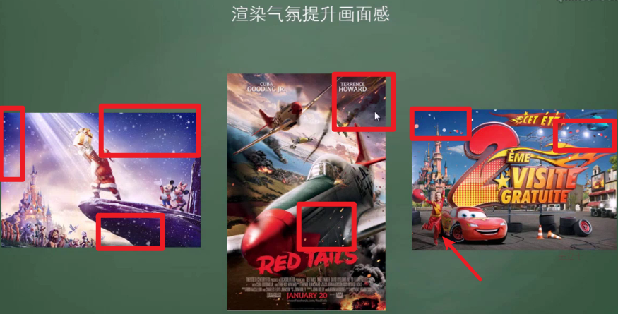

**为画面添加细节和丰富感，用特殊材质体现点的感觉**

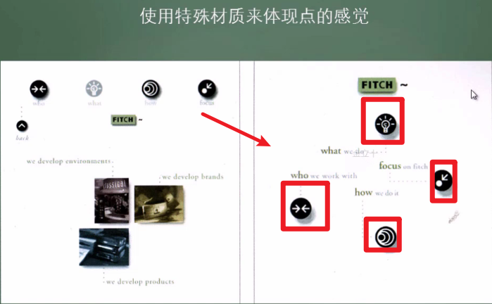

### 线的应用

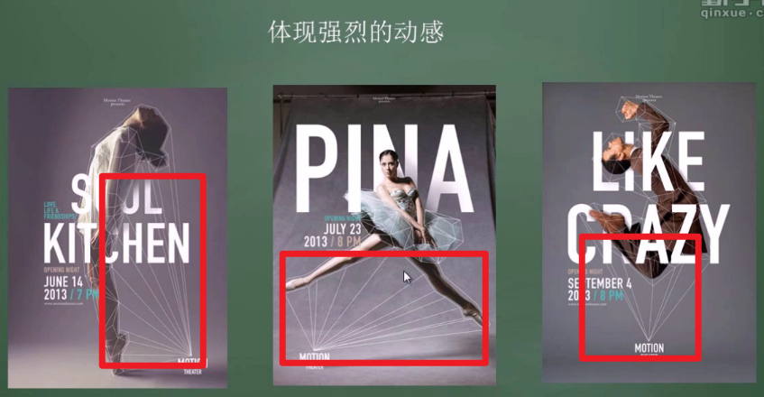

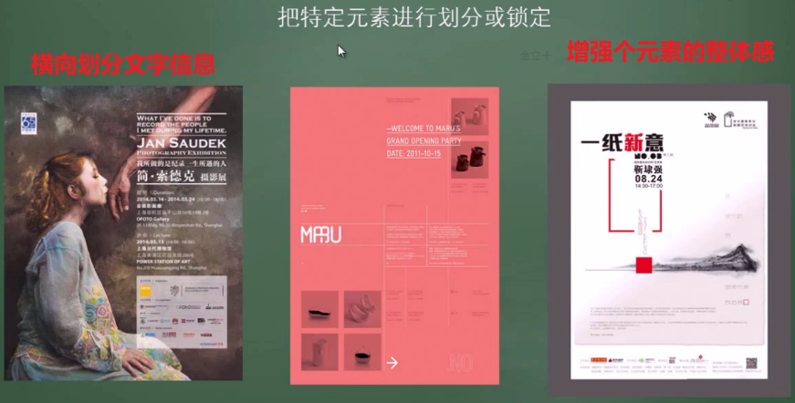

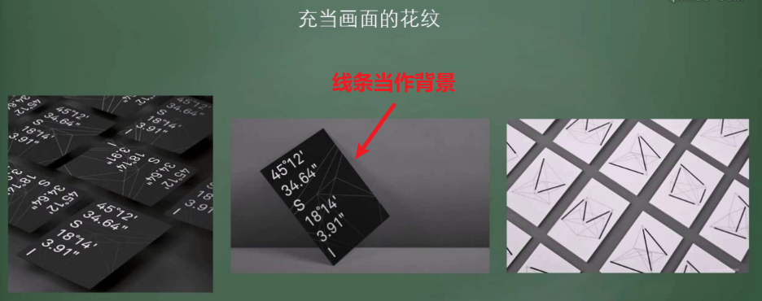

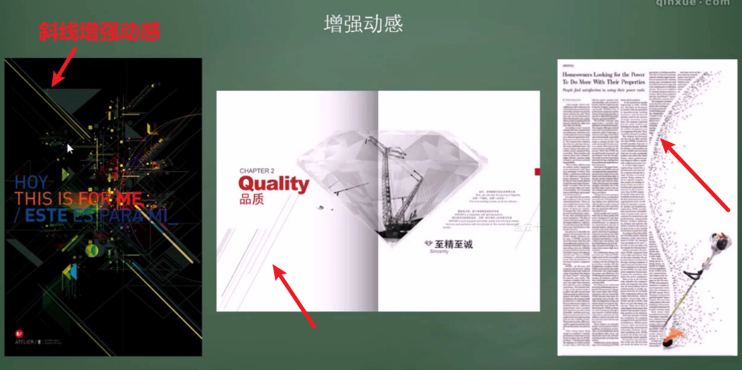

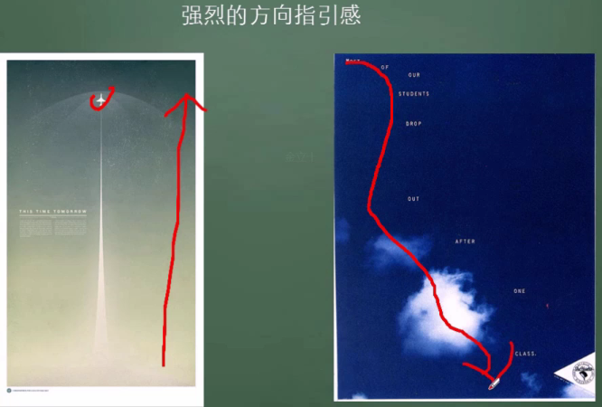

### 面的应用

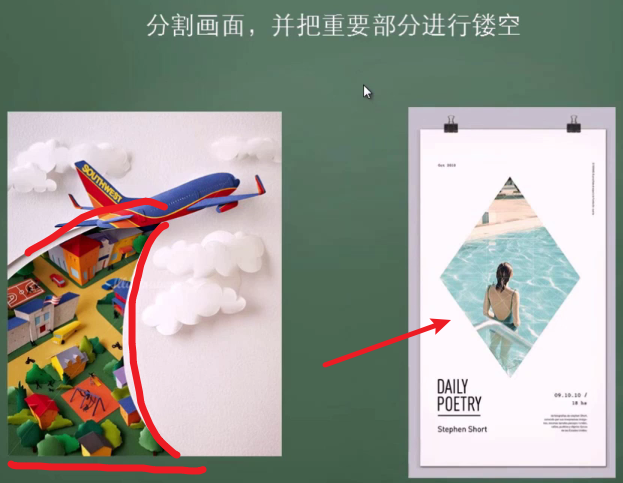

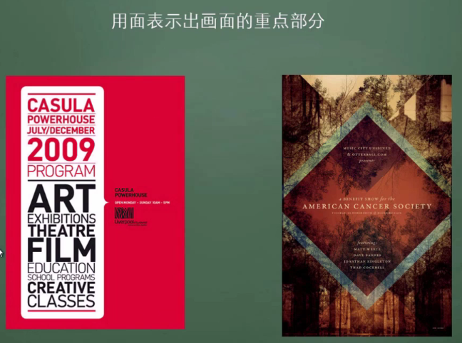

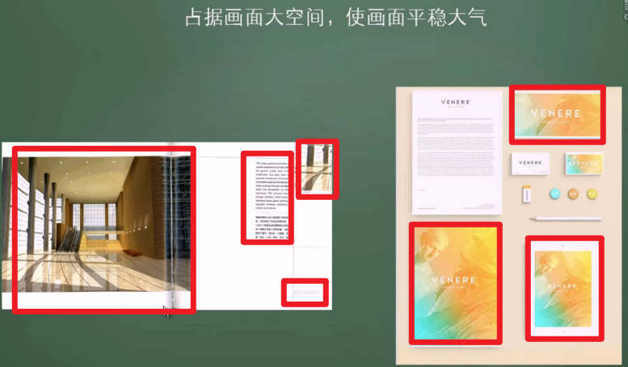

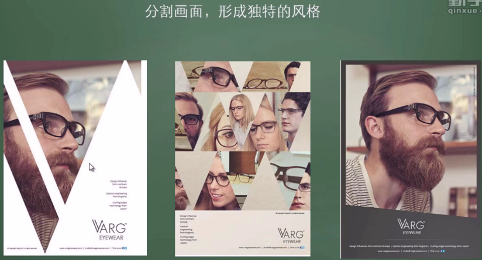

总结：

点的作用：动感、辅助、强调、重点

线：动感、分割、引导

面：分割、表示重点、镂空画面

## 平面构成——骨骼与对比

### 骨骼与基本形

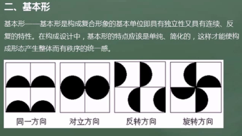

骨骼：将图形元素有秩序地进行排列而画出的有形的或者无形的区间。

骨骼是对空间分割的一种形式，骨骼网决定了基本形在构图中的基本关系。

骨骼的分类：

1. 有规律性骨骼：以严谨的数学方式构成骨格线，在骨格线里安排基本形，如重复，渐变、近似、发射等，有强烈的秩序感

   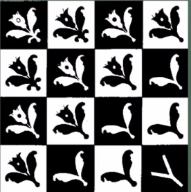

2. 非规律性骨骼：没有严谨的骨格线，构成方式比较自由

   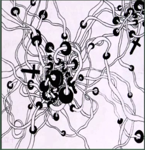

3. 有作用性骨骼：骨骼给基本形准确的空间位置，基本形安排在骨格线的单位中，并且可以改变方向、正负、越出骨格线的余形可能被骨格线切掉，能产生更多的形象。

   1. 基本形都在格子内，通过不同的明暗显示骨格线的存在
   2. 基本形超出格子的部分要擦掉，形的大小、方向、位置可以自有安排
   3. 骨格线划分空间并分割背景

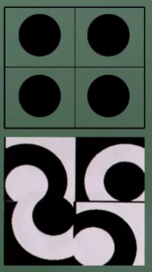

4. 无作用性骨骼：给基本形准确的空间位置，但基本形安排在骨骼的交叉点上，可以改变其大小、方向、正负关系，能构成比较灵活生动的形象
   1. 基本形必须在轴心上，骨格线起到轴心作用
   2. 骨骼主要管辖基本形的准确位置，最后线要擦掉
   3. 形可大可小，不起分割背景的作用

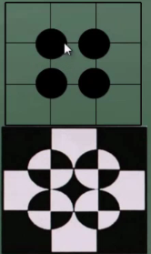

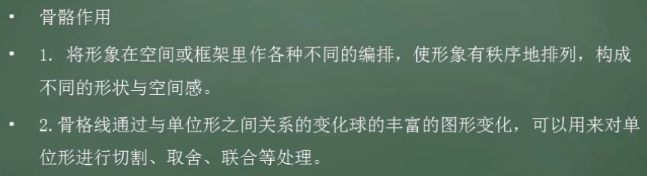

### 对比

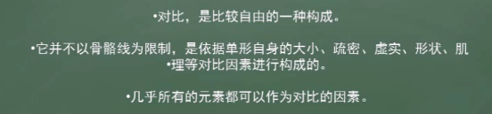

对比的形式：

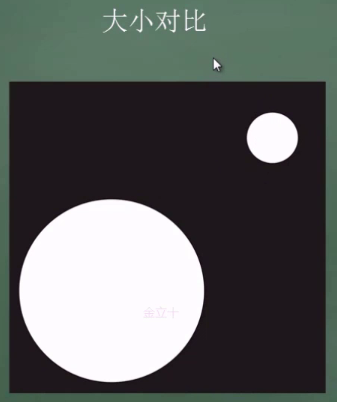

一大一小同时出现，人的目光总是集中在小的上面。

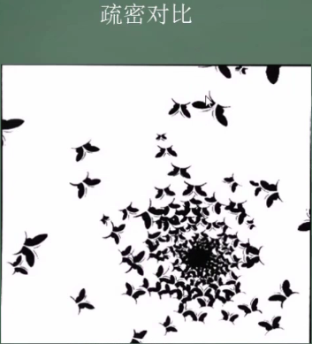

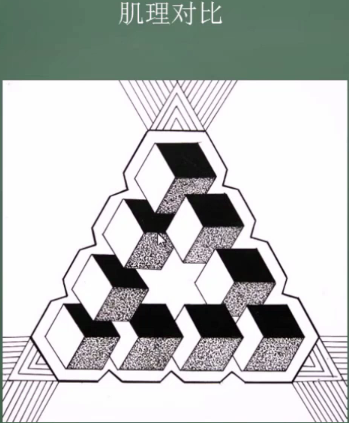

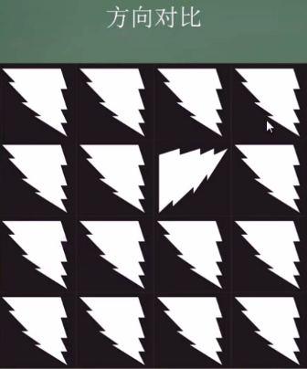

> 作业：
>
> 

## 平面构成——重复与特异

