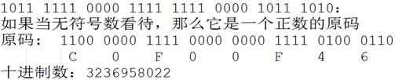

## C语言-数据类型

### 常量与变量

#### 关键字

![[clip_image002-1600484267948.jpg]]

#### 数据类型

> 数据类型的作用：编译器预算对象（变量）分配的内存空间大小

![[clip_image002-1600484293600.jpg]]

#### 常量

常量：

- 在程序运行过程中，其值不能被改变的量
- 常量一般出现在表达式或赋值语句中

| 整型常量   | 100，200，-100，0      |
| ---------- | ---------------------- |
| 实型常量   | 3.14  ， 0.125，-3.123 |
| 字符型常量 | ‘a’,‘b’,‘1’,‘\n’       |
| 字符串常量 | “a”,“ab”，“12356”      |

#### 变量

**1. 变量**

- 在程序运行过程中，其值可以改变
- <font color="red">变量在使用前必须先定义，定义变量前必须有相应的数据类型</font>

标识符命名规则：

- 标识符不能是关键字
- 标识符只能由字母、数字、下划线组成
- 第一个字符必须为字母或下划线
- 标识符中字母区分大小写

变量特点：

- 变量在编译时为其分配相应的内存空间
- 可以通过其<font color="red">名字</font>和<font color="red">地址</font>>访问相应内存

![[clip_image002-1600484648234.jpg]]

**2. 声明和定义区别**

- 声明变量不需要建立存储空间，如：`extern int a;`
- 定义变量需要建立存储空间，如：`int b;`

```c
#include <stdio.h>

int main()
{
	//extern 关键字只做声明，不能做任何定义，后面还会学习，这里先了解
	//声明一个变量a，a在这里没有建立存储空间
	extern int a;
	a = 10;	//err, 没有空间，就不可以赋值

	int b = 10;	//定义一个变量b，b的类型为int，b赋值为10

	return 0;
}
```

从广义的角度来讲声明中包含着定义，即<font color="red">定义是声明的一个特例</font>，所以并非所有的声明都是定义：

- `int b` 它既是声明，同时又是定义

- 对于 `extern b`来讲它只是声明不是定义

> 一般的情况下，把建立存储空间的声明称之为“定义”，而把不需要建立存储空间的声明称之为“声明”

#### 使用示例

```c
#include <stdio.h>
#define MAX 10 //声明了一个常量，名字叫MAX，值是10，常量的值一旦初始化不可改

int main()
{
	int a;	//定义了一个变量，其类型为int，名字叫a

	const int b = 10; //定义一个const常量，名为叫b，值为10
	//b = 11; //err,常量的值不能改变

	//MAX = 100;	//err,常量的值不能改变

	a = MAX;//将abc的值设置为MAX的值
	a = 123;

	printf("%d\n", a); //打印变量a的值

	return 0;
}
```

### 整数：int

#### 整型变量的定义和输出

| **打印格式** | **含义**                                               |
| ------------ | ------------------------------------------------------ |
| %d           | 输出一个<font color="red">有符号</font>的10进制int类型 |
| %o(字母o)    | 输出8进制的int类型                                     |
| %x           | 输出16进制的int类型，字母以小写输出                    |
| %X           | 输出16进制的int类型，字母以大写输出                    |
| %u           | 输出一个10进制的<font color="red">无符号</font>数      |

```c
#include <stdio.h>

int main()
{
	int a = 123;	//定义变量a，以10进制方式赋值为123
	int b = 0567;	//定义变量b，以8进制方式赋值为0567
	int c = 0xabc;	//定义变量c，以16进制方式赋值为0xabc

	printf("a = %d\n", a);
	printf("8进制：b = %o\n", b);
	printf("10进制：b = %d\n", b);
	printf("16进制：c = %x\n", c);
	printf("16进制：c = %X\n", c);
	printf("10进制：c = %d\n", c);
	
	unsigned int d = 0xffffffff; //定义无符号int变量d，以16进制方式赋值
	printf("有符号方式打印：d = %d\n", d);
	printf("无符号方式打印：d = %u\n", d);
	return 0;
}
```

![[image-20200919133924510.png]]

#### 整型变量的输入

```c
#include <stdio.h>

int main()
{
	int a;
	printf("请输入a的值：");

	//不要加"\n"
	scanf("%d", &a);
	printf("a = %d\n", a); //打印a的值
    
	return 0;
}
```

#### short、int、long、long long

| **数据类型**        | **占用空间**                                    |
| ------------------- | ----------------------------------------------- |
| short(短整型)       | 2字节                                           |
| int(整型)           | 4字节                                           |
| long(长整形)        | Windows为4字节，Linux为4字节(32位)，8字节(64位) |
| long long(长长整形) | 8字节                                           |

> 注意：

- 整型数据在内存中占的字节数与所选择的操作系统有关。虽然 C 语言标准中没有明确规定整型数据的长度，但 long 类型整数的长度不能短于 int 类型， short 类型整数的长度不能长于 int 类型
- <font color="red">当一个小的数据类型赋值给一个大的数据类型，不会出错，因为编译器会自动转化。但当一个大的类型赋值给一个小的数据类型，那么就可能丢失高位</font>

| **整型常量** | **所需类型** |
| ------------ | ------------ |
| 10           | 代表int类型  |
| 10l, 10L     | 代表long类型               |
| 10ll, 10LL   | 代表long long类型          |
| 10u, 10U     | 代表unsigned int类型       |
| 10ul, 10UL   | 代表unsigned long类型      |
| 10ull, 10ULL | 代表unsigned long long类型 |


| **打印格式**                   | **含义**                                         |
| ------------------------------ | ------------------------------------------------ |
| %hd                            | 输出short类型                                    |
| <font color="red">%d  </font>  | <font color="red">  输出int类型 </font>          |
| %ld                            | 输出long类型                                     |
| %lld                           | 输出long long类型                                |
| %hu                            | 输出unsigned short类型                           |
| <font color="red">%u</font>    | <font color="red">输出unsigned int类型  </font>  |
| <font color="red">%lu  </font> | <font color="red">输出unsigned long类</型</font> |
| %llu                           | 输出unsigned long long类型                       |

```c
#include <stdio.h>

int main()
{
	short a = 10;
	int b = 10;
	long c = 10l; //或者10L
	long long d = 10ll; //或者10LL

	printf("sizeof(a) = %u\n", sizeof(a));
	printf("sizeof(b) = %u\n", sizeof(b));
	printf("sizeof(c) = %u\n", sizeof(c));
	printf("sizeof(c) = %u\n", sizeof(d));

	printf("short a = %hd\n", a);
	printf("int b = %d\n", b);
	printf("long c = %ld\n", c);
	printf("long long d = %lld\n", d);

	unsigned short a2 = 20u;
	unsigned int b2 = 20u;
	unsigned long c2= 20ul; 
	unsigned long long d2 = 20ull; 

	printf("unsigned short a = %hu\n", a2);
	printf("unsigned int b = %u\n", b2);
	printf("unsigned long c = %lu\n", c2);
	printf("unsigned long long d = %llu\n", d2);

	return 0;
}

```

输出：

```bash
tao@Taoc:~/Desktop/C/2$ ./2.2.3 
sizeof(a) = 2
sizeof(b) = 4
sizeof(c) = 8
sizeof(c) = 8
short a = 10
int b = 10
long c = 10
long long d = 10
unsigned short a = 20
unsigned int b = 20
unsigned long c = 20
unsigned long long d = 20
```

#### 有符号数和无符号数区别

**1. 有符号数**

> 有符号数是最高位为符号位，0代表正数，1代表负数

```c
#include <stdio.h>

int main()
{
	signed int a = -1089474374; //定义有符号整型变量a
	printf("%X\n", a); //结果为 BF0FF0BA

	//B    F    0    F    F    0    B	 A
	//1011 1111 0000 1111 1111 0000 1011 1010

	return 0;
}
```

> 输出： BF0FF0BA

**2. 无符号数**

<font color="red">无符号数最高位不是符号位</font>, 而就是数的一部分，无符号数不可能是负数



```c
#include <stdio.h>

int main()
{
	unsigned int a = 3236958022; //定义无符号整型变量a
	printf("%X\n", a); //结果为 C0F00F46

	return 0;
}
```

> 当我们写程序要处理一个不可能出现负值的时候，一般用无符号数，这样可以增大数的表达最大值

**3. 有符号和无符号整型取值范围**

| **数据类型**   | **占用空间** | **取值范围**                                        |
| -------------- | ------------ | --------------------------------------------------- |
| short          | 2字节        | -32768 到 32767 ($-2^{15}$  ~ 2$^{15}$-1)           |
| int            | 4字节        | -2147483648 到  2147483647 ($-2^{31}$ ~ $2^{31}$-1) |
| long           | 4字节        | -2147483648 到  2147483647($-2^{31}$ ~ $2^{31}$-1)  |
| unsigned short | 2字节        | 0 到 65535 (0 ~ 2$^{16}$-1)                         |
| unsigned int   | 4字节        | 0 到 4294967295 (0  ~ 2$^{32}$-1)                   |
| unsigned long  | 4字节        | 0 到 4294967295 (0  ~ 2$^{32}$-1)                   |

###  sizeof 关键字

- `sizeof`不是函数，所以不需要包含任何头文件，它的功能是<font color="red">计算一个数据类型的大小</font>，单位为字节
- `sizeof`的返回值为`size_t`
- `size_t`类型在32位操作系统下是`unsigned int`，是一个无符号的整数

```c
#include <stdio.h>

int main()
{
	int a;
	int b = sizeof(a);//sizeof得到指定值占用内存的大小，单位：字节
	printf("b = %d\n", b);

	size_t c = sizeof(a);
	printf("c = %u\n", c);//用无符号数的方式输出c的值

	return 0;
}
```

输出：

```bash
tao@Taoc:~/Desktop/C/2$ ./2.3 
b = 4
c = 4
```

### 字符型：char

#### 字符变量的定义和输出

字符型变量用于存储一个单一字符，在 C 语言中用 char 表示，其中每个字符变量都会占用 1 个字节。在给字符型变量赋值时，需要用一对英文半角格式的单引号(`' '`)把字符括起来

字符变量实际上并不是把该字符本身放到变量的内存单元中去，而是将该字符对应的 ASCII 编码放到变量的存储单元中。<font color="red">char的本质就是一个1字节大小的整型</font>

```c
#include <stdio.h>

int main()
{
	char ch = 'a';
	printf("sizeof(ch) = %u\n", sizeof(ch));

	printf("ch[%%c] = %c\n", ch); //打印字符
	printf("ch[%%d] = %d\n", ch); //打印‘a’ ASCII的值

	char A = 'A';
	char a = 'a';
	printf("a = %d\n", a);		//97
	printf("A = %d\n", A);	//65

	printf("A = %c\n", 'a' - 32); //小写a转大写A
	printf("a = %c\n", 'A' + 32); //大写A转小写a

	ch = ' ';
	printf("空字符：%d\n", ch); //空字符ASCII的值为32
	printf("A = %c\n", 'a' - ' '); //小写a转大写A
	printf("a = %c\n", 'A' + ' '); //大写A转小写a

	return 0;
}
```

输出结果：

```c
ao@Taoc:~/Desktop/C/2$ ./2.4.1 
sizeof(ch) = 1
ch[%c] = a
ch[%d] = 97
a = 97
A = 65
A = A
a = a
空字符：32
A = A
a = a
```

#### 字符变量的输入

```c
#include <stdio.h>

int main()
{
	char ch;
	printf("请输入ch的值：");

	//不要加“\n”
	scanf("%c", &ch);
	printf("ch = %c\n", ch); //打印ch的字符

	return 0;
}
```

输出：

```bash
tao@Taoc:~/Desktop/C/2$ ./2.4.2 
请输入ch的值：a
ch = a
```

#### 2.4.3 ASCII 对照表

| <font color="blue">**ASCII值**</font> | <font color="blue"> **控制字符**  </font> | <font color="blue">**ASCII值**</font> | <font color="blue"> **字符**  </font> | <font color="blue">**ASCII值**</font> | <font color="blue"> **字符**  </font> | <font color="blue">**ASCII值**</font> | <font color="blue"> **字符**  </font> |
| ------------------------------------- | ----------------------------------------- | ------------------------------------- | ------------------------------------- | ------------------------------------- | ------------------------------------- | ------------------------------------- | ------------------------------------- |
| 0                                     | NUT                                       | 32                                    | (space)                               | 64                                    | @                                     | 96                                    | 、                                    |
| 1                                     | SOH                                       | 33                                    | !                                     | 65                                    | A                                     | 97                                    | a                                     |
| 2                                     | STX                                       | 34                                    | "                                     | 66                                    | B                                     | 98                                    | b                                     |
| 3                                     | ETX                                       | 35                                    | #                                     | 67                                    | C                                     | 99                                    | c                                     |
| 4                                     | EOT                                       | 36                                    | $                                     | 68                                    | D                                     | 100                                   | d                                     |
| 5                                     | ENQ                                       | 37                                    | %                                     | 69                                    | E                                     | 101                                   | e                                     |
| 6                                     | ACK                                       | 38                                    | &                                     | 70                                    | F                                     | 102                                   | f                                     |
| 7                                     | BEL                                       | 39                                    | ,                                     | 71                                    | G                                     | 103                                   | g                                     |
| 8                                     | BS                                        | 40                                    | (                                     | 72                                    | H                                     | 104                                   | h                                     |
| 9                                     | HT                                        | 41                                    | )                                     | 73                                    | I                                     | 105                                   | i                                     |
| 10                                    | LF                                        | 42                                    | *                                     | 74                                    | J                                     | 106                                   | j                                     |
| 11                                    | VT                                        | 43                                    | +                                     | 75                                    | K                                     | 107                                   | k                                     |
| 12                                    | FF                                        | 44                                    | ,                                     | 76                                    | L                                     | 108                                   | l                                     |
| 13                                    | CR                                        | 45                                    | -                                     | 77                                    | M                                     | 109                                   | m                                     |
| 14                                    | SO                                        | 46                                    | .                                     | 78                                    | N                                     | 110                                   | n                                     |
| 15                                    | SI                                        | 47                                    | /                                     | 79                                    | O                                     | 111                                   | o                                     |
| 16                                    | DLE                                       | 48                                    | 0                                     | 80                                    | P                                     | 112                                   | p                                     |
| 17                                    | DCI                                       | 49                                    | 1                                     | 81                                    | Q                                     | 113                                   | q                                     |
| 18                                    | DC2                                       | 50                                    | 2                                     | 82                                    | R                                     | 114                                   | r                                     |
| 19                                    | DC3                                       | 51                                    | 3                                     | 83                                    | S                                     | 115                                   | s                                     |
| 20                                    | DC4                                       | 52                                    | 4                                     | 84                                    | T                                     | 116                                   | t                                     |
| 21                                    | NAK                                       | 53                                    | 5                                     | 85                                    | U                                     | 117                                   | u                                     |
| 22                                    | SYN                                       | 54                                    | 6                                     | 86                                    | V                                     | 118                                   | v                                     |
| 23                                    | TB                                        | 55                                    | 7                                     | 87                                    | W                                     | 119                                   | w                                     |
| 24                                    | CAN                                       | 56                                    | 8                                     | 88                                    | X                                     | 120                                   | x                                     |
| 25                                    | EM                                        | 57                                    | 9                                     | 89                                    | Y                                     | 121                                   | y                                     |
| 26                                    | SUB                                       | 58                                    | :                                     | 90                                    | Z                                     | 122                                   | z                                     |
| 27                                    | ESC                                       | 59                                    | ;                                     | 91                                    | [                                     | 123                                   | {                                     |
| 28                                    | FS                                        | 60                                    | <                                     | 92                                    | /                                     | 124                                   | \|                                    |
| 29                                    | GS                                        | 61                                    | =                                     | 93                                    | ]                                     | 125                                   | }                                     |
| 30                                    | RS                                        | 62                                    | >                                     | 94                                    | ^                                     | 126                                   | `                                     |
| 31                                    | US                                        | 63                                    | ?                                     | 95                                    | _                                     | 127                                   | DEL                                   |

ASCII 码大致由以下两部分组成：

- ASCII 非打印控制字符： ASCII 表上的数字 0-31 分配给了控制字符，用于控制像打印机等一些外围设备
- ASCII 打印字符：数字 32-126 分配给了能在键盘上找到的字符，当查看或打印文档时就会出现。数字 127 代表 Del 命令

#### 转义字符

| **转义字符**                   | **含义**                            | **ASCII****码值（十进制）** |
| ------------------------------ | ----------------------------------- | --------------------------- |
| <font color="red">\a</font>    | 警报                                | 007                         |
| <font color="red">\b  </font>  | 退格(BS) ，将当前位置移到前一列     | 008                         |
| <font color="red">\f  </font>  | 换页(FF)，将当前位置移到下页开头    | 012                         |
| <font color="red">\n  </font>  | 换行(LF) ，将当前位置移到下一行开头 | 010                         |
| <font color="red"> \r  </font> | 回车(CR) ，将当前位置移到本行开头   | 013                         |
| <font color="red">\t  </font>  | 水平制表(HT)  （跳到下一个TAB位置） | 009                         |
| <font color="red"> \v  </font> | 垂直制表(VT)                        | 011                         |
| `\\  `                         | 代表一个反斜线字符"\"               | 092                         |
| ` \'  `                        | 代表一个单引号（撇号）字符          | 039                         |
| `\" `                          | 代表一个双引号字符                  | 034                         |
| ` \?  `                        | 代表一个问号                        | 063                         |
| `\0 `                          | 数字0                               | 000                         |
| ` \ddd  `                      | 8进制转义字符，d范围0~7             | 3位8进制                    |
| `  \xhh `                      | 16进制转义字符，h范围0~9，a~f，A~F  | 3位16进制                   |

> 注意：红色字体标注的为不可打印字符

```c
#include <stdio.h>

int main()
{
	printf("abc");
	printf("\refg\n"); //\r切换到句首， \n为换行键

	printf("abc");
	printf("\befg\n");//\b为退格键， \n为换行键

	printf("%d\n", '\123');// '\123'为8进制转义字符，0123对应10进制数为83
	printf("%d\n", '\x23');// '\x23'为16进制转义字符，0x23对应10进制数为35

	return 0;
}

```

输出结果：

```bash
tao@Taoc:~/Desktop/C/2$ ./2.4.4 
efg
abefg
83
35
```

### 实型(浮点型)：float、double

实型变量也可以称为浮点型变量，浮点型变量是用来存储小数数值的。在C语言中， 浮点型变量分为两种： 单精度浮点数(`float`)、 双精度浮点数(`double`)， 但是`double`型变量所表示的浮点数比 float 型变量更精确。

由于浮点型变量是由有限的存储单元组成的，因此只能提供有限的有效数字。在有效位以外的数字将被舍去，这样可能会产生一些误差。

不以f结尾的常量是`double`类型，以f结尾的常量(如3.14f)是`float`类型

```c
#include <stdio.h>

int main()
{
	//传统方式赋值
	float a = 3.14f; //或3.14F
	double b = 3.14;

	printf("a = %f\n", a);
	printf("b = %lf\n", b);

	//科学法赋值
	a = 3.2e3f; //3.2*1000 = 3200，e可以写E
	printf("a1 = %f\n", a);

	a = 100e-3f; //100*0.001 = 0.1
	printf("a2 = %f\n", a);

	a = 3.1415926f;
	printf("a3 = %f\n", a); //结果为3.141593

	return 0;
}
```

输出结果：

```bash
tao@Taoc:~/Desktop/C/2$ ./2.5 
a = 3.140000
b = 3.140000
a1 = 3200.000000
a2 = 0.100000
a3 = 3.141593
```

### 进制

进制也就是进位制，是人们规定的一种进位方法。 对于任何一种进制—X进制，就表示某一位置上的数运算时是逢X进一位。 十进制是逢十进一，十六进制是逢十六进一，二进制就是逢二进一，以此类推，x进制就是逢x进位

| **十进制** | **二进制** | **八进制** | **十六进制** |
| ---------- | ---------- | ---------- | ------------ |
| 0          | 0          | 0          | 0            |
| 1          | 1          | 1          | 1            |
| 2          | 10         | 2          | 2            |
| 3          | 11         | 3          | 3            |
| 4          | 100        | 4          | 4            |
| 5          | 101        | 5          | 5            |
| 6          | 110        | 6          | 6            |
| 7          | 111        | 7          | 7            |
| 8          | 1000       | 10         | 8            |
| 9          | 1001       | 11         | 9            |
| 10         | 1010       | 12         | A            |
| 11         | 1011       | 13         | B            |
| 12         | 1100       | 14         | C            |
| 13         | 1101       | 15         | D            |
| 14         | 1110       | 16         | E            |
| 15         | 1111       | 17         | F            |
| 16         | 10000      | 20         | 10           |

#### 二进制

二进制是计算技术中广泛采用的一种数制。二进制数据是用0和1两个数码来表示的数。它的基数为2，进位规则是“逢二进一”，借位规则是“借一当二”

> 当前的计算机系统使用的基本上是二进制系统，<font color="red">数据在计算机中主要是以补码的形式存储的</font>

| **术语**     | **含义**                                                     |
| ------------ | ------------------------------------------------------------ |
| bit(比特)    | 一个二进制代表一位，一个位只能表示0或1两种状态。数据传输是习惯以“位”（bit）为单位。 |
| Byte(字节)   | 一个字节为8个二进制，称为8位，<font color="red">计算机中存储的最小单位是字节</font>。数据存储是习惯以“字节”（Byte）为单位。 |
| WORD(双字节) | 2个字节，16位                                                |
| DWORD        | 两个WORD，4个字节，32位                                      |
| 1b           | 1bit，1位                                                    |
| 1B           | 1Byte,1字节，8位                                             |
| 1k，1K       | 1024                                                         |
| 1M(1兆)      | 1024k, 1024*1024                                             |
| 1G           | 1024M                                                        |
| 1T           | 1024G                                                        |
| 1Kb(千位)    | 1024bit,1024位                                               |
| 1KB(千字节)  | 1024Byte，1024字节                                           |
| 1Mb(兆位)    | 1024Kb = 1024 * 1024bit                                      |
| 1MB(兆字节)  | 1024KB = 1024 * 1024Byte                                     |

十进制转化二进制的方法：用十进制数除以2，分别取余数和商数，商数为0的时候，将余数倒着数就是转化后的结果

![[clip_image002-1600500777852.png]]

十进制的小数转换成二进制：小数部分和2相乘，取整数，不足1取0，<font color="red">每次相乘都是小数部分</font>，顺序看取整后的数就是转化后的结果

![[clip_image002-1600500801245.jpg]]

#### 八进制

八进制，`Octal`，缩写OCT或O，一种以8为基数的计数法，采用0，1，2，3，4，5，6，7八个数字，逢八进1。一些编程语言中常常以数字0开始表明该数字是八进制

八进制的数和二进制数可以按位对应（<font color="red">八进制一位对应二进制三位</font>），因此常应用在计算机语言中

![[clip_image002-1600500855480.jpg]]

十进制转化八进制的方法：

用十进制数除以8，分别取余数和商数，商数为0的时候，将余数倒着数就是转化后的结果

![[img/clip_image002-1600500866476.jpg]]

#### 十六进制

十六进制（英文名称：Hexadecimal），同我们日常生活中的表示法不一样，它由0-9，A-F组成，<font color="red">字母不区分大小写</font>。与10进制的对应关系是：0-9对应0-9，A-F对应10-15

十六进制的数和二进制数可以按位对应（<font color="red">十六进制一位对应二进制四位</font>），因此常应用在计算机语言中

![[clip_image002-1600501357582.jpg]]

十进制转化十六进制的方法：

用十进制数除以16，分别取余数和商数，商数为0的时候，将余数倒着数就是转化后的结果

![[clip_image002-1600501365915.jpg]]

#### C语言如何表示相应进制数

| 十进制   | 以正常数字1-9开头，如123  |
| -------- | ------------------------- |
| 八进制   | 以数字0开头，如0123       |
| 十六进制 | 以0x开头，如0x123         |
| 二进制   | C语言不能直接书写二进制数 |

```c
#include <stdio.h>

int main()
{
	int a = 123;		//十进制方式赋值
	int b = 0123;		//八进制方式赋值， 以数字0开头
	int c = 0xABC;	//十六进制方式赋值

	//如果在printf中输出一个十进制数那么用%d，八进制用%o，十六进制是%x
	printf("十进制：%d\n",a );
	printf("八进制：%o\n", b);	//%o,为字母o,不是数字
	printf("十六进制：%x\n", c);

	return 0;
}
```

输出：

```bash
tao@Taoc:~/Desktop/C/2$ ./2.6.4 
十进制：123
八进制：123
十六进制：abc
```

### 计算机内存数值存储方式

>  [原码, 反码, 补码 详解](https://www.cnblogs.com/zhangziqiu/archive/2011/03/30/ComputerCode.html)

#### 原码

一个数的原码(原始的二进制码)有如下特点：

- 最高位做为符号位，0表示正,为1表示负
- 其它数值部分就是数值本身绝对值的二进制数
- 负数的原码是在其绝对值的基础上，最高位变为1

下面数值以1字节的大小描述：

| **十进制数** | **原码**  |
| ------------ | --------- |
| +15          | 0000 1111 |
| -15          | 1000 1111 |
| +0           | 0000 0000 |
| -0           | 1000 0000 |

原码表示法简单易懂，与带符号数本身转换方便，只要符号还原即可，但当两个正数相减或不同符号数相加时，必须比较两个数哪个绝对值大，才能决定谁减谁，才能确定结果是正还是负，所以原码不便于加减运算

#### 反码

- 对于正数，反码与原码相同
- <font color="red">对于负数，符号位不变，其它部分取反(1变0,0变1)</font>

| **十进制数** | **反码**  |
| ------------ | --------- |
| +15          | 0000 1111 |
| -15          | 1111 0000 |
| +0           | 0000 0000 |
| -0           | 1111 1111 |

>  反码运算也不方便，通常用来作为求补码的中间过渡

#### 补码

<font color="red">**在计算机系统中，数值一律用补码来存储**</font>

补码特点：

- 对于正数，原码、反码、补码相同
- <font color="red">对于负数，其补码为它的反码加1</font>
- 补码符号位不动，其他位求反，最后整个数加1，得到原码

| **十进制数** | **补码**  |
| ------------ | --------- |
| +15          | 0000 1111 |
| -15          | 1111 0001 |
| +0           | 0000 0000 |
| -0           | 0000 0000 |

```c
#include <stdio.h>

int main()
{
	int  a = -15;

	printf("%x\n", a);
	//结果为 fffffff1
	//fffffff1对应的二进制：1111 1111 1111 1111 1111 1111 1111 0001
	//符号位不变，其它取反：1000 0000 0000 0000 0000 0000 0000 1110
	//上面加1：1000 0000 0000 0000 0000 0000 0000 1111  最高位1代表负数，就是-15

	return 0;
}
```

#### 补码的意义

示例1：用8位二进制数分别表示+0和-0

| **十进制数** | **原码**  |
| ------------ | --------- |
| +0           | 0000 0000 |
| -0           | 1000 0000 |

| **十进制数** | **反码**  |
| ------------ | --------- |
| +0           | 0000 0000 |
| -0           | 1111 1111 |

不管以原码方式存储，还是以反码方式存储，0也有两种表示形式。为什么同样一个0有两种不同的表示方法呢？

但是如果以补码方式存储，补码统一了零的编码：

| **十进制数** | **补码**                                              |
| ------------ | ----------------------------------------------------- |
| +0           | 0000 0000                                             |
| -0           | 10000 0000由于只用8位描述，最高位1丢弃，变为0000 0000 |

示例2：计算9-6的结果

以原码方式相加：

| **十进制数** | **原码**  |
| ------------ | --------- |
| 9            | 0000 1001 |
| -6           | 1000 0110 |

![[clip_image002-1600502184471.jpg]]

结果为-15，不正确。

以补码方式相加：

| **十进制数** | **补码**  |
| ------------ | --------- |
| 9            | 0000 1001 |
| -6           | 1111 1010 |

![[clip_image002-1600502207939.jpg]]

最高位的1溢出,剩余8位二进制表示的是3，正确

<font color="red">**在计算机系统中，数值一律用补码来存储**</font>主要原因是：

- 统一了零的编码
- 将符号位和其它位统一处理
- 将减法运算转变为加法运算
- 两个用补码表示的数相加时，如果最高位(符号位)有进位，则进位被舍弃

#### 数值溢出

当超过一个数据类型能够存放最大的范围时，数值会溢出

有符号位最高位溢出的区别：符号位溢出会导致数的正负发生改变，但最高位的溢出会导致最高位丢失

| **数据类型**  | **占用空间** | **取值范围**                      |
| ------------- | ------------ | --------------------------------- |
| char          | 1字节        | -128到 127(-2$^{7}$  ~ 2$^{7}$-1) |
| unsigned char | 1字节        | 0 到 255(0 ~ 2$^{8}$-1)           |

```c
#include <stdio.h>

int main()
{
	char ch;

	//符号位溢出会导致数的正负发生改变
	ch = 0x7f + 2; //127+2
	printf("%d\n", ch);
	//	0111 1111
	//+2后 1000 0001，这是负数补码，其原码为 1111 1111，结果为-127

	//最高位的溢出会导致最高位丢失
	unsigned char ch2;
	ch2 = 0xff+1; //255+1
	printf("%u\n", ch2);
	//	  1111 1111
	//+1后 10000 0000， char只有8位最高位的溢出，结果为0000 0000，十进制为0

	ch2 = 0xff + 2; //255+1
	printf("%u\n", ch2);
	//	  1111 1111
	//+1后 10000 0001， char只有8位最高位的溢出，结果为0000 0001，十进制为1

	return 0;
}
```

```c
tao@Taoc:~/Desktop/C/2$ gcc 2.7.5.c -o 2.7.5
2.7.5.c: In function ‘main’:
2.7.5.c:15:8: warning: unsigned conversion from ‘int’ to ‘unsigned char’ changes value from ‘256’ to ‘0’ [-Woverflow]
  ch2 = 0xff+1; //255+1
        ^~~~
2.7.5.c:20:8: warning: unsigned conversion from ‘int’ to ‘unsigned char’ changes value from ‘257’ to ‘1’ [-Woverflow]
  ch2 = 0xff + 2; //255+1
        ^~~~
tao@Taoc:~/Desktop/C/2$ ./2.7.5 
-127
0
1
```

### 类型限定符

| **限定符** | **含义**                                                     |
| ---------- | ------------------------------------------------------------ |
| extern     | 声明一个变量，extern声明的变量没有建立存储空间。  extern int a;//变量在定义的时候创建存储空间 |
| const      | 定义一个常量，常量的值不能修改。  const int a = 10;          |
| Volatile   | 防止编译器优化代码                                           |
| register   | 定义寄存器变量，提高效率。register是建议型的指令，而不是命令型的指令，如果CPU有空闲寄存器，那么register就生效，如果没有空闲寄存器，那么register无效。 |

### 字符串格式化输出和输入

#### 字符串常量

- 字符串是内存中一段连续的char空间，以'`\0`'(数字0)结尾
- 字符串常量是由双引号括起来的字符序列，如“china”、“C program”，“$12.5”等都是合法的字符串常量

字符串常量与字符常量的不同：

![[clip_image002-1600503616364.jpg]]

每个字符串的结尾，编译器会自动的添加一个结束标志位'`\0`'，即 "a" 包含两个字符'`a`'和’`\0`’

#### printf函数和putchar函数

`printf`是输出一个字符串，`putchar`输出一个char

printf格式字符：

| **打印格式** | **对应数据类型** | **含义**                                                     |
| ------------ | ---------------- | ------------------------------------------------------------ |
| %d           | int              | 接受整数值并将它表示为有符号的十进制整数                     |
| %hd          | short int        | 短整数                                                       |
| %hu          | unsigned short   | 无符号短整数                                                 |
| %o           | unsigned int     | 无符号8进制整数                                              |
| %u           | unsigned int     | 无符号10进制整数                                             |
| %x,%X        | unsigned int     | 无符号16进制整数，x对应的是abcdef，X对应的是ABCDEF           |
| %f           | float            | 单精度浮点数                                                 |
| %lf          | double           | 双精度浮点数                                                 |
| %e,%E        | double           | 科学计数法表示的数，此处"e"的大小写代表在输出时用的"e"的大小写 |
| %c           | char             | 字符型。可以把输入的数字按照ASCII码相应转换为对应的字符      |
| %s           | char *           | 字符串。输出字符串中的字符直至字符串中的空字符（字符串以'\0‘结尾，这个'\0'即空字符） |
| %p           | void *           | 以16进制形式输出指针                                         |
| %%           | %                | 输出一个百分号                                               |

printf附加格式：

| **字符**          | **含义**                                                     |
| ----------------- | ------------------------------------------------------------ |
| l(字母l)          | 附加在d,u,x,o前面，表示长整数                                |
| -                 | 左对齐                                                       |
| m(代表一个整数)   | 数据最小宽度                                                 |
| 0(数字0)          | 将输出的前面补上0直到占满指定列宽为止不可以搭配使用-         |
| m.n(代表一个整数) | m指域宽，即对应的输出项在输出设备上所占的字符数。n指精度，用于说明输出的实型数的小数位数。对数值型的来说，未指定n时，隐含的精度为n=6位。 |

```c
#include <stdio.h>
int main()
{
	int a = 100;
	printf("a = %d\n", a);//格式化输出一个字符串
	printf("%p\n", &a);//输出变量a在内存中的地址编号
	printf("%%d\n");

	char c = 'a';
	putchar(c);//putchar只有一个参数，就是要输出的char
	long a2 = 100;
	printf("%ld, %lx, %lo\n", a2, a2, a2);

	long long a3 = 1000;
	printf("%lld, %llx, %llo\n", a3, a3, a3);

	int abc = 10;
	printf("abc = '%6d'\n", abc);
	printf("abc = '%-6d'\n", abc);
	printf("abc = '%06d'\n", abc);
	printf("abc = '%-06d'\n", abc);

	double d = 12.3;
	printf("d = \' %-10.3lf \'\n", d);

	return 0;
}
```

输出结果：

```bash
tao@Taoc:~/Desktop/C/2$ ./2.9.2 
a = 100
0x7ffd3443b718
%d
a100, 64, 144
1000, 3e8, 1750
abc = '    10'
abc = '10    '
abc = '000010'
abc = '10    '
d = ' 12.300     '
```

#### scanf函数与getchar函数

- getchar是从标准输入设备读取一个char
- scanf通过%转义的方式可以得到用户通过标准输入设备输入的数据

```c
#include <stdio.h>

int main()
{
	char ch1;
	char ch2;
	char ch3;
	int a;
	int b;

	printf("请输入ch1的字符：");
	ch1 = getchar();
	printf("ch1 = %c\n", ch1);

	getchar(); //测试此处getchar()的作用

	printf("请输入ch2的字符：");
	ch2 = getchar();
	printf("\'ch2 = %ctest\'\n", ch2);

	getchar(); //测试此处getchar()的作用
	printf("请输入ch3的字符：");
	scanf("%c", &ch3);//这里第二个参数一定是变量的地址，而不是变量名
	printf("ch3 = %c\n", ch3);

	printf("请输入a的值：");
	scanf("%d", &a);
	printf("a = %d\n", a);

	printf("请输入b的值：");
	scanf("%d", &b);
	printf("b = %d\n", b);

	return 0;
}

```

```bash
tao@Taoc:~/Desktop/C/2$ gcc 2.9.3.c -o 2.9.3
tao@Taoc:~/Desktop/C/2$ ./2.9.3 
请输入ch1的字符：a
ch1 = a
请输入ch2的字符：b
'ch2 = btest'
请输入ch3的字符：c
ch3 = c
请输入a的值：d
a = 1513391056
请输入b的值：b = 32765
```
