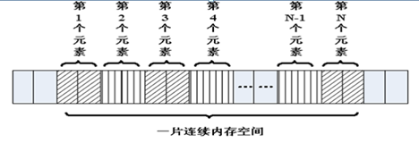

## C语言-数组和字符串

### 概述

> 在程序设计中，为了方便处理数据把具有相同类型的若干变量按有序形式组织起来——称为数组

<font color="red">数组就是在内存中连续的相同类型的变量空间</font>。同一个数组所有的成员都是相同的数据类型，同时所有的成员在内存中的地址是连续的



数组属于构造数据类型：

- 一个数组可以分解为多个数组元素：这些数组元素可以是基本数据类型或构造类型

- ```c
  int a[10];
  struct Stu boy[10]
  ```

- 按数组元素类型的不同，数组可分为：数值数组、字符数组、指针数组、结构数组等类别

- ```c
  int a[10];
  char s[10];
  char *p[10];
  ```

  通常情况下，数组元素下标的个数也称为维数，根据维数的不同，可将数组分为一维数组、二维数组、三维数组、四维数组等。通常情况下，<font color="red">我们将二维及以上的数组称为多维数组</font>

### 一维数组

#### 一维数组的定义和使用

- 数组名字符合标识符的书写规定(数字、英文字母、下划线)

- <font color="red">数组名不能与其它变量名相同，同一作用域内是唯一的</font>

- 方括号[]中常量表达式表示数组元素的个数

- ```c
  int a[3]表示数组a有3个元素
  其下标从0开始计算，因此3个元素分别a[0],a[1],a[2]
  ```

- <font color="red">定义数组时[]内最好是常量，使用数组时[]内即可是常量，也可以是变量</font>

```c
#include <stdio.h>

int main()
{
	int a[10];//定义了一个数组，名字叫a，有10个成员，每个成员都是int类型
	//a[0]…… a[9]，没有a[10]
	//没有a这个变量，a是数组的名字，但不是变量名，它是常量
	a[0] = 0;
	//……
	a[9] = 9;

	int i = 0;
	for (i = 0; i < 10; i++)
	{
		a[i] = i; //给数组赋值
	}

	//遍历数组，并输出每个成员的值
	for (i = 0; i < 10; i++)
	{
		printf("%d ", a[i]);
	}
	printf("\n");

	return 0;
}
```

输出结果：

```bash
tao@Taoc:~/Desktop/C/5$ ./5.2.1 
0123456789
```

#### 一维数组的初始化

在定义数组的同时进行赋值，称为初始化。全局数组若不初始化，编译器将其初始化为零。<font color="red">局部数组若不初始化，内容为随机值。</font>

```c
int a[10] = { 1, 2, 3, 4, 5, 6, 7, 8, 9, 10 };//定义一个数组，同时初始化所有成员变量
int a[10] = { 1, 2, 3 };//初始化前三个成员，后面所有元素都设置为0
int a[10] = { 0 };//所有的成员都设置为0
//[]中不定义元素个数，定义时必须初始化
int a[] = { 1, 2, 3, 4, 5 };//定义了一个数组，有5个成员
```

#### 数组名

<font color="red">数组名是一个地址的常量，代表数组中首元素的地址</font>

```c
#include <stdio.h>

int main()
{
	int a[10] = { 1, 2, 3, 4, 5, 6, 7, 8, 9, 10 };//定义一个数组，同时初始化所有成员变量

	printf("a = %p\n", a);
	printf("&a[0] = %p\n", &a[0]);

	int n = sizeof(a); //数组占用内存的大小，10个int类型，10 * 4  = 40
	int n0 = sizeof(a[0]);//数组第0个元素占用内存大小，第0个元素为int，4

	int i = 0;
	for (i = 0; i < sizeof(a) / sizeof(a[0]); i++)
	{
		printf("%d ", a[i]);
	}
	printf("\n");

	return 0;
}

```

输出结果：

```bash
tao@Taoc:~/Desktop/C/5$ ./5.2.3 
a = 0x7ffcfbfe16d0
&a[0]=0x7ffcfbfe16d0
12345678910
```

### 二维数组

#### 二维数组的定义和使用

> 二维数组定义的一般形式是：
>
> `类型说明符 数组名[常量表达式1][常量表达式2]`

其中常量表达式1表示第一维下标的长度，常量表达式2 表示第二维下标的长度。

`int a[3][4];`

- 命名规则同一维数组
- 定义了一个三行四列的数组，数组名为a其元素类型为整型，该数组的元素个数为3×4个，即：

![[clip_image002-1600585634394.png]]

二维数组a是按行进行存放的，先存放a[0]行，再存放a[1]行、a[2]行，并且每行有四个元素，也是依次存放的

- 二维数组在概念上是二维的：其下标在两个方向上变化，对其访问一般需要两个下标。
- 在内存中并不存在二维数组，二维数组实际的硬件存储器是连续编址的，<font color="red">也就是说内存中只有一维数组</font>，即放完一行之后顺次放入第二行，和一维数组存放方式是一样的。

```c
#include <stdio.h>

int main()
{
	// 定义一个二维数组，名字叫a
    // 由3个一维数组组成，这个一维数组是int[4]
    // 这3个一维数组的数组名分别为a[0],a[1],a[2]
    int a[3][4];
    
    a[0][0] = 0;
    
    a[2][3] = 12;
    
    // 给数组每个元素赋值
    int i = 0;
    int j = 0;
    int num = 0;
    
    for(i=0; j < 4; i++)
    {
        for(j = 0; j < 4; j++)
        {
            a[i][j] = num++;
        }
    }
    
    // 遍历数组，并输出每个成员的值
    for(i = 0; i < 3; i++)
    {
        for(j = 0; j < 4; j++)
        {
            printf("%d", a[i][j]);
        }
        printf("\n");
    }
    
    return 0;
    
}
```

#### 二维数组的初始化

```c
//分段赋值 	int a[3][4] = {{ 1, 2, 3, 4 },{ 5, 6, 7, 8, },{ 9, 10, 11, 12 }};

int a[3][4] = 
	{ 
		{ 1, 2, 3, 4 },
		{ 5, 6, 7, 8, },
		{ 9, 10, 11, 12 }
	};
	// 连续赋值
	int a[3][4] = { 1, 2, 3, 4 , 5, 6, 7, 8, 9, 10, 11, 12  };
	// 可以只给部分元素赋初值，未初始化则为0
	int a[3][4] = { 1, 2, 3, 4  };
	
	//所有的成员都设置为0
	int a[3][4] = {0};
	
	//[]中不定义元素个数，定义时必须初始化
	int a[][4] = { 1, 2, 3, 4, 5, 6, 7, 8};
```

#### 数组名

<font color="red">数组名是一个地址的常量，代表数组中首元素的地址</font>

```c
#include <stdio.h>

int main()
{
	//定义了一个二维数组，名字叫a
	//二维数组是本质上还是一维数组，此一维数组有3个元素
//每个元素又是一个一维数组int[4]
	int a[3][4] = { 1, 2, 3, 4 , 5, 6, 7, 8, 9, 10, 11, 12  };

	//数组名为数组首元素地址，二维数组的第0个元素为一维数组
	//第0个一维数组的数组名为a[0]
	printf("a = %p\n", a);
	printf("a[0] = %p\n", a[0]);
	
	//测二维数组所占内存空间，有3个一维数组，每个一维数组的空间为4*4
	//sizeof(a) = 3 * 4 * 4 = 48
	printf("sizeof(a) = %d\n", sizeof(a));

	//测第0个元素所占内存空间，a[0]为第0个一维数组int[4]的数组名，4*4=16
	printf("sizeof(a[0]) = %d\n", sizeof(a[0]) );

	//测第0行0列元素所占内存空间，第0行0列元素为一个int类型，4字节
	printf("sizeof(a[0][0]) = %d\n", sizeof(a[0][0]));

	//求二维数组行数
	printf("i = %d\n", sizeof(a) / sizeof(a[0]));

	// 求二维数组列数
	printf("j = %d\n", sizeof(a[0]) / sizeof(a[0][0]));

	//求二维数组行*列总数
	printf("n = %d\n", sizeof(a) / sizeof(a[0][0]));

	return 0;
}

```

输出结果：

```c
tao@Taoc:~/Desktop/C/5$ ./5.3.3 
a = 0x7ffe09fd1e60
a[0] = 0x7ffe09fd1e60
sizeof(a) = 48
sizeof(a[0]) = 16
sizeof(a[0][0]) = 4
i = 3
j = 4
n = 12
```

#### 强化训练

```php
#include <stdio.h>

int main()
{
    //二维数组：  五行、三列
	//行代表人：  老大到老五
	//列代表科目：语、数、外

    float a[5][3] =  { { 80, 75, 56 }, { 59, 65, 71 }, { 59, 63, 70 }, { 85, 45, 90 }, { 76, 77, 45 } };
   	
    int i,j,person_low[3] = {0};
    float s=0,lesson_aver[3] = {0};
    
    for(i = 0; i < 3; i++)
    {
        for(j = 0;j < 5; j++)
        {
            s = s + a[i][j];
            if(a[i][j] < 60)
            {
                person_low[i]++;
            }
        }
        lesson_aver[i] = s/5;
        s = 0;
    }
    printf("各科的平均成绩:\n");
	for (i = 0; i < 3; i++)
	{
		printf("%.2f\n", lesson_aver[i]);
	}
		
	printf("各科不及格的人数:\n");
	for (i = 0; i < 3; i++)
	{
		printf("%d\n", person_low[i]);
	}
		
	return 0;
}
```

输出结果：

```bash
tao@Taoc:~/Desktop/C/5$ ./5.3.4 
各科的平均成绩:
67.00
63.40
64.40
各科不及格的人数:
2
2
2
```

### 多维数组(了解)

多维数组的定义与二维数组类似，其语法格式具体如下：

`数组类型修饰符 数组名 [n1][n2]…[nn];`

```c
int a[3][4][5];
```

定义了一个三维数组，数组的名字是a，数组的长度为3，每个数组的元素又是一个二维数组，这个二维数组的长度是4，并且这个二维数组中的每个元素又是一个一维数组，这个一维数组的长度是5，元素类型是`int`;

```c
#include <stdio.h>

int main(){
	// int a[3][4][5]; //定义了一个三维数组，有3个二维数组int[4][5]
	int a[3][4][5] = { { { 1, 2, 3, 4, 5 }, { 6, 7, 8, 9, 10 }, { 0 }, { 0 } }, { { 0 }, { 0 }, { 0 }, { 0 } }, { { 0 }, { 0 }, { 0 }, { 0 } } };
    int i, j, k;
	for (i = 0; i < 3; i++)
	{
		for (j = 0; j < 4; j++)
		{
			for (k = 0; k < 5; k++)
			{
				//添加访问元素代码
				printf("%d, ", a[i][j][k]);
			}
			printf("\n");
		}
	}
	return 0;
}
```

输出结果：

```c
tao@Taoc:~/Desktop/C/5$ ./5.4 
1, 2, 3, 4, 5, 
6, 7, 8, 9, 10, 
0, 0, 0, 0, 0, 
0, 0, 0, 0, 0, 
0, 0, 0, 0, 0, 
0, 0, 0, 0, 0, 
0, 0, 0, 0, 0, 
0, 0, 0, 0, 0, 
0, 0, 0, 0, 0, 
0, 0, 0, 0, 0, 
0, 0, 0, 0, 0, 
0, 0, 0, 0, 0, 
```

### 字符数组与字符串

#### 字符数组与字符串区别

- C语言中没有字符串这种数据类型，可以通过char的数组来替代；
- 字符串一定是一个char的数组，但char的数组未必是字符串；
- <font color="red">数字0(和字符‘`\0`’等价)结尾的char数组就是一个字符串</font>，但如果char数组没有以数字0结尾，那么就不是一个字符串，只是普通字符数组，所以<font color="red">字符串是一种特殊的char的数组</font>

```c
#include <stdio.h>

int main()
{
	char c1[] = { 'c', ' ', 'p', 'r', 'o', 'g' }; //普通字符数组
	printf("c1 = %s\n", c1); //乱码，因为没有’\0’结束符

	//以‘\0’(‘\0’就是数字0)结尾的字符数组是字符串
	char c2[] = { 'c', ' ', 'p', 'r', 'o', 'g', '\0'}; 
	printf("c2 = %s\n", c2);

	//字符串处理以‘\0’(数字0)作为结束符，后面的'h', 'l', 'l', 'e', 'o'不会输出
	char c3[] = { 'c', ' ', 'p', 'r', 'o', 'g', '\0', 'h', 'l', 'l', 'e', 'o', '\0'};
	printf("c3 = %s\n", c3);

	return 0;
}

```

![[image-20200920211035690.png]]

#### 字符串的初始化

```c
#include <stdio.h>

// C语言没有字符串类型，通过字符数组模拟
// C语言字符串，以字符'\0', 数字0

int main()
{
    //不指定长度, 没有0结束符，有多少个元素就有多长
    char buf[] = {'a', 'b', 'c'};
    printf("buf = %s\n", buf);	//乱码
    
    //指定长度，后面没有赋值的元素，自动补0
	char buf2[100] = { 'a', 'b', 'c' };
	char buf[1000]={"hello"};
	printf("buf2 = %s\n", buf2);

    //所有元素赋值为0
	char buf3[100] = { 0 };
    //char buf4[2] = { '1', '2', '3' };//数组越界
    char buf5[50] = { '1', 'a', 'b', '0', '7' };
	printf("buf5 = %s\n", buf5);

	char buf6[50] = { '1', 'a', 'b', 0, '7' };
	printf("buf6 = %s\n", buf6);
    
    char buf7[50] = { '1', 'a', 'b', '\0', '7' };
	printf("buf7 = %s\n", buf7);

    //使用字符串初始化，编译器自动在后面补0，常用
	char buf8[] = "agjdslgjlsdjg";

    //'\0'后面最好不要连着数字，有可能几个数字连起来刚好是一个转义字符
	//'\ddd'八进制字义字符，'\xdd'十六进制转移字符
	// \012相当于\n
	char str[] = "\012abc";
	printf("str == %s\n", str);	
    
    return 0;
}
```

#### 字符串的输入输出

> 由于字符串采用了'\0'标志，字符串的输入输出将变得简单方便

```c
#include <stdio.h>

int main()
{
	char str[100];
   
	printf("input string1 : \n");
	scanf("%s", str);//scanf(“%s”,str)默认以空格分隔
	printf("output:%s\n", str);

	return 0;
}
```

**1. gets()**

```c
#include <stdio.h>
char *gets(char *s);
```

功能：从标准输入读入字符，并保存到s指定的内存空间，直到出现换行符或读到文件结尾为止。
参数：
	`s`：字符串首地址
返回值：
	成功：读入的字符串
	失败：NULL

`gets(str)`与`scanf(“%s”,str)`的区别：

- `gets(str)`允许输入的字符串含有空格
- `scanf(“%s”,str)`不允许含有空格

> 注意：由于`scanf()`和`gets()`无法知道字符串s大小，必须遇到换行符或读到文件结尾为止才接收输入，因此容易导致字符数组越界(缓冲区溢出)的情况

```c
char str[100];
	printf("请输入str: ");
	gets(str);
	printf("str = %s\n", str);
```

**2. fgets()**

```c
#include <stdio.h>
char *fgets(char *s, int size, FILE *stream);
```

>  功能：从stream指定的文件内读入字符，保存到s所指定的内存空间，直到出现换行字符、读到文件结尾或是已读了`size - 1`个字符为止，最后会自动加上字符 '`\0`' 作为字符串结束。
> 参数：
> 	`s`：字符串
> 	`size`：指定最大读取字符串的长度（size - 1）
> 	`stream`：文件指针，如果读键盘输入的字符串，固定写为stdin
> 返回值：
> 	成功：成功读取的字符串
> 	读到文件尾或出错： NULL
>
> 

>  `fgets()`在读取一个用户通过键盘输入的字符串的时候，同时把用户输入的回车也做为字符串的一部分。通过`scanf`和`gets`输入一个字符串的时候，不包含结尾的“`\n`”，但通过`fgets`结尾多了“`\n`”。`fgets()`函数是安全的，不存在缓冲区溢出的问题

```c
char str[100];
	printf("请输入str: ");
	fgets(str, sizeof(str), stdin);
	printf("str = \"%s\"\n", str);
```

**3. puts()**

```c
#include <stdio.h>
int puts(const char *s);
```

> 功能：标准设备输出s字符串，<font color="red">在输出完成后自动输出一个'\n'。</font>
>
> 参数：
>
> ​    s：字符串首地址
>
> 返回值：
>
> ​    成功：非负数
>
> ​    失败：-1

```c
#include <stdio.h>

int main()
{
	printf("hello world");
	puts("hello world");

	return 0;
}
```

**4. fputs()**

```c
#include <stdio.h>
int fputs(const char * str, FILE * stream);
```

> 功能：将str所指定的字符串写入到stream指定的文件中， 字符串结束符 '\0'  不写入文件。 
>
> 参数：
>
> ​    str：字符串
>
> ​    stream：文件指针，<font color="red">如果把字符串输出到屏幕，固定写为stdout</font>
>
> 返回值：
>
> ​    成功：0
>
> ​    失败：-1

`fputs()`是`puts()`的文件操作版本，但`fputs()`<font color="red">不会</font>自动输出一个'`\n`'

```c
    printf("hello world");
    puts("hello world");
    fputs("hello world", stdout);
```

**5. strlen()**

```c
#include <string.h>
size_t strlen(const char *s);
```

> 功能：计算指定指定字符串s的长度，<font color="red">不包含字符串结束符‘`\0`’</font>
>
> 参数：
>
> ​	s：字符串首地址
>
> 返回值：字符串s的长度，size_t为unsigned int类型

```c
	char str[] = "abc\0defg";
	int n = strlen(str);
	printf("n = %d\n", n);

// 输出 n = 3
```

#### 字符串追加

```c
#include <stdio.h>

int main()
{
	char str1[] = "abcdef";
	char str2[] = "123456";
	char dst[100];

	int i = 0;
	while (str1[i] != 0)
	{
		dst[i] = str1[i];
		i++;
	}

	int j = 0;
	while (str2[j] != 0)
	{
		dst[i + j] = str2[j];
		j++;
	}
	dst[i + j] = 0; //字符串结束符

	printf("dst = %s\n", dst);

	return 0;
}
```
