## 前期准备

### 主界面

![[基础.imgs/image-image001.png]]

![[基础.imgs/image-image002.png]]

![[基础.imgs/image-image003.png]]
![[基础.imgs/image-image004.png]]
- [ ] ![[基础.imgs/image-image005.png]]![[基础.imgs/image-image006.png]]

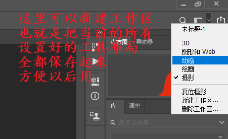

### 文档

#### 分辨率

分辨率尽量大，但是大了的话也会使文件的体积变大

点分辨率（Dot Per lnch）DPI衡量输出（设备）精度的主要参数

- 打印高DPI需要高PPI和高级纸张
- 常见的屏幕物理DPl多为96

线分辨率（Line Per Inch）LPI 衡量印刷精度的主要参数

- 不同纸张设定不同LPI
- PPI要设定为LPI的两倍

常用分辨率设置（像素）：

- 洗印照片 300或以上
- 杂志，名片等印刷物 300
- 海报高清写真 96-200
- 网络图片，网页界面 72/96
- 大型喷绘 25-50

#### 颜色

RGB 从颜色发光原理来设定，红绿蓝混合，用于显示屏
网页、网络图片、视频素材、3D贴图
CMYK 印刷颜色 青色、品红、黄色、黑色进行混合，用于印刷
宣传册、海报、单页、大型喷绘等

颜色位数：8/16/24 一般选8位就好， 16/24是研究用的

#### 背景透明的表现形式

#### 图像大小

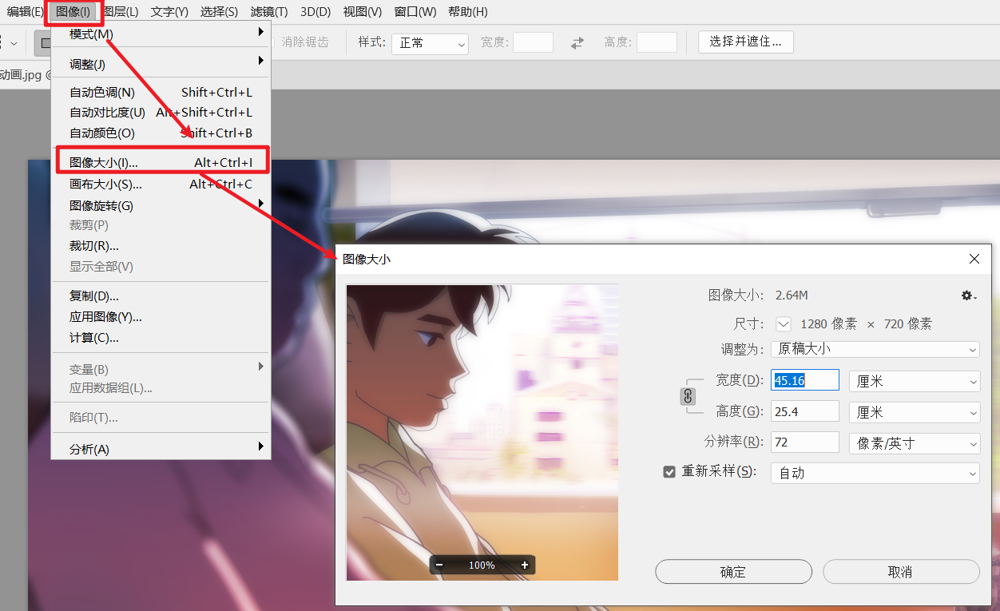

勾选了缩放样式(在在小齿轮里)之后，在图形缩放的时候，图层样式也会跟着成比例放大和缩小

约束比例（长宽旁边的小锁）：限制长宽比

重定图像像素：像素被固定，当改变文档的长、宽、分辨率的时候，另外的属性也会随之变化

自动：画面的总像素 = 高（英寸）* 宽（英寸）* 分辨率（像素/英寸）^2

#### 存储格式

- psd  PS的标准格式，包含颜色，通道，图层，动画等， 原始文件
- psb  ps的大型文件格式 像素可达30w

隐藏文件之后，再保存的时候文件会变小，方便传输

#### 性能

在首选项(Ctrl + K)中

- 暂存盘。PS在工作的时候会产生一个临时文件，数据量大，内存装不下要有个缓冲盘，不建议设置为C
- 历史记录状态。记录的最多历史记录次数
- 文件处理-自动存储设置可以设置自动保存的间隔时间

快捷键设置（尽量用默认的）

菜单栏 -> 编辑快捷键，其中可以更改所有操作的快捷键

可以自行修改所有的快捷键，也可以将一套快捷键保存为一个配置文件，可以在别的电脑上使用了。

### 图层

#### 创建

图层类型：

- 普通图层
- 背景图层
- 智能对象图层
- 调整图层
- 填充图层
- 视频图层
- 矢量图层
- 3D图层
- 文字图层

创建图层：

- 直接点击图层工作区的新建-普通图层
- 按住 alt 再点击， 是详细选项
- 菜单栏图层-新建也可
- 快捷键也可 Ctrl + Shift + N

**双击**名字的**文字**可以改名字

![[基础.imgs/image-20210209212817277.png]]

按住alt，点击图层旁边的小眼睛 - 只显示选中的图层，再次点击就恢复了。

选中之后才能拖拽，拖拽改变图层排列次序（Ctrl+【/】也可以将图层上移一层或者下移动一层，Ctrl+Shift+【/】可以直接移动到最上面或者最下面），排列次序影响视觉效果。

复制图层

- 菜单栏-图层-复制 高级复制
- 按住alt拖拽图层 直接复制为副本（可以同时复制多个图层）
- 复制图层**不能用Ctrl + C**（Ctrl + C的意思是复制当前选区，并新建一个图层来存放当前选区）

删除：直接delete

![[基础.imgs/image-20210209213915813.png]]

### 查看图片方式

抓手工具（单击 H）

双击抓手工具显示全部图像

双击缩放工具显示原图

缩放工具的时候按住鼠标向左向右移动可以快速的放大和缩小

也可以右键图片进行缩放

放大/缩小（Ctrl + +/-）

无论当前的工具是什么：

- 空格 + Alt 同时按下，召唤出临时缩小工具，空格 + Ctrl是放大工具（**最方便**）

## 工具详解

### 移动工具（V）

拖拽一个文件中的图层到另一个文件中-复制

- 文档大小相同，在拖动，将要松手的时候按下shift，可以让原来的图像保持原位
- 文档大小不同的时候回自动居中
- 如果目标文档包含选取，就会到选区中央

自动选择状态下，在透明区域内可以使用选框选择图层，这样可以同时移动多个图层

![[基础.imgs/image-20210209220517422.png]]

大多数时候都是用按住Ctrl的方法进行移动的。

**按住Alt**拖动图层 --> 将当前图层复制一份到指定位置

**按住Shift**拖动图层 --> 锁定图层移动的方向

上下左右箭头可以进行微调，加上Shift，步长加大

---

对齐按钮，需要选择多个图层

默认情况下，目标侧的图层固定，其他图层移动找齐

两图层垂直对齐，怎样选择使一个追随另一个来对齐，而不是共同向中间靠拢？

- 先将两图层进行链接，然后选择其中一个图层，则未选中的向选中的图层移动对齐

### 选区和选框工具

选区内的像素可被编辑和移动

选取是临时性的，但可以存储在文件（的通道）里面（用右键）

单行和单列选区是选择一行或者一列的一个像素条（可以羽化）

### 套索和魔法工具

套索

- 用backspace或者delete可以取消套索工具的上一步选择
- 在套索工具中，使用多边形套索的时候按住Alt键可以使用自由套索
- 多边形套索工具，首尾接近的时候光标出现**小圆圈**的时候，再次点击可以闭合。（也可以双击、按住Ctrl左击、回车）

多边形套索可以画到外边、自由套索工具不能。

多边形套索适合直线选择。

Ctrl + Shift + J 通过剪切的图层（将图层剪切到另一个图层上面）

磁性套索

- 磁性套索可以自动识别像素的边缘
- 选项频率是识别像素边缘的控点的频率

魔法选择工具（W）

- 魔棒选择颜色相近的区域
- 选项 - 连续 - 取消之后会把图层上的所有的颜色相近的图层都选中

色彩范围的用法和魔棒差不多。

魔棒工具也有局限性，一旦需要分离颜色差不多的颜色就不行了。

快速选择工具，比较好。

调整边缘就是选择并遮住。

选区可以有透明度

为选区填充颜色：

- Alt + Delete 多次填充前景色

![[基础.imgs/image-20210210084231156.png]]

![[基础.imgs/image-20210210084231156.png]]

选区可以变成路径。

### 历史工具

历史画笔工具，使用画笔的形式对历史进行部分恢复

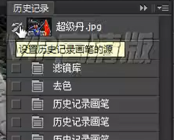

历史记录面板的这个画笔可以设置历史记录画笔的源，也就是使用画笔将这张图的哪个部分恢复到源的状态

### 画笔工具

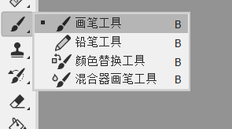

#### 画笔工具

使用方法:

- 直接拉动
- 按住Shift拉动，可以画出来**直线**
- 按住Shift点击起点和终点（递归点击），可以画出来连续的直线
- 改变前景色，改变画笔的颜色
- 画笔状态按住Alt，吸取当前颜色变为前景色
- Shift + Alt + 鼠标右键  可以使用HUD拾色器

#### 画笔预设

画笔状态鼠标右击，召唤预设面板，改变画笔的大小、硬度

【、】或者Alt + 鼠标右键左右移动 改变画笔的大小

Shift + 【、】 或者鼠标右键上下移动改变画笔的硬度

可以自定义笔刷：

编辑 --> 定义画笔预设，就是将当前**图层**转换为画笔。

#### 铅笔工具

铅笔的笔带有锯齿

#### 橡皮擦工具

**学会了蒙版之后，橡皮擦几乎不用，**

**实际工作中不建议使用**

橡皮擦：擦到背景

背景橡皮擦：擦除背景，得到主题图像，图标中心要留在背景上

- 这个的高级功能还挺有用的，自己可以摸索一下。

魔术橡皮擦：擦除颜色相近的工具

### 修复工具

锐化和模糊效果无法转换

模糊工具会改变、损失很多原有的像素信息

涂抹工具和画笔一样使用就行。

减淡工具

- 保护色调可以保护图像在使用减淡时防止色调失真

加深工具

仿制图章工具

- 先使用Alt + 鼠标左键进行位置的选区
- 再在要复制的地方用“画笔”进行“复制”
- “对齐”选项取消之后，鼠标松开之后刷新复制起点
- 当前和下方模式可以定义当前及下方图层的图像为源，其他选项以此类推
- 可以跨文档进行

图像图章工具和仿制图章差不多，只不过是自己选择一个图片作为模板，对当前图像进行擦除之后显露模板的样子

修复画笔工具和仿制图章差不多

- 和仿制图章共享源
- 有一定的智能性，可以和周围环境进行融合

污点修复画笔 - 修复小“污点”

- 类似于选区大面积像素用来平均污点周围像素值

修补工具 - 修复大“污点”

- 建立选区 =》鼠标拖拽

内容感知移动工具

- 建立选区 =》 移动

红眼工具

- 直接框出来就行了

### 颜色和图案的填充

建立选区之后，填充在选区内进行

油漆桶用来填充颜色相近的区域（可以选择容差）

填充：Shift+F5 或者 Shift + BackSpace

填充背景色：Ctrl + Del

渐变工具：

- Shift锁定角度
- 双击展示色块可以进行相关的编辑

### 自由变换

Ctrl + Shift + Alt + T 重复上一次变换操作并复制到新的图层

自由变换模式下按住Ctrl键快速进入扭曲模式

### 通道和蒙版基础知识

通道：

RGB通道由红绿蓝三个通道构成，每一个通道都用灰度图像来表示每个像素颜色的强度（也可以设置为用有颜色的图像，但那样不好看），区域颜色越白表示通道中颜色的强度越强。

通道面板上最多能有56个通道，除了rgb之外还能存53个

通道默认用灰色表示，如果想用彩色表示，那么：Ctrl + K -> 界面 -> 选项 -> 用彩色显示通道

不同的颜色模式的通道不同，CMYK就有四个通道

Alpha通道：记录透明度信息的特殊图层

- 黑色不包含像素信息，代表透明；白色代表100%像素覆盖，代表此处是不透明的实色区域 
- 一般情况下用8位通道即2的8次方，256种色阶，0~255，0是黑色透明，255是白色不透明，1~254表示灰色半透明

- Ctrl + 点击Alpha通道，在当前通道载入被点击通道的选区。 
- 通道的编辑方式和图层一样，灰阶像素的调整和形状的编辑，就是为了得到相应的选区。

---

- 按住Ctrl点击通道可以快速载入被点击的通道的选区

Alpha通道：黑色

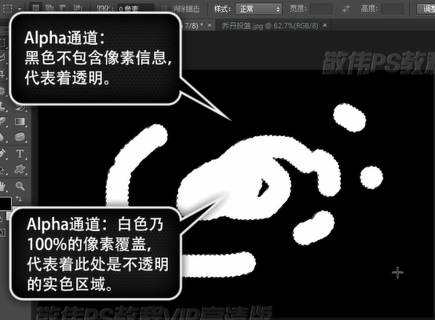

一般情况下我们使用8位的通道，2^8=256种色阶

单个通道 0~255 种色阶

0 黑色 完全透明，1~254 灰 半透明（通道的精华所在），255 白 不透明

灰度表示透明度

---

编辑Alpha通道

通道和图层一样，可以使用各种各样的工具

用灰色画笔在上面进行勾画可以实现羽化的效果

---

选中区域之后可以点击图层下方的“添加图层蒙版”来创建图层蒙版

按住Alt点击 “添加图层蒙版”是隐藏选区内的内容

按住Ctrl点击 是功能“显示全部”

编辑蒙版的时候一定要激活蒙版

被抹掉的地方只是被遮蔽了，而不是删除了。

右击蒙版或者按住Shift 点击可以停用图层蒙版。

“选择并遮住” 可以调节选取的各种参数

---

快速蒙版

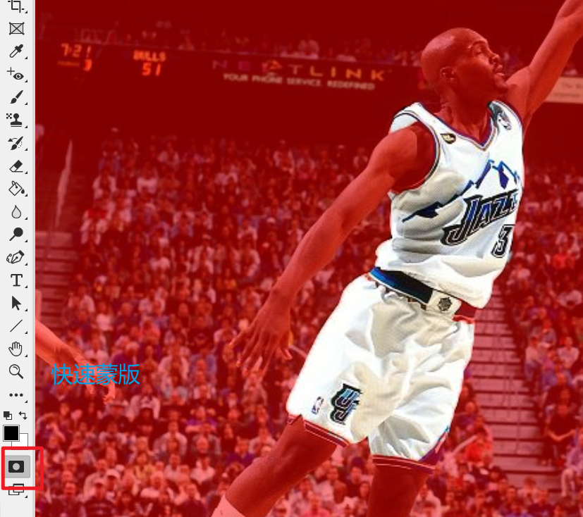

做好选区之后按Q可以进入快速蒙版模式，直接在原图上添加图层蒙版

优点：方便快捷；和图层叠加显示，方便查看

“直接在画面上进行选取的调整”

调整快速蒙版的选项

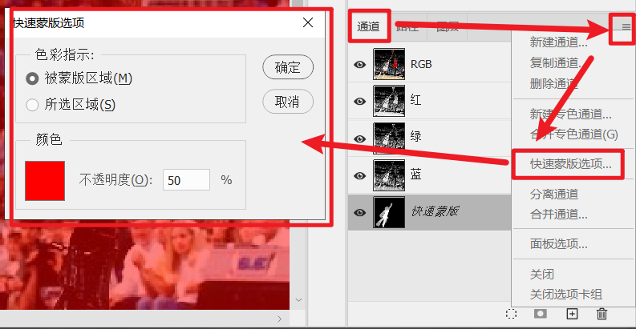

快速蒙版是临时的，不会保存在通道中，适用于进行不是很重要的调整。

### 图层进阶

**过滤与锁定**

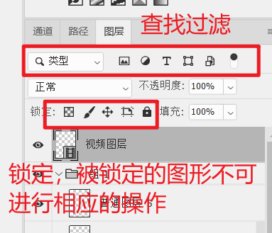

锁定透明像素：锁定整个图层上的所有透明像素

锁定图像像素：禁止编辑图像，但可以移动和变换

锁定位置：禁止移动变换

锁定全部：字面意思

**图层链接：**

选中图层们，右键“链接图层”或者点击图层面板下面的链接按钮创建图层链接

选中一个不在连接中的图层和其他在连接中的任何一个图层，点击创建图层链接按钮可以拉这个图层“入伙”

可以进行多个图层的统一移动和变换，对每个图层进行编辑的时候对其他的还是没有影响的。

按住Shift 点击连接目标可以 临时 停用链接（类似于图层蒙版）

右键在连接中的任何一个图层，“选择链接图层” 可以快速选择在链接中的图层。

**图层编组**

直接点击创建新组按钮可以创建一个新组

选中多个图层，然后按住Shift点击图层功能下方的 “创建新组” 按钮可以把选中的图层归到一个组中去。【Ctrl + G 快速编组，可以递归编组。】

按住 Alt 点击 新建组 可以选择新建组的高级选项

**图层拼合**

Ctrl + E 向下合并。向下合并一个图层，合并到下面的图层，1合并到2，不保留1，或者合并多个图层，或者合并一个组

Ctrl + Alt + E 保留图层并向下合并。将1合并到2，但是保留1

Ctrl + Shift + E 合并可见图层（字面意思）

**图层盖印（可以用智能对象替代）**

Ctrl + Alt + Shift + E 合并所有可见图层的效果，并生成新图层。

Ctrl + Alt + E 盖印多个图层，合并选中图层的效果

**图层复合（不常用）**

保存当前图层的位置，可见性和样式信息。

**图层剪贴蒙版**

上方图层进入下方图层形状

创建剪贴蒙版 Ctrl + Alt + G

把“约束”放在下方，把被蒙住的图形放在上方。

创建剪贴蒙版之后：

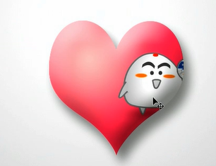

上方的被下方的约束住了。

快捷方法：

选择 2 图层，按住Alt键拉住，接近3的时候有提示，松手，则会把2加入到剪贴蒙版中。

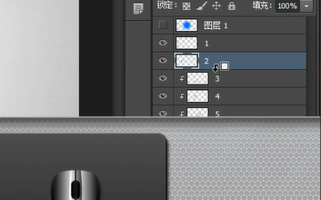

图层组只能作为“约束”

### 色彩基础

选择吸管工具：Alt键切换吸管工具的前景色和背景色（按住Alt）；

Shift + Alt + 右键 切换 HUD拾色器

色彩三要素：色相、饱和度、明度

按 Ctrl + U 调整

色相：看起来是啥颜色

饱和度：看起来纯不纯

明度：看起来亮不亮

选色：

颜色面板、色板、拾色器

RGB是加色模式，CMYK是减色模式。

### 亮度与色阶

明度：

Ctrl + U 的色相和饱和度可以调节明度，但是效果太单一了。

色阶：合并颜色的发光级别

色阶直方图：用二维坐标表示画面像素发光强度的分布。

直方图从左到右分别为黑场分布、灰场分布、白场分布

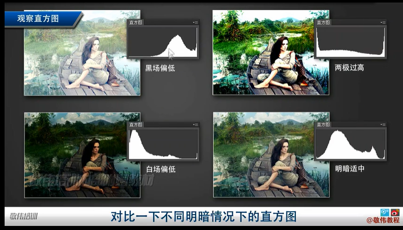

调整色阶有三种方式：

- 合并黑场（调节滑块1）
- 合并白场（调节滑块3）
- 改变黑白场的比例（调节滑块2）

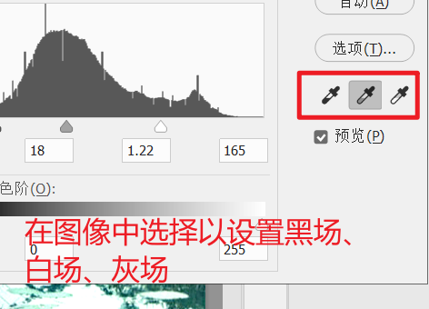

我们也可以单独调整某一个通道的色阶。

面板上的“自动”就是自动调节

“选项”就是选择相应的算法。暂时用不到这么高级的。

---

**调整图层**

对下方的所有图层有影响，对上方的没有影响。

如何把调整图层的作用域作用在其下方 1个 图层上 --> 使用剪贴蒙版

还可以添加蒙版

### 曲线和色彩平衡调色

**实际工作中使用：蒙版+调整图层**

**曲线：Ctrl + M**

**色彩平衡调色 Ctrl + B**

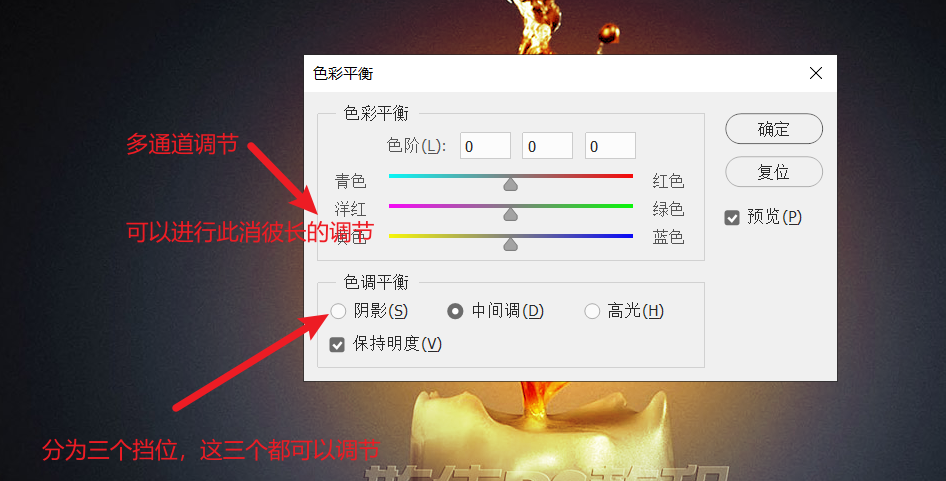

### 钢笔工具【矢量图制作】

独立于图层存在。

### 文字处理工具

创建文字的两种类型：点式文字、区域文字

文字蒙版工具：快速建立文字选取，输入文字点击提交之后显示文字的选区

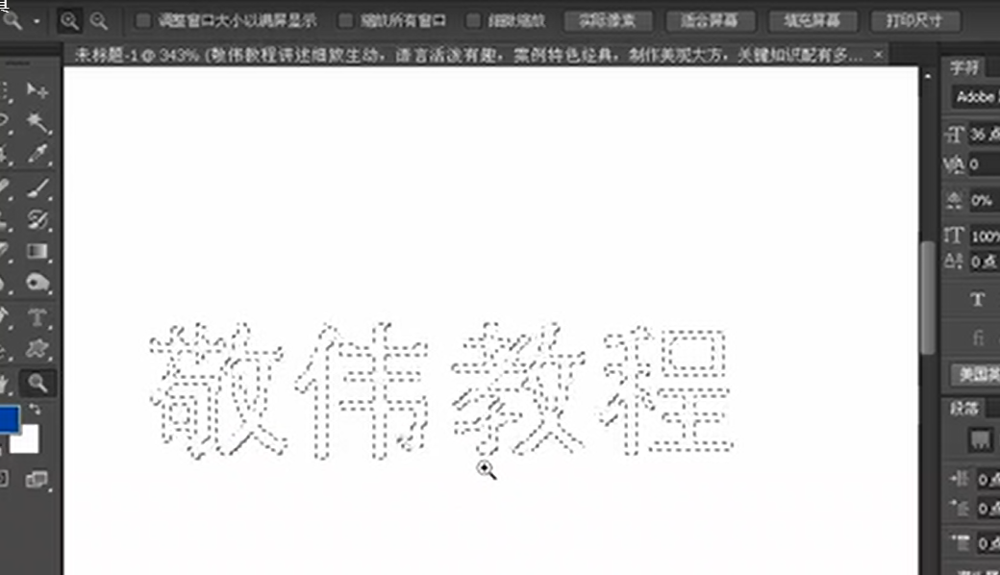

在路径上输入文字：用钢笔画路径或者用图形生成路径；文字工具的光标靠近路径的时候光标会变化，这时候我们输入的文字可以根据路径显示

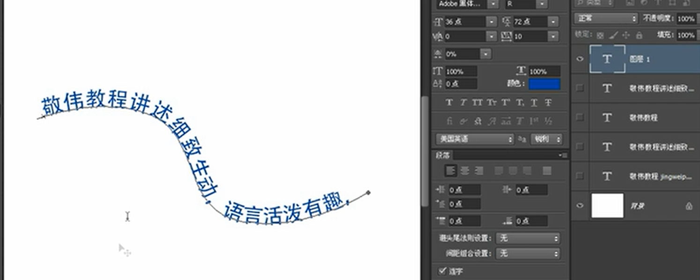

---

**文字图层**

最好不要栅格化，可以转换为智能对象

在图层上右击可以从点文本和段落文本之间相互转化

关于抗锯齿：大字不使用抗锯齿、小字可以不适用抗锯齿（清除）

文字图层的两种状态：

- 图层激活状态（选中图层）
- 图层的文字激活状态（选中图层之后，用T工具选中文字）；或者双击图层的图标T

调整文本格式：

- 行距：文字激活状态的时候，选中文字，按住Alt键按小键盘的上下键调整文字的行距
- 文字间距：文字激活状态的时候，选中文字，按住Alt键按小键盘的左右键调整文字的行距

### 实用的辅助工具

**裁剪工具，快捷键C**

拖动裁剪和滑动裁剪

选取也可以转换为裁剪区域，需要用鼠标点击激活

拉直工具：拉一条直线，系统会以我们拉取的这个直线为基准裁剪，使得裁剪后的图像以我们刚才拉的这个直线为水平线

不勾选“删除裁剪的像素”的时候，裁剪操作不会影响图层的像素（勾选上之后被裁剪掉的像素会被删除）

【透视裁剪工具不常用】

---

**画布大小 Ctrl + Alt + C**

或者最上方->图像->画布大小

可以对画布进行裁切

裁切后的大小比较大的时候，会进行填充

点击相对之后，输入的值为扩大的Δ，正数表示扩大，负数是缩小

定位，表示图像的变大或者变小以那个方向为基准；此时是以中心为基准向八面扩展。

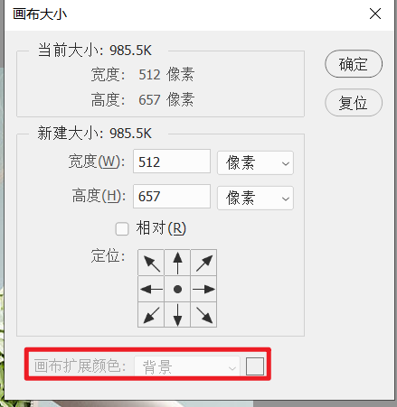

---

裁切

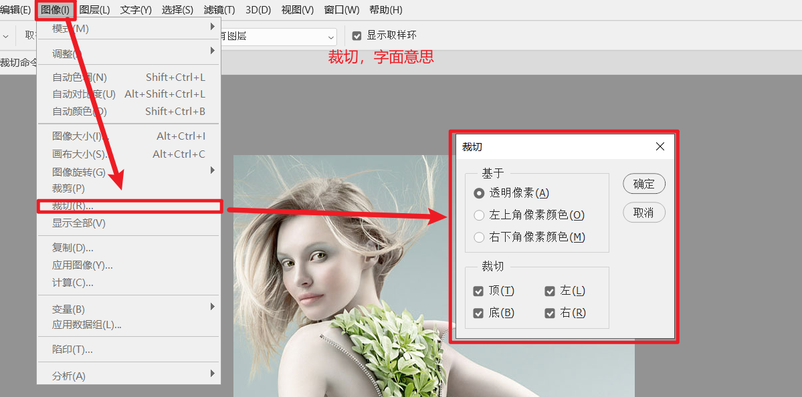

---

辅助功能：

屏幕模式：F

显示额外内容 Ctrl + H ，可以显示以下内容

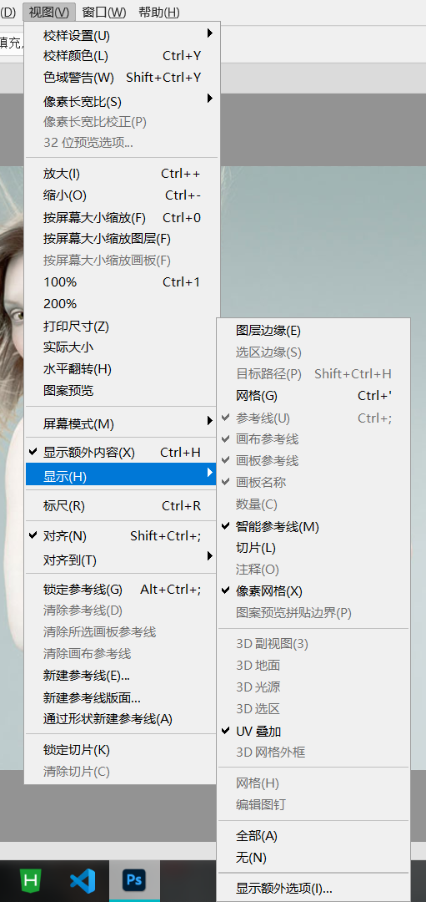

标尺：Ctrl + R

标尺可以自己设置归零点：拖动这个小方块会有十字线，松手以设置（双击小方块以恢复）

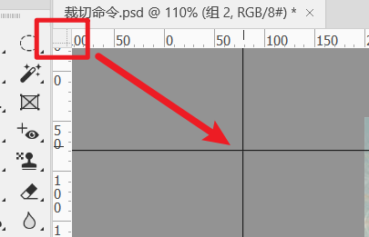

参考线：从标尺上直接往下或者往右拉；指针模式下可以收回去；如果怕被移动，可以 视图->锁定参考线

---

对齐（吸附）

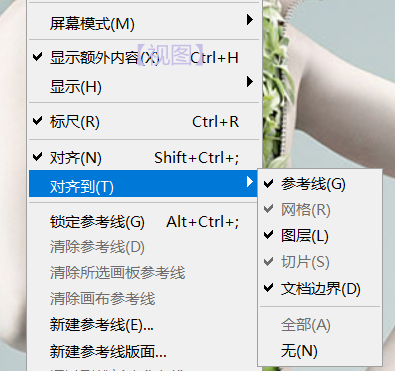

---

F12 把文档恢复到打开的状态，恢复操作会记录在历史中。

### 批量处理大量图像——动作

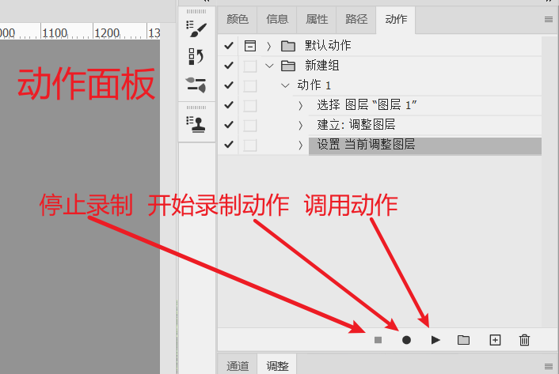

批处理命令：

文件-> 自动 -> 批处理

具体内容自己看

文件->脚本->图像处理器

具体内容自己看
