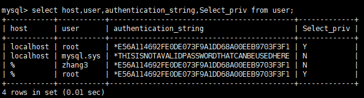
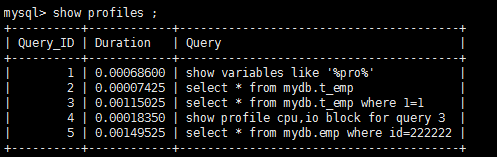
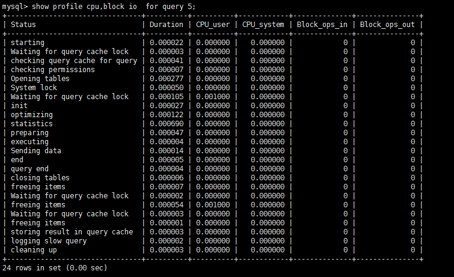
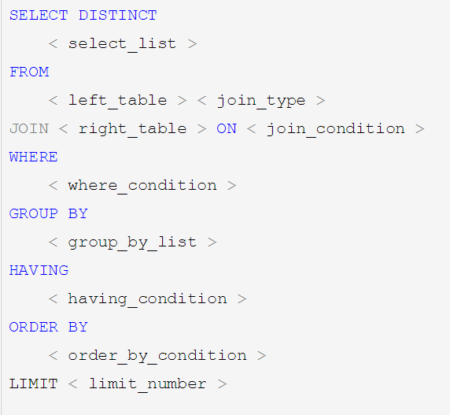
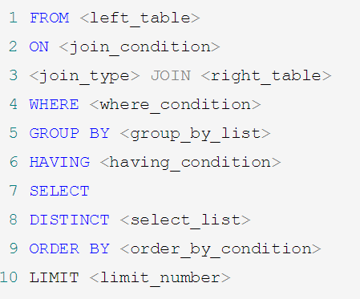
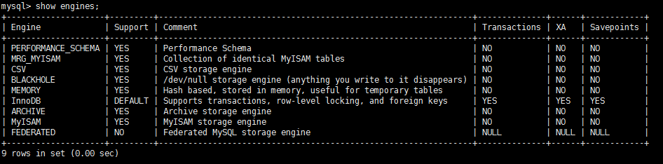
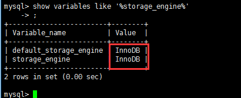

## MySQLMySQL架构介绍

MySQL是一个关系型数据库管理系统，由瑞典MySQL AB公司开发，目前属于Oracle公司。 

MySQL是一种关联数据库管理系统，将数据保存在不同的表中，而不是将所有数据放在一个大仓库内，这样就增加了速度并提高了灵活性。

MySQL是开源的，所以你不需要支付额外的费用。

MySQL是可以定制的，采用了GPL协议，你可以修改源码来开发自己的MySQL系统。 

MySQL支持大型的数据库。可以处理拥有上千万条记录的大型数据库。

MySQL使用标准的SQL数据语言形式。

MySQL可以允许于多个系统上，并且支持多种语言。这些编程语言包括C、C++、Python、Java、Perl、PHP、Eiffel、Ruby和Tcl等。

MySQL支持大型数据库，支持5000万条记录的数据仓库（分库），单表最大容量大约为500万条数据（分表），32位系统表文件最大可支持4GB，64位系统支持最大的表文件为8TB。

### MySQL用户与权限管理

#### 用户管理

- 创建用户` create user zhang3 identified by '123123';`
	
	- 表示创建名称为zhang3的用户，密码设为123123；
- 修改当前用户的密码:

  -  `set password =password('123456'); flush privileges; `
- 修改某个用户的密码: 
	- `update mysql.user set password=password('123456') where user='li4'; flush privileges; `

-  修改用户名：
	- `update mysql.user set user='li4' where user='wang5'; flush privileges;`

- 删除用户：
	- `drop user li4 ;` （不要通过delete from  user u where user='li4' 进行删除，系统会有残留信息保留。 ）
- <span style = "color:red">flush privileges;   所有通过user表的修改，必须用该命令才能生效。</span>

**user表：**

查看用户
`select host,user,authentication_string,select_priv,insert_priv,drop_priv from mysql.user;`



 **host**    表示连接类型

% 表示所有远程通过 TCP方式的连接

IP 地址 如 (192.168.1.2,127.0.0.1) 通过制定ip地址进行的TCP方式的连接

机器名   通过制定i网络中的机器名进行的TCP方式的连接

::1   IPv6的本地ip地址  等同于IPv4的 127.0.0.1

localhost 本地方式通过命令行方式的连接 ，比如mysql -u xxx -p 123xxx 方式的连接。

**User**   表示用户名

同一用户通过不同方式链接的权限是不一样的。

**password**   密码

所有密码串通过 password(明文字符串) 生成的密文字符串。加密算法为MYSQLSHA1 ，不可逆 。

mysql 5.7 的密码保存到 authentication_string 字段中，不再使用password 字段。

**select_priv , insert_priv**  等为该用户所拥有的权限。

#### 权限管理

授予权限：

授权命令： grant 权限1,权限2,…权限n on 数据库名称.表名称 to 用户名@用户地址 identified by ‘连接口令’; 该权限如果发现没有该用户，则会直接新建一个用户。

```sql
grant select,insert,delete,drop on atguigudb.* to li4@localhost  ;

 #给li4用户用本地命令行方式下，授予atguigudb这个库下的所有表的插删改查的权限。
```

```sql
grant all privileges on *.* to joe@'%'  identified by '123'; 
#授予通过网络方式登录的的joe用户 
```
对所有库所有表的全部权限，密码设为123.

收回权限：

查看当前用户权限 show grants;

收回权限命令： 
revoke  权限1,权限2,…权限n on 数据库名称.表名称  from  用户名@用户地址 ;

```sql
REVOKE ALL PRIVILEGES ON mysql.* FROM joe@localhost;
#收回全库全表的所有权限

REVOKE select,insert,update,delete ON mysql.* FROM joe@localhost;
#收回mysql库下的所有表的插删改查权限
```

<span style="color:red"> 必须用户重新登录后才能生效</span>

查看权限：

查看当前用户权限
`show grants;`

查看某用户的全局权限
`select  * from user ;`

查看某用户的某个表的权限
`select * from tables_priv;`

### sql_mode的配置

MySQL的sql_mode合理设置

sql_mode是个很容易被忽视的变量，默认值是空值，在这种设置下是可以允许一些非法操作的，比如允许一些非法数据的插入。在生产环境必须将这个值设置为严格模式，所以开发、测试环境的数据库也必须要设置，这样在开发测试阶段就可以发现问题。

show  variables like 'sql_mode';

在my.ini文件中，有个sql_mode属性

sql_mode常用值如下： 
set sql_mode='ONLY_FULL_GROUP_BY';

ONLY_FULL_GROUP_BY：
对于GROUP BY聚合操作，如果在SELECT中的列，没有在GROUP BY中出现，那么这个SQL是不合法的，因为列不在GROUP BY从句中

NO_AUTO_VALUE_ON_ZERO：
该值影响自增长列的插入。默认设置下，插入0或NULL代表生成下一个自增长值。如果用户 希望插入的值为0，而该列又是自增长的，那么这个选项就有用了。

STRICT_TRANS_TABLES：
在该模式下，如果一个值不能插入到一个事务表中，则中断当前的操作，对非事务表不做限制

NO_ZERO_IN_DATE：
在严格模式下，不允许日期和月份为零

NO_ZERO_DATE：
设置该值，mysql数据库不允许插入零日期，插入零日期会抛出错误而不是警告。

ERROR_FOR_DIVISION_BY_ZERO：
在INSERT或UPDATE过程中，如果数据被零除，则产生错误而非警告。如果未给出该模式，那么数据被零除时MySQL返回NULL

NO_AUTO_CREATE_USER：
禁止GRANT创建密码为空的用户

NO_ENGINE_SUBSTITUTION：
如果需要的存储引擎被禁用或未编译，那么抛出错误。不设置此值时，用默认的存储引擎替代，并抛出一个异常

PIPES_AS_CONCAT：
将"||"视为字符串的连接操作符而非或运算符，这和Oracle数据库是一样的，也和字符串的拼接函数Concat相类似

ANSI_QUOTES：
启用ANSI_QUOTES后，不能用双引号来引用字符串，因为它被解释为识别符

ORACLE：
  设置等同：PIPES_AS_CONCAT, ANSI_QUOTES, IGNORE_SPACE, NO_KEY_OPTIONS, NO_TABLE_OPTIONS, NO_FIELD_OPTIONS, NO_AUTO_CREATE_USER.

### MySQL逻辑架构

#### 总体概览

和其它数据库相比，MySQL有点与众不同，它的架构可以在多种不同场景中应用并发挥良好作用。主要体现在存储引擎的架构上，插件式的存储引擎架构将查询处理和其它的系统任务以及数据的存储提取相分离。这种架构可以根据业务的需求和实际需要选择合适的存储引擎。

1.连接层
 最上层是一些客户端和连接服务，包含本地sock通信和大多数基于客户端/服务端工具实现的类似于tcp/ip的通信。主要完成一些类似于连接处理、授权认证、及相关的安全方案。在该层上引入了线程池的概念，为通过认证安全接入的客户端提供线程。同样在该层上可以实现基于SSL的安全链接。服务器也会为安全接入的每个客户端验证它所具有的操作权限。

2.服务层

2.1  Management Serveices & Utilities： 系统管理和控制工具 
2.2  SQL Interface: SQL接口。接受用户的SQL命令，并且返回用户需要查询的结果。比如select from就是调用SQL Interface
2.3 Parser: 解析器。SQL命令传递到解析器的时候会被解析器验证和解析。 
2.4 Optimizer: 查询优化器。
	SQL语句在查询之前会使用查询优化器对查询进行优化。 
	用一个例子就可以理解： select uid,name from user where  gender=1;
	优化器来决定先投影还是先过滤。

2.5 Cache和Buffer： 查询缓存。
	如果查询缓存有命中的查询结果，查询语句就可以直接去查询缓存中取数据。
	这个缓存机制是由一系列小缓存组成的。比如表缓存，记录缓存，key缓存，权限缓存等

3.引擎层。存储引擎层，存储引擎真正的负责了MySQL中数据的存储和提取，服务器通过API与存储引擎进行通信。不同的存储引擎具有的功能不同，这样我们可以根据自己的实际需要进行选取。后面介绍MyISAM和InnoDB

4.存储层。数据存储层，主要是将数据存储在运行于裸设备的文件系统之上，并完成与存储引擎的交互。

#### 查看sql的执行周期

 修改配置文件/etc/my.cnf
新增一行：query_cache_type=1
重启mysql 

先开启 show variables  like '%profiling%';
set profiling=1;

select * from xxx ;

`show profiles;     #显示最近的几次查询`




`show profile cpu,block io for query 编号  #查看程序的执行步骤`



#### SQL执行顺序

首先，mysql的查询流程大致是：

- mysql客户端通过协议与mysql服务器建连接，发送查询语句，先检查查询缓存，如果命中，直接返回结果，否则进行语句解析,也就是说，在解析查询之前，服务器会先访问查询缓存(query cache)——它存储SELECT语句以及相应的查询结果集。如果某个查询结果已经位于缓存中，服务器就不会再对查询进行解析、优化、以及执行。它仅仅将缓存中的结果返回给用户即可，这将大大提高系统的性能。

- 语法解析器和预处理：首先mysql通过关键字将SQL语句进行解析，并生成一颗对应的“解析树”。mysql解析器将使用mysql语法规则验证和解析查询；预处理器则根据一些mysql规则进一步检查解析数是否合法。

- 查询优化器当解析树被认为是合法的了，并且由优化器将其转化成执行计划。一条查询可以有很多种执行方式，最后都返回相同的结果。优化器的作用就是找到这其中最好的执行计划。

- 然后，mysql默认使用的BTREE索引，并且一个大致方向是:无论怎么折腾sql，至少在目前来说，mysql最多只用到表中的一个索引。

手写SQL执行顺序：



机读SQL执行顺序

随着Mysql版本的更新换代，其优化器也在不断的升级，优化器会分析不同执行顺序产生的性能消耗不同而动态调整执行顺序。

下面是经常出现的查询顺序：


### MySQL存储引擎

#### 查看命令

如何用命令查看 
你的mysql现在已提供什么存储引擎:
  mysql> show engines;



`  #看你的mysql当前默认的存储引擎:`
`  mysql> show variables like '%storage_engine%';`



#### 各种简介

1、InnoDB存储引擎

InnoDB是MySQL的默认事务型引擎，它被设计用来处理大量的短期(short-lived)事务。除非有非常特别的原因需要使用其他的存储引擎，否则应该优先考虑InnoDB引擎。

2、MyISAM存储引擎

MyISAM提供了大量的特性，包括全文索引、压缩、空间函数(GIS)等，但MyISAM不支持事务和行级锁，有一个毫无疑问的缺陷就是崩溃后无法安全恢复。

3、Archive引擎

Archive档案存储引擎**只支持INSERT和SELECT操作，不支持UPDATE和DELETE**在MySQL5.1之前不支持索引。
Archive表适合日志和数据采集类应用。
根据英文的测试结论来看，Archive表比MyISAM表要小大约75%，比支持事务处理的InnoDB表小大约83%。

4、Blackhole引擎

Blackhole引擎没有实现任何存储机制，它会丢弃所有插入的数据，不做任何保存。但服务器会记录Blackhole表的日志，所以可以用于复制数据到备库，或者简单地记录到日志。但这种应用方式会碰到很多问题，因此并不推荐。 

5、CSV引擎 

CSV引擎可以将普通的CSV文件作为MySQL的表来处理，但不支持索引。
CSV引擎可以作为一种数据交换的机制，非常有用。
CSV存储的数据直接可以在操作系统里，用文本编辑器，或者excel读取。

6、Memory引擎

如果需要快速地访问数据，并且这些数据不会被修改，重启以后丢失也没有关系，那么使用Memory表是非常有用。Memory表至少比MyISAM表要快一个数量级。

7、Federated引擎

Federated引擎是访问其他MySQL服务器的一个代理，尽管该引擎看起来提供了一种很好的跨服务器的灵活性，但也经常带来问题，因此默认是禁用的。

####  MyISAM/InnoDB

主要区别是前四点，重要！！！

| 对比项 | MyISAM | InnoDB |
| ------ | ------ | ------ |
| 外键   | 不支持 | 支持   |
| 事务   | 不支持 | 支持   |
| 行表锁   | 表锁，即使操作一条记录也会锁住整个表，不适合高并发的操作 | 行锁,操作时只锁某一行，不对其它行有影响，适合高并发的操作   |
| 缓存  | 只缓存索引，不缓存真实数据 |  不仅缓存索引还要缓存真实数据，对内存要求较高，而且内存大小对性能有决定性的影响  |
|关注点|节省资源、消耗少、简单业务|	并发写、事务、更大资源|
|默认安装	|Y	|Y|
|默认使用	|N 	|Y|
|自带系统表使用|	Y	|N|

系统自带的表用MyISAM，不用高并发，但是节省资源

#### 阿里用哪个


- Percona 为 MySQL 数据库服务器进行了改进，在功能和性能上较 MySQL 有着很显著的提升。该版本提升了在高负载情况下的 InnoDB 的性能、为 DBA 提供一些非常有用的性能诊断工具；另外有更多的参数和命令来控制服务器行为。

- 该公司新建了一款存储引擎叫xtradb完全可以替代innodb,并且在性能和并发上做得更好,

- 阿里巴巴大部分mysql数据库其实使用的percona的原型加以修改。
- AliSql+AliRedis
