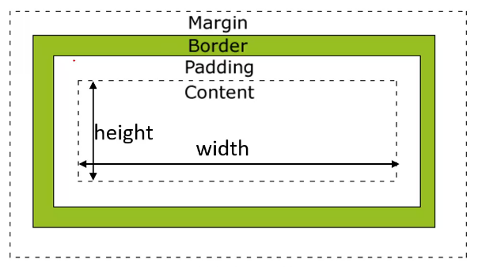

#前端/CSS #CSS/基础

# CSS基础

## 简介

- 层叠样式表 Cascading Style Sheets
- css可用来为网页创建样式表, 通过样式表可以对网页进行装饰,所谓层叠, 可以将整个网页想象成是一层一层的结构, 层次高的覆盖层次低的,css就可以分别为网页的各个层次设置样式
- CSS不是编程语言，不是标记语言，是一种样式表语言。只是一种计算机语言。

CSS官方文档： <https://www.w3.org/TR/?tag=css>

CSS推荐文档：<https://developer.mozilla.org/zh-CN/docs/Web/CSS/Reference#%E5%85%B3%E9%94%AE%E5%AD%97%E7%B4%A2%E5%BC%95>

查询CSS属性的可用性:<https://caniuse.com/>

### 历史

早期网页都是用HTML编写的，但我们希望HTML页面可以变得更加丰富，这个时候就有了具备特殊样式的元素，比如i、strong

- 1994 哈肯·维姆莱和伯特·波斯合作了CSS，1996发布了CSS1
- 1997，W3C成立CSS工作组
- 1998发布了CSS2
- 2006-2009非常流行div+css布局
- 从CSS3开始，所有的CSS被分成了**不同的模块**，每一个模块都有CSS2中额外增加的功能
- 可以说，**没有真正的CSS3**，因为CSS3之后全都模块化了，每一个模块单独发展。
- 第一个CSS模块从2011年发布的。

### 作用：美化HTML

结构和样式分离

- 方式1：添加样式，比如颜色、字体、大小、下划线
- 方式2：布局，比如flex和grid

## 基础知识

### 像素 px

长度单位 像素px

是在网页中使用最多的一个单位 相当于屏幕中的一个小点 我们的屏幕就是由这些点构成的

不同的显示器, 一个像素的大小也不同, 显示效果越好, 越清晰, 像素就越小, 反之像素就越大

### 百分比%

也可以将单位设置为百分比的形式, 这样浏览器会根据其父元素的样式来计算该值

好处 : 当父元素的属性值变化的时候, 子元素也会按照比例发生改变

在我们创建一个自适应页面的时候, 经常使用百分比作为单位

### em

和百分比类似, 是相对于当前元素字体大小来计算的

1 em = 1 font-size

使用em的时候, 当字体大小发生改变的时候, em也会随之改变

设置字体相关的样式的时候经常会使用em

### 颜色

可以直接使用颜色的单词来表示不同的颜色

可以用RGB值

- 通过red, blue, green设置, 通过这三种颜色不同的浓度表示不同的颜色
- 方式 : rgb(red值, green值, blue值)
- 数值
  - 可以为 0 -- 255 之间的数字
  - 可以用 00 -- FF 之间的16进制数字, 两位重复的颜色可以用简写, 如 aabbcc 可以表示为 `#abc`
  - 可以用 0% ~ 100% 之间的百分数

## 编写位置

### 标签中（内联样式）

- 可以将CSS样式写到元素的style属性当中, 叫做内联样式, 只对当前元素的内容起作用, 这样的复用性不太好, **不推荐使用**
- 内联样式属于结构与表现耦合, 在实际开发中不推荐使用
- 也是名-值对结构

```html
	<p style="color: red; font-size: 50px;">WARNING</p>
	<!-- 字体颜色; 字体大小 -->
```

::: tip

在原生的HTML中不推荐使用，但是，在Vue的template中某些动态的样式会使用内联样式的

:::

### head中（内部样式表）

- 也可以将CSS样式便写道head中的style标签中
- 将样式表编写到style标签中吗这样可以将样式进一步复用
- 也可以使表现和结构进一步分离
- 是我们推荐的使用方式
- **缺陷** : 但是这种方式只能在同一个页面中复用, 不能在不同页面复用

```html
<!doctype html>
<html>
    <head>
        <title>CSS</title>
        <meta charset="UTF-8" />
        <style type="text/css">
	<!-- 中间的type是默认值, 写上是因为有的浏览器不兼容会出问题-->
            p{
            color: red;
            font-size: 50px;
            }
<!-- p表示对下面的所有p标签内容有效,大括号内是对这些东西的设置 -->
        </style>
    </head>
    <body>
        <p>窗前明月光, 疑似地上霜</p>
    </body>
</html>
```

::: tip
在vue的开发过程中，每一个组件也有一个style元素，和内部样式非常相似，但是原理并不相同
:::

### 外部CSS文件中

- 开发中最推荐使用
- 还可以将样式表编辑道外部的CSS文件中, 然后用link标签将外部的CSS文件引入到当前页面中
- 完全使得结构和表现分离, 可以使样式表在不同的页面中使用, 最大限度地使样式可以进行复用
- 使用link自结束标签引入, 可以利用浏览器的缓存, 加快用户访问的速度, 提高了用户的体验
- rel="stylesheet" type="text/css"是默认值, 记住就行

```html
<!--myStyle.css-->
p{
    color: royalblue;
    font-size: 30px;
}

<!-- test.html -->
<!doctype html>
<html>
    <head>
        <title>CSS</title>
        <meta charset="UTF-8" />
        <link rel="stylesheet" type="text/css" href="myStyle.css"/>
    </head>
    <body>
        <p>窗前明月光, 疑似地上霜</p>
    </body>
</html>
```

**补充：**

可以在index.css中引入其他所有的css文件

```css
@import url(./style.css);

@import url(./position.css);

```

link元素是外部资源链接的元素，规定了文档与外部资源你的关系，通常位于head中

常见的 属性：

- href：指向被链接的资源的URL，这个URL可以是绝对的，也可以是相对的

- rel：指定链接的类型，常见的类型：
  - icon：站点图标
  - stylesheet CSS样式

> 其他常见的类型：<https://developer.mozilla.org/zh-CN/docs/Web/HTML/Link_types>

## CSS语法

- 在style标签中间就不是HTML代码了, 所以用HTML代码的注释就失效了
- 在CSS代码或者文件中应该用 /*   */ 表示注释
  CSS语法 : 选择器和声明块
  选择器 :
- 通过选择器可以选中页面中指定的元素, 并且将声明块中的样式应用到选择器对应的元素上

声明块 :

- 紧跟在选择器的后面, 用{}括起来
- 实际上是一组名值对结构, 中间用 : 链接
- 名值对叫做声明
- 一个声明块中可以写多个声明, 多个声明之间用 ; 隔开

::: tip
疑问：注释写多了会不会造成文件css文件过大，从而导致用户方面的加载速度过慢？

不会，因为我们实际开发的时候会使用打包和构建工具，他们会优化我们的代码，因此我们在项目中可以随心所欲地写注释。
:::

## 内联（行内）和块元素

这两个元素在HTML5已经没有了

div :

- 块元素, 独占一行的元素，无论内容有多少都会独占一整行
- p, h1, h2 等也是块元素, 都会独占一行
- 没有任何语义(表示一块区域), 就是一个纯粹的块元素, 并且不会为其中的元素设置任何默认样式
- 主要对页面进行布局(分区)

span :

- 内联元素(行内元素)
- 有几个字就占多少地方
- 后面可以跟着其他元素
- 一行容不下的时候会自动换行
- a, img, iframe, span 都是内联元素
- 没有任何语义
- 用来选中自由的文字, 然后为文字设置样式

注意 :

- 一般情况下使用块元素包含内联元素 , 而不是用内联元素包含块元素
- a元素可以包含除了他本身的任何元素
- p不可包含其他任何块元素

## 盒子模型

一个盒子我们会分成几部分, 盒子的大小由以下这些加起来决定

- 内容区(content) 盒子的内容，显示文本 图像
- 内边距(padding) 内容和边框之间的区域，是透明的
- 边框(border) 元素的边框
- 外边距(margin) 外边距是透明的



### 边框

- width **内容区**宽度
- height **内容区**高度
- background-color **内容区**背景颜色

要为一个元素设置边框, 必须设置三个样式

- border-width 宽度
  - 可以分别指定四个边框的宽度, 空格之间用空格隔开, 分别表示 _上左下右_ 的边框(顺时针)
  - 如果设置 3 个值, 则分别设置给 上 左右 下
  - 两个值的话, 就分别设置为 上下 左右
  - 如果指定一个值, 则四个边都是这个值
  - <span style="color: rgb(152, 225, 78);">注意 : 这个规则不仅适用于边框, 还适用于下面的边框颜色, 样式等</span>
- border-color 颜色
- border-style 边框样式
  - 可选值 : solid 实线
  - dotted 点状
  - dashed 虚线
  - double 双线
  - ...更多的参见W3C手册

<span style="color: red">盒子的可见框的大小由内容区, 内边框, 外边距加起来决定</span>

除了border-width, CSS还提供了四个border-xxx-width, xxx可以使top, left, right, bottom, 可以分别设置指定边的宽度

```html
    <style>
        .box1{
            /*宽和高*/
            width: 100px;
            height: 100px;

            /*设置背景颜色*/
            background-color: blue;

            /*边框*/
            border-width: 20px 10px 20px 10px;
            border-color: red orange;
            border-style: solid double; /*实线*/
        }
    </style>
...
    <body>
        <div class="box1"> </div>
    </body>


```

**大部分浏览器, 边框宽度和颜色都是有默认值的, 而边框的样式默认值为none**

边框简写样式 border

- 通过他可以直接设置四个边框的样式, 宽度, 颜色 而且没有任何的顺序要求
- 但是一指定就是四个边, 四个边不能分别制定
- 但是可以通过 border-top, border-left, border-bottom, border-left 分别对四个边的属性进行指定, 规则同 border

### 内边距

指的是盒子的内容区与盒子边框之间的距离

一共有四个方向的内边距, 可以通过

- padding-top
- padding-left
- padding-right
- padding-bottom
  来设置四个方向的内边距值

内边距会影响盒子的可见框的大小, **元素的背景会延伸到内边距**

使用padding可以**同时设置**四个边框的样式, 规则和border-width一致

### 外边距

指的是当前盒子与其他盒子的距离

盒子有四个方向的外边距

- margin-top
- margin-right
- margin-bottom
- margin-left

这个值可以理解为是一个最小值

由于页面中的元素都是靠左靠上拜访的时候, 当我们设置上和左外边距的时候, 会导致盒子的位置发生改变, 如果是设置下和右边距的大小的时候, 会导致其他盒子的位置发生改变, 也就是"挤走"

外边距也可以指定为一个负值, 即向反方向移动

margin还可以设置为auto, aoto一般只设置给**水平**方向的margin

- 如果只指定, 左外边距或者有外边距的margin为auto, 则会将外边距设置为最大值
- 垂直方向如果设置为auto, 则默认就是 0
- 如果left和right同时设置为auto, 则会将两侧的外边距设置为相同的值
- 就可以使元素自动在父元素中居中, 所以我们经常将左右外边距设置为auto, 以使子元素在父元素中居中

外边距也可以使用简写属性margin, 具体方法和内边距一样

垂直外边距的重叠

- 在网页中, **垂直**方向**相邻**外边距会发生外边距的重叠
- 即 兄弟元素之间的相邻外边距会区最大值而不是取和
- 如果父子元素的垂直外边距相邻了, 则子元素的外边距会设置传递给父元素
  - 解决方法:
  - 给父元素设置内边距或者给子元素设置外边距让他俩不相邻
  - 使用空的table标签可以隔离父子元素的外边距, 阻止外边距重叠
- 最终方案:
  - display可以将一个元素设置为表格显示
  - 具体方法见"解决高度塌陷的最终方案"

浏览器为了 在页面中没有样式的时候也有一个比较好的显示效果, 默认设置了一些margin和padding, 而这些默认样式正常情况下我们是不需要使用的, 所以在我们编写样式之前需要将浏览器中的默认margin和padding去掉

```html
<!-- 清除浏览器默认样式 -->
*{
    margin:0;
    padding:0;
}

```

### 内联元素的盒子

内联元素不能设置width和height

可以设置水平内边距, 可以影响页面布局

可以设置垂直内边距, 但是不会影响页面的布局

可以设置边框, 水平边框影响布局, 垂直的不影响

支持水平方向外边距, 不会重叠

支持垂直方向外边距, 会重叠

### _display&visiability&overflow

通过display样式可以修改元素的类型

- inline 可以将一个元素作为内联元素显示
- block 可以将一个元素作为块元素显示
- inline-block 将以一个元素转换为行内块元素
  - 既可以设置宽高, 又不独占一行
- none 不显示元素并且元素不会在页面中继续占用位置
  - 使用该方式隐藏的元素不会在页面中显示并且不再占用页面的位置

visibility 可以用来设置元素的隐藏和显示的转台
可选值: visible 和 hidden

使用这个方式隐藏的元素虽然不可见了, 但是还会占用空间

子元素默认在父元素的内容去中, 理论上子元素的最大大小可以等于父元素的内容区的大小如果超过了父元素的大小, 超过的内容会在父元素意外的位置显示, 超过的内容叫溢出的内容，溢出的元素默认在外面显示，通过overflow可以设置如何处置溢出的内容

可选值:

- visible 一处之后在父元素意外的位置显示
- hidden 溢出的内容会被修剪掉
- scroll  显示滚动条, 可以拖动滚动条查看全部内容
  - 缺点 : 不论是否溢出都会显示滚动条
- **aoto** 根据需求自动添加滚动条, 需要水平就水平, 需要垂直就垂直

## 文档流

文档流处在网页的最底层表示的是一个页面中的位置, 我们所创建的元素都是在文档流中

元素在文档流中的特点

- 块元素
  - 块元素在文档流中会独占一行 块元素**自上向下**排列
  - 块元素在文档流中默认宽度是父元素的100%
  - 当元素的高度或者宽度的值为auto的时候, 此时指定内边距不会影响可见框的大小, 而是会自动修改宽以适应内边距
  - 块元素在文档流中高度默认被内容撑开
- 内联元素
  - 内联元素在文档流中只占自身大小, 会从左到右排列
  - 如果装不下了就换行之后 从左向右排列
  - 宽和高默认都是被内容撑开

## 浮动与文档流

如果希望块元素在页面中水平排列, 可以使块元素脱离文档流--使用float来使元素浮动, 从而脱离文档流

float

可选值

- none 默认值, 在文档流中排列

- right 元素会脱离文档流向右浮动

- left 元素会脱离文档流向左浮动

- 当为一个元素设置浮动以后(float非none), 元素会立即脱离文档流, 脱离以后, 在其下的元素会立即向上移动, 浮动以后会尽量向页面的右上或者左上浮动

- 元素浮动以后, 会**尽量**向页面的左上或右上漂浮, 直到遇见**父元素**的边框或者**其他的浮动元素**

- 如果浮动元素上面是一个没有浮动的块元素, 则浮动元素不会超过块元素

- 如果一行中不足以容纳所有浮动元素, 则会自动换行

- 浮动的元素不会超过它的兄弟元素, 最多对齐

- 浮动的元素不会盖住文字, 文字会自动环绕在元素周围, 所以我们可以通过浮动来设置文字坏绕图片效果

- 在文档流中, 子元素, 默认占据父元素的全部

- 块元素脱离文档流以后, 高度和宽度都被内容撑开

- 内联元素脱离文档流以后会变成块元素

## 布局

### 高度塌陷

在文档流中, 父元素的元素是默认被子元素撑开的, 也就是子元素多高, 父元素就多高, 但是, 当为子元素设置浮动以后, 子元素会完全脱离文档流, 此时, 将会导致子元素无法撑开父元素的高度, 导致了父元素的高度塌陷

带来的问题 : 由于父元素的高度塌陷, 代指了父元素的下面的所有元素向上移动, 导致了页面布局混乱
在开发中一定要尽力避免高度塌陷的问题

解决问题的办法:

- 我们可以将父元素的高度写死来避免这种问题, 但是一旦写死, 父元素的高度将不能自动适应子元素, 所以**不推荐使用**

办法一:

- 原理 : 根据W3C标准, 页面中的元素都有一个隐含的属性, Block Formatting Context (BFC), 该属性可以设置打开或关闭, 当开启了之后, 元素将会有如下特性
  - 父元素的垂直外边距不会和子元素重叠(子元素的外边距将不会传递给父元素)
  - 开启BFC的元素不会被浮动元素所覆盖
  - 开启BFC的父元素可以包含浮动的子元素(子元素就可以撑开父元素了)
- 如何开启?
  - 设置元素浮动
    - 虽然可以撑开父元素, 但是会导致父元素的宽度丢失
    - 而且使用这种方式也会导致斜边的元素上移动
    - **不能彻底解决问题**
  - 设置元素绝对定位
  - 设置元素为inline-block
    - 可以解决问题, 但是也会导致宽度丢失, 不推荐使用
  - 将元素的overflow设置为一个非visible的值(设置为hidden是最**简单**的方式)
    - 但是在IE6及以下的浏览器中不支持开启BFC, 所以使用这种方式不能兼容IE6
    - 在IE6中虽然没有BFC但是又另一个隐含的属性hasLayout, 该属性的作用和BFC类似, 所以在IE6中可以通过开启hasLayout解决
    - 副作用最小的: 将元素的zoom设置为1即可 zoom:1
    - zoom表示放大, 后面的数值为将元素放大几倍
    - zoom只在IE6中支持

方案二 :

clear样式 清除其他元素对当前元素产生的影响, 清除以后, 其他元素会回到原来的位置
可选值:

- none 不清除浮动
- left 左侧
- right 右侧
- both 两侧(清除对他影响最大的元素的浮动)

可以直接在高度塌陷的父元素的最后添加一个空白的div, 由于这个div并没有浮动, 所以他是可以撑开父元素的高度的, 然后再对其进行清除浮动, 这样可以通这个空白的div来撑开父元素的高度, 基本没有副作用

但是, 只用这种方式虽然可以解决问题, 但会在页面中添加多余的结构.

方案三:

通过after伪类, 选中父类的最后面, 想元素的最后添加空白的块元素, 对其清除浮动, 这样做和添加一个div的原理一样, 可以达到相同的效果, 而且不会在页面中添加多余的div, 这是最推荐使用的方式, **几乎没有副作用**

(IE6不支持, 还IE6是要用hasLayout的)

```html
    <style>
        .box1{
            border:1px solid red;
        }

        .box2{
            height: 100px;
            width: 100px;
            background-color: blue;
        }

        .clearfix{
            content: "";
            display: block;
            clear: both;
        }
    </style>
...
    <body>
        <div class="box1 clearfix">
            <div class="box2">
            </div>
        </div>
    </body>

```

最终方案:

经过修改后的clearfix是一个多功能的, 既可以解决高度塌陷, 又可以确保父元素和子元素的垂直外边距不会重叠

```html
<style>
    .clearfix:before, .clearfix: after{
        content: "";
        display: table;
        clear: both;
    }
</style>

```

## 定位

快捷生成标签。标签名.类名$*数量

如

```html
div.box$*3

结果为:

<div class="box1"></div>
<div class="box2"></div>
<div class="box3"></div>

```

- 定位指的就是将指定的元素摆放到任意位置
- 通过定位可以任意的摆放元素
- position属性来设置定位, 可选值
  - static 默认值, 元素没有开启定位
  - relative 开启了相对定位
  - absolute 开启了绝对定位
  - fixed 开启了固定定位

### 相对定位

特点

1. 开启了相对定位(position值relative)而不设置偏移量的时候不产生任何变化
2. 是相对于元素在文档流中原来的位置的定位进行移动
3. 相对定位的元素不会脱离文档流, 原来的位置还被它占着
4. 相对定位会使元素提高一个层级, 即"盖住别的元素"
5. 通常只需要使用两个就够了
6. 开启之后元素的性质不变, 块还是块

开启后, 可以通过left right top bottom 四个属性来设置元素的偏移量

- left 相对于定位位置的左侧的偏移量
- right 右
- top 上
- bottom 下

### 绝对定位

当position的值为absolute的时候开启了绝对定位

特点

- 开启之后, 元素脱离文档流(与相对定位不同)
- 开启之后, 如果不设置偏移量, 元素的位置不变
- 绝对定位是相对于离他最近的开启了定位的祖先元素进行定位的(一般情况, 开启了子元素的绝对定位的同时会开启父元素的相对定位)
  - 如果所有的祖先元素都没有开启定位, 则相对于浏览器的窗口进行定位
- 绝对定位会使元素提升一个层级
- 绝对定位会改变元素的性质, 内联元素变为块元素, 块元素的宽度和高度默认被内容撑开

### 固定定位

当元素的position属性设置为fixed的时候开启了固定定位

固定定位也是一种绝对定位, 它的大部分特点都和绝对定位一样

不同的是:

- 永远都会相对于浏览器窗口进行定位
- 固定定位的元素会固定在浏览器窗口的某个位置, 不会随滚动条滚动而被滚上去

IE6不支持固定定位

### 元素的层级

- 如果定位元素的层级是一样的, 则下面的会盖住上面的
- 通过z-index属性可以用来设置元素的层级
- 可以为z-index指定一个整数值, 该值将会作为当前元素的层级
- 对于没有开启定位的元素不能用z-index
- 父元素的层级再高也不会盖住子元素

设置透明属性opacity

需要一个0-1之间的值, 0表示完全透明, 1表示完全不透明(这个属性在IE8及以下的浏览器中不支持, 需要使用 filter:alpha(opacity=50)相当于0.5的透明度)

## 背景

使用background-image设置背景图片

格式 :background-image:url(相对路径);

返回上一个路径用 ../  (和cmd一样哎)

- 如果图片大于元素, 默认显示图片的左上角, 一样大就全部显示
- 如果图片小于元素大小, 则将图片**平铺**到元素的大小
  - 如何设置只显示一个 ? background-repeat
  - 默认值 repeat 背景图片会双向重复
  - no-repeat 不重复, 有多大显示多大
  - repeat-x 沿着x轴重复
  - repeat-y 沿着y轴重复
- 可以同时设置背景颜色和背景图片, 这样背景颜色将会在背景图片的下面
- 一般设置背景图片的时候会同时指定一个背景颜色
- 背景图片默认贴着元素的左上角显示
  - 如何改变背景图片的开始位置 ? background-position
  - 可以使用 yop right left botton center 中的两个值指定一个背景图片的位置(如果只指定了一个值, 则另一个默认为center)
  - 可以使用xpos ypos 直接指定两个偏移量, 水平偏移量 垂直偏移量, 正值向右/下
- 如何让背景图片不随着滚动条滚动 ? background-attachment
  - 默认scroll 随着滚动
  - fixed 不随着滚动, 这时候背景图片的定位永远相对于浏览器的窗口
    - 不随窗口滚动的图片我们一般都设置给body
  - inherit 继承父元素的background-attachment设置

背景简写 : background, 没有顺序要求 没有数量要求, 不写的就使用默认值

## 表格样式

- width 宽度
- margin 外边距
- border 外边框
- border-spacing: table和td边框之间默认有一个距离, 可以设置这个数值(px)来改变这个距离
  - 如果想让边框合并呢 ?
  - border-collapse 的值改为 collapse
  - 如果设置了边框合并, 则border-spacing自动失效
