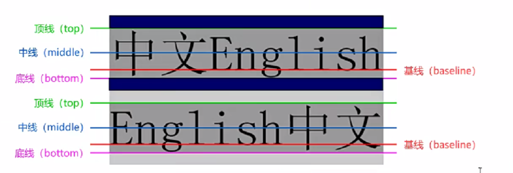
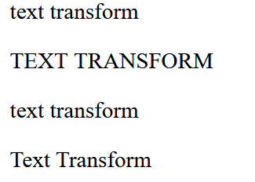
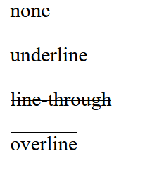
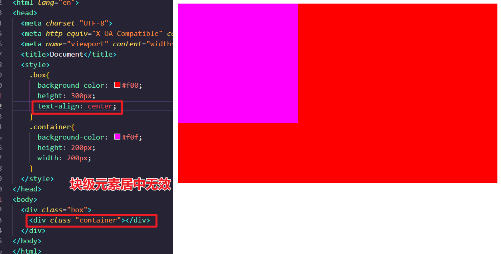
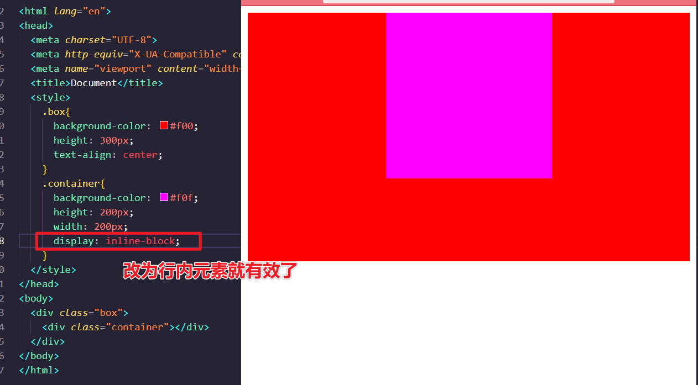

#前端/CSS #CSS/字体 

# 字体和文本

- 前景颜色 color
- 背景颜色 background-color

## 字体分类

网页中的字体分成了五大类(大的分类)

- serif(衬线字体) (有顿笔)
- sans-serif(非衬线字体) (没有顿笔)
- monospace(等宽字体)
- cursive(草书字体)
- fantasy(虚幻字体)

可以将这些最设置为大分类的字体, 然后浏览器从大分类中的字体中自动选择一个使用

不同浏览器对同一个字体的理解可能不同, 所以在不同浏览器打开的时候可能会不一样

一般会将大分类指定为 font-family 的最后一个字体

```html
<span style="font-family: Arial;">你好世界HelloWorld123</span>
<span style="font-family: cursive;">你好世界HelloWorld123</span>
```

## 字体属性

### font-size 字体大小【重要】

默认是16px

- 设置的并不是文字本身的大小
- 在页面中, 每个文字都是在一个'格子'里, 我们设置的font-size实际上是设置的'格子'的高度
- 一般情况下, 文字都要比这个值要小一些，也有时候会比格子大
- 根据字体不同, 显示的效果也不一样

> 1em = 16px，也就是原本从父元素继承下来的字体大小的1倍
>
> 2em = 32px

### font-family 字体样式

- 如 Arial, 微软雅黑等
- 如果浏览器支持, 就用指定的, 不支持就用默认字体
- 该样式可以同时指定多个字体, 不同的字体用**逗号**隔开, 当采用多个字体的时候, 浏览器会优先使用前面的字体

也可以使用`@font-face`指定的可以直接下载字体


### font-style 文字斜体

可选值

- normal 默认值, 文字正常显示
- italic 文字会以斜体显示
  - 字体本身支持斜体时，浏览器会直接调用字体本身的斜体字样

- oblique 以倾斜状态显示
  - 不管支持与否，浏览器对其进行倾斜

- 大多数浏览器的这两个倾斜是一样的

```html
<p style="font-style: italic;" >123123</p>
```

### font-weight 加粗

可选值:

- normal 默认值 = 400
- bold 加粗 = 700
- 100--900 之间的值表示粗细程度
  - 但是因为用户计算机中没有这么多级别的字体, 所以可能达不到我们的效果
  - 200可能比100粗, 也可能一样

```html
<p style="font-weight: bold;">12132</p>
```

### font-variant 小型大写字母

可选值:

- normal 正常
- small-caps 小型大写字母

```html
<p style="font-variant: small-caps;">ABCabc</p>
```

还有一个样式叫font, 可以通过这个同时设置字体相关的所有样式

也就是以上的那些样式, 可以同时设置, 不同的值之间使用空格隔开 没有顺序要求 甚至可以写可不写(默认值)

但是文字的大小和字体<span style="color: red">必须写, 而且字体必须是最后一个样式, 大小必须是倒数第二个样式 </span>

```html
    <style>
        p{
            font : 100 bold 30px;
        }
    </style>
...
    <body>
        <p>123123</p>
    </body>

```

实际上使用简写属性的性能比较好

## line-height 行高

定义：两行文字的基线的间距。（基线：与小写字母x底部对齐的线）



CSS中并没有提供直接设置行间距的方式, 我们只能通过设置行高来间接设置行间距,而且文字会默认居中在行中显示

行间距 = 行高 - 字体大小

通过设置 line-height 来调整行高

- 可以直接接收一个大小
- 也可以指定一个百分数:相对于字体的大小
- 可以传入一个数字表示相对于字体的**倍数**

```html
<style type="text/css">
    p{
    line-height:20px;
}
</style>
```

tips:

- 对于单行文本来说, 将行高设置为和父元素高度一致, 则单行文本在父元素中居中
- 在 font 中也可以指定行高
- 行高只对文本有效。

## text-transform 文本大小写

可选值:

- none 默认值
- capitalize 每个单词的首字母大写(通过空格识别)
- uppercase 所有都大写
- lowercase 所有都小写

```html
  <p style="text-transform: none;">text transform</p>
  <p style="text-transform: uppercase;">text transform</p>
  <p style="text-transform: lowercase;">text transform</p>
  <p style="text-transform: capitalize;">text transform</p>
```




## text-decoration 文本修饰

用来给文本添加各种线或者闪烁文本

可选值

- none 默认值【常用】
- underline 文本下划线 (超链接默认为这个)
- hoverline 文本上划线
- line-through 穿过文本的线（删除线）

```html
  <p style="text-decoration: none;">none</p>
  <p style="text-decoration: underline;">underline</p>
  <p style="text-decoration: line-through;">line-through</p>
  <p style="text-decoration: overline;">overline</p>
```



## font 综合属性

`font-style font-variant font-weight font-size/line-height font-family`

- font-style font-variant font-weight 没有顺序要求，并且都可以省略

- /line-height 可以省略，如果不省略，则必须跟在font-size后面
- font-size和font-family不可以调换顺序，也不能省略

```css
font: small-caps italic 700 30px/50px "等线";
font: 30px/50px "等线";
```


## 对齐文本

### text-aligh 对齐方式【非常重要】

作用：描述**行内级元素**在其父元素中的对齐方式

可选值

- left 左对齐 默认值
- right 右对齐
- center 居中对齐
- justify 两端对齐 调整文本之间的空格的大小达到两端对齐的目的

这个属性对块级元素无效，但是把块级元素改成行内元素就生效了。






### test-indent 首行缩进

- 设置值, 对其他行没有影响
- 可以设置像素值, 但是最好设置为**em**, 即几倍的字体大小
- 当指定正值时, 则自动向右侧缩进指定的像素
- 负值向左缩进 (可以将一些不想显示的字隐藏起来)
  - 不希望用户看见, 但希望搜索引擎看见

```html
    <style>
        p{
            text-align:center;
            text-indent: 2em;
        }
    </style>
...
    <body>
        <p>i love you</p>

```

## 字符间距

字母间距 letter-spacing 字符之间的间距 中英文都有效
单词间距 word-spacing 单词之间的间距 词与词之间空格的大小(对中文来说没啥意义)
这两个属性都可以直接指定一个长度或者百分数, 正数表示增加距离, 负数表示减少距离

```html
    <style>
        p{
            letter-spacing: 1px;
            word-spacing: 3px;
        }
    </style>

```