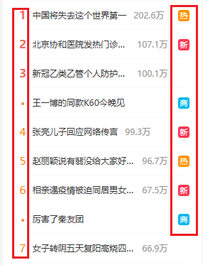
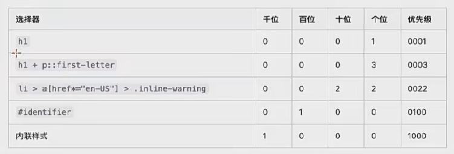

#前端/CSS #CSS/选择器

# 常用选择器

## 元素选择器

作用 : 通过元素选择器可以选择页面中所有指定的元素

```html
<style>
    p{
        color: red;
    }
</style>
```

## id选择器

作用 : 通过元素的id选中唯一的一个元素

语法 : `#id`

注意 : id不能以数字开头

```html
<style>
    #p123{
        color: black;
    }
</style>

......

<p id="p123">123132132123</p>

```

## 类选择器

我们可以为元素设置class属性

class 属性和 id 类似, 但是可以重复

拥有相同class属性值的元素属于同一个类

语法 : .class的属性值{}

```html
        <style>
            .p1{
                color: aqua;
            }
        </style>
    <body>
        <p class="p1">123132132123</p>
        <p class="p1">123132132123</p>
        <p class="p1">123132132123</p>
    </body>
```

class 比 id 的功能强大, class 可以设置多个class属性值, 多个值之间用空格隔开

```html
        <style>
            .p1{
                color: aqua;
            }
            .p2{
                font-size: 50px;
            }
        </style>
...
    <body>
        <p class="p1 p2">123132132123</p>
        <p class="p1">123132132123</p>
    </body>
```

## 选择器分组(并集选择器)

通过选择器分组可以同时选中多个选择器对应的元素

语法 : 选择器1, 选择器2, ..., 选择器n{}

```html
        <style>
            .p1, .p2{
                color: aqua;
            }
        </style>
...
    <body>
        <p class="p1 p2">123132132123</p>
        <p class="p1">123132132123</p>
    </body>
```

## 交集选择器

可以同时选择满足多个条件的元素, 精准地选择某个元素，如:span标签的某class

语法 : 选择器1选择器2...选择器n{}

```html
        <style>
            p.p2{
                color: aqua;
            }
        </style>
...
    <body>
        <p class="p1 p2">123132132123</p>
        <p class="p1">123132132123</p>
    </body>
```

## 通配选择器

用来选择页面中的所有元素

语法 : *{}

```html
        <style>
		  *{
                color: aqua;
            }
        </style>
...
    <body>
        <p class="p1 p2">123132132123</p>
        <p class="p1">123132132123</p>
    </body>

```

## 后代选择器

元素之间的关系

- 父元素 : 直接包含子元素的元素
- 子元素 : 直接被父元素包含的元素
- 祖先元素 : 直接或间接包含后代元素的元素, 父元素也是祖先元素
- 后代元素 : 直接或间接被祖先元素包含的元素
- 兄弟元素 : 拥有相同父元素的元素

后代选择器 :

选中制定元素的后代元素

语法 : 祖先元素 空格 后代元素{}

```html
        <style>
            #d1 p{
                /*选中id为d1的父元素中的p标签的元素*/
                color: aqua;
            }

            #d1 span p{
                /*选中id为d1的父元素的span标签中的p子元素*/
                color: red;
            }
        </style>
...
    <body>
        <div id="d1">
            <p class="p1 p2">123132132123</p>
            <span><p class="p4">123132132123</p></span>
        </div>
        <div>
            <p class="p1">123132132123</p>
        </div>
    </body>

```

## 子元素选择器

作用 : 选中指定父元素的指定子元素

ie6及以下的浏览器不兼容子元素选择器

语法 : 父元素 > 子元素

```html
        <style>
            #d1 > p{
                background-color: rgb(8, 204, 83);
            }
        </style>
...
    <body>
        <div id="d1">
            <p class="p1 p2">123132132123</p>
            <span><p class="p4">123132132123</p></span>
        </div>
```

### 子元素选择器的伪类

- first-child 选择第一个子标签
- last-child 选择最后一个子标签
- nth-child(n) 选择第n个子标签(括号里是变量)
  - 括号里可以传特殊值, 如even 表示偶数位置, odd表示奇数位置
- 和他们的父标签是谁没有关系

```html
    <style>
        p:first-child{
            background-color: yellow;
        }
    </style>
...
    <body>
        <p>123123123132</p> <!--变色-->
        <p>123123123132</p>
        <div><p>123123123132</p></div> <!--变色-->
    </body>
```

- first-of-type 某类型的第一个元素
- last-of-type 某类型的第一个元素
- nth-of-type 某类型的第一个元素

```html
    <style>
        p:first-of-type{
            background-color: yellow;
            /*p类型的第一个(作为)子标签变色*/
        }
    </style>
...
    <body>
        <p>123123123132</p> <!--变色-->
        <p>123123123132</p>
        <div><p>123123123132</p><!--变色-->
            <p>123123123132</p>
        </div>
    </body>

```

## 兄弟类型选择器

- 后一个兄弟元素选择器
  - 选中后一个紧挨着的元素
  - 语法 : 前一个 + 后一个
- 后边所有兄弟元素选择器
  - 语法: 前一个 ~ 后面所有

```html
    <style>
        /*选择div后面所有的兄弟p元素*/
        div ~ p{
            background-color: yellow;
        }
    </style>
...
    <body>
        <div>
            <p>123123123132</p>
        </div>
        <p>123123123132</p> <!--变色-->
        <p>123123123132</p> <!--变色-->
        <div>123123123123</div>
    </body>
```

## 伪类选择器

> 伪类和伪元素选择器都可以用一个冒号或者两个冒号，只不过为了区分，将伪类选择器写成一个冒号，伪元素是两个冒号

伪类 : 专门用来表示元素的一种特殊的状态

比如 :

- 访问过的超链接
- 普通的超链接
- 获取焦点的文本框

给链接定义样式

- 正常连接 a:link
- 访问过的链接 a:visited
  - 由于涉及到用户的隐私问题, 所以使用visited的时候只能设置字体的颜色
- 鼠标滑过的链接 a:hover
- 正在被点击的链接 a:active
- hover和active不仅可以对a标签用, 还可以对p等其他标签用(IE6除外)

```html
    <style>
		a:link{
            color: blue;
        }
        a:visited{
            color: gray;
        }
        a:hover{
            color : red;
        }
        a:active{
            color: yellow;
        }
    </style>
...
    <body>
        <a href="#">go to top</a>
    </body>
```

使用注意：

- hover必须放在link和visited后面才能生效
- active必须放在hover后面才能生效
- 所以建议的顺序为：link visited focus hover active

---

- 获取焦点 :focus
- 选中内容 ::selection (两个冒号!)
  - 这个伪类在火狐中要采用另一种方式去写 (-moz-selection{}), 为了都兼容, 可以写两个selection

```html
    <style>
        input:focus{
            /*输入状态的文本框显示蓝色*/
            background-color: aqua;
        }
        p::selection{
            /*选中的文本为绿色*/
            background-color: green;
        }
    </style>
...
    <body>
        <input type="text" />
        <p>this is a test text...</p>
    </body>

```

## 伪元素选择器

使用伪元素来表示元素中的一些位置

- 首字母 ::first-letter
- 首行 ::first-line

```html
<style>
        p::first-line{
            /*首行字体大小*/
            font-size: 50px;
        }
        p::first-letter{
            /*首个字母颜色*/
            color: red;
        }
</style>
...

        <p>This is a <br />test text...</p>

```

### before 和 after

> 使用的时候不能省略 content

- :before
  - 表示元素最前面的部分
  - 一般的before都需要结合content这个样式一起使用
  - 通过content可以向before或者after的位置添加一些内容
  - 不能被选中
- :after
  - 表示元素的最后面
  - 其余和before类似

```html
    <style>
        p::before{
            content: "This";
        }
    </style>
...
    <body>
        <p>This is a test text...</p>
    </body>
```

---

扩展：

在这种列表中，前后的小组件一般都是用的after和before伪元素



因为before和after伪元素的内容也可以是图片。

具体形式：

```css
.box::before {
    content: url("./hot.svg");
    
/*
    后面可以使用定位等手段继续调整位置。
    before和after也可以单独设置样式，成为上述列表的样式。
*/
}
```

为什么要这样做？

未来大型项目的代码量会非常多，如果所有的都用标签的话会非常复杂，通过css设置before和after可以简化开发，不需要很多HTML标签。


## 属性选择器

title属性:

- 可以为所有标签指定
- 当鼠标移入到元素上的时候, 元素中的title属性的值会作为提示文字提示

属性选择器

作用 : 可以根据元素的属性或属性值来选取指定元素

语法 :

- 标签[属性名]{} 选取含有指定属性的元素
- 标签[属性名 = ""]{} 选取含有制定元素值的元素
- 标签[属性名 ^= ""]{} 选取属性值以指定值开头的元素
- 标签[属性名 $= ""]{} 选取属性值以指定值结尾的元素
- 标签[属性名 *= ""]{} 选取属性值中包含指定值的元素
- 标签[属性名 |= ""]{} 选取属性值等于指定值或以这个值开头后面紧跟-的元素
- 标签[属性名 ~= ""]{} 选取属性值中包含指定值的元素，如果有其他值必须以空格和val分割

```html
    <style>
        /*为所有具有title属性并且为te开头的p元素设置背景颜色为黄色*/
        p[title ^= "te"]{
            background-color: yellow;
        }
    </style>
...
    <body>
        <p title="test01">This is a test text...</p>
        <p title="taxs02">This is a test text...</p>
        <p title="test02">This is a test text...</p>
    </body>

```

## 否定伪类

作用 : 可以从已经选中的元素中剔除某些元素

语法 ::not(选择器)

```html
    <style>
        /*为所有p元素设置一个背景颜色为黄色
        除了class 值为a123 的*/
        p:not(.a123){
            background-color: yellow;
        }
    </style>
...
    <body>
            <p class="a123">123123123132</p>
            <p>123123123132</p> <!--变色-->
            <p class="a123">123123123132</p>
    </body>

```

## 继承性

- 祖先的样式会传给后代，但不是所有的样式都会传给后代
- 如 : 文字相关的

其余可以查文档。

> 注意：
>
> 继承下来的属性是**计算值**，而不是**设置值**

如果一个元素无法继承，但是还是想要他继承父元素的值，如何做？

- 设置属性为`inherit`

```css
.para p{
    border: inherit;
}
```

## 属性的层叠

CSS的翻译是层叠样式表，什么是层叠呢？

- 对于一个元素来说，相同一个属性我们可以通过不同的选择器给它进行多次设置那么属性会被一层层覆盖上去，但是最终只有一个会生效。

那么多个样式属性覆盖上去，哪一个会生效呢？

- 判断一：选择器的权重，权重大的生效，根据权重可以判断出优先级
- 判断二：先后顺序，权重相同时，后面设置的生效

## 选择器优先级（权重）

当使用不同选择器选中同一个元素的时候, 并且设置了相同的样式, 这时我们的样式之间会产生冲突, 最终会采用哪个样式, 由选择器的优先级(权重)决定

优先级高的优先选中

规则 :

- !important 优先级 10000
- 内联样式, 优先级 1000
- id选择器 优先级 100
- 类和伪类选择器 优先级 10
- 元素选择器 优先级 1
- 通配选择器 优先级 0
- 继承的样式 没有优先级

注意 :

- 当出现多种选择器的时候, 需要将所有选择器的**优先级相加**, 但是 : 选择器的优先级计算不会超过它的最大数量级



- 如果选择器的优先级一样, 则使用靠后的样式
- **并集选择器**的优先级**单独计算**
- 可以在样式的最后添加一个 !important 则样式将会获得最高的优先级, 优先于所有的优先级显示, 甚至超过内联样式, 但是在开发中**尽量避免使用**

## 伪类顺序

link, visited, hover, active 这四个伪类的优先级是一样的

所以如果两个状态同时存在, 则用下面的状态

所以伪类的顺序:

- link
- visited
- hover
- active

如果伪类设置了背景图片, 则会在第一次切换图片的时候, 发现图片会有个非常快的闪烁, 这个闪烁会产生不好的用户体验

- 原因 : 背景图片是以外部资源的形式加载进网页的, 浏览器每架在一个外部资源会单独的发送一次请求, 但是我们外部资源并不是同时加载, 浏览器会在使用资源的时候才加载, 由于link和hover的状态没被马上触发, 所以并不会预先加载, 在加载的过程中会有一段时间, 导致背景图片无法显示, 才会出现闪烁的情况.
- 解决方法 : 把三个状态弄到同一张图片上(CSS-Sprite图片整合技术), 不同的状态显示不同的位置, 用background-position
- 优点:
  - 浏览器只需要发送一次请求就可以加载多个图片, 提高了访问效率, 提高了用户体验
  - 减小了图片的总大小(颜色表合并), 提高了请求速度, 提高了用户体验