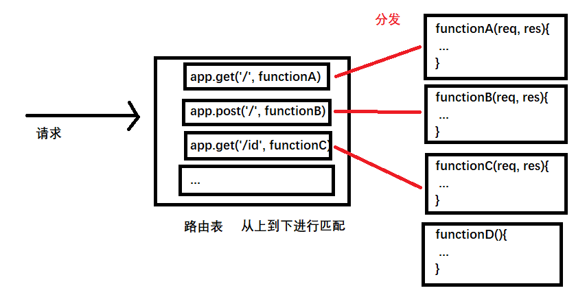
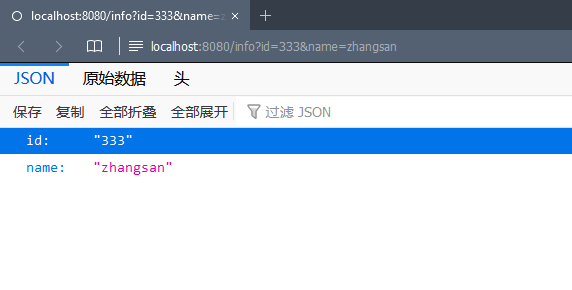
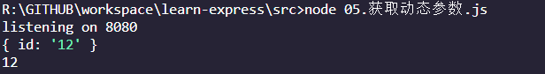
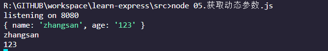
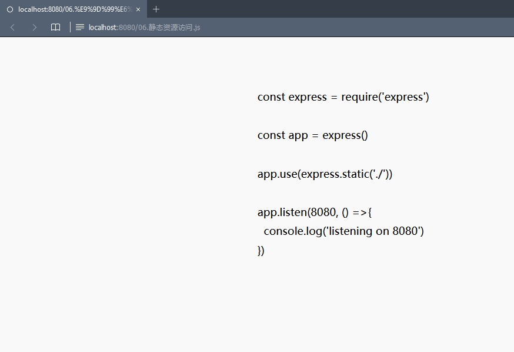
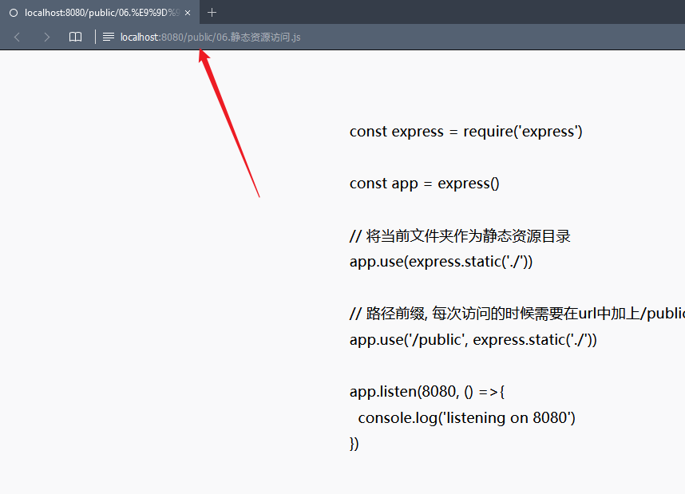
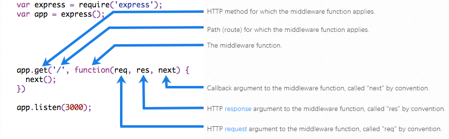
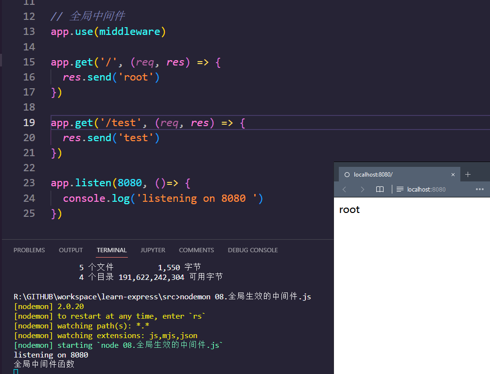
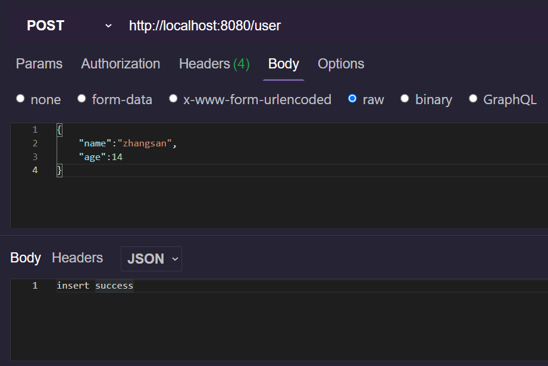

#前端/CSS 

## Express 路由

### 概念

路由是什么

- 客户端的请求和服务处理函数之间的映射关系

组成

1. 请求类型
2. URL
3. 处理函数

```js
app.method(PATH, handler)
    // PATH  路径
    // handler  处理函数

// get 请求，URL是 /
app.get('/', function(req, res){
    res.send('Hello World')
})

// post 请求，URL是 /
app.post('/', function(req, res){
    res.send('Hello World')    
})

```


请求到达服务器之后，需要先进性路由匹配，匹配成功之后才会调用相应的处理函数

匹配成功的条件：

- 请求类型匹配（GET,POST,HEAD...）
- 请求URL匹配（URL相同）




### 简单使用

初始化node项目的 package.json

```bash
npm init -y
```

安装express

```bash
npm install express@4.17.1
```

简单使用

```js
const express = require('express')

const app = express()

// 挂载路由

// get 方法
app.get('/', (req, res) => {
  res.send('Hello World')
})

// post 方法
app.post('/', (req, res) => {
  res.send('post Hello World')
})

// 监听80端口
app.listen(8080, ()=> {
  console.log('listening on 8080')
})
```


### 获取查询参数

#### 静态参数

使用`req.query`获取查询参数，默认是json格式

```js
const express = require('express')

const app = express()

app.get('/info', (req, res) => {
  // req.query 是前端传来的查询参数，默认是空对象
  res.send(req.query)
  // 打印在控制台
  console.log(req.query)
})

app.listen(8080, () =>{
  console.log('listening on 8080')
})
```



#### 动态参数

获取通过冒号匹配的动态参数

使用`req.params`对象获取url中通过冒号匹配到的动态参数，默认是空对象

```js
const express = require('express')

const app = express()

app.get('/info/:id', (req, res) => {
  // app.params 获取冒号中的动态参数
  console.log(req.params)
  console.log(req.params.id)
})

app.get('/info/:name/:age', (req, res) => {
  // 参数可以有多个
  console.log(req.params)
  console.log(req.params.name)
  console.log(req.params.age)
})

app.listen(8080, () =>{
  console.log('listening on 8080')
})
```






### 静态资源托管

#### 静态资源服务器

使用`app.use(express.static('public'))`托管静态资源

- 在指定的目录中查找文件，并提供资源访问路径，存放静态资源的目录名不会出现在url中

```js
const express = require('express')

const app = express()

// 将当前文件夹作为静态资源目录
app.use(express.static('./'))

app.listen(8080, () =>{
  console.log('listening on 8080')
})
```

在浏览器中访问指定文件



注意

- 如果想要托管多个目录，那么多次调用`app.use(express.static(path))`即可
- 在访问的时候，服务器会按照use的顺序查找文件

#### 路径前缀

使用`app.use(prefix, express.static(url))` 添加路径前缀

```js
const express = require('express')

const app = express()

// 将当前文件夹作为静态资源目录
app.use(express.static('./'))

// 路径前缀, 每次访问的时候需要在url中加上/public
app.use('/public', express.static('./'))

app.listen(8080, () =>{
  console.log('listening on 8080')
})
```





### 模块化路由

#### 模块化路由

方便对路由进行模块化管理，不建议把路由直接挂载到app实例上，而是将路由拆分为单独的模块。

步骤：

1. 创建模块对应的js文件
2. 调用`express.Router()`函数创建路由对象
3. 将具体路由挂载到路由对象上
4. 使用`module.expoerts`导出共享路由对象
5. 使用`app.usr`注册路由模块


创建模块对应的js文件、调用`express.Router()`函数创建路由对象、将具体路由挂载到路由对象、使用`module.expoerts`导出共享路由对象

`api/user.js`

```js
// 导入express
const express = require('express')

// 创建路由对象
const router = express.Router()

// 挂载路由
router.get('/user/list', (req, res) => {
  res.send('Get User List')
})

router.post('/user/add', (req, res) => {
  res.send('post User add')
})

// 导出路由对象
module.exports = router
```

使用`app.usr`注册路由模块

`index.js`

```js
const express = require('express')
const app = express()

// 导入路由模块
const userRouter = require('./api/user')

// 注册路由模块
// app.use 的作用：注册全局中间件
// app.use(express.static()) 也是中间件
app.use(userRouter)

// 监听80端口
app.listen(8080, ()=> {
  console.log('listening on 8080')
})
```


#### 添加访问前缀

在上一节中，我们的userAPI的有统一的前缀`/user`，在每一个user路由前面都写上是非常麻烦的，那么如何统一添加user路由前缀呢？

方法：

- 在注册的时候使用 `app.use('/user', userRouter)`
- 第一个参数为访问前缀，第二个参数为路由对象


api/user.js

```js
// 导入express
const express = require('express')

// 创建路由对象
const router = express.Router()

let user = {"id":1,"name":"zhangsan", "age":18}

// 挂载路由
router.get('/list', (req, res) => {
  res.send(user)
})

router.post('/add', (req, res) => {
  res.send('post User add')
})

// 导出路由对象
module.exports = router
```

index.js

```js
const express = require('express')
const app = express()

// 导入路由模块
const userRouter = require('./api/user')
// 注册路由
app.use('/user', userRouter)

// 监听8080端口
app.listen(8080, ()=> {
  console.log('listening on 8080')
})
```


## 中间件

### 是什么

- 业务处理的中间环节，起到承上启下的作用
- express 的中间件的作用是对请求进行**预处理**

中间件的函数和路由极其相似，只不过，**路由的形参列表只有req和res，而中间件的形参列表中必须有next**

官方结构



next的作用是？

- 实现多个中间件连续调用的关键，表示把流转关系交给下一个路由或者中间件

### 基本使用

#### 最简单的中间件

注意：

- 函数的参数**必须带有next**
- 在函数的最后**必须调用next函数把流转关系交给下一个中间件或者路由**

```js
const express = require('express')

const app = express()

// 定义一个最简单的中间件函数
const middleware = (req, res, next) => {
  console.log('最简单的中间件函数')
  // 使用next() 把流转关系交给下一个中间件或者路由
  next()
}

app.listen(8080, ()=> {
  console.log('listening on 8080 ')
})
```


#### 全局生效的中间件

客户端的所有请求到达服务器后都会触发的中间件叫做全局生效的中间件

调用`app.use(middleware_function)`可以定义一个全局生效的中间件

```js
const express = require('express')

const app = express()

// 全局中间件
const middleware = (req, res, next) => {
  console.log('全局中间件函数')
  // 使用next() 把流转关系交给下一个中间件或者路由
  next()
}

// 全局中间件
app.use(middleware)

app.get('/', (req, res) => {
  res.send('root')
})

app.get('/test', (req, res) => {
  res.send('test')
})

app.listen(8080, ()=> {
  console.log('listening on 8080 ')
})
```




简化定义全局中间件：

```js
// 简化形式, 直接use
app.use((req, res, next) => {
  console.log('简化形式')
})
```

#### 中间件的作用

多个中间件之间可以共享同一份req或者res。

因此我们能在上游的中间件中统一给req或者res添加自定义的属性或者方法，供下游的中间件使用

**获取请求到达服务器的时间**

上游挂载获取时间的函数，下游访问请求到达服务器的时间

```js
const express = require('express')

const app = express()

app.use((req, res, next) => {
  // 获取请求到达服务器的时间
  const time = Date.now()
  // 将time属性挂载到req，以后的访问中就可以使用req.startTime访问请求到达服务器的时间了
  req.startTime = time
  next()
})

app.get('/', (req, res) => {
  res.send('' + req.startTime)
})

app.listen(8080, ()=> {
  console.log('listening on 8080 ')
})
```

#### 多个全局中间件

定义了多个中间件后，按照上下顺序进行调用

```js
const express = require('express')

const app = express()

// 第一个全局中间件
app.use((req, res, next) => {
  console.log('the first mw')
  next()
})
// 第2个全局中间件
app.use((req, res, next) => {
  console.log('2 mw')
  next()
})
// 第3个全局中间件
app.use((req, res, next) => {
  console.log('3 mw')
  next()
})


app.get('/', (req, res) => {
  res.send('Hello')
})

app.listen(8080, ()=> {
  console.log('listening on 8080 ')
})
```

#### 局部生效的中间件

不适用`app.use`定义的中间件都叫局部中间件

只针对某个路由生效，在需要生效的路由函数中作为第二个参数即可，也就是`app.get('/', middlewareFunction, handler)`

```js
const express = require('express')

const app = express()

const mw = (req, res, next) => {
  console.log('local mw')
  next()
}

// 作为第二个参数传入即可
app.get('/', mw, (req, res) => {
  res.send('Hello')
})

app.get('/test', (req, res) => {
  res.send('Hello')
})

app.listen(8080, ()=> {
  console.log('listening on 8080 ')
})
```

如果想要定义多个局部中间件，其余的局部中间件依次排列即可，也可以用列表包围

```js
// 多个局部中间件
app.get('/multi', [mw, mw, mw, mw, mw, mw], (req, res) => {
  res.send('Hello')
})

// 两种写法等效
app.get('/multi', mw, mw, mw, mw, mw, mw, (req, res) => {
  res.send('Hello')
})
```

#### 注意

- 在路由前面定义中间件
- 链式调用
- 记住`next()`，并且在next()后面不要再写别的代码
- 多个中间件共享req和res对象

### 中间件的分类

1. 应用级中间件
   1. 通过`app.use()`或者`app.get()`，`app.post()`绑定到`app`上的中间件

2. 路由级中间件
   1. 绑定到`express.Router()`实例上的中间件，使用`router.use`进行注册的中间件
   2. 和应用级中间件在用法上没有任何区别

3. 错误级中间件

   1. 错误级别的中间件一定要**注册到所有的路由之后**，这样才能捕获到所有的错误
   2. 捕获项目中发生的异常错误，防止项目一场崩溃的问题
   3. 格式：中间件的处理函数上必须写上4个形参 `app.use(function(err, req, res, next)=>{})`,必须写上err

      ```js
      const express = require('express')
      
      const app = express()
      
      app.get('/', (req, res) =>{
        throw new Error("error")
      
        // 这条信息不会显示
        res.send('after throw error')
      })
      
      // 如果不写中间件，那么路由函数在抛出异常之后会直接崩溃，停止运行（在前端显示 StackTrace）
      // 使用了中间件之后，项目如果出错，会直接进行错误的显示。
      app.use((err, req, res, next) => {
        // 后端控制台显示 error occured
        console.log('error occured...')
        // 前端页面显示 mw error
        res.send('error page')
        next()
      })
      
      app.listen(8080, ()=> {
        console.log('listening on 8080 ')
      })
      ```

4. Express 内置中间件（3个）

   1. `express.static()`快速托管静态资源（无兼容性）
      1. `app.use(express.ststic())` 上面讲了
   2. `express.json()`解析json格式的请求体数据（4.16.0+）
      1. `app.use(express.json())`
   3. `express.urlencoded`解析url-encoded格式的请求体数据（4.16.0+）
      1. `app.use(express.urlencoded({extended: false }))`

   ```js
   const express = require('express')
   
   const app = express()
   
   // 注册json解析中间件
   app.use(express.json())
   
   app.post('/user', (req, res) =>{
     // 在服务器中可以使用res.body这个属性接受客户端发来的数据
     // 如果没有配置 解析表单中数据的中间件 ，res.body 默认为undefined
     console.log(res.body)
     res.send('insert success')
   })
   
   app.listen(8080, ()=> {
     console.log('listening on 8080 ')
   })
   ```

   

   ```js
   
   // 注册urlencoded格式
   app.use(express.urlencoded( {extended: false} ))
   
   // urlencoded格式
   app.post('/students', (req, res) =>{
     // 如果没有配置 解析表单中数据的中间件 ，res.body 默认为undefined
     console.log(req.body)
     res.send('student insert success')
   })
   
   ```

5. 第三方中间件

   1. `body-parser`中间件的使用 `npm install body-parser`

   ```js
   const express = require('express')
   
   const parser = require('body-parser')
   
   const app = express()
   
   // 使用第三方中间件
   app.use(parser.urlencoded({extended: false}))
   
   app.post('/user', (req, res) => {
     console.log(req.body)
   })
   
   app.listen(8080, ()=> {
     console.log('listening on 8080 ')
   })
   ```

   1. express内置的express.urlencoded这个中间件是基于body-parser封装出来的，因此用法极其相似


### 自定义中间件

模拟一个类似于express.urlencoded这样的中间件解析POST提交到服务器的数据

步骤

1. 定义中间件
2. 监听req的data事件
3. 监听req的end事件
4. 使用querystreing模块解析数据
5. 将解析出来的中间件挂载到req.body
6. 将自定义中间件封装为模块


## 基于Express的接口


