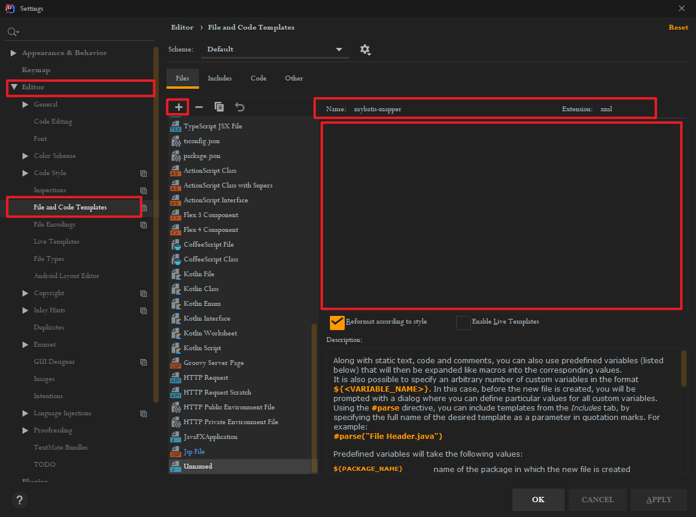
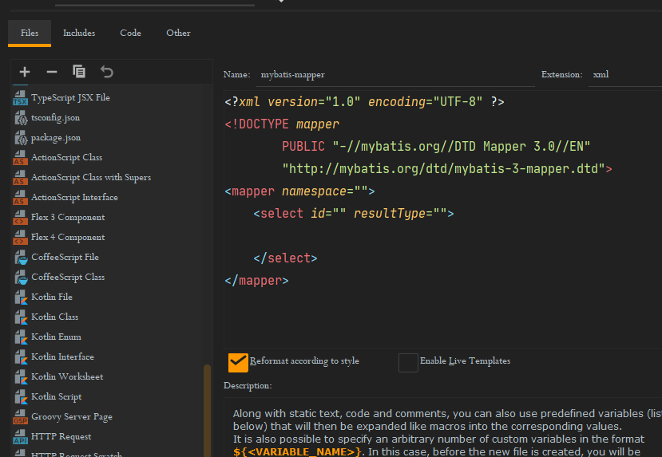
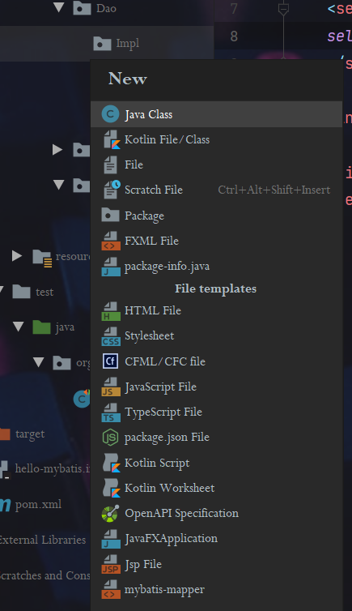
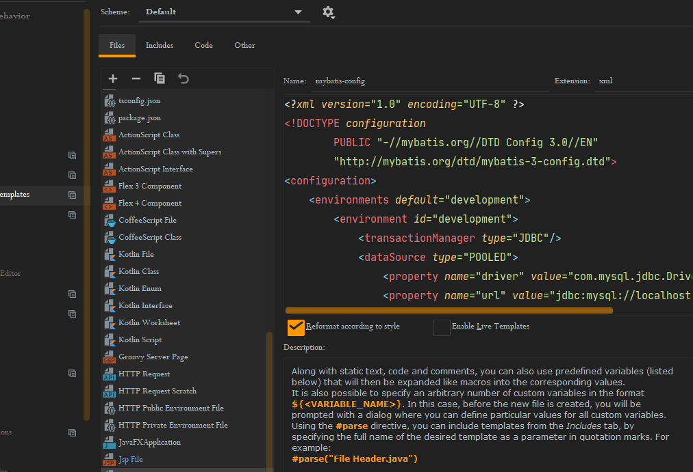

#MyBatis 

# MyBatis

## 概述

### 三层架构

| 名称       | 作用                                                 | 对应的包   | 对应的框架 |
| ---------- | ---------------------------------------------------- | ---------- | ---------- |
| 界面层     | 和用户打交道，接受用户请求参数，显示处理结果         | controller | SpringMVC  |
| 业务逻辑层 | 接受界面层传递的数据，计算逻辑，调用数据库，获取数据 | service    | Spring     |
| 数据访问层 | 访问数据库，执行CRUD                                 | dao        | MyBatis    |

用户使用界面层->业务逻辑层->数据访问层（持久层）->数据库

MyBatis有什么用?

1. 提供了创建connection，statement，Resultset的能力，不用开发人员创建这些对象了
2. 提供了执行sql语句的能力，不用你执行sql
3. 提供了循环sql，把sql的结果转为java对象，List集合的能力
4. 提供了关闭资源的能力，不用你关闭Connection，Statement，Resultset

总结:

mybatis是一个sql映射框架，提供的数据库的操作能力。是一个增强的JDBC，使用mybatis让开发人员集中精神写sql就可以了，不必关心Connection，Statement，Resultset的创建，销毁，sql的执行。

## MyBatis快速入门

> 对应文件：Learning/JavaWeb/Mabatis/1.Hello-Mybatis

### 实现步骤

1. 新建的student表
2. 加入maven的mybatis依赖，mysql驱动依赖
3. 创建实体类，student--保存表中的一行数据的
    1. 其中，成员变量名和表中的数据类型一样
    2. 实体类名和表名一样
4. 创建持久层的dao接口，定义操作数据库的方法
5. 创建一个mybatis使用的配置文件叫做**sql映射文件**：写sql语句的。一般一个表一个sql映射文件。这个文件是xml文件。
    1. 在接口所在的目录中
    2. 文件名和接口保持一致
6. 创建mybatis的**主配置文件**：一个项目就一个主配置文件。主配置文件提供了数据库的连接信息和sql映射文件的位置信息
    1. 位置：maven的位置为`src/main/resources` ，没有就创建
7. 创建使用mybatis类，通过mybatis访问数据库

#### 创建sql映射文件


```xml
<!-- 
	sql映射文件：写sq1语句的，mybatis会执行这些sq1
    1.指定约束文件
    <!DOCTYPE mapper PUBLIC "-//mybatis.org//DTD Mapper 3.0//EN"  "http://mybatis.org/dtd/mybatis-3-mapper.dtd">
    mybatis-3-mapper.dtd是约束文件的名称，扩展名是dtd的。
    2.约束文件作用：限制，检查在当前文件中出现的标签，属性必须符合mybatis的要求。
    3.mapper是当前文件的根标签，必须的。namespace：叫做命名空间，唯一值的，可以是自定义的字符串。要求你使用dao接口的全限定名称。
    4.在文件中可以使用特定的标签，表示数据库的特定操作
    <select> 查询
    <update> 更新
    <insert> 插入
    <delete> 删除
-->

<?xml version="1.0" encoding="UTF-8" ?>
<!DOCTYPE mapper
        PUBLIC "-//mybatis.org//DTD Mapper 3.0//EN"
        "http://mybatis.org/dtd/mybatis-3-mapper.dtd">
<mapper namespace="com.Jancoyan.Dao.IStudentDao">

    <select id="queryAllStudent" resultType="com.Jancoyan.Domain.Student">
    select * from t_student
    </select>

<!--
    select : 表示查询操作
    id是要执行的sql的唯一标识mybatis会根据这个唯一标识去找要执行的sql语句，
    可以自定义，但是要求使用接口中的方法名称
    resultType: 表示sql语句执行后得到的ResultSet，遍历这个ResultSet之后得到的数据类型
    需要填写类型的全限定名称
-->
</mapper>
```

#### 创建主配置文件

复制粘贴以下内容，注意配置相关的参数

```xml
<?xml version="1.0" encoding="UTF-8" ?>
<!DOCTYPE configuration
        PUBLIC "-//mybatis.org//DTD Config 3.0//EN"
        "http://mybatis.org/dtd/mybatis-3-config.dtd">
<configuration>
    <environments default="development">
        <environment id="development">
            <transactionManager type="JDBC"/>
            <dataSource type="POOLED">
                <property name="driver" value="com.mysql.jdbc.Driver"/>
                <property name="url" value="jdbc:mysql://localhost:3306/ssm"/>
                <property name="username" value="root"/>
                <property name="password" value="333"/>
            </dataSource>
        </environment>
    </environments>
    <mappers>
<!--        sql映射文件的位置-->
<!--        一个mapper标签指定了一个文件的映射位置，从类路径开始的路径信息
            也就是从 target/classes的下面开始的-->
        <mapper resource="com/Jancoyan/Dao/IStudentDao.xml"/>
    </mappers>
</configuration>
```

如果在maven的src/main目录下面手动添加了resources，则应该在pom.xml中加上以下语句：

如果没有手动添加，就不用加第二个resource标签里面的内容

作用：使配置文件在编译的时候不会被挪走

```xml

  <build>
    <resources>
      <resource>
        <directory>src/main/java</directory>
        <includes>
          <include>**/*.properties</include>
          <include>**/*.xml</include>
        </includes>
      </resource>

      <resource>
        <directory>src/main/resources</directory>
        <includes>
          <include>**/*.xml</include>
          <include>**/*.properties</include>
        </includes>
      </resource>
    </resources>
  </build>
```

#### 第一个查询程序

创建 IStudentDao 接口，并在其中添加查找函数

```java
public interface IStudentDao {
    List<Student> queryAllStudent();
}
```

IStudentDao.xml 中添加

```xml
    <select id="queryAllStudent" resultType="com.Jancoyan.Domain.Student">
    select * from t_student
    </select>
```

mybatis.xml 中添加

```xml
        <mapper resource="com/Jancoyan/Dao/IStudentDao.xml"/>
```

测试方法：

```java
    public static void main(String[] args) {
        try {
            // 访问MyBatis读取数据
            // 1. 定义mybatis主配置文件名称，从类路径开始
            String config = "mybatis.xml";
            // 2. 读取这个配置文件
            InputStream in = Resources.getResourceAsStream(config);
            // 3. 创建 SqlSessionFactoryBuilder 对象
            SqlSessionFactoryBuilder builder = new SqlSessionFactoryBuilder();
            // 4. 创建 SqlSessionFactory 对象
            SqlSessionFactory factory = builder.build(in);
            // 5. [重要] 获取sqlSession对象，从sqlSessionFactory中
            SqlSession sqlSession = factory.openSession();
            //  6. [重要] 指定要执行的sql语句的表示 sql映射文件中的namespace + . + 标签中的ID
            String SqlId = "com.Jancoyan.Dao.IStudentDao" + "." + "queryAllStudent";
            // 7. 执行sql
            List<Student> students = sqlSession.selectList(SqlId);
            // 8. 输出结果
            for (Student student : students) {System.out.println(student);}
            // 9. 关闭SqlSession对象
            sqlSession.close();
        } catch (IOException e) {
            e.printStackTrace();
        }
    }
```

#### 第一个插入程序

IStudentDao 接口中添加

```java
public interface IStudentDao {
    List<Student> queryAllStudent();
    int insertStudent(Student student);
}
```

IStudentDao.xml 中添加语句

- 其中参数用占位符表示，占位符中是实体类的属性名

```xml
    <insert id="insertStudent" >
        insert into t_student values (${id}, ${name}, ${email}, ${age});
    </insert>
```

注意：MyBaits不会自动提交事务，所以我们要手动提交事务

```java
    @Test
    public void test() {
        try {
            // 访问MyBatis读取数据
            // 1. 定义mybatis主配置文件名称，从类路径开始
            String config = "mybatis.xml";
            // 2. 读取这个配置文件
            InputStream in = Resources.getResourceAsStream(config);
            // 3. 创建 SqlSessionFactoryBuilder 对象
            SqlSessionFactoryBuilder builder = new SqlSessionFactoryBuilder();
            // 4. 创建 SqlSessionFactory 对象
            SqlSessionFactory factory = builder.build(in);
            // 5. [重要] 获取sqlSession对象，从sqlSessionFactory中
            SqlSession sqlSession = factory.openSession();
            //  6. [重要] 指定要执行的sql语句的表示 sql映射文件中的namespace + . + 标签中的ID
            String SqlId = "com.Jancoyan.Dao.IStudentDao" + "." + "insertStudent";
            // 7. 执行sql
            Student student = new Student(1211, "aha", "aha@qq.com", 21);
            sqlSession.insert(SqlId, student);
            sqlSession.commit();
            // 8. 输出结果
            // 9. 关闭SqlSession对象
            sqlSession.close();
        } catch (IOException e) {
            e.printStackTrace();
        }
    }
```

#### 扩展：IDEA的文件模板

直接创建新建文件的模板


以后在创建文件的时候可以直接选择这个模板对应的文件了




同样的方法创建了主配置文件`mybatis-config`


### 设置在控制台上输出运行日志

在mybatis.xml中添加

**注意** : 这个属性必须添加在 configration标签中，并且位置一定只在 properties 的下面，在其他标签的上面，顺序不能错！！

```xml
    <settings>
        <setting name="logImpl" value="STDOUT_LOGGING"/>
    </settings>
```

### 主要类的介绍

1）Resources : mybatis中的一个类，负责读取主配置文件
```java
Inputstream in=Resources.getResourceAsstream（"mybatis.xml"）；
```
2）SqlessionFactoryBuilder：创建sqlsessionFactory对象，

```java
SqlSessionFactoryBuilder builder=new sqlsessionFactoryBuilder（）；
//创建sqlsessionFactory对象
SqlSessionFactory factory=builder.build（in）；
```

3）sqlsessionFactory：重量级对象，程序创建一个对象耗时比较长，使用资源比较多。 在整个项目中，有一个就够用了。

SqlsessionFactory：接口
接口实现类：DefaultscqlsessionFactory 
作用: 获取sqlsession对象。`sqlsession sqlsession=factory.opensession();`

opensession（）方法说明：

1. opensession（）：无参数的，获取是非自动提交事务的sqlsession对象
2. openSession（boolean）：opensession（true）获取自动提交事务的sqlsession ;   opensession（false）非自动提交事务的sqlsession对象

4） SqlSession:

接口，定义了操作数据的方法，例如 selectOnt(), SelectList(), insert(), update()等

实现类为 DefaultSqlSession

使用要求：SqlSession对象不是线程安全的，需要在方法的内部使用，在执行sql语句之前，使用openSession()获取SqlSession，在执行完sql语句之后需要关闭，这样能保证他是线程安全的

### MyBatisUtils工具类

- 用来获取SqlSession

```java
package com.Jancoyan.Utils;

import org.apache.ibatis.io.Resources;
import org.apache.ibatis.session.SqlSession;
import org.apache.ibatis.session.SqlSessionFactory;
import org.apache.ibatis.session.SqlSessionFactoryBuilder;

import java.io.IOException;
import java.io.InputStream;

public class MyBatisUtils {

    private static SqlSessionFactory factory = null;

    static {
        // 需要和项目中的主要配置文件一样
        String config = "mybatis.xml";
        try {
            InputStream in = Resources.getResourceAsStream(config);
            // 使用SqlSessionBuilder创建factory对象
            factory = new SqlSessionFactoryBuilder().build(in);
        } catch (IOException e) {
            e.printStackTrace();
        }
    }

    // 获取SqlSession方法
    public static SqlSession getSqlSession(){
        SqlSession sqlSession = null;
        if(factory != null){
            sqlSession = factory.openSession();
        }
        return  sqlSession;
    }

}
```

有了这个工具类之后，只需要使用工具类来获取SqlSession即可

拿上面的第二个例子来说：

```java
    @Test
    public void test() {
        SqlSession sqlSession = MyBatisUtils.getSqlSession();
        String SqlId = "com.Jancoyan.Dao.IStudentDao" + "." + "insertStudent";
        Student student = new Student(121, "aa", "ha@qq.com", 21);
        sqlSession.insert(SqlId, student);
        sqlSession.commit();
        sqlSession.close();
    }
```

## Dao代理【重点】

### 实现数据库操作

mybatis根据dao方法的调用获取执行sql语句的信息。mybatis根据你的dao接口创建出一个dao接口的实现类，并创建这个类的对象，完成SqlSession方法访问数据库。

**不需要再写接口的实现类！！！**

只需要写接口和对应的sql映射文件，使用mybatis的动态代理机制，使用SqlSession.getMapper(Dao接口.class)，就能获取dao接口对应于实现类的对象

```java
    @Test
    public void test() {
        SqlSession sqlSession = MyBatisUtils.getSqlSession();
        IStudentDao dao = sqlSession.getMapper(IStudentDao.class);
         // 根据Mapper获取
        Student student = new Student(1251, "aaa", "haa@qq.com", 21);
        dao.insertStudent(student); // 直接调用dao的insert方法
        sqlSession.commit(); //需要提交事务
    }
```

### 理解映射文件的参数

#### [了解]parameterType

写在，mapper文件中的一个属性，表示dao接口中方法的参数类型。他的值是java数据类型全名称或者是mybatis定义的别名 - 在mybatis帮助文档中可以查看

注意：这个属性不止是强制的，mybatis通过反射机制能够发现接口参数的数据类型，所以可以没有，**一般我们也不写**

#### [掌握]一个简单参数（Java基本类型和字符串都是简单类型）

获取简单类型的参数值，格式为： `#{任意字符串}`

深入理解：使用#{}之后，mybatis使用的jdbc中的PreparedStatment对象，由Mybatis执行以下代码:

```java
// 假设查询返回一个学生对象
String sql  = "";
PreparedStatment ps = conn.preparedStatment(sql);
ps.setInt()...;
ResultSet rs = ps.executeQuery();
while(rs.next()){
    Student stu = new Student;
    stu.setId(rs.getString("id"));
    //...
}
return stu;
```


#### [掌握]多个参数-使用@param[官方推荐]

多个参数，在接口的形参前面加上 @param，mapper文件中就可以直接使用这个名称来占位

```java
// IStudentDao.java
public interface IStudentDao {
    List<Student> selectStudentByAge(@Param("stuAge") int age);
}
```

```xml
<!-- IStudentDao.xml -->
<select id="selectStudentByAge" resultType="com.Jancoyan.Domain.Student">
        select * from t_student where age = #{stuAge};
</select>
```


#### [掌握]多个参数-使用对象

mapper文件中的占位符与类中的属性和数据库表的属性一一对应

```java
// IStudentDao.java
public interface IStudentDao {
    int insertStudent(Student student);
}
```

```xml
<!--IStudentDao.xml-->
	<insert id="insertStudent" >
        insert into t_student values (#{id}, #{name}, #{email}, #{age});
    </insert>
```

```java
// Test
    @Test
    public void test() {
        SqlSession sqlSession = MyBatisUtils.getSqlSession();
        IStudentDao dao = sqlSession.getMapper(IStudentDao.class);
        Student student = new Student(1251, "aaa", "haa@qq.com", 21);
        dao.insertStudent(student);
        sqlSession.commit();
    }
```


#### [掌握] # 和 $

首选方案是  #

- 安全性高，避免SQL注入
- 效率高

不建议使用  $

`#`表示占位符‘？’ 使用的是PreparedStatement

而$表示字符串的拼接,使用的是 Statement，安全性低，而且用起来比较麻烦

当你能保证sql语句是绝对安全的时候就可以使用$，比如替换列名或者表名：

用一个函数实现根据任意字段排序

```java
// IStudentDao.java
public interface IStudentDao {
    List<Student> selectStudentByOrder(String order);
}
```

```xml
<!--IStudentDao.xml-->
    <select id="selectStudentByOrder" resultType="com.Jancoyan.Domain.Student">
        select * from t_student order by ${order};
    </select>
```

```java
// test
    @Test
    public void testOrder(){
        SqlSession sqlSession = MyBatisUtils.getSqlSession();
        IStudentDao studentDao = sqlSession.getMapper(IStudentDao.class);
        List<Student> students = studentDao.selectStudentByOrder("id"); // 会根据传入的字段进行排序
        for (Student student :
                students) {
            System.out.println(student);
        }
    }
```

总结：

1. `#`使用？在sq1语句中做站位的，使用PreparedStatement执行sql，效率高
2. `#`能够避免sql注入，更安全。
3. $不使用占位符，是字符串连接方式，使用Statement对象执行sql，效率低
4. $有sql注入的风险，缺乏安全性。
5. $：可以替换表名或者列名

### resultType结果封装

resultSet是mybatis的输出结果，是mybatis执行了sql语句，得到的java对象。

resultType结果类型，指sql执行完毕后，数据转为的java对象，类型是**任意的**,只要能转化就行。

resultType值可以是全限定名称，也可以是别名， 或者自定义别名

处理方式：

1. mybatis执行sql语句，然后mybatis调用类的无参数构造方法，创建对象。

2. mybatis把ResultSet指定列值赋值给同名的属性，多余的或者不同的会**忽略掉**

如果是基本数据类型，可以放别名（int/double等）也可以放类型的全限定名称(java.lang.Integer/ java.lang.Double)

定义自定义类型的别名：

 方法一: 为某个类指定别名

在主配置文件 mybatis.xml 中的typeAliases标签中设置别名，这个标签写在environments 的上面，settings的下面

```xml
<!--mybatis.xml-->
	<typeAliases>
        <typeAlias type="com.Jancoyan.Domain.Student" alias="student"/>
    </typeAliases>
```

方法二：为某个包中的所有类指定别名，别名为类的名称，不区分大小写**[实际开发中使用居多]**

```xml
<!--mybatis.xml-->
	<typeAliases>
        <typeAlias type="com.Jancoyan.Domain.Student" alias="student"/>
        <package name="com.Jancoyan.Domain"/>
    </typeAliases>
```

如果有两个包中的两个类名是一样的，则会报错，此时应该使用全限定名名称


如果结果返回map，则只能返回一行，不建议使用map接受返回值。

 resultMap结果映射，指定列名和java对象的属性对应关系

- 自定义列值赋值给哪个属性
- 当**列名和属性名不一样**的时候一定使用resultMap

使用resultMap：

- 先定义resultMap（可以复用）
- 再在select标签中使用resultMap来引用定义

```xml
<!--
    定义resultMap
    id：自定义名称，表示你定义的这个resultMao
    type：java类型的全限定名称
-->
    <resultMap id="studentMao" type="com.Jancoyan.Domain.Student">
<!--        主键用id-->
<!--        将column的值赋值给property的值-->
        <id column="id" property="id"/>
<!--        非主键用result-->
        <result column="name" property="name"/>
        <result column="email" property="email"/>
    </resultMap>
    <insert id="insertStudent" >
        insert into t_student values (#{id}, #{name}, #{email}, #{age});
    </insert>
```

注意：resultMap 和 resultType 不能一起用


逆向思维，如果列名和属性名不一样，有哪些方法可以获取参数值?

1. 定义resultMap，不同的列赋给不同的属性
2. 【推荐】在sql语句中给列起别名  selece name as stuName...

### 模糊查询

1. 在java代码中指定like的内容【推荐】

```java
// IStudentDao.java
public interface IStudentDao {
   List<Student> selectLikeOne(String name); // 在java代码中指定like的内容
}
```

```xml
<!--IStudentDao.xml-->
	<select id="selectLikeOne" resultType="com.Jancoyan.Domain.Student">
        select * from t_student where name like #{name};
    </select>
```

```java
// test
    @Test
    public void testLike(){
        SqlSession sqlSession = MyBatisUtils.getSqlSession();
        IStudentDao studentDao = sqlSession.getMapper(IStudentDao.class);
        // 指定匹配的形式
        List<Student> students = studentDao.selectLikeOne("%haha%");
        for (Student student :
                students) {
            System.out.println(student);
        }
    }

```

2. 在mapper中拼接

接口定义和第一种一样

```xml
<!--IStudentDao.xml-->
	<select id="selectLikeOne" resultType="com.Jancoyan.Domain.Student">
        select id,name,email,age from student where name  like "%" #{name} "%"
    </select>
```

```java
// test
    @Test
    public void testLike(){
        SqlSession sqlSession = MyBatisUtils.getSqlSession();
        IStudentDao studentDao = sqlSession.getMapper(IStudentDao.class);
        // 指定匹配的形式
        List<Student> students = studentDao.selectLikeOne("haha");
        for (Student student :
                students) {
            System.out.println(student);
        }
    }

```


## 动态SQL【理解】

 动态sql: sql的内容是变化的，可以根据条件获取到不同的sql语句。主要是where部分发生变化。

 动态sql的实现，使用的是mybatis提供的标签` <if> ,<where>,<foreach>`

1. < if >是判断条件的，   语法< if test="判断java对象的属性值" >部分sql语句	< /if>
2. < where > 用来包含 多个< if >的， 当多个if有一个成立的， < where >会自动增加一个where关键字，并去掉 if中多余的 and ，or等。这样就不用在语句中多写一个 where 1  = 1 了
3. < foreach > 循环java中的数组，list集合的。 主要用在sql的in语句中。

### < if >

```java
// IStudentDao.java
public interface IStudentDao {
    List<Student> selectStudentIf(Student student); // 测试 if
}
```

注意！！！！

在这里多写了一句  `where 1 = 1` 是为了防止第一个if匹配失败而第二个if匹配成功时，sql语句发生的语法错误。加上之后就不会出错了。

```xml
<!--IStudentDao.java-->
	<select id="selectStudentIf" resultType="com.Jancoyan.Domain.Student">
        select * from t_student
        where 1 = 1
        <if test="name != null and name != '' ">
            and name != #{name}
        </if>
        <if test="age > 10">
            and age > 20
        </if>
    </select>
```

```java
// test
    @Test
    public void testIf(){
        SqlSession sqlSession = MyBatisUtils.getSqlSession();
        IStudentDao studentDao = sqlSession.getMapper(IStudentDao.class);
        List<Student> students = studentDao.selectStudentIf(new Student(1003, "haha", "haha@qq.com", 20));
        for (Student student :
                students) {
            System.out.println(student);
        }
    }
```

### < where >

 ```java
// IStudentDao.java
public interface IStudentDao {
     List<Student> selectStudentWhere(Student student); // 测试 if
}
 ```

```xml
<!--IStudentDao.xml-->
    <select id="selectStudentWhere" resultType="com.Jancoyan.Domain.Student">
        select * from t_student
        <where>
            <if test="age > 20">
                and age &lt; 30
            </if>
            <if test="age > 30">
                and age &lt; 40
            </if>
        </where>
    </select>
```

```java
// test
    @Test
    public void testWhere(){
        SqlSession sqlSession = MyBatisUtils.getSqlSession();
        IStudentDao studentDao = sqlSession.getMapper(IStudentDao.class);
        List<Student> students = studentDao.selectStudentWhere(null);
        for (Student student : students) {
            System.out.println(student);
        }
    }
```


### < foreach >

语法：
```xml
<foreach collection="" item="" open="" close="" separator="">
             #{xxx}
</foreach>
```

- collection:表示接口中的方法参数的类型， 如果是数组使用**array** , 如果是list集合使用**list**

- item:自定义的，表示数组和集合成员的变量
- open:循环开始是的字符
- close:循环结束时的字符
- separator:集合成员之间的分隔符

```java
// IStudentDao.java
public interface IStudentDao {
    List<Student> selectStudentCollection(List<Integer> ages); // 年龄集合
}
```

```xml
<!--IStudentDao.xml-->
    <select id="selectStudentCollection" resultType="com.Jancoyan.Domain.Student">
        select * from  t_student where id in
        <foreach collection="list" item="age" open="(" close=")" separator=",">
            #{age}
        </foreach>
    </select>
```

```java
// test
    @Test
    public void testColletion(){
        SqlSession sqlSession = MyBatisUtils.getSqlSession();
        IStudentDao studentDao = sqlSession.getMapper(IStudentDao.class);
        List<Integer> ages = new ArrayList<>();
        ages.add(21);
        ages.add(20);
        List<Student> students = studentDao.selectStudentCollection(ages);
        for (Student student : students) {
            System.out.println(student);
        }
    }
```

### SQL代码片段

sql代码片段， 就是复用一些语法

步骤

1. 先定义 < sql id="自定义名称唯一" >  sql语句， 表名，字段等 < /sql>
2. 再使用， < include refid="id的值" />

```xml
    <sql id="sql_1">
        select * from t_student
    </sql>

    <select id="selectLikeOne" resultType="com.Jancoyan.Domain.Student">
        <include refid="sql_1" /> where name like #{name};
    </select>
```


## 数据库配置文件

在resource目录下创建属性配置文件，将数据库信息都放到同一个文件中。和Mybatis主配置文件分开，便于修改和保存。

文件的内容为 key=value，目的是便于修改和保存，处理数据，建议key写多级目录，比如

```properties
jdbc.driver=com.mysql.jdbc.Driver
jdbc.url=jdbc:mysql://localhost:3306/springdb
jdbc.user=root
jdbc.passwd=123456
```

