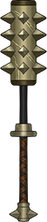

# 狼王

|||
|:----:|:----:|
|固定词条|近战攻击|
|解锁方式|默认解锁|
|效果联动|[锋锐之牙](../Potions/Potion_IncisiveTooth.md) [狼王白鬃](../Potions/Potion_WolfKingWhiteMane.md)|

## 武器特效
- 当你同时携带[锋锐之牙](../Potions/Potion_IncisiveTooth.md)和[狼王白鬃](../Potions/Potion_WolfKingWhiteMane.md)时，你对处于[流血]状态的敌人造成的伤害+60%。
- 当你同时携带[锋锐之牙](../Potions/Potion_IncisiveTooth.md)和[狼王白鬃](../Potions/Potion_WolfKingWhiteMane.md)时，你对处于[流血]状态的敌人造成伤害时有15%的几率使目标向周围射出6枚血弹，造成相当于攻击力250%的伤害。

## 特效机制

## 补充

---

——Page Create By 一只小墨鱼
