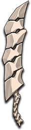

# 蛮武

|||
|:----:|:----:|
|固定词条|近战攻击|
|解锁方式|默认解锁|
|效果联动|[大骨](../Potions/Potion_BigBone.md)|

## 武器特效
- 当你携带[大骨](../Potions/Potion_BigBone.md)时，你的近战攻击有5%的几率触发一次[大骨](../Potions/Potion_BigBone.md)核心槽的效果。
- 蛮武的触发几率额外提高10%。

## 特效机制

## 补充

---

——Page Create By L慢郎中
