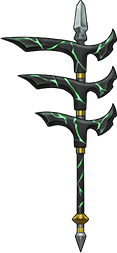

# 冥将

|||
|:----:|:----:|
|固定词条|所有伤害|
|解锁方式|默认解锁|
|效果联动|[黄纸](../Potions/Potion_YellowPaper.md)|

## 武器特效
- 当你的核心槽携带[黄纸](../Potions/Potion_YellowPaper.md)时，黄纸的伤害提高50%。
- 当你的核心槽携带[黄纸](../Potions/Potion_YellowPaper.md)时，将无视[黄纸](../Potions/Potion_YellowPaper.md)等级和拥有黄纸枚数，必定发动[法天象地]。

## 特效机制

## 补充

---

——Page Create By 一只小墨鱼
