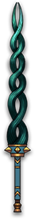

# 冥妆

|||
|:----:|:----:|
|固定词条|所有伤害|
|解锁方式|默认解锁|
|效果联动|[鬼妃断发](../Potions/Potion_HairOfWitch.md)|

## 武器特效
- 当你的核心槽携带[鬼妃断发](../Potions/Potion_HairOfWitch.md)时，[死之咒]会每秒对目标造成相当于你攻击力33%的真实伤害。
- 当你的核心槽携带[鬼妃断发](../Potions/Potion_HairOfWitch.md)时，[死之咒]每次造成伤害时，都有33%的概率发射鬼发对目标以及周围的敌人造成300%的真实伤害，并附加5秒的[燃烧]，[流血]以及[中毒]。

## 特效机制

## 补充

---

——Page Create By 一只小墨鱼
