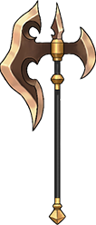

# 山崩

|||
|:----:|:----:|
|固定词条|所有伤害|
|解锁方式|默认解锁|
|效果联动|[大骨](../Potions/Potion_BigBone.md) [破冰石](../Potions/Potion_IceBreaker.md)|

## 武器特效
- 当你同时携带[大骨](../Potions/Potion_BigBone.md)和[破冰石](../Potions/Potion_IceBreaker.md)时，你的近战攻击有15%的几率触发山崩，对前方大范围造成冲击伤害，造成200%的近战攻击。对[昏迷]或[冻结]的敌人造成伤害提高100%。
- 山崩会向当前方向连续触发3次。

## 特效机制

## 补充

---

——Page Create By 一只小墨鱼
