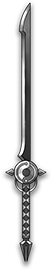

# 时裂
神行迷踪天尊专属 

|||
|:----:|:----:|
|固定词条|所有伤害|
|解锁方式|默认解锁|
|效果联动|无|

## 武器特效
- 你的[神行一闪]会使敌人获得[时之列]效果，时期每秒受到的攻击力60%的伤害，持续10秒。
- [时之列]可以最大叠加5层，每层时之列会使敌人受到的所有伤害提高30%，当你使用[剑心]收刀时，直接引爆所有敌人身上的[时之列]。

## 特效机制

## 补充

---

——Page Create By 一只小墨鱼
