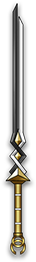

# 双生

神行迷踪天尊专属 

|||
|:----:|:----:|
|固定词条|所有伤害|
|解锁方式|默认解锁|
|效果联动|梦缠|

## 武器特效
- 当你拥有[梦缠]时，[梦缠]对处于[时之破碎]的敌人触发4倍伤害的几率提高40%。
- 当你拥有[迷踪]时，你的瞬身将可以直接发射[幻刃]。并且幻刃的伤害提高250%。

## 特效机制
- 瞬身触发
## 补充

---

——Page Create By 一只小墨鱼
