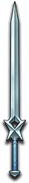

# 星辰

|||
|:----:|:----:|
|固定词条|所有伤害|
|解锁方式|默认解锁|
|效果联动|[星辰之玉](../Potions/Potion_StarJade.md)|

## 武器特效
- 当你携带[星辰之玉](../Potions/Potion_StarJade.md)时，你的近战和飞剑攻击有6%的几率触发[星辰之玉](../Potions/Potion_StarJade.md)的核心槽效果。
- 当你的功效槽携带[星辰之玉](../Potions/Potion_StarJade.md)时，你同时获得太阳和月亮祝福。

## 特效机制

## 补充

---

——Page Create By L慢郎中
