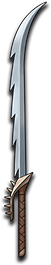

# 牙刃

|||
|:----:|:----:|
|固定词条|近战攻击|
|解锁方式|默认解锁|
|效果联动|[锋锐之牙](../Potions/Potion_IncisiveTooth.md)|

## 武器特效
- 当你携带[锋锐之牙](../Potions/Potion_IncisiveTooth.md)时，你的近战攻击速度提高25%。
- 牙刃提高的近战攻击速度额外提高35%。

## 特效机制

## 补充

---

——Page Create By L慢郎中
