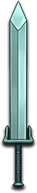

# 养战

|||
|:----:|:----:|
|固定词条|所有伤害|
|解锁方式|默认解锁|
|效果联动|[跌打草](../Potions/Potion_BruiseWeed.md)|

## 武器特效
- 当你携带[跌打草](../Potions/Potion_BruiseWeed.md)时，近战攻击有3%的几率掉落恢复球。
- 养战掉落恢复球的几率提高5%。

## 特效机制

## 补充

---

——Page Create By L慢郎中
