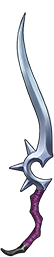

# 鹰眼

|||
|:----:|:----:|
|固定词条|远程伤害|
|解锁方式|默认解锁|
|效果联动|[飞剑强化] [百步穿杨]|

## 武器特效
- 当你拥有[飞剑强化]时，使你的[飞剑强化]效果翻倍。
- [百步穿杨]的触发几率提高20%。

## 特效机制

## 补充
- 飞剑强化是技能书（加10%飞剑伤害）翻倍为20%飞剑伤害。
---

——Page Create By 一只小墨鱼
