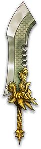

# 斩龙

|||
|:----:|:----:|
|固定词条|所有伤害|
|解锁方式|默认解锁|
|效果联动|斩龙决|

## 武器特效
- [斩龙决]有15%的几率造成3倍伤害。
- 当你拥有[斩龙决]时，你的每一刀都会被斩龙决替代，但[斩龙决]造成的伤害会降低75%，不再受到近战攻击速度加成，但近战攻击速度会转变为近战攻击加成。

## 特效机制

## 补充
- 攻击速度会转变为近战攻击面板。
- 攻击速度为整合后乘算给面板。
---

——Page Create By 一只小墨鱼
