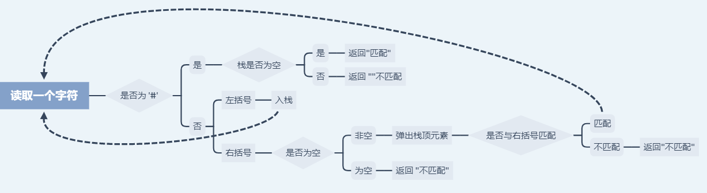
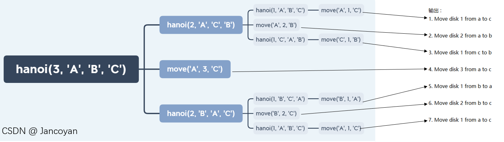

# 栈

>本文为作者学习[b站上交版<<数据结构与算法>>](https://www.bilibili.com/video/BV13W411W7KP?p=5), 结合清华大学出版社<<数据结构(C语言版)>> 的学习笔记, 部分内容来自于视频中的的PPT

## 栈的定义

栈 : 一个只能在栈顶进行插入何删除的线性表, 特征为 LIFO.
空栈 : 不含元素的空表
遵循LIFO(Last In First Out)原则的线性表

## 堆栈的表示和实现

### 栈的表示 :


## 顺序栈操作

```c
#define TRUE 1 //正确
#define FALSE 0 //错误
#define OK 1 //执行成功
#define ERROR 0 //执行有误

#define INFEASIBLE -1 //不可执行
#define OVERFLOW -2 //溢出

typedef int Status; //函数执行的结果, 返回值为 int 类型

typedef int ElemType; //用 int 型元素表示任意类型的元素

#define STACK_INIT_SIZE 100 //初始存储空间
#define STACKINCREMENT 10 //存储空间不够的时候, 每次扩容增加的存储空间

typedef int SElemType;

typedef struct {
	SElemType* base; //栈底
	SElemType* top; //栈顶
	int stacksize; //当前可以使用的最大容量
}SqStack;

//代码来源 <<数据结构>> (清华大学出版社出版, 严蔚敏/吴伟民 编著)
```

base 为 NULL 则栈结构不存在
top 指向的是**栈顶元素的*下一个*位置**(下次入栈的位置)
top-1 指向出栈时下一个元素的取值位置
栈空 : top == base
栈满 : top >= base + stacksize


[top and base]


### 初始化

```c
Status InitStack(SqStack& S){
	S.base = (SElemType*)malloc(STACK_INIT_SIZE * sizeof(SElemType));
	if (!S.base) exit(OVERFLOW); //内存不足
	S.top = S.base; //空栈
	S.stacksize = STACK_INIT_SIZE; //初始存储空间
	return OK;
} //InitStack

//代码来源 <<数据结构>> (清华大学出版社出版, 严蔚敏/吴伟民 编著)
```

用malloc函数分配空间并进行判断, 将栈置空, 并且设置初始存储空间为 STACK_INIT_SIZE

### 销毁

```c
Status StackDestory(SqStack& S)
{
	free(S.base); //将内存释放
	S.base = S.top = NULL; //指针置空
	S.stacksize = 0; //容量归零
	return OK; //返回状态码
} //StackDestory
```

销毁栈的代码如上.

### 判断是否为空

```C
Status StackEmpty(SqStack S) {
	return (S.base == S.top);
} //StackEmpty
```
如果栈S没有初始化, 则无法编译成功(VS2019 : 使用了未初始化的局部变量)
栈为空的条件为 栈顶指针与栈尾指针重合, 所以直接返回 判断栈顶指针与栈尾指针重合的结果

### 长度
```c
int StackLength(SqStack S)
{
	return (S.top - S.base);
}
```
这里直接返回 S.top - S.base 就是栈的长度
因为 : 两个指向同一个数组的指针相减, 得到的结果是两指针中间元素的个数

### 获得栈顶元素
```c
Status GetTop(SqStack S, ElemType& e) {
	if (S.base == S.top) return ERROR; //栈未初始化, 返回错误
	e = *(--S.top); 
	return OK;
} //GetTop
```

S.top指向的是栈顶元素的下一个元素, 所以在返回栈顶元素的时候应该将其先指向栈顶元素 即S.top--, 然后再将其指向的元素赋值给 e 
因为栈 S 不能改变, 所以以值的方式传递, 元素e 以引用的方式传递.

### 入栈

```c
Status Push(SqStack& S, SElemType e){ 
	//元素e插入到栈中, 成为新的栈顶
	if (S.top - S.base >= S.stacksize) {
		//栈满
		SElemType* newbase = (SElemType*)realloc(S.base,
			(STACK_INIT_SIZE + STACKINCREMENT) * sizeof(SElemType));
		if (!newbase)
			exit(OVERFLOW); //空间不够, 退出
		else
			S.base = newbase;
		S.top = S.base + S.stacksize;
		S.stacksize += STACKINCREMENT;
	}
	*S.top++ = e;
	return OK;
} //Push

//代码来源 <<数据结构>> (清华大学出版社出版, 严蔚敏/吴伟民 编著)
```

如果栈满了就将栈用realloc扩容. 每次扩容都增加10个元素的大小. 分配成功后, 将新的地址给S.base
然后将 e 的值赋给S.top(原先栈顶元素的下一个), 栈顶指针后移

### 出栈

```c
Status Pop(SqStack& S, SElemType& e){
	//从栈顶读取数据到e, 栈中下一个元素所在的位置成为新的栈顶
	if (S.top == S.base)
		return ERROR; //栈为空
	e = *--S.top;
	return OK;
} // Pop

//代码来源 <<数据结构>> (清华大学出版社出版, 严蔚敏/吴伟民 编著)
```
由于 S.top 指向的是末尾元素的下一个元素, 所以, 我们只需要把s.top--即可, 下一次使用这一块内存的时候会给他重新赋值, 不需要有其他的操作了
注意 :
入栈 value->top, top++
出栈 top--; top-value, 出栈后可以理解为"这个位置空了" **元素还在** 只是这个元素**不再使用**了, 在下一次赋值的时候就被覆盖了

### 遍历输出

```c
Status TraversePrint(SqStack S)
{
	while (!StackEmpty(S)) {
		printf("%d ", *(--S.top));
	 }
	return OK;
}
```
注意, 这里要对S.top进行自减操作, 所以要用值传递.
每次都输出top指向的前一个位置的元素值, 直到 top 和 base 指针重合.
输出的顺序是从头到底
遵循先入后出原则

## 链栈操作
链栈 : 

[图片 : 链栈]

可以看出, 链栈每一个节点的指针域都指向其前方元素的next域, 而最后一个节点的指针域为NULL

### 初始化

```c
typedef struct stack_node{
	ElemType data;
	struct stack_node* next;
}LinkStack;

Status InitLinkStack(LinkStack *stk){
	stk.next = NULL;
	return OK;
} //InitLinkStack
```
创造头节点.
将头结点的next置为空

### 判断是否为空

```c
Status LinkStackEmpty(LinkStack* stk) {
	return stk->next == NULL;
}//LinkStackEmpty
```

我们已经在初始化的时候将链栈置为空栈. 所以, 如果栈为空栈, 那么stk->next == NULL 的结果为1, 否则为 0.把结果直接返回即可.

### 入栈

```c
Status PUSH(LinkStack& stk, ElemType x){
	LinkStack top = (LinkStack)malloc(sizeof(LinkStack));
    //创造节点
	top->data = x; //数据赋值
	top->next = stk; //next 指向下方元素
	stk = top; //stk 指向栈顶元素
	return OK;
}
```

创造一个栈节点, 其数据域赋值为 x, 并将新的节点的next域指向其下面的节点.
然后令stk继续指向新的栈顶.

### 弹出栈

```c
int POP(LinkStack& stk){
	//将栈顶元素赋值给 e 出栈
	int e = stk->data; //栈顶元素赋值给 e
	LinkStack p = stk; //中间变量 p 临时存放栈顶元素
	stk = stk->next; //栈顶指针前移
	free(p); //释放空间
	return e;
} //POP
```

### 销毁

```c
Status DestoryLinkStack(LinkStack& stk) {
	while (!LinkStackEmpty(stk)){
		POP(stk);
	}
	free(stk);
	stk = NULL;
	return OK;
}//DestoryLinkStack
```
将所有元素全部弹出, 释放掉stk所占的内存之后将stk的指向置空

### 长度

```c
int Length(LinkStack& stk)
{
	LinkStack temp = stk
	int length = 0; //初始长度为 0
	while (temp->next != NULL) {
		temp = temp->next; //当stk->next非空的时候, 也就是没有到栈底
		++length; //长度加一
	}
	return length; //返回栈长
}//Length
```
先用一个节点类型的变量存放stk, 用其进行遍历, 到栈底跳出循环, 返回长度.

### 获得栈顶元素

```c
Status GETTOP(LinkStack& stk, ElemType& e){
	// 获得栈顶元素
	e = stk->data;
	return OK;
}
```
由于stk指向的就是栈顶元素, 所以直接返回 stk的data即可

### 遍历输出

```c
Status TraversePrintLink(LinkStack S)
{
	LinkStack p = S;
	while (!LinkStackEmpty(p)) {
		printf("%d ", p->data);
		p = p->next;
	}
	return OK;
}
```

当p未指向栈底元素的时候, 输出p->data并且向栈底方向移动.


## 进制转换

### 定义栈结构/实现初始化/入栈/出栈/判空函数

```c
#include<stdio.h>
#include<stdlib.h>

#define STACK_INIT_SIZE 100 //初始存储空间
#define STACKINCREMENT 10 //存储空间不够的时候, 每次扩容增加的存储空间

typedef int SElemType;

typedef struct {
	SElemType* base; //栈底
	SElemType* top; //栈顶
	int stacksize; //当前可以使用的最大容量
}SqStack;

int InitStack(SqStack& S){
	S.base = (SElemType*)malloc(STACK_INIT_SIZE * sizeof(SElemType));
	if (!S.base) exit(-1); //内存不足
	S.top = S.base; //空栈
	S.stacksize = STACK_INIT_SIZE; //初始存储空间
	return 1;
} //InitStack

int StackEmpty(SqStack S) {
	return (S.base == S.top);
} //StackEmpty

//代码来源 <<数据结构>> (清华大学出版社出版, 严蔚敏/吴伟民 编著)
```

注意 : 这里的 ELemType 为 int 类型

### 非负十进制数转化为八进制数

```c
void conversionTen2Eight() {
	// 非负十进制数转化为八进制数
	SqStack s;
	int n = 0, e; //n 是将要转换的数, e作为中间变量来存储弹出堆栈的数
	InitStack(s);
	scanf_s("%d", &n);
	while (n) { 
        //当n不为0
		Push(s, n % 8); //余数依次入栈
		n /= 8;
	}
	while (!StackEmpty(s)) { 
        //当栈非空, 依次弹栈
		Pop(s, e);
		printf("%d ", e);
	}
} //conversionTen2Eight

//代码来源 <<数据结构>> (清华大学出版社出版, 严蔚敏/吴伟民 编著)
```

十进制转换八进制为: 除8取余后逆序排列.我们就可以将这个数除以8之后的每一个余数都进栈, 然后依次出栈, 利用栈的先进后出原则进行转换.

### 非负十进制数转化为二进制数

```c
void conversionTen2Two() {
	// 非负十进制数转化为八进制数
	SqStack s;
	int n = 0, e; //n 是将要转换的数, e作为中间变量来存储弹出堆栈的数
	InitStack(s);
	scanf_s("%d", &n);
	while (n) { 
        //当n不为0
		Push(s, n % 2); //余数依次入栈
		n /= 2;
	}
	while (!StackEmpty(s)) { 
        //当栈非空, 依次弹栈
		Pop(s, e);
		printf("%d ", e);
	}
} //conversionTen2Two

//代码来源 <<数据结构>> (清华大学出版社出版, 严蔚敏/吴伟民 编著)
```

将十进制转化为二进制的方法为除2取余逆序排列, 入栈出栈方式与十进制转化为八进制类似.

## 简单括号匹配

>()[]{} 的配对问题
>方法 : 见到左括号入栈, 右括号出栈, 并且和弹出的符号匹配
>假设表达式的结束符为 #

### 定义栈结构/实现初始化/入栈/出栈/判空函数

``` c
#include<stdio.h>
#include<stdlib.h>

typedef char SElemType;

typedef struct {
	SElemType* base; //栈底
	SElemType* top; //栈顶
	int stacksize; //当前可以使用的最大容量
}SqStack;

int InitStack(SqStack& S){
	S.base = (SElemType*)malloc(STACK_INIT_SIZE * sizeof(SElemType));
	if (!S.base) exit(-1); //内存不足
	S.top = S.base; //空栈
	S.stacksize = STACK_INIT_SIZE; //初始存储空间
	return 1;
} //InitStack

int StackEmpty(SqStack S) {
	return (S.base == S.top);
} //StackEmpty


int Push(SqStack& S, SElemType e){ 
	//元素e插入到栈中, 成为新的栈顶
	if (S.top - S.base >= S.stacksize) {
		//栈满
		SElemType* newbase = (SElemType*)realloc(S.base,
			(STACK_INIT_SIZE + STACKINCREMENT) * sizeof(SElemType));
		if (!newbase)
			exit(-1);
		else
			S.base = newbase;
		S.top = S.base + S.stacksize;
		S.stacksize += STACKINCREMENT;
	}
	*S.top++ = e;
	return 1;
} //Push

Status Pop(SqStack& S, SElemType& e){
	//从栈顶读取数据到e, 栈中下一个元素所在的位置成为新的栈顶
	if (S.top == S.base)
		return -1; //栈为空
	e = *--S.top;
	return 1;
} // Pop
```

注意 : 这里的 ElemType 为 char 类型. 

### 函数实现

```CQL
int IsMatch(char ch, char e) {
    //判断两个括号是否匹配
	if (ch == ')' && e == '(')
		return 1;
	if (ch == ']' && e == '[')
		return 1;
	if (ch == '}' && e == '{')
		return 1;
	return 0; 
} //IsMatch

int MatchJudge() {
	// 匹配返回 1, 否则返回 0
	SqStack s;
	char ch;
	char e;
	InitStack(s);
	scanf_s("%c",&ch); //读取一个字符
	while (ch != '#') {
		if (ch == '(' || ch == '[' || ch == '{') //左括号入栈
			Push(s, ch);
		if (ch == ')' || ch == ']' || ch == '}') { //右括号
			if (StackEmpty(s)) //判空
				return 0;
			Pop(s, e); //弹出栈顶元素
			if (!IsMatch(ch, e)) //没有成对出现
				return 0;
		}
		scanf_s("%c",&ch); //继续读取字符
	} //while
	if (StackEmpty(s))
		return 1;
	else
		return 0;
} //MatchJudge
```

具体思路 : 



依次读取字符, 直到遇见#号, 每次遇到左括号就将其入栈, 如果遇到右括号, 先判断栈元素是否为空, 如果为空话就返回"不匹配" 因为接下来我们要弹出栈顶元素, 如果它与我们刚刚遇到的那个字符刚好不是一对括号的话, 也会返回 "不匹配", 直到读取完所有符号, 跳出循环, 这时候如果栈空了, 也就是所有的括号都匹配上了, 那么就返回 "相匹配", 否则返回"不匹配".

在判断括号是否匹配的函数中, 一定要分清左括号和右括号, 在本例中, e 是被弹出的括号, 也就是 ( 或 { 或 [.


## 汉诺塔

> 三根杆子, A杆上有n个盘子, 把A杆上的盘子全部移到C杆上，并仍保持原有顺序叠好。
>
> 每次只能移动一个盘子，并且在移动过程中三根杆上都始终保持大盘在下，小盘在上，操作过程中盘子可以置于A、B、C任一杆上

``` c
void move(char x, int n, char z)
{
	static int c = 1;
	printf("%d. Move disk %d from %c to %c\n", c++, n, x, z);
}

void hanoi(int n, char x, char y, char z)
{
	if (n == 1)
		move(x, 1, z);
	else {
		hanoi(n - 1, x, z, y); //将x上编号为 1 -- n-1 的圆盘移到y, z作为辅助塔
		move(x, n, z);
		hanoi(n - 1, y, x, z); //将y上编号为 1 -- n-1 的圆盘移到z, x作为辅助塔
	}
}

//代码来源 <<数据结构>> (清华大学出版社出版, 严蔚敏/吴伟民 编著)
```

题目中说, 要将A上的所有盘子都移动到C上去, 而且移动过去之后, 盘子从下到上应该是从大到小的, 所以我们要考虑的是, 借助B杆, 将A杆上的所有的盘子, 按照从大到小, 也就是A杆的从下到上的顺序, 移动到C杆上去.

显然这时候我们首先要移动A杆上最后一个盘子.

所以我们想到了将A杆上除了最大的那个盘子之外的盘子挪到B杆上去, 只留下一个最大的(最底下的)盘子, 因为盘子的大小顺序不能变, 所以只用AB两个杆是不够的, 我们要借助C杆, 将A杆上除了最下面的所有的盘子移动到B杆(line 12 : hanoi(n-1, x, y, z)), 然后将A杆剩下的最后一个(最底下的)盘子挪动到C杆上去(line 13 : move(x, n, z)), 这样我们就完成了 : 将A杆上最下面的(最大的)盘子, 移动到C杆上去, 此时A杆是空的, B杆上的所有盘子都比C杆上的小.

A杆是空的, B上所有盘子都比C上的小, 也就是说我们的盘子可以借助空的A杆, 移动到C杆上去, 方法也是一样的 ------ 先将B杆上除了最大的盘子之外的盘子移动到A杆, 再将B杆上最下面的最大的盘子移动到C杆 ----- 和我们的第一步如此相似 ------ 借助空杆将最大盘子移动到指定盘子

所以我们得出了hanoi函数的作用 : hanoi(int n, char x, char y, char z) 将 n 个盘子, 从 x , 借助 y , 移动到 z 上去. 这个函数是针对于移动多个盘子的过程, 而移动一个盘子, 我们有move函数 : move(char x, int n, char z) 将 x 上的第 n 个盘子(这里的n指的是在最开始的A杆上的顺序, 从上到下依次为 1, 2, ......, n), 从 x 移动到 z.

这里我们就用到了递归调用 : 

hanoi函数里, 如果n为1, 我们就将其从x杆移动到z杆, 如果不是, 我们就先将前n-1个, 借助z移动到y, 将最大的移动到z, 再借助x, 将其他的移动到z.直到我们的n最后为1.

所以我们看到的结果, 只是由move函数输出的, hanoi 是用来递归调用的.只要n不为1, hanoi 函数里总是有两个move, 也就是输出两次移动结果.

举个栗子 :

