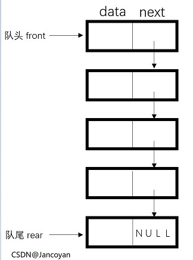
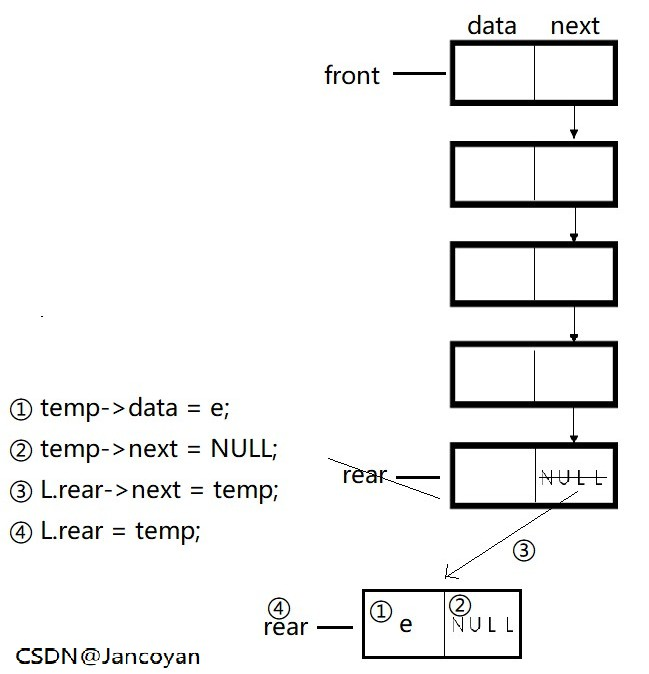
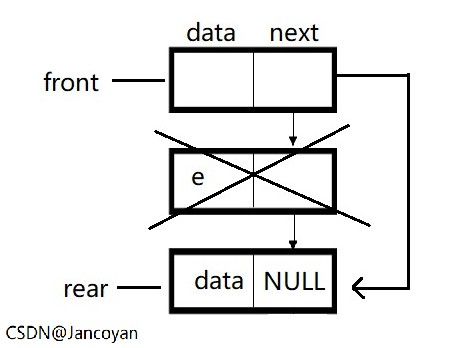
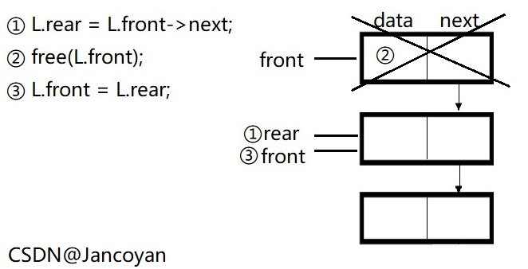
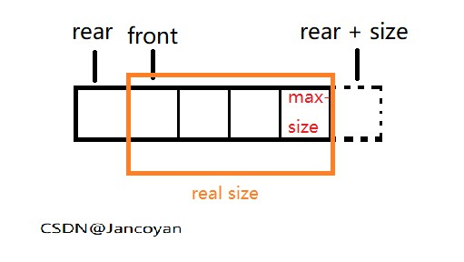
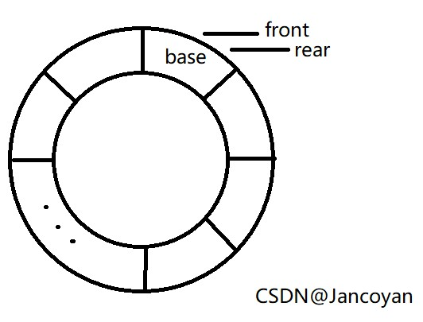

# 数据结构与算法 -- 链队

> 本文为作者学习[b站上交版<<数据结构与算法>>](https://www.bilibili.com/video/BV13W411W7KP?p=5), 结合清华大学出版社<<数据结构(C语言版)>> 的学习笔记, 部分内容来自于视频中的的PPT

## 定义

只能在队首进行删除, 队尾进行性插入的线性表 
特征 : FIFO (先进先出)



从图中我们可以看出, 一个队列有一个队头和一个队尾, 入队从队尾入, 出队从队头出, 每个节点由数据域和指针域构成, 其中的每个指针域指向靠近队尾的元素

**<u>注意 : front结点的数据域是为空的, 真正有数据的的头结点是 front->next</u>**

## 链式队列

### 表示

```c
//队列

typedef int QElemType;

//链队列

typedef struct Qnode {
	QElemType data;
	struct Qnode* next;
}Qnode, *QueuePtr;

typedef struct {
	QueuePtr front;
	QueuePtr rear;
}LinkQueue;

//代码来源 <<数据结构>> (清华大学出版社出版, 严蔚敏/吴伟民 编著)
```

### 初始化

```c
Status InitQueue(LinkQueue &L) {
	L.front = (Qnode*)malloc(sizeof(Qnode*));
	if (!L.front) return (OVERFLOW);
	L.front->next = NULL;
	L.rear = L.front;
	return OK;
}
//代码来源 <<数据结构>> (清华大学出版社出版, 严蔚敏/吴伟民 编著)
```

分配头结点空间并将next域置空, 空队列的头指针和尾指针重合

### 入队

队尾入队, 队头出队

```c
Status EnQueue(LinkQueue& L, QElemType e) {
	QueuePtr temp = (QueuePtr)malloc(sizeof(QueuePtr));
	if (!temp) return (OVERFLOW);
	temp->data = e;
	temp->next = NULL;
	L.rear->next = temp;
	L.rear = temp;
	return OK;
}

//代码来源 <<数据结构>> (清华大学出版社出版, 严蔚敏/吴伟民 编著)
```

开辟新节点, 将其data域赋值为e, next域置空, 将L 的尾指针指向temp, 后将其作为L的尾端




### 出队

队尾入队, 队头出队

```c
Status DeQueue(LinkQueue& L, QElemType& e) {
	if (L.front == L.rear) return ERROR;
	QueuePtr p = L.front->next;
	e = p->data;
	L.front->next = p->next;
	if (L.rear == p) L.rear = L.front;
	free(p);
	return OK;
}

//代码来源 <<数据结构>> (清华大学出版社出版, 严蔚敏/吴伟民 编著)
```

由于front指向队首的下一个位置, 所以在出队的时候, 是让front的next出队




### 销毁

```c
Status DestoryQueue(LinkQueue& L) {
	while (L.front){
		L.rear = L.front->next;
		free(L.front);
		L.front = L.rear;
	}
	return OK;
}

//代码来源 <<数据结构>> (清华大学出版社出版, 严蔚敏/吴伟民 编著)
```




### 清空

```c
Status ClearQuqeue(LinkQueue& L) {
	while (L.front != L.rear){
		L.rear = L.front->next;
		free(L.front);
		L.front = L.rear;
	}
	return OK;
}
```

清空和销毁的区别是, 清空会留下最后一个节点

因为清空的循环判定条件是front != rear

### 判断是否为空

```c
Status QueueEmpty(LinkQueue& L) {
	return (L.front == L.rear);
}

```

链式队列为空的条件 : 头指针和尾指针重合

### 返回长度

```c
int Length(LinkQueue& L) {
	if (L.front == L.rear) return ERROR;
	int length = 0;
	LinkQueue p = L;
	while (p.front->next) {
		length++;
		p.front = p.front->next;
	}
	return length;
}

```

当临时变量p的next指向非空的时候, length++, 最后返回length



### 获得队头元素

```c
Status GetHead(LinkQueue& L, QElemType& e) {
	e = L.front->data;
	return OK;
}
```

直接返回头指针指向节点的data域

### 遍历输出

```c
Status QueueTraverse(LinkQueue& L) {
	if (L.front == L.rear) return ERROR;
	LinkQueue p = L;
	while (p.front->next) {
		printf("%d", p.front->data);
		p.front = p.front->next;
	}
	return OK;
}
```

用临时变量p来访问队列中的元素


# 数据结构与算法 -- 循环队列


> 部分内容来自于<<数据结构(C语言版)>>(清华大学出版社, 严蔚敏/吴伟民 编著)

@[TOC](目录)

## 循环队列(顺序队列)

如果我们将队列设置为顺序存储结构, 那么, 因为出队的时候是从队首出队, 入队的时候是从队尾入队, 而入队需要在后面的内存中开辟空间, 一直这样总会把所有的内存耗尽. 虽然我们在出队的时候会释放空间, 但是释放的空间是在靠前的内存地址, 我们入队的时候是使用的队列后面的内存地址, 所以, 总会有一个时候, 队列后面的内存地址会被耗近, 但是队列的前面还有内存, 所以我们将顺序队列**想象**为循环队列来防止这种情况的发生.

由于当队列为空和队列为满的时候front 和 rear指针都是处于重合状态, 所以我们应该设置一个队列结束的标志或者一直少用一个空间

在这里我们使用后者, **一直少用一个空间来保证front == rear 的时候一定表示为空队列**



**注意 :**

在这里, 将队列的结构想象成一个环, 索引只是代表了位置, 与队列的前后端无关, 也就是说, front 和 rear 的索引的大小关系不确定, 当出队的时候, front 的索引通常会变大(在到达了上限时候会回到0重新开始循环), 而在入队的时候, rear的索引通常会变小(在到达了上限的时候会回到0重新开始循环), 具体情况请跳转下方"出队"与"入队"

### 表示

```c
typedef int QElemType;

typedef struct {
    QElemType* base;
    int front;
    int rear;
 }SqQueue;
//代码来源 : <<数据结构(C语言版)>>(清华大学出版社, 严蔚敏/吴伟民 编著), 稍有改动
```

依然是顺序存储结构

### 初始化

```c
Status InitQueue(SqQueue& Q) {
    Q.size == 100;
    Q.base = (QElemType*)malloc(Q.size * sizeof(QElemType));
    if (!Q.base) exit(OVERFLOW);
    Q.front = Q.rear = 0;
    return OK;
};

//代码来源 : <<数据结构(C语言版)>>(清华大学出版社, 严蔚敏/吴伟民 编著), 稍有改动
```

初始化front和rear为0

初始空间为100

### 入队


```c
Status EnQueue(SqQueue& Q, QElemType e) {
    if ((Q.rear + 1) % Q.size == Q.front) {
        Q.base = (QElemType*)realloc(Q.base, (Q.size * 2) * (sizeof(QElemType)));
        Q.size *= 2;
        if (!Q.base) exit(0);
    }
    Q.base[Q.rear] = e;
    Q.rear = (Q.rear + 1) % Q.size;
    return OK;
}

//代码来源 : <<数据结构(C语言版)>>(清华大学出版社, 严蔚敏/吴伟民 编著), 稍有改动
```

在队尾入队, 入队之后, 新的rear的位置为rear+1对最大容量取模. 

**为什么要对容量上限取模 ?**

假设循环队列在此之前都没有出队.  此时front的索引为0, max = 100, 假设rear 为小于99的数值, 则rear的后面的空间都是可以使用的, 此时(rear+1)对100取模, 等效于rear++; 如果rear == 99, 则rear+1对100取模为0, 与front的索引相同, 说明空间已满, 扩容.

假设循环队列在此之前有过出队情况. 此时front的索引大于0, 当rear的索引小于99的时候,  与上述情况相同, 当rear==99的时候, 此时(rear+1)对100取模为0, 与front不同, 所以队尾的索引变为了0;

### 出队

```c
Status DeQueue(SqQueue& Q, QElemType& e) {
    if (Q.front == Q.rear) return ERROR; //未初始化
    e = Q.base[Q.front];
    Q.front = (Q.front + 1) % Q.size;
    return OK;
}

//代码来源 : <<数据结构(C语言版)>>(清华大学出版社, 严蔚敏/吴伟民 编著), 稍有改动
```

front为队头元素, 出队之后, fron为 (Q.front + 1) % Q.size;

取模的原因同上

### 销毁

```c
Status Destory(SqQueue& Q) {
    free(Q.base);
    Q.front = NULL;
    Q.rear = NULL;
    Q.size = 0;
    return OK;
}
```

释放空间, 指针置空, 容量置为0

### 清空

```c
Status Clear(SqQueue& Q) {
    Q.front = Q.rear = 0;
    return OK;
}
```

将头尾指针索引置为0

### 判空

```c
bool IsEmpty(SqQueue& Q) {
    return Q.front == Q.rear;
}
```

队列为空的条件为头尾指针重合

### 长度

```c
int QueueLength(SqQueue Q) {
    return (Q.rear + Q.size - Q.front) % Q.size;
}

//代码来源 : <<数据结构(C语言版)>>(清华大学出版社, 严蔚敏/吴伟民 编著)
```

如果rear的索引大于front的索引, 则加上size之后对size取模不变

如果rear的索引小于front的索引

### 队头元素

```c
QElemType getFront(SqQueue& Q) {
    return Q.front;
}
```

直接返回Q.front即可
