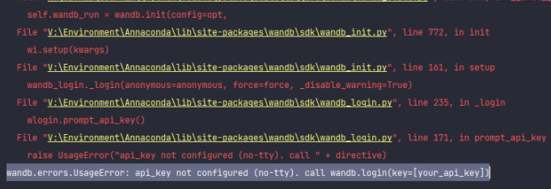
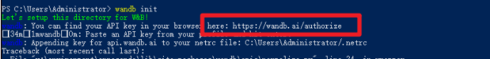
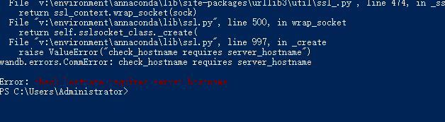
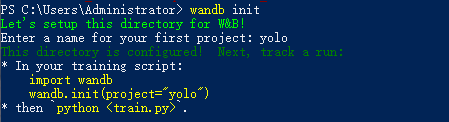
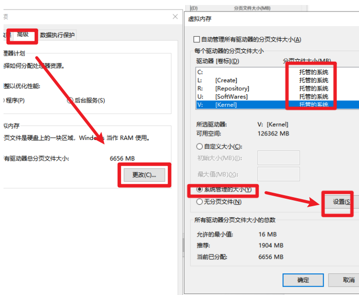

# yolov5s初次使用的踩坑记录

## 找不到conda命令

添加以下路径到path

```
你安装Annaconda3的位置\\Anaconda3
你安装Annaconda3的位置\\Anaconda3\\Scripts
你安装Annaconda3的位置\\Anaconda3\\Library\\bin
```

## conda配置国内的镜像源

修改`C:\\User\\Adminstrater\\.condarc` 文件如下：

```yaml
channels:
  - defaults
show_channel_urls: true
default_channels:
  - https://mirrors.tuna.tsinghua.edu.cn/anaconda/pkgs/main
  - https://mirrors.tuna.tsinghua.edu.cn/anaconda/pkgs/free
  - https://mirrors.tuna.tsinghua.edu.cn/anaconda/pkgs/r
custom_channels:
  conda-forge: https://mirrors.tuna.tsinghua.edu.cn/anaconda/cloud
  msys2: https://mirrors.tuna.tsinghua.edu.cn/anaconda/cloud
  bioconda: https://mirrors.tuna.tsinghua.edu.cn/anaconda/cloud
  menpo: https://mirrors.tuna.tsinghua.edu.cn/anaconda/cloud
  pytorch: https://mirrors.tuna.tsinghua.edu.cn/anaconda/cloud
  simpleitk: https://mirrors.tuna.tsinghua.edu.cn/anaconda/cloud
```

##  opencv-python>=4.1.2 not found

conda下载的opencv-python 版本最高是4.0几的，不满足yolov5的需求，所以要用pip下载。

`pip install opencv-python` 自动下载最新版本的


## wandb 未注册异常: wandb.errors.UsageError

api_key not configured (no-tty). call wandb.login(key=[your_api_key])



在Power Shell 输入命令： wandb init 然后出现下图。



在方框这注册，然后会获得一个key

复制到下面的输入框中，不会显示key，按回车就行，理论上就可以了，但是我又出现了下面这个错误：

wandb.errors.CommError: check_hostname requires server_hostname



这个是因为我科学上网了，科学上网关了之后就行了：



## [WinError 1455] 页面文件太小，无法完成操作。

Python没有装在C盘，系统没有分配虚拟内存

高级系统设置（就是配置环境变量的那个窗口）：



