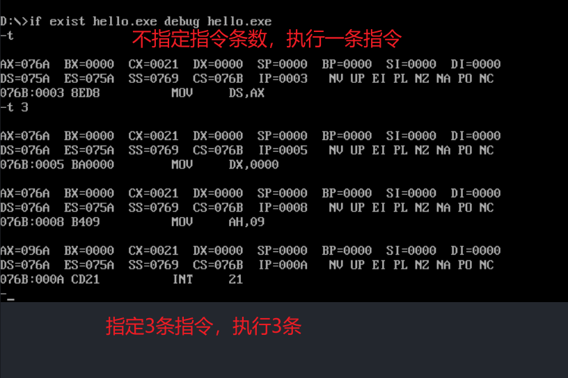
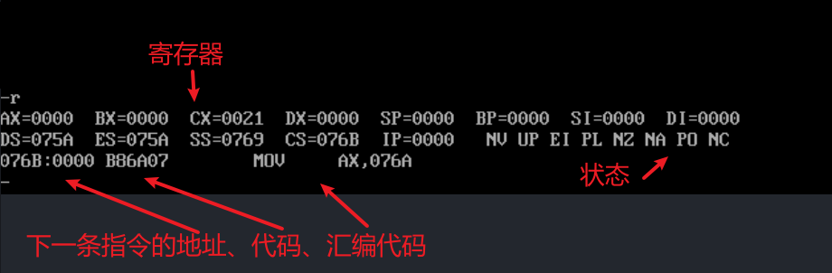
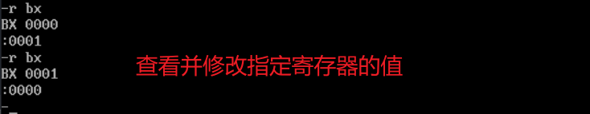
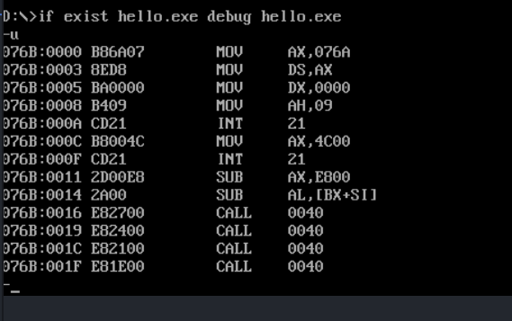
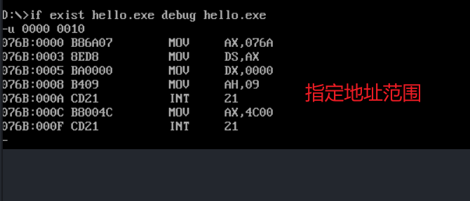
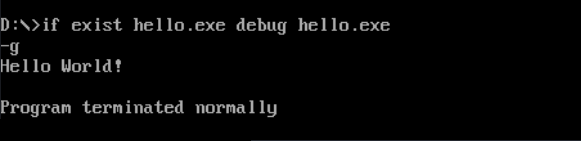
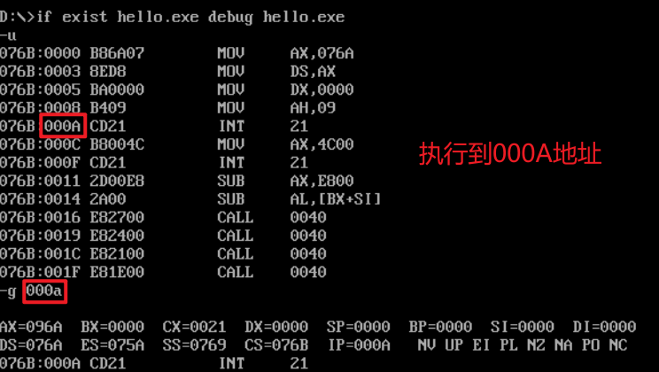
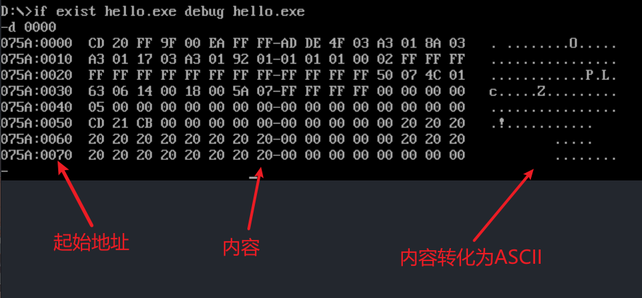
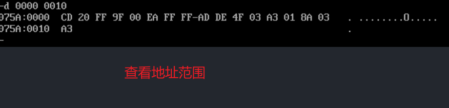

# MASM调试汇编代码（命令行方式）

---

> 以 【输出helloworld】为例，讲解MASM用指令方式调试汇编代码的方法。

代码：

```assembly
DATA    SEGMENT                           ;数据段
	HELLO DB 'Hello World!',0DH,0AH,'$'
DATA    ENDS

CODE    SEGMENT                           ;代码段
				ASSUME CS:CODE,DS:DATA            ;段寄存器分别与哪些段有关
START:  MOV   AX,DATA
				MOV   DS,AX                       ;设置数据段

				MOV   DX,OFFSET HELLO					  	;输出
				MOV   AH,09H
				INT   21H

				MOV  AX,4C00H
				INT  21H
CODE    ENDS                              ;代码段结束
				END START                         ;源代码结束
```

## 总览

常用命令 ：t、r、d

1. t：执行下一条语句。
2. u：查看汇编代码。
3. g：跳转到该内存所对应的语句
4. r：查看寄存器的内容（后可直接接寄存器的名称，就只查看该寄存器的内容）。
5. d：后接内存地址，查看改地址后面 8 * 16 个字节空间的地址（每行 16 个字节，共 8 行）后面是对应的字符‘.’表示没有该数字对应的字符。
6. p：与T命令一样完成跟踪程序的运行, 但遇到子程序、中断程序、循环时并不跟踪下去, 而是把它们当作一条指令来执行。


### t指令

- T 【起始地址】【指令条数】
  - 逐条跟踪程序的运行, 同时显示出各寄存器的内容、状态标志和下一条要执行的指令
  - 当执行够指定的指令数后就暂停程序的运行。
  - 如果不指定起始地址, 则从CS:IP处开始执行。
  - 不指定指令条数, 则认为只执行一条指令。




### p指令

格式：

- p 【起始地址】【指令条数】	
  - 与T命令一样完成跟踪程序的运行, 但遇到子程序、中断程序、循环时并不跟踪下去, 而是把它们当作一条指令来执行。


### r指令

格式：

- r
  - 显示当前所有寄存器内容, 状态标志及将要执行的下一条指令的地址、代码和汇编指令形式。
- r 寄存器
  - 显示并修改指定寄存器的内容







### u指令

格式

- u 【地址】
- u 【地址1】【地址2】

将指定地址范围内的机器代码翻译成汇编源程序指令显示出来, 并同时显示地址及代码。

反汇编时一定确认指令的起始地址, 否则得不到正确的结果。






### g指令

运行程序命令

格式：

- g 【起始地址】【断点地址】


从起始地址开始执行程序, 直到程序结束或遇到断点地址为止，如果不指定起始地址, 则从CS:IP处开始执行。

如果程序执行到结束,则显示"Program terminated normally"。如果遇到断点, 则程序停止执行, 并显示当时各寄存器的内容 和下一条要执行的指令。






### d指令

格式：

- d 【地址】
- d 【地址1】 【地址2】

说明：D命令在屏幕上显示的内容分为三部分, 左边是每一行存储单元的起始地址, 中间是各字节单元的内容, 右边是各单元内容对应的ASCII码字符( 不可显示的字符用"."代替)。






