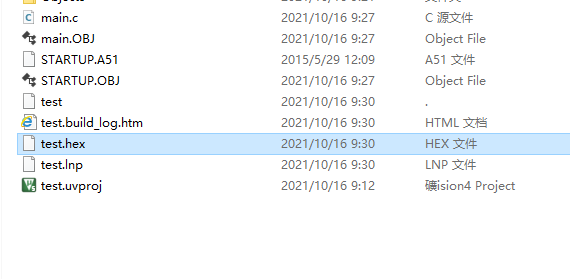

[TOC]

# Proteus 创建89c51项目

file -> new project (文件 -> 新项目)

如图，选择Default，然后next

如图，选择不创建PCB Layout

如图，创建Firmware Project

点击next，然后Finish即可。

完成之后会自动打开一个asm文件，关掉即可

项目创建完成。 

# Proteus 绘制流水灯

## 添加组件

刚才选择的组件就添加进来了。

> 【注意】直接双击搜索结果中的组件也可以直接添加（适合一次性添加多个组件）

## 绘制组件

选择组件

点击画板，鼠标指针变为组件形状，再次点击可放置组件

双击组件可以设置属性。 

成品图

## 常用组件

LED灯

- LED-BLUE
- LED-YELLO
- LED-GREEN
- LED-RED

电阻

- RES

电源和接地是同一个组件，双击设置一下就好

# Keil 创建项目

> > 如果老师给了相关软件，尽量用老师给的，老师给的不会错的。。。。

菜单栏 Project -> new uVision Project

填写项目名称

搜索并选择设备

自己手动创建一个main.c文件即可

# Keil 生成 hex 文件

点击魔法棒图标，选择生成文件夹，选择创建hex file

点击ok

进行编译

可以看到文件夹中生成了hex文件

# proteus中加载hex文件

双击89c51，选择hex文件

点击ok，点击运行

可以看出，8个流水灯全亮，然后逐个熄灭。

