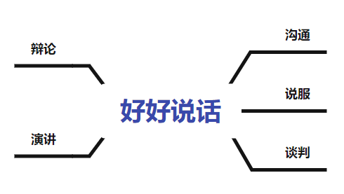

# 好好说话 - 笔记

算来这已经是我第三次看这本书了。第一次是在高考完的暑假，在喜马拉雅上听的音频，第二次是在大一，看完了这本书但是没有什么收获，这是第三次，虽然看完之后基本没有记起来什么有用的东西，但是想着总结整理一下看到的内容。

## 沟通

### 承上启下

#### 及时有效地传达信息

制造意外、引发好奇、回应主题

> - 请先给我一分钟好吗？保证不耽误您时间。
>
> - 关于这件事，如果您不给我时间解释，那就是逼着我说谎话了。
>
> - 这事很复杂，你想知道详情吗？

#### 传达坏消息

前提是这件事不是你的锅，那么首先不应该说 `对不起`，而是`很遗憾`，`“对不起，这事办砸了。”` => `“很遗憾，这事没成功。”`

可以陪伴，但千万不要主动安慰。

无论是想当然地说一些自以为“体贴”的话，还是用主动的肢体语言，比如握住对方的手或拍拍背来安慰人，抑或是给出所谓“积极的”解决方案，**都不可取**。分寸重于一切，任何越界的行为都有可能节外生枝，给双方都带来不必要的麻烦。

> -  我来说明一下，这件事情是这样的……
>
> 要表达专业性，首先你的表述要中立客观，如果可以，最好还能有一点权威感。所以在报告坏消息的时候，要尽量避免说“我觉得”“我认为”，不要支支吾吾，而是要用类似“说明”这样的词语，用不带个人主观色彩的表述方式，强化你的专业形象。同时也要传达出免责信息——这件事不是我造成的，我只是来告诉你它是怎样的。
>
> - 我很遗憾，情况并不乐观……
>
> 说遗憾，意味着你仅仅是出于人道主义而表示出善意，有别于愧疚和抱歉。
>
> - 有任何疑问你都可以问我，我会告诉你我所知道的一切信息。
> - 你一定有很多疑问，你一定觉得这不可能，没关系，我可以在这里一直陪你，帮你耐心解答问题。
>
> 首先，表示愿意解答疑问，是在尽陪伴的义务；同时强调自己说的都是知道的事情，是在暗示自己只是个信息的传递者。如对方问起，知无不言，但也言尽于此了。

#### 初次见面聊什么

对于没有打算深交的人：

千万不要说出“这个名字很常见”“啊，我认识一个人，也叫这个名”之类的话。

> - 您这个名字很少见，别人应该一听就很难忘吧？老师点名的时候是不是总逃不掉？
>
> - 您父母应该很有文化，才会取这样的一个寓意深长的名字。
>
> - 哈哈，您这个名字，是不是常被人读错？

不要给对方施加压力：

1. 不要索取信息，而是分享态度。

   > “你有孩子吗？”
   >
   > “打算什么时候生呢？”
   >
   > “小孩多大啦？”
   >
   > ------------------------------------
   >
   > “你喜欢孩子吗？”
   >
   > “这年头当父母啊，真是越来越不容易！”

2. 抛砖引玉，以自我揭短的方式向对方抛出话题，但不要说谎，也不要凡尔赛

   > “情人节我男朋友送了我一个新款的包包，我超喜欢！哦，对了，你跟你男朋友最近还好吗？”
   >
   > ---------
   >
   > “我男朋友最近总是加班，相处时间很少，我不开心的时候，他也只会用买个包这种方式哄我。我看你男友对你特别用心，你有什么相处的诀窍吗？”

3. 把问题抛给在场的所有人，而不是特意面向某个人

   > “我现在根本不想结婚、不想生小孩，可是父母天天催，你们这些还没结婚的有没有想过什么时候结婚啊？你们是怎么应对父母催婚的？”

应对借钱

别关心数目，先关心原因

> “我借钱是因为最近想筹划买房，你看能不能帮我周转周转。”
>
> “哎呀，怎么这么巧，我恰好最近也在计划买车，手头的资金压力也很大，想帮你也是有心无力啊。”

> - 你最近是遇到什么困难了吗？
>
> - 我也遇到了一样的问题，真抱歉没法帮到你。

### 冲突

同一件事在不同的人眼里有不同的版本，我们在表达不好的情绪之前最好先进行一些铺垫。以“对人不对事”为切入，最终达到了“对事不对人”的沟通效果。

> - 抱歉，这或许未必是事实，但我难免会有这种感觉……
>
> 预先承认这只是自己的主观感受，减轻对方被否定和被攻击的感觉，让对话能理性、平和地进行下去。
>
> - 你知道我这个人其实有点作（敏感或容易受伤），不过我确实感觉到...

有三种暗示最让人觉得不舒服：

1. 想表示关心，在别人听起来却是指手画脚 => 批评别人暗示自己处于比较高的地位

   > "你屋里怎么这么乱啊？"

2. 想表示安慰，在别人听起来反而是漠不关心 => 降低事情的重要性

   > “没事的，我是过来人，这都是小事。” 
   >
   > ---
   >
   > “唉，我知道你花了很多时间和心血，结果变成这样，真是非常可惜。”

3. 想表示委婉礼貌，别人听起来却是暗藏心机

   > “在吗？” “你什么时候有空啊”

> - 你这样做让我……
>
> - 我认为你做得真的很好，只不过这件事情……
>
> - 你好，我有件事情想找你帮忙，事情是这样的……打扰了！

### 情绪引导

#### 引导自己的情绪

自己不好的情绪暴露之前要有足够的预告，并且要循序渐进地预告。

> - 这个笑话一点都不好笑，再这样我可要生气啦。
>
> - 我不开心，我需要听你说一些好话！
>
> - 我现在正在气头上，不想听什么大道理，就算是天大的事也等我消了气再说！

#### 引导别人的情绪

误区：

1. 挣扎（解释、反驳）
2. 闭嘴（无言抗议）
3. “你先冷静一下”（指责对方情绪不稳定）

方法：

1. 给自己做心里隔离

   > 尝试着把全部注意力都用来寻找客户话语中的高频词汇，并从中分析原因

2. 使用同理心句型

   >  我很理解您，换作任何一个人恐怕都会生气。

3. 拦截人身攻击

   > 我觉得你不应该这么说，不过这不是重点

#### 道歉

雷区：

1. 试图淡化
2. 试图撇清

方法：蚂蚁搬大象

这招的适用范围，主要是日常生活中那些**比较模糊**的责任地带，而且是为了**平息对方的怒火**才使用的。

> “这是我的责任，我应该....”
>
> “我有责任...但我没做到”

### 弱点暴露

#### 弱点

误区：掩盖弱点

正确：主动暴露可能会给自己造成不利条件的弱点

面对敌人的时候，应当用自嘲的方式提及对方**已经知晓**且可能会被攻击的弱点，而不必将所有弱点和盘托出，给对方更大的攻击空间。

争取他人信任时，应该多暴露自己**无关紧要的弱点**。例如职场工作中，你可以大谈自己毕业学校不好，但是直接涉及工作能力的弱点最好还是尽少展现并尽可能改正。

> 我在这方面确实不行，以后还请您多多指教

## 说服

### 给对方选择权

通过提问引导思路

> 唉，我最近又胖了，好羡慕你的身材，能锻炼得这么好。”
>
> “咦，奇怪了，你看起来不是那种会注意身材的人，为什么会对运动感兴趣呢？”
>
> “我也希望自己能瘦一点啊……”
>
> “胖就胖嘛，有什么不好呢？”
>
> “可是瘦一点的话，我穿起衣服来就能更有自信一点……”
>
> “何必在意呢？反正我们又不会嘲笑你。”
>
> “不是别人会不会嘲笑的问题，而是自己看自己也不开心啊……”
>
> “那么，你打算怎么做呢？”

句式

> - 咦，你居然会想过要这么做，我很好奇，原因是什么？
>
> 用提问引导对方强化某个信念，同时用“我很好奇”这类中立的表述消除对方的戒心。

#### 请人帮忙

以对方为出发点。诉求要具体、善意要扩大、让对方有选择。

> “抱歉，我母亲年纪大了，可以让个座吗（诉求具体）？下次要是让我遇到其他有需要的人，我也一定会像您一样伸出援手，（善意扩大）当然，这是个不情之请，毕竟是您的座位，让不让由您决定。（选择权）”

#### 劝走歪路的人

误区：

1. 追问原因
2. 独善其身
3. 拼命拦阻

方法：

- 不要问“为什么”，要问“怎么了”
  - 询问事情发生的缘由，换言之，是在邀请朋友来向你倾诉遭遇的委屈。
- 引导情绪宣泄，你要比你朋友更狠
  - 需要的是有人跟他一起骂，最好比他还生气、比他还具体、比他还刻薄。
- 与其一味阻拦，不如把计划落到实处

### 触及对方痛点

#### 对付年纪大的人

误区：试图输出价值观

方法：

- 用对方的角度看问题

  - 跳出自己的专业所限，从对方的角度思考问题

- 找到感同身受的痛点

- 给对方一套完整的解决方案

  > “我去的那个地方暖气很足、人很多，穿多了不舒服。回来时也是离地铁几步路而已，冻不着。万一要在外面走路，我就叫个专车直接门口到门口，您就放心吧。”

#### 催老板

误区：求老板

方法：

1. 真诚表示体谅，实现低阻力沟通

   > “渐彪，最近你要忙的事情好多，还hold（掌控）得住吗？我看你又是跑高校宣传，又是和投资人协商，还要录制自己的音频，你要是有时间审我们的音频就见鬼了。”
   >
   > 没有说现在离音频上线的截止时间，也没有让他该拍板的时候就快点拍板，而是先罗列他目前在做的很多工作，表示他的辛苦我们都看在眼里，所以非常理解他到现在还没听审音频的原因。

2. 提供后备方案，清空焦虑内存

   > “看你忙得没时间，所以我想了一下，如果你觉得实在来不及听审这周的音频，咱们还有一个方案，就是把后备音频调上来，新的音频可以以后再审。”
   >
   > 后备方案的意义——不在于领导会不会真的选择它，而是帮助领导缓解当前开天窗的压力，让他觉得其实这件事没有那么难办。

3. 点明短期收益，激发主体动力

   > “不过，如果这期赶赶工，上新的音频，那就正好符合咱们职场周的主题。那些后备的音频跟职场的关系不大。你看你只需要挤两个小时出来，就能让咱们这一周的产品更贴近主题，刚好也回应了上周听众的意见。”
   >
   > 

> - 您最近这么忙，工作又多，应付得过来吗？
>
> - 您要是没时间处理这个事，我们用方案B怎么样？
>
> - 不过如果您能抽时间处理这个事，我们能获得更多的好处喔。

#### 说服比自己专业的人

- 克制直接表达主观感受的冲动
  - 避免说 `我觉得... ` 开头的句式

- 提出抽象需求，而不是具体要求

  > “今年‘五四’青年节的主题跟环保与社会责任结合得比较紧密。你做的这个黑色是挺有个性的，现在的年轻人也挺喜欢黑色，但和咱们这个设计的主题有些不太吻合。你能不能建议一些可以实现这个需求的方案呢？”
  >
  > 然后，等设计师罗列出什么橙色、蓝色、绿色的时候，我们再从里面挑出绿色说：“我觉得你用的这个绿色就挺好，不如咱试试？”

- 不要下命令，要尝试在探讨中达成共识

> - 你做的这个方案也挺不错的，只是和这次的要求有一点出入，你能不能根据这次的主题建议一些新的方案呢？
> - 你觉得这个配色方案怎么样？要不咱们试试？

#### 鼓励不求上进的人

- 降低对方对结果的恐惧

  > “有考试，就有人得第一，也会有人垫底。即便结果不如意，也未必是你的问题，可能是运气，可能是环境，也可能是别的什么原因。总之，考不好不意味着对你个人的否定。很多人说什么一考定终身，你别信！”

- 用可行性代替目的性

  > “你不要去做隔壁那个家财万贯的老王，你人生的可能性至于这么狭窄吗？你的潜力那么大，只要你愿意，完全可以做点别的有意思的事儿嘛。”

- 营造愿景而不下指令

  > “如果你想造一艘船，不要抓一批人来收集材料，不要指挥他们做这个、做那个，你只要让他们渴望浩瀚的大海就行了。”

愿景应该是感召，而非承诺；激励的本质应该是对个体可能性的探索，而不是鼓吹甚至胁迫人完成任务的工具。

> - 就算……也不会怎么样嘛！
>
> 讲好处之前，先削弱后果的严重性。采用这种句式，可以削弱不求上进者的畏惧心理，免除后顾之忧，让他们愿意一试。
>
> - 我倒觉得你是能做到很多事的，未必要像他……那样。
>
> 用“未必要这样”“谁说非如此不可”之类的讲法，反其道而行之地否定标的，用可能性代替目的性，增加对方对你劝说的接受度。
>
> - 哎，这样……也挺有意思的嘛！
>
> 不做任何明确的劝导，避开“你应该如何”“我觉得如何”这样带有明确诱导性的表述，而仅仅是看似客观地描摹一个愿景，引起对方的兴趣。

### 用压力改变双方立场

#### 诉诸外部压力进行说服

把 “我” 换成 “我们”，显示我们是同一阵营

塑造共同的敌人，可以免伤和气

> “哦？要出去玩？好啊好啊！大家都好久没出去玩了，趁机增进一下感情也挺好。不过，最近财务部盯着各部门预算特别紧，咱们要是超支就麻烦了。他们找我还好说，咱绝大部分的开销都是业务支出，但要是具体问到这一次集体出行……您说，咱怎么应对财务部那边呢？”

化主观意见为客观压力，让对方更容易接受我们的意见

> 前一种情况是：“我告诉你，你这样下去会受害，所以我希望你离开”；
>
> 而后一种情况是：“听人家说，有坏人要害咱们，咱们得一起离开”。很显然，后一种情况更加客观，接受起来才比较不丢面子。

#### 营造机不可失的时间紧迫感

> - 我很希望……但是因为时间紧急，我必须要离开了，所以可以请你……**吗？**
>
> 明确表达意图，讲清时间紧迫，让外在的急迫性帮助你促使对方下决定。
>
> - 我完全没有要催你做决定的意思，只不过这个机会很快就没有了，所以我必须跟你讲清楚这个东西的珍贵性。
>
> 强调自己没有催促的意思，避免对方产生逆反心理。尽可能采用“这件事情如何如何”“这个机会如何如何”等中立化的表述，让对方感受到急迫性带来的压力。

#### 把人“架起来”

先给对方戴上一顶高帽子，表示对方境界高、水平高，再顺理成章地提出建议。

> “小姐，看您的穿着很有品位，您对包包应该比我更懂行，您肯定也知道这是最流行的新款，不如今天就把它背回家试试？”
>
> “经常书写的您，比我们更懂，一支书写流畅的钢笔到底有多重要。”

## 谈判

### 搜集情报

#### 旁敲侧击打探消息

三种常用的问句：

1. “您是怎么知道我们的？”

   - 信息的来源可能比信息本身更重要

2. “在这方面，你们之前做过的最大的案子是多少？”

   - 对于这类案件， 你们最多付出过多少钱

3. “按照这样的条件，我给您推荐别人好不好？” “以这样的条件来说啊，要不然，我推荐××来帮你们培训好不好？他们也很不错的。”

   > 我们卖了两个人情：
   >
   > 一是客户可能真有难处，那在条件谈不拢的时候，这次帮他牵个线，就等于留下了个好印象；
   >
   > 二是无论成与不成，我们所推荐的那个人（或机构），事后在知道了我们的有心介绍后，往往都会领情。

#### 纠正式引导

方法：

- 运用对方的纠正心理获取信息

- 注意我们的态度和语调

- 将信息获取的效益进一步扩大

案例：

>假如我们和小王说，高老师是个成熟、稳重的人，结果小王却吐槽了高老师一大堆糗事儿。
>
>如果我们接下来的态度立刻就认输了，说：“哎呀，王姐，没想到高老师是这样的人，真是知人知面不知心啊！”这时，小王肯定不会再继续说了，你想知道的信息也就断了。
>
>因为小王觉得，关于高老师的个性她已经纠正我们之前的观点了，那就够了，这个话题当然就不用再继续了。可是如果在这个关键时刻，我们做出适度的反抗，那结果会变成什么样呢？
>
>在小王爆料了高老师一大堆糗事儿之后，我们竟然反驳她：“王姐啊，你这样说就不对了，我也和高老师打过两次交道，我觉得她私底下也很成熟、稳重啊。”
>
>这句话一出口，绝对就像一根针一样，会砰的一下爆发小王下一波的吐槽，她就会提供给我们更多有关高老师的信息。善于运用这种适度的反抗，我们就会从对方嘴里套取更多的信息。

注意：

- 适度辩护，不要太激烈，以免人们认为我们是一伙的

句式：

> - 我听说……我就觉得肯定是这样的，毕竟……对吧？（或“难道不是吗？”）
>
> 在提出观点时故意跟一句提问，让对方至少得礼貌性地予以回应、发表观点；同时，采用“道听途说”一类不靠谱的由头，让自己的观点显得容易被攻击，引起他人“纠正”的欲望。
>
> - 我就知道是这样的，不会再有别的可能了（或“没的跑”）。
>
> 语气上用自信满满的断言，让对方产生想要纠正的念头。
>
> - 咦，真的吗？那可是我听到的（或“上次那件事情……”）。
>
> 在使用适当反抗策略的时候，尽可能用中立的口吻，只叙述“我听到的部分”和“对方说的部分”的矛盾，引起对方进一步纠正的欲望；但尽量不要提及自己的观点，避免引起两个人之间的直接对立。

#### 要求加薪

方案：

- 用确定标准获取主动
- 和老板讨论自己的工作表现
- 带着老板“想象未来”

> - 老板，我想知道，在我们公司里，员工大概要达到什么样的条件才可能加薪？
>
> - 我确实没有达到条件A，但是我在条件B中表现超标啊。我的B表现是不是可以补偿我缺失的那一块，让我加薪呢？
>
> - 如果我得到加薪，我会在项目A中投入更多精力。

### 砍价

#### 先发制人-开价

- 先报高价，然后一点一点降低，给对方“赚到”的心理感受。
- 果断报价的一方开口之后，另一方想要砍价，就必须讲出理由和承诺。

充分估计对方的心理预期，结合对方的心理预期报价。

#### 学会“掀桌子”

方法：

1. 表达上桌意愿，把对方也拉到谈判桌上来

2. 等对方上桌，再讲出还有不太友好的其他人也在桌上

3. 条件成熟，果断掀桌

案例：

> 一个朋友特别会砍价。如果在商店看到一个心仪的东西，他会很小心地拿起包装盒，反反复复看很久。如果身边有朋友，他还跟朋友交流几句，流露出对这个玩意儿的喜爱**【表达上桌意愿，把对方拉到谈判桌上来】**。他也会跟店家聊，但绝不开口问价，都是在问跟这个商品有关的细节，一直细到保修能保多少年，说得好像已经买了一样。同时，他还会很不情愿地表达出一些犹豫，哼哼唧唧地说：“老婆对于我总是买这样的东西很不爽”“我自己其实并不需要它”等。**【等对方上桌】**
>
> 到最后已经把钱包从兜里拿出来放手上了，他才开口问店家：“我要付你多少钱？”而不管店家报出什么价格，如1000元，他都会立刻做出极度震惊状，并迅速把钱包收起来，一边对店家说：“开玩笑呢，要我命呢！”一边对朋友说：“唉，可惜了。”【条件成熟，掀桌子】
>
> 这个时候，店家要么会立刻抛出一个大折扣，要么会说：“那你说多少钱好了。”而我这位朋友就可以十分从容地说：“我原以为，一两百元就搞定了，谁知道这么贵啊，买回去还不得跪搓衣板啊？但我确实挺不好意思砍价的，这样吧，400元，我也不勉强，不行我就当认识个朋友。”

话术：

> - 这个东西我真是一看就喜欢（或“我最近好像刚好需要一个”）。
>
> 在表达时，措辞上要强化主观意愿，或从内容上制造客观需求，让出价方充分意识到你的上桌意愿，从而增加他们上桌的可能性。
>
> - 唉，可惜这个月花钱实在太多了（或“不过要是买了就没钱买机票回家了啊”）。
>
> 制造矛盾焦点作为你们共同的敌人，为之后的掀桌、再沟通做铺垫。
>
> - 什么？你在开玩笑吧？（或“哈哈哈，那算了。”）
>
> 在掀桌时，可以用诸如震惊、哂笑、表示荒谬的姿态来表达你的态度。只有桌掀得坚决，才能迫使对方让步。

#### 跳崖式让步

1. 咬定自己原本的底线，累积压力，不轻易退让。

2. 出于某种特殊的原因我们突然松动，愿意一口气做出大幅的让步，但也因如此，这个特殊的让步是仅此一次的。

3. 要表示出决绝的态度，要让对方明白，如果在已经做出大幅的让步后还要再还价，就未免欺人太甚了。

跳崖式让步最关键的就是在一次降价之后绝不能再降，不然之前的努力就会全部白费，又进入挤牙膏式的循环。

挤牙膏是我们应该刻意避免的，因为这会导致我们一步一步的让步，损失更多。

### 僵局

#### 不要重复同一句话

千万不要反复重复同一句话。

方法：寻找原因的两句话：

1. “咱们都是爽快人，这事儿今天就定下来，好不好？

   > - 谈判中的第一块绊脚石——没意愿
   >
   > - 谈判中的另一块绊脚石——没授权
   >
   > 这句话只是在试探对方的心理，至于对方真实的想法，那不重要。

2. “想想有什么新方案，咱俩都能接受。”

   > - 谈判中可能出现的第三块绊脚石——求独赢。
   >
   > 如果对方没有双赢，那么交易也就没有进行下去的必要了。

#### 把是非题变成选择题

> “不行，这已经是最低价了。”
>
> ---
>
> “没问题啊，因为有人在意质量，有人在意价格，很正常嘛。”

> - 其实不是我说能不能便宜点，是要看您要的是质量还是价格啊。
> - 当然这个我也可以做，但是时间这么紧，执行的品质可能不太高。

#### 辞职

禁止畅所欲言

方法：

1. 告知去处

   > 如果我们希望在离职后依然保持过去经营的人脉，那对于辞职后的计划最好不要隐瞒。

2. 慎选理由

   > 最好把原因归咎于自己，从自己说起。
   >
   > “我不太适应公司的文化，大家很内敛，沟通较少，而我很外向，个性不太一样。”

3. 表示感激

   > 您虽然不理解，但我还是很感谢您这些年对我的照顾。（表示感激）

## 演讲

### 化解尴尬

#### 承认尴尬

大方坦然，效果就不会差——万事别紧张，没人真的在意你到底为什么会犯这样的错误。

话术：

> - 这里有些小问题，不过不重要，我们来看下一个话题。
>
> - 没关系（这个小错误并没有太大的影响），我们继续。
>
> 这类型句式的思路是：承认这是个问题，然后带领观众的注意力走向下面的环节。

#### 故事性陈述

- 用故事，带大纲
- 说故事，加感想
- 贴标签，存故事

> - 大家好，我今天的演讲主题是……**在准备这个主题时，我脑海中一直回旋着一个故事，在这里分享给大家。**
>
> 这是一种将演讲主题导引到一个故事上的常用开头。
>
> - 如果用……的视角来看待这个故事，我们会发现……
>
> 讲完故事后，将主题与故事做个连接。

### 照顾多方关系

#### 胜选演讲

情况：

- 你把别人比下去了、赢了，被你比下去的人肯定心有不甘。

- 你在很多人的帮助下赢了，没有对这些人表示好好的感谢，容易让帮助者感觉心里不舒服。

- 你赢得了某个职位，那么下一步要做什么？大家都盯着看你呢。

方法：

1. 赞美对手

   > 我真的非常欣赏...

2. 弥合分歧

   > 我们....【把‘我’换成‘我们’拉近距离】

3. 感谢盟友

   > 这不是一次竞争，而是一次运动……（或“这场竞选没有失败的一方……”）

#### 败选演讲

1. 我不是彻底的输家
2. 我输了，但我没错
3. 你赢是侥幸，我输是有客观原因

> - 我们的事业并非只关乎一个人，甚至也不只关乎这一次的胜负。
> - 我们参与的，不只是这一次的……我们必须贯穿始终坚持下去。我们依然要尽己所能，推动我们的事业。
>
> - 最后我要跟年轻人说话，我要告诉你们，我为自己相信的东西奋斗一生。你们才刚刚开始，但是不要停止为值得的东西奋斗，是的，这是值得的。

### 获取信任

#### 快速建立信任

千万不要自吹自擂，即便是真的，那样无法取信于人。

1. 先适当地降低听众的预期

   > “刚才主持人讲的都只是一些场面话，那我今天呢，不是来给大家上课的，毕竟说话大家都会，我也只不过练习多、比较熟练而已。所以今天我要跟大家聊的主要也都是些我过往在长期训练中所得到的一点经验，希望能在分享后帮大家节省点时间。”

2. 在演讲的过程中不动声色地建立起他人对自己专业的信任

   - 将我们最耀眼的资历，以一种极为平淡的口吻，看似漫不经心地吐露在自己的演说内容里。

   > “各位同学，你们要知道，在台湾，许多的政治人物学生时代也都参加过辩论训练。辩论是一件很普及的事情，就好比有一次我在跟吴敦义秘书长私下聊天的时候，就听他谈到他自己在学生时代参加保钓辩论，就是保卫钓鱼岛主权的辩论。哇，他那时候讲得是意气风发、得意非凡啊。”

> - 刚才那不过是**……**（或“我只不过是**……**”）
>
> 用“只不过”“而已”这样的表述，将主持人的夸张介绍朴实化。一方面可以适当降低观众的期望值，另一方面也是某种不动声色的自夸：刚才那些名头听起来好像很唬人，但我真的就觉得不过如此而已。
>
> - 有这么一个人，不确定大家认不认识，他是……
>
> 用“顺便一提”“不知道大家认不认识”来显示自己并非有意要讲这件事，而只是附带地提一下。
>
> - 当年××也曾经跟我这么说，不过其实我觉得……
>
> 有时候，可以通过适当地对某些重量级的人物、事件提出相左甚至否定的意见，来反衬出自己的分量。例如，“金庸曾经对我这么讲过，但我觉得武侠小说其实还有别的路子”“如果你们也参与过国际空间站项目，就会知道这类东西其实不过如此”。	

#### 应对众口难调

看情况选择不同的顺应套路

1. 权力顺应

   > 在一场演讲里，我们主要讲给全场最有决定权的人听

2. 低阶顺应

   > 这场演讲的内容要让全场程度最低的人也听得懂

3. 多数顺应

   > 多数顺应是指要针对听众里的大多数。

> - 在座的各位可能有各种各样的身份，父母、子女、兄弟、丈夫、妻子，每个人都有想保护、想照顾的对象，所以，为了他们，我们要……（多数顺应）
>
> - 接下来的话需要在座的每一个人都能拿出几分钟认真听我说，以下的内容与大家的权益息息相关。（低阶顺应）

#### 讲别人不愿意听的话

> - 其实我也知道大家不爱听，但是为了广告商的利益我还是要念一段广告。（点破尴尬）
>
> - 虽然大家都急着吃饭，不过我们还是要先祝福新郎新娘。（明确主题）
>
> - 也许这些祝福的话在大家听来有些老套，可却是对这对新人最美好的期盼。（找对听众）

### 自信

#### 增强自信

1. 学会练习失误
2. 设定收听率
3. 正向解读

> - 准备一个与忘词或口误有关的小笑话。
>
> 即使是再熟练的演讲者，实际演讲过程中都有可能犯错。因此，练习失误的时候，不妨准备一个与可能发生的失误有关的小笑话用以过渡，既让自己心里有底，到时也不至于尴尬。毕竟，没有人会拒绝幽默。
>
> - 无论如何，我想刚才那个向我点头的姑娘肯定是明白了。
>
> 不妨多提一提那些认真倾听、与你互动的观众。一来，多关注他们能让你保持自信；二来，也能让其他观众产生一种“错过了什么”的落差感，从而也吸引到他们的注意力。

#### 清晰表达自己的观点

这一块在逻辑思维里面会有很多。

#### 避免说话啰嗦

先问再答

> 领导问你：“你对这份企划案有什么看法？”
>
> 你可以问一句：“您是指内容上的意见，还是操作层面上的意见？”或者“我对预算和流程都有点儿想法，您想先听哪个？”很简单的一句问话，让对方帮我们聚焦，我们的答案肯定要比之前面面俱到什么都讲要精练得多。

看人下菜碟

> 比如我们对女生说：“你这个包很漂亮啊，是不是很贵？” 一般人回答时都会说“贵”或者“不贵”、多少钱，最多再加个牌子。可是对于爱包的女生来说，常常一提包就刹不住车了

先讲中心句

## 辩论

### 意识到对方的问题

#### 意识到对方的逻辑漏洞

禁区：不要想着“我慢我就输了”

方法：

1. 复述问题

   > 如果你不着急，慢慢把它复述出来，让大家清清楚楚地看到对方有多荒谬，其实是一种更好的反驳。

2. 慢而不断

   > 经常问自己：对方这个问题跟我原本的逻辑是什么关系？我有没有必要回答他这个问题？

3. 化繁为简

   > 你无非是在说...

话术

> - 等一等，我反应慢，你不要骗我……
>
> 对于反应慢的人，最有效的避免落下风的方法就是努力让讨论节奏放缓。所以，多用“等一等”“好像哪里不对吧”这样的说法，先缓和节奏，之后无论是复述对方的问题，还是继续自己的论述，都会更加从容。
>
> - 我们原本讨论的好像是……
>
> 时刻提醒大家，我们原本讨论的重点是什么。这样，即使场面上看起来可能暂时吃亏，但至少不会被带偏主线。
>
> - 你无非是在说……
>
> 明确对方的潜台词和讨论核心，摆脱对方的花招对自己的影响。

#### 回应陷阱式提问

禁区：顺着对方的思路回答。

方法：

1. 增强意识，发现陷阱
2. 斥责刨坑者的动机

> - 你这种问法只是想通过我的话来证明××的观点，但事实却并非如此。
>
> 区分事实与观点，避免被对方带入陷阱。
>
> - 你这样提问只是想套出我的话，并歪曲报道，我真为你有这样的想法感到羞愧。
>
> 点破对方用意，先发制人。

#### 反忽悠

禁区：不听

1. 关键词脱敏，做到态度免疫
2. 模拟辩论，做到论点免疫
3. 模仿表达，做到影响力免疫

### 反驳

#### 认真你就输了？

禁区：用态度决定输赢

1. 我在讲道理，只有你在讲输赢
2. 如果讲输赢，那你已经输了
3. 嫌我认真，我就要更认真

> - 我在乎的是道理，原来你在乎的是输赢啊！
>
> - 既然如此，这么认真计较输赢的你，岂不是已经输得很惨？

#### 你行你上

1. 澄清各自的角色

   > “老说中国足球不行，那你行你上啊，让你去踢，你踢得下去吗？”
   >
   > “你让我踢，我是踢不下去；那让你看，你又看得下去吗？如果不是国足不行，难道还怪观众不行吗？”

2. 指出对方在逃避

   > “班长，你办事怎么这样呢？”
   >
   > “那你行你上啊，你以为班长这活儿好干吗？”
   >
   > “我就是知道自己不行，才没有竞选班长嘛！你既然当选了，我以为你一定比我行呢，看来是我看错你了！”

3. 锁定对方的责任

   > 乐视的首席执行官贾跃亭抱怨百度（Baidu）、阿里巴巴（Alibaba）、腾讯（Tencent）组成的BAT搞垄断，害得其他创业者无路可走
   >
   > 马云：“如果你成了BAT中的一员，你会做得更好吗？”我不得不说，马老板的这个问题很巧妙。当时贾老板就蒙了，说了几句大而化之的话，就让这个问题滑过去了。
   >
   > 其实，贾老板错失了一次大好机会，去锁定BAT作为大企业的真正责任。他完全可以说：“马云老师，每个创业企业面对BAT时都会希望‘长大后我就成了你’。但垄断的后果就在于，你让我永远成为不了你。所以你问，“我成了BAT的话会怎样”，我可以坦诚地告诉你，我不知道，也没人知道，因为这位置你占着呢，而这就是垄断真正的问题！”

> - 我就是知道自己不行才没上的，你上了，我还以为你行呢！
> - 就是因为你一直处在这个位置上，我才上不去的啊！你想让我上，你先下来好不好？

#### 我走过的桥比你走过的路还多

注意：

- 不要否定长辈的经验价值

1. 在偏好问题上，指出它与经验无关

   > “二姑您误会了，您阅人无数，经验当然没的说，这姑娘一定是好的。我的意思是，喜好这种东西跟经验没关系，您的经验再多，这方面也帮不上我的忙。”

2. 在成长问题上，点明经验的真实价值

   > 二姑，您之所以会有这些宝贵的经验，也是因为年轻的时候没听人劝，而我如果现在就照您说的做，我的人生就没有经验了。”

3. 在责任问题上，要明确权利关系

   > “二姑都走过这么多弯路了，总结成经验告诉你，你为什么偏偏不听，要再找罪受呢？”
   >
   > “二姑啊，正因为您跟我打了这么多包票，所以要是这次我听您的，那万一以后这个姑娘有什么不合适的，我总不好再回来找二姑负责吧。”

### 借力打力

#### 破解对方的类比

- 可以试试指出类比之中的不当之处

- 可以顺承对方的类比进行延伸阐述

#### 避免被"架起来"

> 就是因为...，我才......

