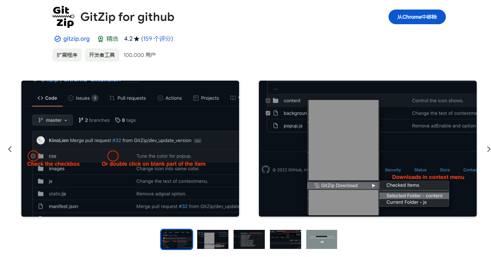
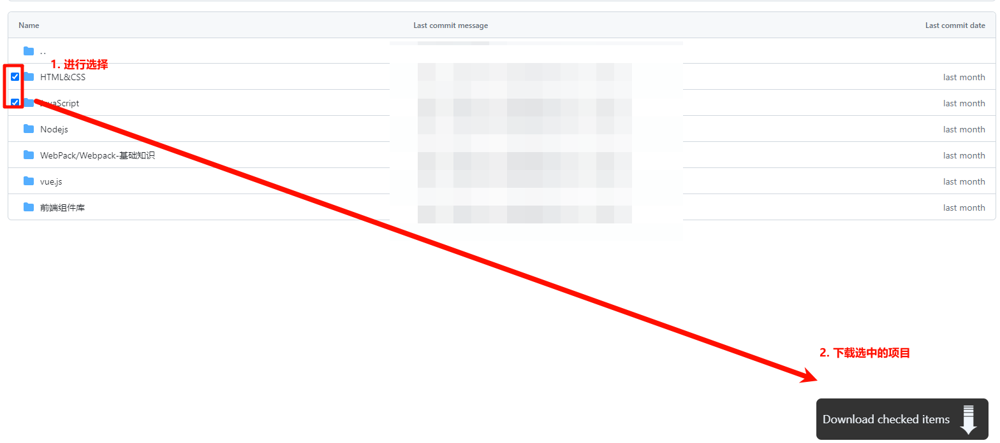

> 如果等到学至自己很满意的程度才采取行动或者进行分享，我就永远无法运用和传述所学到的东西。
> —— 《原则：应对变化中的世界秩序》

## 介绍

这是我使用Obsidian构建的个人笔记。主要是自学期间的笔记。很多东西还不完整，如果能帮到你，那就太好了~

主要有计算机基础（算法\C\C++\计网\设计模式等）、Java后端（SE\Web\Spring等）、Python（Spider\Annaconda\Pandas\Numpy等）、前端（H5\CSS3\JS\Vue\各种组件库等）、数据库（MySQL\Redis等）、DevOps相关（Docker\Git\Maven）等。

目前正在进行深度学习相关领域的学习，可能抽不出来时间整理此仓库。

### 文件结构

| 根目录   | 介绍                           |
| -------- | ------------------------------ |
| OBSIDIAN | 基于obsidian的个人笔记         |
| scripts  | 脚本，对笔记的一些信息进行统计 |

| ./OBSIDIAN目录 | 介绍    |
| -------------- | -------------- |
| .obsidian/ | obsidian仓库的字体、主题和插件 |
| 0.plugin | 模板、excalidraw、pdf文件等 |
| 1.归档/ | 归档后的笔记 |
| 2.正在进行/ | 正在进行的笔记 |
| 3.将来可能/ | 如果将来学习相关的文件，可能会补充这里面的笔记。 |

## 如何使用？

**极其不建议直接git clone**

原因如下：

```bash
$ git clone git@github.com:coderyjc/MyNotes.git
Cloning into 'MyNotes'...
remote: Enumerating objects: 30056, done.
remote: Counting objects: 100% (7088/7088), done.
remote: Compressing objects: 100% (2835/2835), done.
remote: Total 30056 (delta 4217), reused 6989 (delta 4118), pack-reused 22968
Receiving objects: 100% (30056/30056), 667.50 MiB | 4.52 MiB/s, done.
Resolving deltas: 100% (17454/17454), done.
Updating files: 100% (2117/2117), done.
```

仓库时间久远，commit较多，直接clone会克隆所有的提交历史，接近700MB。

因此**如果想要克隆整个仓库，强烈建议使用浅克隆**，即

```bash
git clone --depth 1 git@github.com:coderyjc/MyNotes.git
```

这种方式只有200+MB

同时，可以使用浏览器插件`gitzip`选择性下载。[chrome应用商店链接](https://chromewebstore.google.com/detail/gitzip-for-github/ffabmkklhbepgcgfonabamgnfafbdlkn) 

因此本仓库中每一个项目的笔记以及笔记中的图片是放在同一个目录下的，方便直接连带着图片下载笔记。





## 更新日志

### 2024.04 仓库拆分

将专业类的笔记和生活类的笔记进行拆分，本仓库中只保留专业类的笔记。

项目结构进行重构。

### 2024.01 专业笔记目录和文件名重构

专业性的归档内容目录结构：

[技术名称]，驼峰命名法，中文优先，首字母大写。如`MySQL`

  - [技术名称]-基础知识。比如`MySQL-基础知识`
  - [技术名称]-解决方案。比如`MySQL-解决方案`
  - [技术名称]-Bug汇总。比如`MySQL-Bug汇总`

解决方案和Bug汇总以文件名为主，方便查找。

使用QueryBlock进行搜索结果聚合进行综合和总结。

### 2023.02 GTD系统重构

使用GoToDo笔记系统重构所有笔记，并使用Obsidian软件及其优秀特性进行笔记系统的横向扩展。

### 2022.11 repo扩充

不再只记录技术方面的笔记，还会记录日常的一些笔记，都会在这个repo里面进行同步

### 2022.10 笔记系统拆分和重组

由于Obsidian软件在使用某些主题的时候，会出现文本排版解析不正确的问题，因此不再使用Obsidian记录长文本，比如技术使用教程等，而是采用了vuepress记录成系统成体系的知识。

而博客中的文章将会另外创建一个仓库存放。

自此，原本杂乱的笔记系统被按照功能拆分为了三部分

### 2022.09 笔记系统重构

> 本repo自2022.9月起开始用于记录项目记录, 零碎知识, debug记录以及博客的零散文章

基础知识和自成体系的知识不在保存到本repo中, 而是转移到了我的另一个库 [doc](https://github.com/jancoyan/doc) （已废除）中, 这是一个使用vuepress搭建的静态文章站, 由于底层也是使用markdown编写, 因此方便编写和查看.

本系统从2022.9月起, 不再记录基础知识和成体系的知识.

以下知识不再出现于本repo(若存在, 则属于临时记录): 
- 基础知识的学习记录
- vscode插件中文doc和使用教程
- obsidian插件中文doc和使用教程
- 各种前后端框架的doc

### 2022.02 笔记系统整合

将以前使用的Typora记录的笔记整合到了Obsidian中。

### 2021.12 月末

笔记系统升级。

当线性的知识笔记不能再满足我的需求的时候，是时候寻找一种网状笔记软件了。经过多维对比，最终选择了Obsidian。

我的读书笔记会用Obsidian记录，放在了我GitHub的Reading库中。

本repo下也会创建一个Obsidian目录，会用Obsidian记录相关的知识。

### 2021.12 中旬

我会在这个repo中存放我从大学开始所学**所有基础知识**的笔记

包括但不限于计算机基础知识、各种编程语言、框架、web开发、手机app开发、网络技术、Office、PS、PR、平面设计等。

还有游戏的教程、发表在CSDN上的文章、考研规划等

大概就相当于一个，个人知识库。

但是，这个知识库是一个基于基础知识的知识库，里面存放的大多是“线性的”知识。

但是我的知识结构正在从树形向网状进行转化，这就意味着线性的笔记不再适用

这也就意味着，这个repository的更新速度逐渐减慢，逐渐变成了字典式的查询工具，而不是idea的诞生地。

以后会找更适合的笔记软件的。

