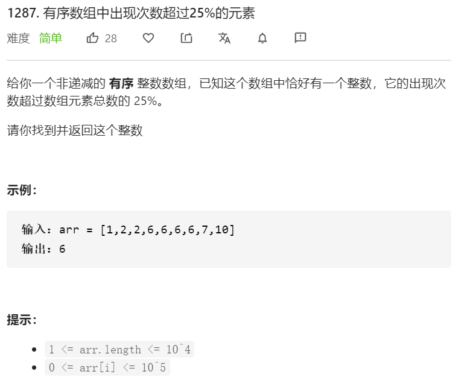
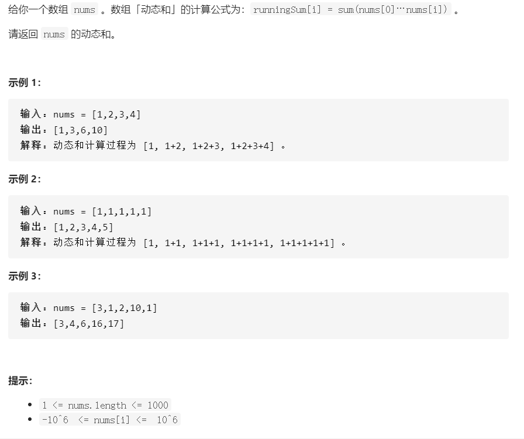

# LeetCode刷题笔记

##  1287. 有序数组中出现次数超过25%的元素



【官方】法一：遍历

“如果这个数字的个数大于总数的25%，这个数就是要找的数”

```C++
class Solution {
public:
    int findSpecialInteger(vector<int>& arr) {
        int n = arr.size();
        int cur = arr[0], cnt = 0;
        for (int i = 0; i < n; ++i) {
            if (arr[i] == cur) {
                ++cnt;
                if (cnt * 4 > n) {
                    return cur;
                }
            }
            else {
                cur = arr[i];
                cnt = 1;
            }
        }
        return -1;
    }
};

```

- 在计算数组 arr 长度的 25% 时，会涉及到浮点数。我们可以用整数运算 count * 4 > arr.length 代替浮点数运算 count > arr.length * 25%，减少精度误差

【官方】法二：二分查找

```C++
class Solution {
public:
    int findSpecialInteger(vector<int>& arr) {
        int n = arr.size();
        int span = n / 4 + 1;
        for (int i = 0; i < n; i += span) {
            auto iter_l = lower_bound(arr.begin(), arr.end(), arr[i]);
            auto iter_r = upper_bound(arr.begin(), arr.end(), arr[i]);
            if (iter_r - iter_l >= span) {
                return arr[i];
            }
        }
        return -1;
    }
};
```

- 满足条件的整数 x 至少在数组 arr 中出现了 span = arr.length / 4 + 1 次，那么我们可以断定：数组 arr 中的元素 arr[0], arr[span], arr[span * 2], ... 一定包含 x

关键点：

- 在计算数组 arr 长度的 25% 时，会涉及到浮点数。我们可以用整数运算 count * 4 > arr.length 代替浮点数运算 count > arr.length * 25%，减少精度误差

## 1304.和为0的n个唯一整数


- 一开始的时候我是想的用随机数，但是后来想到，不一定随机，只要我们可以控制每一个数都不一样，【控制的方法可以是先固定一个数，然后这个数增加或者减少1】。
- 


## 1480.一维数组的动态和



关键点：

- 问清楚面试官是否可以修改穿入的nums数组

如果能修改nums数组：

```C++
/*
作者：liuyubobobo
链接：https://leetcode-cn.com/problems/running-sum-of-1d-array/solution/ru-guo-mian-shi-yu-dao-zhe-ge-wen-ti-zhe-yi-dian-z/
来源：力扣（LeetCode）
*/

class Solution {
public:
    vector<int> runningSum(vector<int>& nums) {
        //从第1个开始，让后面的数字依次加等于其前面一位，这样可以节省空间
        for(int i = 1; i < nums.size(); i ++)
            nums[i] += nums[i - 1];
        return nums;
    }
};
```

如果不能修改nums数组：

```C++
/*
作者：liuyubobobo
链接：https://leetcode-cn.com/problems/running-sum-of-1d-array/solution/ru-guo-mian-shi-yu-dao-zhe-ge-wen-ti-zhe-yi-dian-z/
来源：力扣（LeetCode）
*/
class Solution {
public:
    vector<int> runningSum(vector<int>& nums) {

        vector<int> res(nums.size()); 
        //提前开辟好空间而不是push_back()，降低时间复杂度
        res[0] = nums[0];
        for(int i = 1; i < nums.size(); i ++)
            res[i] = res[i - 1] + nums[i];
        return res;
    }
};
```

我的代码：

```C++
class Solution {
public:
    vector<int> runningSum(vector<int>& nums) {
        vector<int> rst; //重开了一个数组->没必要，并且没有提前开辟空间->时间复杂度大
        int sum = 0;
        for(auto i : nums){
            sum += i;
            rst.push_back(sum); //插入的时间复杂度大
        }
        return rst;
    }
};
```

总结：

1. 能修改原来的数据就尽量修改原来的数据，降低空间复杂度
2. 数组能提前开辟就不要在中途插入的时候开辟